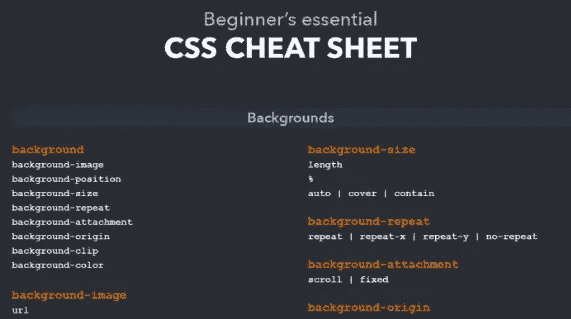

# 7 个有用的 CSS 备忘单来提高你的技能

> 原文：<https://javascript.plainenglish.io/7-useful-css-cheat-sheets-to-improve-your-skills-66d7d3a7cc8?source=collection_archive---------2----------------------->

## 一个很棒的 CSS 备忘单列表，你可以作为一个 web 开发者使用。

Photo by [Nicole Wolf](https://unsplash.com/@joeel56?utm_source=medium&utm_medium=referral) on [Unsplash](https://unsplash.com?utm_source=medium&utm_medium=referral)

学习 CSS 有时会让人不知所措。有很多概念需要你去学习。CSS 并不难学，但是你需要大量的练习才能精通它。

不管你想学什么技术，做东西是提高技能的最好方法。这就是为什么在这篇文章中，我想与你分享一个很棒的 CSS 备忘单列表，以帮助你提高知识。所以让我们开始吧。

# 1.CSS 动画备忘单

如果你想轻松地学习 CSS 动画和效果，CSS 动画&效果是最好的备忘单。它可以让你很容易地理解变换，过渡，以及更多的 CSS 动画属性。

Capture by the author from [Learn the web](https://learn-the-web.algonquindesign.ca/topics/css-animations-effects-cheat-sheet/)(external link).

# 2.Flex 备忘单

想轻松学习和练习 CSS flexbox？嗯， [Flex CheatSheet](https://yoksel.github.io/flex-cheatsheet/) 是最好的去处。它以一种简单的方式包含了关于 flexbox 的所有内容，让您可以轻松地学习。

Capture by the author from [Flex CheatSheet](https://yoksel.github.io/flex-cheatsheet/)(external link).

除此之外，你也可以看看我下面的文章。我试图在一篇文章中尽可能多地介绍 flexbox，以便让您更容易理解。

 [## 终极 CSS Flexbox 备忘单及示例

### 用通俗易懂的例子学习 CSS flexbox。

javascript.plainenglish.io](/the-ultimate-css-flexbox-cheat-sheet-with-examples-7a62dce086dc) 

# 3.网格备忘单

想轻松学习和练习 CSS 网格？嗯，[网格备忘单](https://yoksel.github.io/grid-cheatsheet/)是开始的最好地方。它以一种简单的方式包含了 CSS 网格的所有内容，使您能够轻松地学习和实践网格概念。

Capture by the author from [Grid CheatSheet](https://yoksel.github.io/grid-cheatsheet/)(external link).

# 4.CSS 布局备忘单

这个[备忘单](https://learn-the-web.algonquindesign.ca/topics/css-layout-cheat-sheet/)可以让你轻松了解 CSS 布局概念。像布局机制(位置、显示……)、居中元素等等。

Capture by the author from [Learn the web](https://learn-the-web.algonquindesign.ca/topics/css-layout-cheat-sheet/)(external link).

# 5.CSS 备忘单

这个备忘单为你提供了很多 CSS 属性的完整参考。有兴趣就去看看。

Capture by the author from [website setup](https://websitesetup.org/css3-cheat-sheet/)(external link).

# 6.Flexbox 可视备忘单

如果你是一个视觉型的人，并且你发现用视觉工具学习更容易，那么 [FLEX](https://flexbox.malven.co/) 是你最好的备忘单。它让您以一种非常简单的方式轻松了解 flexbox。

Capture by the author from [FLEX](https://flexbox.malven.co/)(external link).

# 7.网格可视化备忘单

这张[小抄](https://grid.malven.co/)和上面这张很像。它让你以一种非常简单的方式直观地学习 CSS Grid。如果你正在努力理解 CSS 网格，这是一个有用的资源。

Capture by the author from [GRID](https://grid.malven.co/)(external link).

# 结论

正如你在上面的列表中看到的，如果你想学习和提高你的 CSS 知识，这些是一些非常有用的备忘单。如果你忘记了什么，你也可以把它们作为参考。

感谢您阅读这篇文章。希望你觉得有用。

**更多阅读:**

 [## 学习 React 之前应该了解的 JavaScript 特性

### 在做出反应之前，先学习这些 JavaScript 特性

javascript.plainenglish.io](/8-javascript-features-to-know-before-learning-reactjs-aac8b7748b30)  [## 面向所有前端开发人员的 7 个非常棒的 React UI 库

### 可以在 React 中使用的有用 UI 组件库的列表。

javascript.plainenglish.io](/7-awesome-react-ui-libraries-for-all-frontend-developers-c7d45b7cecad) 

*更多内容尽在*[***plain English . io***](http://plainenglish.io)