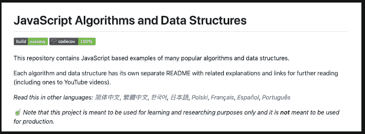
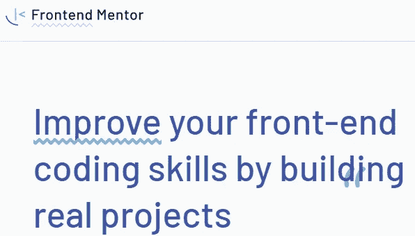
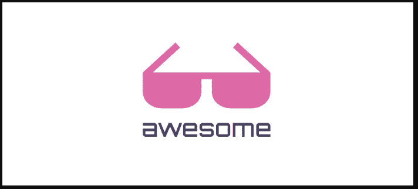
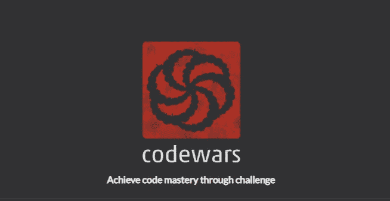
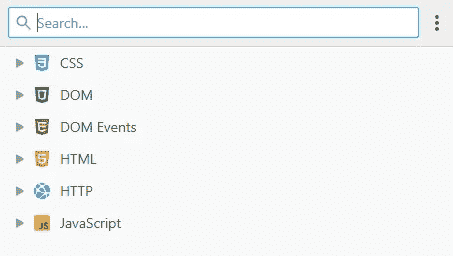

# 7 个对前端开发人员有用的免费资源

> 原文：<https://javascript.plainenglish.io/7-useful-free-resources-for-front-end-developers-f427cf5d5392?source=collection_archive---------2----------------------->

## 你需要用到的牛逼前端开发资源。

Photo by [Fotis Fotopoulos](https://unsplash.com/@ffstop?utm_source=medium&utm_medium=referral) on [Unsplash](https://unsplash.com?utm_source=medium&utm_medium=referral)

# 介绍

前端是软件开发的一个重要部分，作为处理这种类型开发的开发人员，你需要学习很多东西。幸运的是，网络上也有很多免费资源可以帮助您学习和发展前端开发人员的职业生涯。

在本文中，我们将为您提供一些有用的免费资源，供您作为前端开发人员使用。让我们开始吧。

# 1.JavaScript 信息

[JavaScript info](https://javascript.info/) 是一个非常有用的网站，在这里你可以从零开始学习 JavaScript，达到高级水平。它们涵盖了作为前端开发人员您需要了解的关于 JavaScript 的一切。他们的教程解释得很好，你找不到任何问题。

[JavaScript info](https://javascript.info/).

# 2.JavaScript 算法和数据结构

这是一个令人敬畏的[知识库](https://github.com/trekhleb/javascript-algorithms)，在 Github 上有超过 80，000 颗星星。它包含了大量的 JavaScript 算法和数据结构示例。他们有一个非常好的结构，从初学者到高级水平的算法。

[JavaScript Algorithms and Data structures](https://github.com/trekhleb/javascript-algorithms).

# 3.前端导师

[前端导师](https://www.frontendmentor.io/)让你解决现实世界的 HTML、CSS 和 JavaScript 挑战，以提高你的前端技能。它们还提供了许多你可以从中受益的学习资源。

[Frontend Mentor.](https://www.frontendmentor.io/)

# 4.可怕的

Awesome 是最受欢迎的 Github 库之一，包含所有软件开发主题。此刻它在 Github 上有超过 144，000 颗星。如果您想学习一些与前端或后端相关的新知识，这是一个很好的资源。

[Awesome](https://github.com/sindresorhus/awesome).

# 5.代码战争

CodeWars 是一个很棒的网站，可以帮助你练习解决问题的技巧。CodeWars 是一个很好的平台，可以作为前端开发人员来练习 JavaScript 技能。

[CodeWars](https://www.codewars.com/).

# 6.DevDocs

DevDocs 是一个非常有用的开源 web 应用程序，它在一个易于导航和访问的界面中结合了多个 API 文档。它包含许多关于不同 web 技术的文档，您可以很容易地访问和学习。它也可以在离线模式下工作。

[DevDocs](https://devdocs.io/).

# 7.Onepagelove

Onepagelove 是一个单页网站，它给你一堆主题和模板，以及一些前端开发的学习技巧。这是一个可以获得灵感的好地方。如果你想使用的话，它们还可以让你下载免费的模板。

[Onepagelove](https://onepagelove.com/).

# 结论

正如你所看到的，所有这些资源都是有用且免费的。它们帮助您学习和实践作为前端开发人员的技能。

感谢您阅读这篇文章。希望你觉得有用。

# 更多阅读

*如果你对 JavaScript 和 web 开发相关的更有用的内容感兴趣，也可以* [*订阅*](https://mehdiouss.ck.page/) *我的快讯。*

*下面是另一篇有用的文章，请点击链接查看:*

 [## JavaScript 算法:对一个范围内的所有数字求和

### 让我们使用 JavaScript 来获得一个范围内所有数字的总和。

medium.com](https://medium.com/javascript-in-plain-english/javascript-algorithm-sum-all-the-numbers-in-a-range-7b0d5fe43064)