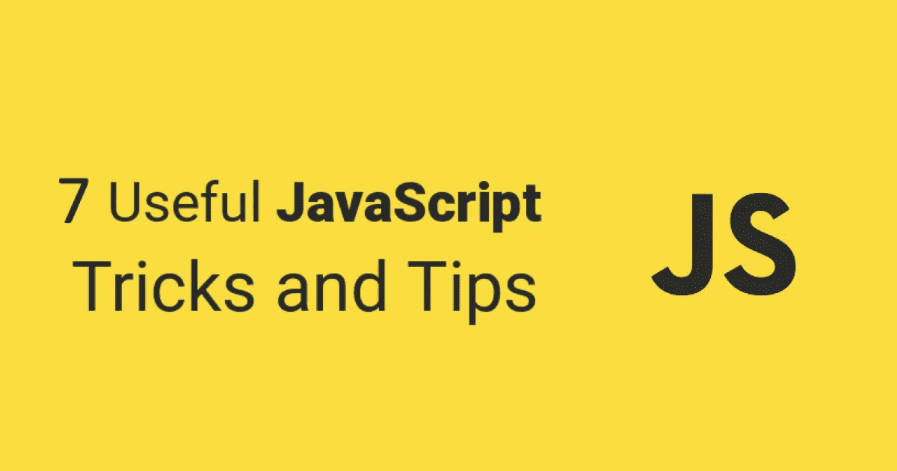

# 7 个有用的 JavaScript 技巧和提示

> 原文：<https://javascript.plainenglish.io/7-useful-javascript-tricks-and-tips-fdf92dd9b869?source=collection_archive---------11----------------------->



在本文中，我收集了一些 JavaScript 技巧和诀窍，我相信它们可以让你成为更好的 JavaScript 开发人员。排名不分先后，这里有七个(？)JavaScript 招数！

# 1.转换为数字

JavaScript 是一种**松散类型的语言**，这意味着我们不必显式指定变量的类型。JavaScript 还可以根据使用的上下文将值自由地转换成类型。

将值转换成数字，尤其是将字符串转换成数字，是一个常见的需求，可以使用许多方法。

## 一元+运算符

将字符串类型转换为数字的最简洁的方法是*一元* `**+**` *运算符*:

```
+"42" // 42
```

> 一元运算是只有一个操作数的运算。该操作数位于运算符之前或之后。

*一元加运算符*位于其操作数之前，计算其操作数，但试图将其转换为数字(如果尚未转换为数字)。这里还有几个例子可以说明它是如何工作的:

```
+true  // 1
+false // 0
+null  // 0
```

但是，如果我们想在代码中更加明确呢？

## 数字

[Number](https://developer.mozilla.org/en-US/docs/Web/JavaScript/Reference/Global_Objects/Number) 是一个用于表示和操作数字的原始包装对象。当用作函数时，`Number(value)`将字符串或其他值转换为数字类型。如果值不能被转换，它返回`NaN`(不是一个数字)。

```
Number("42")  // 42
Number("1.3") // 1.3
Number("tax") // NaN
```

## parseInt

[parseInt()](https://developer.mozilla.org/en-US/docs/Web/JavaScript/Reference/Global_Objects/parseInt) 将一个字符串作为第一个参数和该字符串要转换到的基底。这个方法总是返回一个整数。

```
parseInt("1234", 10)       // 1234
parseInt("11 players", 10) // 11
parseInt("player 2", 10)   // NaN
parseInt("10.81", 10)      // 10
```

`parseInt()`试图从一个不仅仅包含数字的字符串中得到一个数字，但是如果这个字符串不是以数字开头，你将得到`NaN`。

## parseFloat

如果我们想保留小数部分，而不仅仅是整数部分，我们可以使用 [parseFloat()](https://developer.mozilla.org/en-US/docs/Web/JavaScript/Reference/Global_Objects/parseFloat) ，它接受一个字符串作为参数，并返回等价的浮点数。

```
parseFloat("10.42") // 10.42
parseFloat("10.00") // 10
```

还有一些方法可以转换成数字，但这些是最常用的方法。

# 2.管理对象

**析构**是 ES6 的重要组成部分，你可能会经常用到。它允许我们从对象中提取数据，并将提取的数据分配到变量中:

```
const rectangle = { h: 100, w: 200 };
const { h, w } = rectangle;
```

如果需要，我们可以重命名变量:

```
const { h: height, w: width} = rectangle;
console.log(height); // 100
```

我们可以做的另一件方便的事情是通过一个函数来析构返回的对象，并选择我们想要使用的值:

因此，通过析构，我们可以从一个函数中返回多个值，方法是返回一个对象并选择我们想要返回的部分。

以一种不可变的方式移除一个属性需要 spread 的对应部分提供的一个小技巧，即 **rest 操作符**，它用三个点(…)编写，就像 spread 一样。然而，在这种情况下，我们将剩余的属性扩展到一个新的对象中。

```
const { age:_ , …person } = getPerson();
console.log(person); // {firstName: “Max”, lastName: “Best”}
```

现在，`person`对象保存了除了`age`之外的来自原始 person 对象的所有属性。

# 3.交换两个变量

使用我们在上一个技巧中学到的知识，交换变量就像:

```
let me = "happy", you = "sad";
[me, you] = [you, me];
// me = "sad", you = "happy"
```

上面的代码创建了一个[you，me]数组，并立即将它们析构为相反的变量。

不再需要临时变量了！

# 4.设置默认值

我们都见过他们。无尽的 if 语句检查值是否已经设置。如果我说有更好的方法呢？嗯，这正是我要说的，默认值。

## 变量

[无效合并运算符(？？)](https://developer.mozilla.org/en-US/docs/Web/JavaScript/Reference/Operators/Nullish_coalescing_operator)是逻辑运算符，当其左侧操作数为`null`或`undefined`时，返回其右侧操作数，否则返回其左侧操作数。我们可以用它来设置默认值，例如当我们收到一个还没有被设置为数组的列表时:

```
const bookList = receivedBooks ?? [];
```

## 因素

我们可以使用*零合并操作符*来设置函数中变量的默认值，但是有一个更好的方法，默认参数:

这里我们将`height`的默认值设置为 100，并且只通过发送`width`来计算面积。

## 目标

析构对象的另一个技巧是设置默认值:

ES6 析构默认值仅在值为`undefined`时生效。

# 5.来自区间的随机数

有时候我们需要在一个范围内产生一个随机数。`[Math.random()](https://developer.mozilla.org/en-US/docs/Web/JavaScript/Reference/Global_Objects/Math/random)`函数帮助我们生成一个随机数，然后我们可以将它转换成我们想要的范围:

```
const randomIntFromInterval = (min, max) => Math.floor(Math.random() * (max — min + 1) + min);
```

如果你看看这个函数是如何构造的，你会发现这里面还有一个技巧。

# 6.移除数组重复项

ES6 中引入的 Set 对象类型允许您存储唯一的值。与 spread 运算符(…)一起，我们可以使用它来创建一个只包含唯一值的新数组:

```
const uniqueArray = [...new Set(array)]
```

我们从数组中创建一个集合，因为集合中的每个值都必须是唯一的，所以我们删除了所有重复的值。然后，我们使用 spread 操作符将集合转换回一个新的数组。

# 7.动态属性名称

ES6 给我们带来了计算属性名，允许对象文字的属性键使用表达式。通过用括号`[]`将键括起来，我们可以将变量用作属性键:

这在您希望动态创建密钥的情况下非常有用。

我们可以用括号符号来访问该值:

```
item[type];   // "kiwi"
item["fruit"] // "kiwi"
```

或者用点符号表示:

```
item.fruit; // "kiwi"
```

# 8.奖励诡计

如果我们想在没有突变(我们通常想避免这种情况)的情况下向数组**添加一个新项，我们可以使用 ES6 [扩展操作符](https://developer.mozilla.org/en-US/docs/Web/JavaScript/Reference/Operators/Spread_syntax)和[切片](https://developer.mozilla.org/en-US/docs/Web/JavaScript/Reference/Global_Objects/Array/slice)创建一个新数组:**

# 结论

我希望这些 JavaScript 技巧对您有用，值得添加到您的日常工作中。记住，负责任远比高效重要。

[](https://www.educative.io/courses/game-development-js-tetris) [## 用 JavaScript 开发游戏:创建俄罗斯方块-互动学习

### 在本课程中，您将获得使用 JavaScript 进行游戏开发的实践经验。使用俄罗斯方块的经典游戏…

www.educative.io](https://www.educative.io/courses/game-development-js-tetris) 

*更多内容请看*[***plain English . io***](http://plainenglish.io)