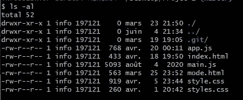

# 每个 Web 开发人员都必须知道的 7 个有用的终端命令

> 原文：<https://javascript.plainenglish.io/7-useful-terminal-commands-every-web-developer-must-know-e9eeab6dd09a?source=collection_archive---------6----------------------->

## 对开发人员有用的终端命令列表。

Photo by [Jexo](https://unsplash.com/@jexo?utm_source=medium&utm_medium=referral) on [Unsplash](https://unsplash.com?utm_source=medium&utm_medium=referral)

如今，每种类型的开发人员都必须能够熟练使用命令行。因为对于几乎任何类型的项目，您都必须使用终端命令来控制项目、浏览文件夹以及执行所有其他任务。

你可以选择使用 GUI 应用程序而不是命令行，但大多数开发人员不会这样做。就我个人而言，我更喜欢在我所有的项目中使用命令行。

这就是为什么在这篇文章中，我会给你一些有用的终端命令的列表，这些命令是你作为一个 web 开发人员必须知道的。所以让我们开始吧。

# 1.显示当前工作目录

首先，你可以根据你的操作系统使用任何你想要的终端。例如，我在 Windows 上使用 Git Bash 作为终端。在 Mac 中，终端会工作得很好，你不需要 Git Bash。

所以你可以使用的第一个命令是`pwd`。这个命令告诉你你当前的目录是什么。这是确定你在哪个文件夹的好方法。

这里有一个例子:

Capture by the author.

正如你在上面看到的，命令`pwd`告诉我我在桌面上的文件夹`Project 1`里。

# 2.限位开关（Limit Switch）

命令`ls`显示了目录中所有不同的文件。只要输入`ls`，它就会显示所有的文件。

这里有一个例子:

Capture by the author.

上面的例子向我们展示了文件夹`Project 1`中的所有文件。

另外，如果您想获得关于这些文件的更多细节，您可以键入 ls 命令，后跟 *al* 标志。像这样:`ls -al`。

Capture by the author.

最后，你也可以使用命令`ls -a`来显示所有隐藏的文件和目录。

# 3.清楚的

命令`clear`允许你清除你在终端中写的所有东西。所以这个命令会清理你的终端屏幕来写新的命令。

Capture by the author.

# 4.激光唱片

命令`cd`代表改变目录。它允许你改变你所在的目录或文件夹。

只需键入 cd，后跟您要去的目录的名称。比如我在桌面目录，我可以输入`cd Project 1`转到项目 1 目录(因为我在桌面上有一个文件夹叫项目 1)。

Capture by the author.

此外，如果我们想再次返回到桌面目录，我们可以键入 cd 后跟两个点。像这样:`cd ..`。

# 5.mkdir

命令`mkdir`代表制作目录。它允许我们在特定的目录下创建一个文件夹。

例如，如果我们想在桌面目录中创建一个名为`new-folder`的新文件夹，我们可以在该目录中键入命令`mkdir new-folder`。因此，该文件夹将自动在桌面上创建。

您还可以在名称之间添加空格，以便一次创建多个文件。看看下面的例子:

Capture by the author.

现在，将在桌面目录中创建三个文件夹。

# 6.触控

命令`touch`的工作方式和`mkdir`一样，唯一的区别是它允许我们创建**文件**而不是文件夹。

只需输入命令`touch`,后跟你想要创建的文件的名称。

同样，您可以通过在文件名之间添加空格来创建多个文件，如下所示:

Capture by the author.

# 7.空间

命令`rm`允许你删除文件。您只需要键入命令，后跟您想要删除的文件的名称。

您也可以通过在文件之间添加空格来一次删除多个文件。就像我们下面做的:

Capture by the author.

此外，如果您想要删除一个文件夹而不是一个文件，您将需要添加标志`-r`，后跟您想要删除的文件夹的名称。

像这样:`rm -r folderName`。但是请记住，该命令将删除文件夹以及其中的所有文件。所以使用这个命令时要小心。

# 结论

正如您所看到的，这些是作为 web 开发人员需要了解的一些基本命令。如果您有兴趣，可以从其他资源中了解更多的命令。

感谢您阅读这篇文章。希望你觉得有用。

**更多阅读**

 [## 您应该使用的 10 种有用的 JavaScript 编码技术

### 实现编程任务的有用 JavaScript 技术。

javascript.plainenglish.io](/10-useful-javascript-coding-techniques-that-you-should-use-e8e7960e08ed)  [## 10 个令人敬畏的前端开发工具来提高您的生产力

### 你可能需要用到的有用的前端开发工具。

javascript.plainenglish.io](/10-awesome-front-end-development-tools-to-boost-your-productivity-b1d2efc4c4ba) 

*更多内容请看*[*plain English . io*](http://plainenglish.io/)