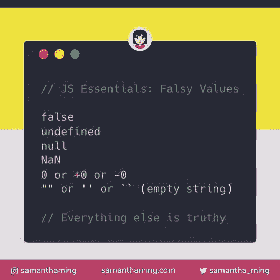

# 提高代码水平的 7 个有用的打字技巧

> 原文：<https://javascript.plainenglish.io/7-useful-typescript-tips-to-level-up-your-code-25d0ff545009?source=collection_archive---------10----------------------->

## 提升您的类型脚本代码的技巧和窍门


Photo by [Maranda Vandergriff](https://unsplash.com/@mkvandergriff?utm_source=unsplash&utm_medium=referral&utm_content=creditCopyText) on [Unsplash](https://unsplash.com/s/photos/code?utm_source=unsplash&utm_medium=referral&utm_content=creditCopyText)

## 1.Currying

Currying 是将一个接受多个参数的函数转换成一系列一次接受一个参数的函数的过程。

```
// A curried function
let add = (x: number) => (y: number) => x + y;// Simple usage
add(321)(345);// partially applied
let add321 = add(321);// fully apply the function
add321(345);
```

## 2.字符串枚举

有时你需要在一个公共键下收集一组字符串。在 TypeScript 2.4 之前，TypeScript 仅支持基于数字的枚举。如果您使用 2.4 之前的版本，解决方案是使用字符串文字类型，通过组合[联合类型](/typescript-advanced-types-b6d0f19bcbf5)来创建基于字符串的枚举。

在字符串枚举中，每个成员都必须用字符串或另一个字符串枚举成员进行常量初始化

```
enum Direction {
Up = "UP",
Down = "DOWN",
Left = "LEFT",
Right = "RIGHT",
}
```

虽然字符串枚举没有自动递增行为，但字符串枚举的优点是可以很好地“序列化”。换句话说，如果您正在调试并且必须读取数值枚举的运行时值，该值通常是不透明的，它本身不能传达任何有用的意义(尽管反向映射通常会有所帮助)，字符串枚举允许您在代码运行时提供有意义且可读的值，而不管枚举成员本身的名称如何。

## 3.有状态函数

其他编程语言的一个共同特点是使用 static 关键字来增加函数变量的生存期(而不是作用域)，使其超出函数调用的作用域。下面是一个实现这一点的 C 示例:

```
void addUp() {
    static count = 0;
    count++;
    printf("Count : %d", count);
}int main () {
    addUp(); // Count : 1
    addUp(); // Count : 2
    return 0;
}
```

因为 TypeScript 没有静态函数，所以您可以使用包装局部变量的各种抽象来实现同样的事情，例如使用`class`:

```
const {addUp} = new class {
    count = 0;
    addUp = () => { 
       this.count++;
       console.log(`Count : ${this.count}`); 
    }
};addUp(); // Count : 1
addUp(); // Count : 2
```

## 4.导出默认值可能会导致问题

如果你有一个文件`bar.ts`:

```
class Bar {
}
export default Bar;
```

您可以使用 ES6 语法在`faa.ts`中导入它，如下所示:

```
import Bar from "./bar";
```

以下是一些可维护性问题:

*   如果`Bar`在`bar.ts`中被重构，在`faa.ts`中不会被重命名。
*   如果您最终需要从`bar.ts`导出更多的东西(这是您的许多文件都有的)，那么您必须修改导入语法。

因此，建议使用简单导出+析构导入:

```
export class Bar{
}
```

然后:

```
import {Bar} from "./bar";
```

## 5.桶

桶是一种将多个模块的导出集合到一个方便的模块中的方法。桶本身是一个模块文件，可以重新导出其他模块的选定导出。想象一下库中的如下类结构:

```
// tutorial/bar.ts
export class Bar {} // tutorial/bas.ts
export class Bas {}// tutorial/bat.ts
export class Bat {}
```

如果没有桶，消费者将需要三个进口声明:

```
import { Bar } from '../tutorial/bar'; 
import { Bas } from '../tutorial/bas'; 
import { Bat } from '../tutorial/bat';
```

您可以添加一个包含以下内容的桶`tutorial/index.ts`:

```
// tutorial/index.ts
export * from './bar'; 
export * from './bas'; 
export * from './bat';
```

现在，消费者可以从桶中进口所需的东西:

```
import { Bar, Bas, Bat } from '../tutorial';
```

## 6.暗示

它是 TypeScript 的放大镜，这是一个漂亮的检查工具，可以提取被困在不同类型的结构中的类型。

例如，让我们从对象中提取属性的类型:

```
type ObjectInfer<O> = O 
  extends {a: infer A}
  ? A
  : neverconst object = {a: 'hello'};
type testResult1 = ObjectInfer<typeof object>; // string
type testResult2 = ObjectInfer<string>; // never
```

## 7.真理



Image from [https://samanthaming.com](https://samanthaming.com/)

最后一个技巧是正确理解一个基本概念——真理。真值是在某些地方评估为真的东西(比如条件和布尔&& ||运算符)。以下是 JavaScript 中的真实情况。一个例子是除 0 以外的任何数字，例如:

```
if (1) { 
console.log('Any number other than 0 is truthy');
}
```

不真实的东西叫做虚假。

*更多内容尽在*[*plain English . io*](http://plainenglish.io/)