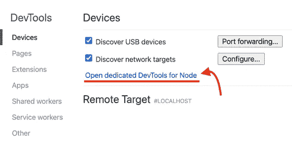

# 在终端中调试 Jest 测试的 7 种方法

> 原文：<https://javascript.plainenglish.io/7-ways-to-debug-jest-tests-in-terminal-400eec99281a?source=collection_archive---------25----------------------->

欢迎，你可能已经搜索了如何用 Jest 调试你的测试。我很高兴你发现了这篇博文，因为你将要学习在你的终端内部调试 Jest 测试的 7 种方法。众所周知，使用像 VSCode 或 WebStorm 这样的 IDE 可以很容易地做到这一点，但是如果您不使用它们呢？你如何着手调试它们呢？剧透警报—不含`console.log()`。


*Photo by* [*Nikola Đuza*](https://unsplash.com/@nikolalsvk?utm_source=unsplash&utm_medium=referral&utm_content=creditCopyText) *on* [*Unsplash*](https://pragmaticpineapple.com/s/photos/bugs?utm_source=unsplash&utm_medium=referral&utm_content=creditCopyText)

# 1.标准方式

如果您在 Jest 文档中搜索一种方法，它会告诉您以下信息:

*   转到基于 Chromium 的浏览器，打开`chrome://inspect`。
*   如下面的屏幕截图所示，单击“为节点打开专用的开发工具”:



*   在你的代码中的某个地方放一个`debugger`语句(测试或生产代码)。
*   运行`node --inspect-brk node_modules/.bin/jest --runInBand [any other arguments here]`。

瞧，您的测试应该在您在步骤 2 中打开的 DevTools 中的调试器处运行和停止。实际上，由于`--inspect-brk`，这个进程一运行就会停止，但是我们稍后会讲到。

在项目中，通常不使用 raw Jest 命令。有时它被包装在其他库中，或者使用一些额外的配置来启动它。如果您是这种情况，让我们深入研究并找出不同的方法来调试和检查我们的测试。

> *💡*让节点专用的 DevTools 窗口保持打开状态，我们将继续进行其他方式的调试。

# 2.没有最初的间断

如果你看一看，这里的大部分魔术是由节点检查器完成的。节点检查器的酷之处在于，当您执行`node --inspect`时，Node.js 进程会在`127.0.0.1:9229`监听调试客户端。这个变化在 2016 年得到了[的引入。](https://github.com/nodejs/node/pull/6792)并允许每个人轻松检查他们的流程。

在前一节的例子中，我们使用了`node --inspect-brk ...`。使用`--inspect-brk`标志将在用户代码开始前中断。在我的例子中，我不在乎测试一开始就停止，只是求助于简单的`node --inspect`。`node --inspect`会在你放`debugger`的地方断裂，而不是在发射时立即断裂。从现在开始我们继续吧。我们的调试命令将是:

```
$ node --inspect node_modules/.bin/jest --runInBand
```

由于`node_modules`位置可以依赖于操作系统，我们可以使它不可知，并使用`yarn bin`或`npm bin`。在我的例子中，我将像这样使用`npm bin`:

```
$ node --inspect $(npm bin)/jest --runInBand
```

# 3.调试类型脚本测试

如果您现在正在使用 TypeScript，如果您尝试运行:

```
$ node --inspect $(npm bin)/jest --runInBand
```

您可能会得到一个错误，因为 TypeScript 测试没有转换成 JavaScript。确保您在`jest.config.js`中配置了类似于以下配置的 Jest:

```
module.exports = {
  roots: ["<rootDir>/src"],
  testMatch: [
    "**/__tests__/**/*.+(ts|tsx|js)",
    "**/?(*.)+(spec|test).+(ts|tsx|js)",
  ],
  transform: {
    "^.+\\.(ts|tsx)$": "ts-jest", // The important part right here
  },
}
```

我们告诉 Jest 使用`ts-jest`转换`.ts`和`.tsx`文件。如果没有`ts-jest`，可以装上`npm install -D ts-jest`，应该就可以了。我做了一个回购样本，你可以在这里试用。

# 4.调试™️的最佳方法

好吧，所以这一节的标题承诺了很多，多包涵。如果你没有听说过 Jest 手表模式，你会喜欢这个。大部分时间我在写代码，我让`jest --watch`运行。监视模式的优点是它会监视您所做的任何更改，并运行相关的测试。要在监视模式下调试测试，可以键入以下内容:

```
$ node --inspect $(npm bin)/jest --watch --no-cache --runInBand
```

让我们在这里分解一下笑话的论点:

*   `--watch`从 Jest 启动手表模式，相当酷。
*   `--no-cache`将确保我们的代码被正确重载。您可以尝试不使用它，但手表模式可能无法正常工作。
*   `--runInBand` -好吧，这面旗帜从一开始就跟着我们。它确保所有测试在一个进程中连续运行，而不是创建子进程。拥有一个过程使得`node --inspect`能够正确地“检查”测试。

您还可以组合其他 Jest 命令，如运行单个测试:

```
$ node --inspect $(npm bin)/jest --runTestsByPath src/index.test.ts --runInBand
```

但是不要忘记附加`--runInBand`或者仅仅是`-i`来确保 Node.js 检查器发挥它的魔力。

# 5.CRA 怎么样？

如果你使用 create-react-app (CRA)并让你的测试脚本使用 react-scripts test，调试对你来说会有点不同。推荐的方法是向`package.json`添加一个新脚本，如下所示:

```
"scripts": {
  ...,
  "test:debug": "react-scripts --inspect test --runInBand --no-cache"
}
```

现在，每当你运行`npm run test:debug`，Jest 就会以手表模式运行，停在你放`debugger`的地方。当然，您需要打开一个用于 Node.js 的专用 DevTools，就像我们在第一节中描述的那样。

# 6.从命令行调试

好了，现在你已经有了使用 Chromium 浏览器和 DevTools 的初始调试器。但是，如果您是命令行爱好者，您可能正在考虑一种不使用 DevTools 的方法。对你来说是个好消息，这是可以做到的。幸运的是，我们有`node inspect`为我们启动命令行调试器。尝试运行以下命令:

```
$ node inspect $(npm bin)/jest --runInBand
```

我在我制作的示例回购中运行了这个，这是我得到的结果:

```
$ node inspect $(npm bin)/jest --runInBand
< Debugger listening on ws://127.0.0.1:9229/be2d3410-48ad-46fb-a345-bb37339b5e38
< For help, see: https://nodejs.org/en/docs/inspector
< Debugger attached.
Break on start in node_modules/jest/bin/jest.js:9
  7  */
  8
> 9 const importLocal = require('import-local');
 10
 11 if (!importLocal(__filename)) {
debug>
```

检查员在`node_modules/jest/bin/jest.js:9`内的第一行停了下来。我们可以通过键入`cont`或`c`继续调试:

```
$ node inspect $(npm bin)/jest --runInBand
< Debugger listening on ws://127.0.0.1:9229/be2d3410-48ad-46fb-a345-bb37339b5e38
< For help, see: https://nodejs.org/en/docs/inspector
< Debugger attached.
Break on start in node_modules/jest/bin/jest.js:9
  7  */
  8
> 9 const importLocal = require('import-local');
 10
 11 if (!importLocal(__filename)) {
debug> cont
break in src/index.test.ts:6
  4 test("add", function () {
  5     var result = index_1.add(1, 2);
> 6     debugger;
  7     expect(result).toEqual(3);
  8 });
debug>
```

现在检查员停在了我们测试代码中的`debugger`语句。我们可以键入`help`并熟悉我们可以在那里键入的所有命令。我不会一一介绍，但我会提到`repl`命令。通过在调试器中键入`repl`，您将进入读取-评估-打印-循环(REPL)模式，在这里您可以评估变量。如果我在我的例子中这样做，我将得到以下结果:

```
$ node inspect $(npm bin)/jest --runInBand
< Debugger listening on ws://127.0.0.1:9229/be2d3410-48ad-46fb-a345-bb37339b5e38
< For help, see: https://nodejs.org/en/docs/inspector
< Debugger attached.
Break on start in node_modules/jest/bin/jest.js:9
  7  */
  8
> 9 const importLocal = require('import-local');
 10
 11 if (!importLocal(__filename)) {
debug> cont
break in src/index.test.ts:6
  4 test("add", function () {
  5     var result = index_1.add(1, 2);
> 6     debugger;
  7     expect(result).toEqual(3);
  8 });
debug> repl
Press Ctrl + C to leave debug repl
> result
3
>
```

这些是从命令行检查代码的基础。开发者体验(DX)可能没有 DevTools 打开时的体验好，在 dev tools 打开时，你可以通过悬停在变量上来获得变量的值，但这仍然是一个不错的选择。让我们在下一节看看如何从命令行打开 DevTools。

# 7.一体化解决方案— ndb

ndb 是为 Node.js 改善调试体验的库，你可以用`npm install -g ndb`全局安装，也可以用`npm install -D ndb`本地安装。我在我的 [Abacus repo](https://github.com/nikolalsvk/abacus) 上用全局命令试过，比如:

```
$ ndb $(npm bin)/jest --watch --no-cache --runInBand
```

而且效果很好。你一输入它，它就会为你打开 DevTools。它的表现也比普通的`node --inspect`更快。ndb 的伟大之处在于，你可以轻松地为`package.json`运行你的脚本。我设法运行了以下内容:

```
$ ndb npm run test -- --watch --no-cache --runInBand
```

我相信使用 ndb 的方法对那些想从命令行做任何事情的人来说最有吸引力。它让你不用在浏览器上打开 DevTools for Node.js，ndb 会帮你完成。

# 最后的想法

就这样了，伙计们。您应该能够挑选调试 Jest 测试的方法。在 Jest 中调试测试的想法困扰了我很长一段时间，我很高兴我找到了各种解决方案，并与大家分享。

感谢收听，请务必订阅[时事通讯](https://pragmaticpineapple.com/newsletter)并在[推特](https://twitter.com/nikolalsvk)上关注我，获取新的博客帖子和技巧。如果你觉得这篇文章有用，可以考虑在 Twitter 上与你的朋友和同事分享:

直到下一个，干杯。

*原载于 2021 年 3 月 15 日 https://pragmaticpineapple.com*[](https://pragmaticpineapple.com/7-ways-to-debug-jest-tests-in-terminal/)**。**