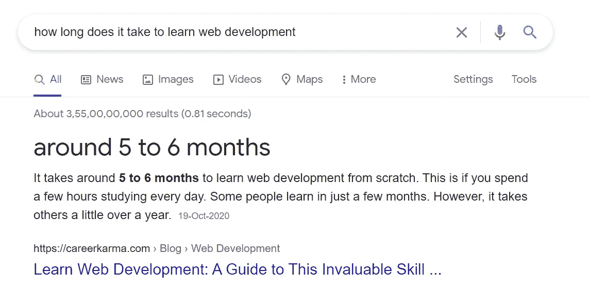
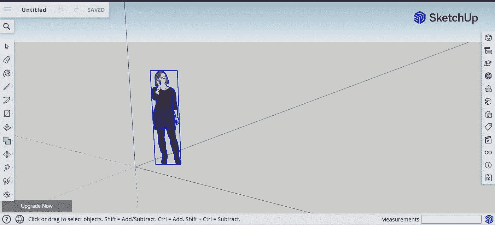
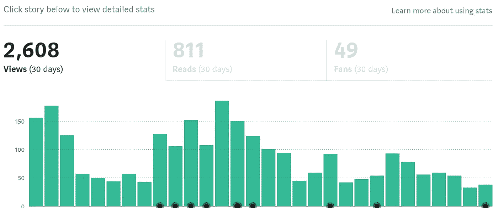

# 7 个为网络开发者创造财富的想法

> 原文：<https://javascript.plainenglish.io/7-wealth-generating-ideas-for-web-developers-3cd9f1bf8718?source=collection_archive---------16----------------------->

## 最后一个是我最喜欢的

Photo by [Austin Distel](https://unsplash.com/@austindistel?utm_source=medium&utm_medium=referral) on [Unsplash](https://unsplash.com?utm_source=medium&utm_medium=referral)

我认为开发者可以做任何事情，是的，我是说任何事情。开发人员比其他人更了解技能。这也是埃隆·马斯克、杰夫·贝索斯、桑德尔·皮帅以及更多科技专家成功的主要原因。

他们都试图学习几种技能，并取得了成功。

是的，我知道，学习一项技能是困难的。可能是什么[网页开发](https://medium.com/code-blog/getting-started-and-earning-105-813-yr-as-a-web-developer-for-beginners-19b2cd26fcc2)、 [App 开发](/getting-started-with-react-native-for-beginners-958d39fee16a)、 [AI](https://medium.com/dev-genius/introduction-to-artificial-intelligence-the-future-5ed6f26d0578) 之类的，或者别的什么。但更重要的是，实现一项技能是艰巨的。

我们举一个 Web 开发者的例子。一个网页开发者必须学习不同的概念。今天，React 开发人员必须学习 Vue 和 Angular 来解决客户端问题。

现在让我们从头开始。

根据谷歌的说法，从头开始学习网络开发通常需要大约 5 到 6 个月的时间。

Source: Google

初学者必须通过免费或付费的课程来学习网页开发。

 [## 如何利用免费资源学习 Web 开发

### 初学者的深入指南。

javascript.plainenglish.io](/how-to-learn-web-development-using-free-resources-1c677e70de14) 

从那时起，Web 开发人员必须构建非凡的项目。向客户展示他们的才华，完成实习，做自由职业者，等等。

但是如果我告诉你通过创造你的项目来赚钱呢？

会很疯狂的，对吧。

那我们开始吧。

# 1.从 SketchUp 赚取

Photo by [Firmbee.com](https://unsplash.com/@firmbee?utm_source=medium&utm_medium=referral) on [Unsplash](https://unsplash.com?utm_source=medium&utm_medium=referral)

许多网站开发人员更喜欢做自由职业者，而不是在公司工作。为此，他们学习创建网站所需的所有技能。Photoshop、平面设计、UI/UX 设计、使用代码创建网站、学习数据库、3D、GitHub 等技能。

对于 SketchUp 来说，不需要几个技能。平面设计，3D 已经足够了。

你不需要为此支付任何费用。只需创建一个个人账户，开始创建 3D 设计并出售。

Source: SketchUp

SketchUp 是一个 3D 建模计算机程序，你可以在其中设计室内设计、景观建筑、电影、视频游戏设计等。

它是免费的，也是付费的(额外的功能)。

只需注册，创建三维设计和销售给客户。这将有助于创建您的项目以及获得报酬。

# 2.创建一个中型博客

Photo by [NeONBRAND](https://unsplash.com/@neonbrand?utm_source=medium&utm_medium=referral) on [Unsplash](https://unsplash.com?utm_source=medium&utm_medium=referral)

根据谷歌的数据，目前有超过 6 亿个博客。你们中的许多人甚至想为自己的内容创建一个博客网站。

> 但是有一些限制，例如
> 
> a)你不懂编码，
> 
> b)你没有钱，
> 
> c)你不想从谷歌广告中赚钱，
> 
> d)你不想每天都写，
> 
> e)你不想分享你的内容，
> 
> f)你想挣钱，
> 
> g)你想根据你的时间来写作。

那么介质就是为你准备的。

你可以免费创建一个像 nitinfab 这样的中型博客或者像 T2 Code-Blog 这样的出版物。

根据你的观点获得报酬，不需要分享内容，以及所有那些费力的事情。

中号是为你准备的。只要写出高质量的内容和媒介就能帮助你迅速走红。

基于此，你的投资组合会变得强大，人们会认识你。

我已经在 2020 年 7 月在 Medium 开始了我的博客。在我的第一个月，就有 2608 次浏览。

Source: Medium

# 3.创建一个 YouTube 频道

Photo by [CardMapr.nl](https://unsplash.com/@cardmapr?utm_source=medium&utm_medium=referral) on [Unsplash](https://unsplash.com?utm_source=medium&utm_medium=referral)

也许你听说过 Traversy Media，DesignCourse，Clever Programmer，Academind，Web Dev Simplified，Dev Ed，Net Ninja 等等。

这些是什么？这些是由开发人员(主要是网络开发人员)运营的 YouTube 频道。

他们从 YouTube 上学习、实施、赚取和获得客户。

想想开一个 YouTube 频道。这确实是一项伟大的投资。创建您的项目并将其传授给其他人。

# 4.做自由职业者

Photo by [Avi Richards](https://unsplash.com/@avirichards?utm_source=medium&utm_medium=referral) on [Unsplash](https://unsplash.com?utm_source=medium&utm_medium=referral)

项目是你事业成功的一个好方法。到目前为止，我们已经探索了 SketchUp、Medium 和 YouTube。Medium 和 YouTube 足以赢得大量客户。

但是我们想取得更大的成就。

Payoneer 的一项研究发现，美国自由职业者的平均时薪为 31 美元，而 2017 年美国所有员工的时薪为 26.30 美元。

还有什么。

根据 ZipRecruiter 的数据，2019 年美国自由作家的平均年薪为 63，488 美元。

自由职业是投资你时间的一个很好的来源。*做一名自由职业者将有助于你与客户互动。*

# 5.出售您的代码并赚取

Photo by [Brooke Cagle](https://unsplash.com/@brookecagle?utm_source=medium&utm_medium=referral) on [Unsplash](https://unsplash.com?utm_source=medium&utm_medium=referral)

我已经写了一篇关于[企业如何从销售代码](/how-businesses-earn-revenue-from-selling-code-ed3a90316277)中获得收入的完整文章。

但是让我也为你解释一下。

现在你是一名开发人员，正在创建内容和视频。所以你肯定会有样本代码。

现在你可以卖掉它们了。

是的，你可以在网上出售你自己的代码来赚钱。

假设你是一名网络开发人员，为你的客户创建网站。

你为什么不把你的代码卖给网络世界？

但是，尼廷怎么了？

想卖你的代码，最好的地方是 [Git Market](https://git.market/) 。在这里你可以很容易地从 GitHub、Gitlab 和 Bitbucket 导入你现有的代码并出售。

> **什么是 Git 市场？**
> 
> 它类似于 Udemy，创作者上传他们的课程。在 Git 市场，开发者上传他们的代码。
> 
> 根据他们的网站，GitMarket 是世界上第一个也是唯一一个使用私有 Git 库买卖代码的市场。
> 
> 将你的代码货币化；WordPress 主题和插件，HTML/CSS 模板，库，以及任何类型的片段。(支持的语言:JavaScript、PHP、Python、Ruby、Node.js、Rust、Go 等)。

Git 市场的特点:

1.  每次销售可获得高达 70%的利润。
2.  支持 150 多种货币。
3.  定制您的店面。
4.  轻松地从 GitHub、GitLab 和 Bitbucket 导入代码。
5.  仅私有存储库。

 [## 企业如何从销售代码中获得收入

### 是的，你也可以通过出售你的代码来赚钱

javascript.plainenglish.io](/how-businesses-earn-revenue-from-selling-code-ed3a90316277) 

# 6.在创业公司工作

Photo by [Austin Distel](https://unsplash.com/@austindistel?utm_source=medium&utm_medium=referral) on [Unsplash](https://unsplash.com?utm_source=medium&utm_medium=referral)

创业帮助你改变个人和职业。帮助学习多种技能，最重要的是趋势技能。

创业公司招聘能够在不同部门工作、学习迅速、主动的员工。大多数以产品为基础的公司都招聘专门从事某一领域的员工。

先说在创业公司工作。

我实习的时候和不同的创业公司合作过，学过 Web 开发，Flutter，React Native，WordPress。从你开始吧。

现在你有了运用你的特殊技能的经验。你是否意识到我到目前为止还没有提到创建你的项目？因为当你教别人、写内容、上传视频和课程时，所有这些都将被添加到你的项目中。

创业的一些好处:

1.  你会变得多才多艺。
2.  你会得到更多的学习机会。
3.  在不同部门工作的自由。
4.  采取主动的自由。
5.  你将不是作为一名员工，而是作为一名领导者工作。
6.  你可以得到一些赌注。
7.  可以升职。

 [## 如何从今天开始创业并赚取$美元

### 如果你不是一个行动者，就不要读它。

medium.com](https://medium.com/code-blog/how-to-start-your-business-today-and-earn-b52bd1d94ceb) 

# 7.开始你自己的创业

Photo by [Mika Baumeister](https://unsplash.com/@mbaumi?utm_source=medium&utm_medium=referral) on [Unsplash](https://unsplash.com?utm_source=medium&utm_medium=referral)

如果你点击了这个故事并阅读，你可能是一个开发者或者想成为一个开发者。

而创业，不需要资金。

大多数科技巨头[都是从小公司](https://www.forbes.com/sites/jonathanponciano/2019/05/15/worlds-largest-tech-companies-2019/?sh=36baec19734f)起步，并通过他们的努力成长起来的。

所以，如果你现在没有资本，也不要感到羞愧。你并不孤单。大多数企业由于资本不足而离开他们的创业公司。

为什么你必须开始创业？完成和学习里里外外。

但是怎么做呢，尼廷？

> *在创业公司工作会帮助你了解障碍。以及如何解决。*

 [## 开发人员挣钱的 5 种方法

### 从新手到专家:成功的深度指南

javascript.plainenglish.io](/5-ways-to-earn-money-as-a-developer-1e42e694a078) 

# 结论

要成为下一个亿万富翁，你必须做些什么？

开始吧。

就是这样。

我从没有内容写作经验开始。现在，我为 freeCodeCamp、用简单英语编写的 JavaScript 以及更多的内容撰写文章。

所以让我们开始吧。