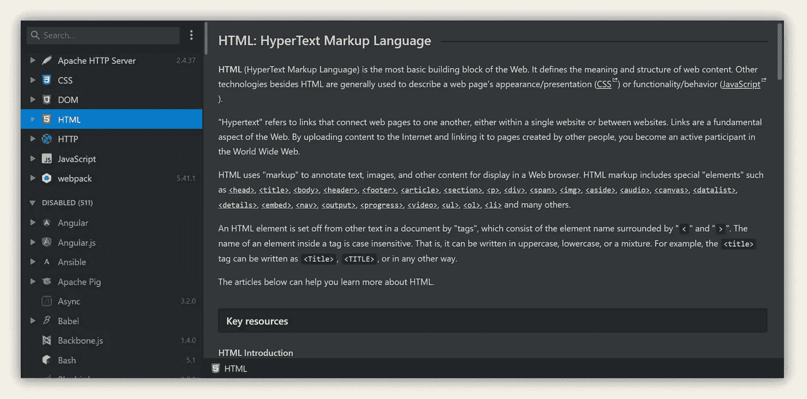
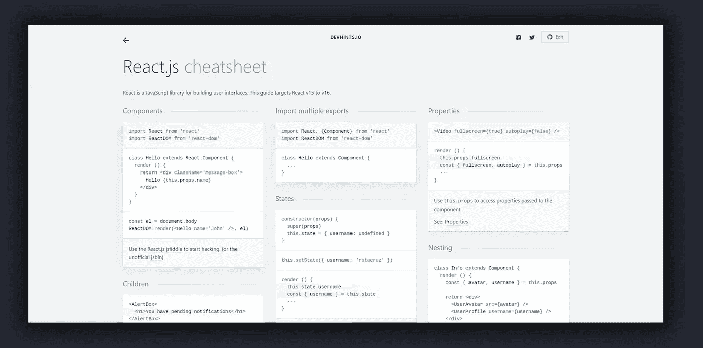
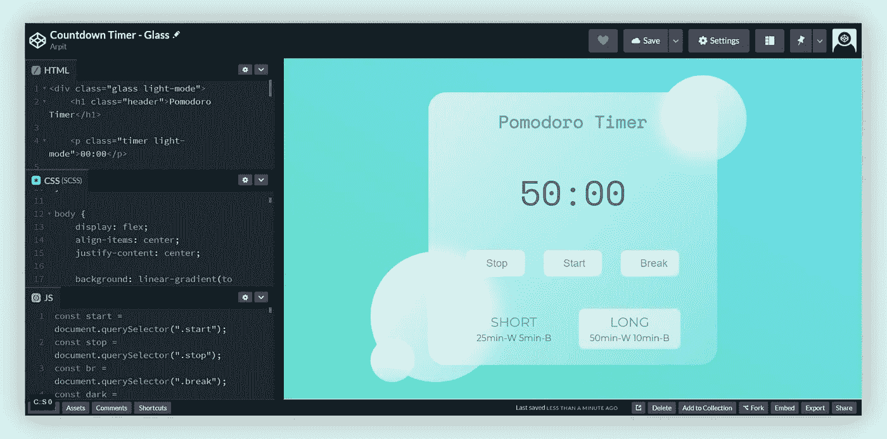
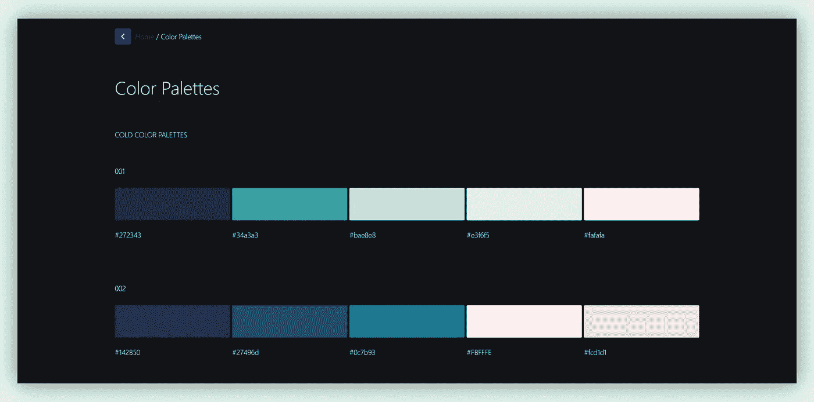
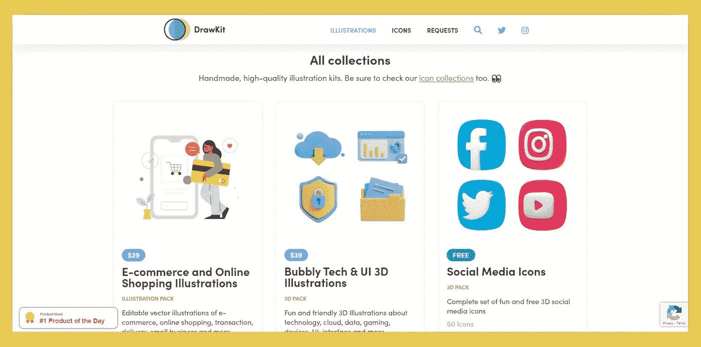
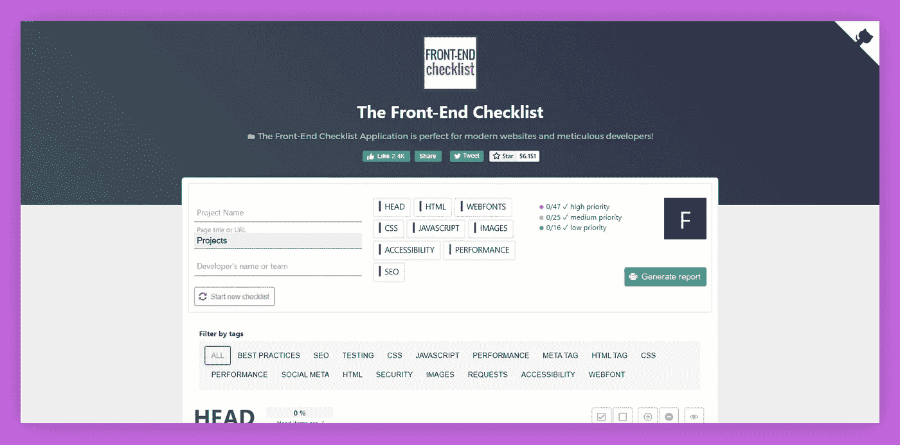
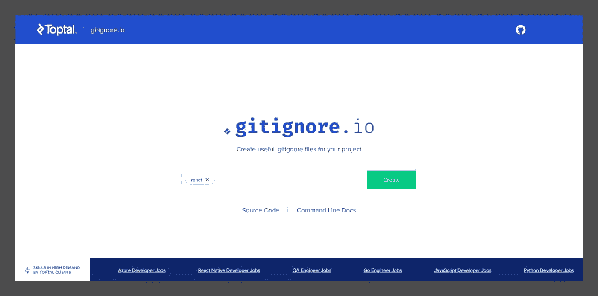

# 7 个网站让你的网站开发者生活更轻松

> 原文：<https://javascript.plainenglish.io/7-websites-to-make-your-life-easier-as-a-web-developer-aa24b99e4e0e?source=collection_archive---------11----------------------->

## 我每天都在使用其中的大部分

Photo by [Lee Campbell](https://unsplash.com/@leecampbell?utm_source=medium&utm_medium=referral) on [Unsplash](https://unsplash.com?utm_source=medium&utm_medium=referral)

最近开始学习前端 web 开发。所以，我想策划一些有用的网站，帮助我学习和发展。

我发现了这 7 个网站，我认为每个网站开发者都应该知道。它们提供了很好的工具，可以让你的开发速度提高数倍。

# 1.devdocs.io

Homepage of [devdocs.io](http://devdocs.io). Photo by Author

作为开发人员，我们总是在学习和构建。技术发展如此之快，以至于我们需要随时挑选新的框架和语言。

对我们来说幸运的是，任何新技术的开发者都会提供很好的文档和支持。文档帮助我们非常容易地查找某些功能和任何功能的实现。

最近我开始使用 React，发现它的[文档](https://reactjs.org/docs/getting-started.html)非常有用。

[devdocs.io](http://devdocs.io) 在同一个地方提供了许多流行和不太流行的技术的文档。

网站超级干净，很容易找到资源。每当我遇到困难时，我每天都用它来帮我。

# 2.devhints.io

React Cheatsheet page of [devhints.io](http://devhints.io), Photo by Author

开发人员的工作是构建和解决问题。我们没有被付钱去记住语法。所以，为什么要费心去学习我们所学的每一个框架和语言的语法呢？我们需要完成任务。

这就是备忘单发挥作用的地方。备忘单为我们提供了开发过程中最常用的函数。它就像是一项技术的迷你文档。

我发现，将我正在开发的框架的备忘单放在我面前，可以多次加速我的开发过程。

[devhints.io](http://devhints.io) 为许多开发工具、框架和语言提供了备忘单。

我在浏览器中安装了 *devhints.io* 。我经常用它。

# 3.codepen.io

New Pen page of [codepen.io](http://codepen.io). Photo by Author

我的 CSS 技能主要归功于 [codepen.io](http://codepen.io) 。

*codepen.io* 是一个基于社区的网站。它拥有庞大的前端开发人员和全栈开发人员用户群，他们分享自己独特而美丽的作品。

该网站的最大特点之一是它为你提供了一个在线实时编辑器，你可以在这里快速创建单页网站，无需任何设置。您还可以轻松地与他人共享您的工作和代码。

在这里，大多数作品都是开源的。因此，你可以很容易地选择[吸引你眼球的东西](https://codepen.io/trending)并查看代码，尝试自己重新创建它。

这是一个练习您的前端技能和向社区学习的好地方。

# 4.colorsandfonts.com

Color Pallete page of [colorsandfont.com](https://www.colorsandfonts.com/). Photo by Author

有没有遇到过在你的网站上使用哪种颜色和字体的问题？

调色板在网页设计中起着很大的作用。我总是在制作调色板和选择合适的字体组合来用在我的网站上。

有了[colorsandfonts.com](http://colorsandfonts.com)，就像在网上挑选产品一样简单。你只需要浏览这些选择，然后选出你最喜欢的一个。

选择正确的颜色和字体组合可以让网站立刻变得更有吸引力。我强烈推荐*colorsandfonts.com*作为你的下一个网站。

# 5.drawkit.io

Home Page of [drawkit.io](http://drawkit.io). Photo by Author

你看到的任何网站或多或少都会使用与其设计相匹配的插图和图标。但是，我们到哪里去寻找设计呢？

作为开发者，你不需要自己设计插图和图标。有很多网站免费提供给你。你可以挑选他们预先做好的插图，用在你的网站上。

我使用 [drawkit.io](http://drawkit.io) 来满足我的大部分需求，但这里有一些其他网站为我们提供了令人惊叹的插图、图标和 3D 资产—

1.  [undraw.co](https://undraw.co/)
2.  [canva.com](http://canva.com)
3.  [iconscout.com](https://iconscout.com/)

# 6.frontendchecklist.io

Frontpage of [frontendchecklist.io](http://frontendchecklist.io). Photo by Author

当你在做一个大型网站，需要处理很多事情的时候，这是一个很好的资源。

[frontendchecklist.io](http://frontendchecklist.io) 为我们提供了在发布我们的网站之前应该填写的事项列表。

它包括小事情，最重要的事情，可以影响我们网站的性能，搜索引擎优化，可访问性和安全性。

这是一个伟大的工具来检查你的网站的健壮性，使它比大多数网站更好。

# 7.gitignore.io

Homepage of [gitignore.io](http://gitingnore.io), Photo by Author

这个网站是专门为使用 GitHub 的人设计的。如果你不知道 GitHub，不用担心，你可以在这里学习[。](https://www.youtube.com/watch?v=SWYqp7iY_Tc)

我是 GitHub 的超级粉丝。我喜欢记录我的项目，即使我没有和团队一起工作。我们，开发人员，不会把我们的节点模块和开发模块上传到存储库。

这就是为什么 GitHub 中有`gitignore`文件，以省略我们不想上传的文件。

[gitignore.io](http://This website is particularly for the people who use GitHub. If you don't know GitHub, don't worry, you can learn from here.) 快速为你正在使用的任何技术栈制作一个`gitignore`文件。您可以放心，您的开发文件夹不会被上传到存储库中。

我发现这些网站在很大程度上帮助了我，加速了我的发展和学习过程。

我每天使用的另一个网站是 [**中型**](https://arpitfalcon.medium.com/membership) **。各种主题的文章有助于学习许多概念。我也发现了我从未想过存在的东西。**

如果你是新来的，请使用下面的链接来获取我和其他成千上万的作家在 Medium 上的无限故事。

[**这里是无限制访问媒体上所有内容的链接。如果你使用这个链接注册，我会收到一小笔钱作为感谢。**](https://arpitfalcon.medium.com/membership)

*更多内容看**[***说白了. io***](http://plainenglish.io/)*