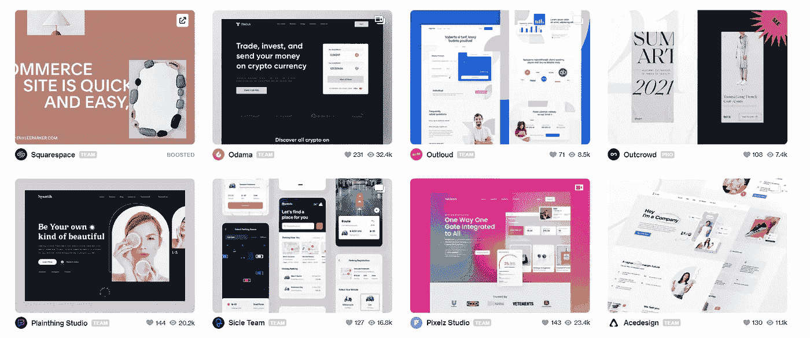

# 5 个网站将您的前端技能从 1 倍提升到 100 倍

> 原文：<https://javascript.plainenglish.io/7-websites-to-take-your-front-end-skills-from-1x-to-100x-98c1db53c6d1?source=collection_archive---------0----------------------->

## 走出教程地狱。

Photo by [Kelly Sikkema](https://unsplash.com/@kellysikkema?utm_source=medium&utm_medium=referral) on [Unsplash](https://unsplash.com?utm_source=medium&utm_medium=referral)

我发现前端开发比后端开发难多了。一般来说，在后端开发中，我知道我在做什么，以及所有东西是如何相互交互的，不管代码是否会运行。但是，当涉及到前端时，整个故事就不同了。

这是无数个小时的谷歌搜索，尝试不同的东西，和实验。

我不是一个优秀的前端开发人员。所以，我决定提高自己的技能，并从我可以练习的地方寻找资源。

学习像 React、Angular 这样的前端框架很好。但是，我更专注于发展我的网页设计技能和 HTML、CSS 和 JS 的基础知识。

在花了大量的时间研究和深入互联网的大世界后，我列出了这 7 个我认为最适合练习你前端技能的网站。这些网站将把你的前端技能提升到一个全新的水平。

# 1.前端导师

Challenges page of [Frontend mentors](https://www.frontendmentor.io/challenges?types=free)

[*前端导师*](http://frontendmentor.io) 是一个基于社区的挑战平台。你得到了样板代码和资源，然后，你应该按照要求制作网站。

没有规定说网站应该和样本一模一样。所以，你可以尽情发挥你的创造力。

进入*前端导师*的门槛几乎为零，任何级别的人都可以来挑战自己。它的特点是挑战从新手到专家的水平，所以每个人都有适合的东西。

前端导师最棒的一点是，在你解决了一个挑战后，你把它上传到社区，并与人们互动以赚取积分。这不是一个测试，而是一个学习、成长和与他人分享的平台。

利用前端大师的方法是尽可能多地参与社区，而不是成为一个完美主义者，把你的工作放在那里。

# 2.100 天挑战

[*100DaysCSS 挑战赛*](https://100dayscss.com/days/1) 专注于深入挖掘你的 CSS 技能。接受这个挑战后，你将成为一名 CSS 大师(这是我听说的)。

每天你都有一个新的挑战要完成，你必须用同样的概念去创造这个或类似的东西。创造力非常受欢迎，尤其是在 CSS 社区。

您在 [codepen](http://codepen.io) s 中提交您的解决方案。如果您不知道 codepen 是什么，它是一个在线代码编辑器工具，允许您在浏览器中编写代码，并在构建时查看实时结果。我会建议检查一次。

Home page of [100DaysCSS Challenge](https://100dayscss.com/days/1/)

*#100DaysChallenge* 是 Twitter 上非常受欢迎的标签。你可以记录你在那里的旅程，并和那里的社区一起收获很多。我也看到许多专家在那里帮忙。

# 3.滴水不漏

[*Dribbble*](http://dribbble.com) 是互联网上最大的设计收藏之一。您可以利用这些已经构建好的设计来编码它们的克隆体。

Home page of [Dribble](http://dribbble.com)

作为一名前端开发人员，你的大部分工作是设计编码，而不是自己做网页设计。这些设计通常由 UI/UX 设计师提供。

在*运球*中，你可以选择任何你想编码的设计并开始制作。

我建议找一个程序员伙伴，你们可以互相挑战谁能更快地克隆设计。在某种程度上，这将是一个健康的竞争，会激励你们两个去挑战自己的极限。

有一个伙伴程序员的一个很大的特点是，你们可以一起集思广益解决一些难题。

# 4.CodePen 挑战

我前面提到过 [*codepen*](http://codepen.io) 它是一个供你编码的在线编辑器。但是，远不止如此。Codepen 还提供了一个社区，在这里你可以分享你的作品，也可以看看其他人的作品。它的伟大之处在于，你可以看到代码，以及某人是如何做出特定设计的。

我喜欢花时间在 codepen 上，去了解一些最好的设计师和开发者。这是一种奢侈，我们可以观看并向最优秀的人学习。

Monthly challenges by [Codepen](http://codepen.io/challenges)

Codepen 还提供了许多挑战[帮助你通过构建东西来提升技能。他们有一个每月的主题，每周你都会收到一个新的挑战。](https://codepen.io/challenges/)

有大量的参与者，他们中的大多数都与他人分享他们的代码。所以，你永远不会觉得你是一个人在做这件事。社区会帮助你提升。

# 5.日常用户界面

[*每日 UI*](https://www.dailyui.co/) 挑战也和 *100DaysCSS* 一样，要求你每天解决一个挑战。

但是，每日用户界面的工作方式与 100 天不同。每个挑战都会发送到您的邮箱，您可以随时完成挑战。

日常 UI 也照顾周末，周末不给你发挑战。与此同时，它给你免费的模板和资源作为惊喜奖励。

Home page of [Daily UI](http://dailyui.co)

我觉得日常 UI 是一个很好的资源，应该接受这个挑战。我知道我会从这个开始。

前端开发很难，很多时候令人沮丧。精通它的最好方法是大量练习。所以，让我们制作一些漂亮的网站给人们使用。

不要再把时间浪费在旧的学习技巧上了。 [***抓住我的免费 7 步学习框架，加速你的学习，让技能坚持下去。***](https://dedicated-innovator-3432.ck.page/47cebcc022)

*更多内容请看*[***plain English . io***](http://plainenglish.io/)