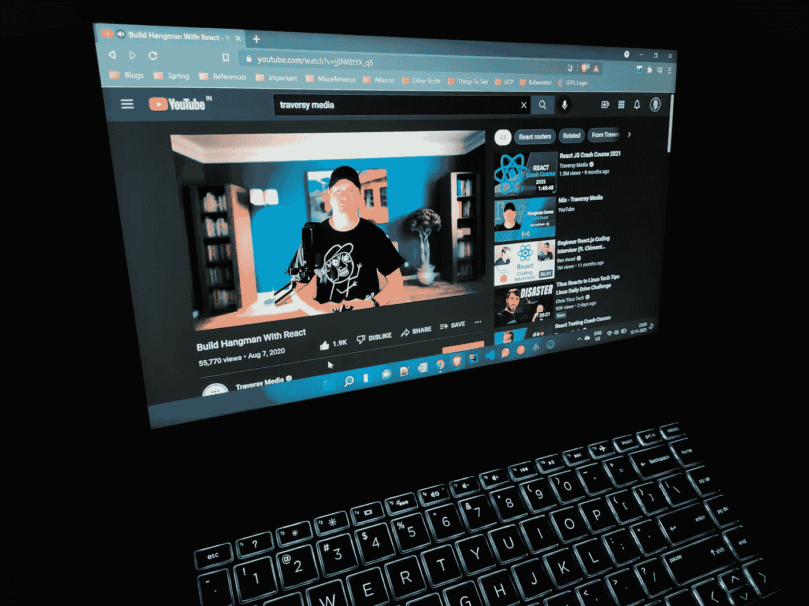

# 每个 JavaScript 开发者都应该关注的 7 个 YouTube 频道

> 原文：<https://javascript.plainenglish.io/7-youtube-channels-that-every-javascript-developer-should-follow-4dcffc9fc0c0?source=collection_archive---------4----------------------->

## 如果你是一个有抱负的或者经验丰富的开发者，强烈推荐这些 YouTube 频道。

Photo by the Author

当我在大学时，我们被要求学习和练习编程语言 C，然后被要求选择任何其他高级编程语言，如 C++或 Java。

然而，事情正在发生变化。如今，有抱负的开发人员发现 JavaScript 是最值得学习的编程语言。你看，JS 当时并不流行，尽管这种语言是在 1995 年创建的。

自从开源、跨平台、后端 JavaScript 运行时环境 *Node.js* 发布以来，JavaScript 代码现在可以在 web 浏览器之外执行。这是 JavaScript 被称为 web 语言的唯一原因，这要归功于它的“ *JavaScript everywhere* ”范例，该范例围绕一种编程语言集成了 Web 应用程序开发中的一切，而不是为服务器端和客户端脚本使用单独的语言。

有了这么多的平台和选择，学习编程变得前所未有的简单。YouTube 就是这样一个平台，最棒的是它完全免费。有各种渠道提供 JavaScript 及其框架的教程或其他内容，创作者可以在这些渠道中让编程变得非常有趣。

因此，我分享了一些最好的 YouTube 频道，排名不分先后，你一定要去看看，并尽可能多地带走。

# 旅行媒体

*频道链接:**[***https://www.youtube.com/c/TraversyMedia***](https://www.youtube.com/c/TraversyMedia)*订阅者:* ***1.69M****

*不应该有任何没有 Traversy 媒体频道的列表。早在 2009 年由 *Brad Traversy* 创办，该频道拥有一些最令人满意的 JavaScript 及其框架，如 *Vue、Angular、Node.js、*以及流行的库，如 *jQuery、React、Chart.js* 等。除此之外，他还创建了关于其他不同编程语言、框架、工具和库的全功能速成课程。*

*该频道还包括来自 Brad 和其他著名客座讲师的视频，如“*用 React* 构建 Hangman”、“*构建音乐播放器|香草 JavaScript* 、“ *JavaScript 书单应用|无框架*、“*Ace 求职面试的 7 个技巧*”以及数百个更多的教育教程。这个频道已经影响了其他几个编程频道，并激励了许多有抱负的人从事 web 开发。*

# *本·阿瓦德*

**频道链接:**[***https://www.youtube.com/c/BenAwad97***](https://www.youtube.com/c/BenAwad97)*订阅者:* ***358K*****

**本·阿瓦德(Ben Awad)是一名软件开发人员，他制作视频并上传到他的频道上，分享关于 *React、React Native、GraphQL、Typescript、Node.js、PostgreSQL、Python* 以及其他视频的经验。他在 React 方面非常有经验，已经在他的频道上上传了几个用 React 开发的项目。**

**本在他的视频中非常机智和讽刺，他对 Angular 的恨和对 React 的爱受到了他的订户的喜爱。他还有一些关于他讨厌 Angular 的独特视频。他的视频“*我爱 Angular.js* ”和“*谷歌最懂*”极其搞笑讽刺。**

# **开发教育**

***频道链接:**[***https://www.youtube.com/c/DevEd***](https://www.youtube.com/c/DevEd)*订阅者:* ***707K******

**这个名为 *Dev Ed，*的频道成立于 2018 年，由于上传视频的质量，它已经实现了指数级增长。该频道有关于 *Vanilla JavaScript、React、UI & UX、*和 *Node.js* 的视频。该频道还有其他基于讨论的视频，他在那里讨论自己的经历。让他的视频脱颖而出的是他独特的幽默感和诚实的解释，看起来令人难以置信。**

# **简化的 Web 开发**

***频道链接:**[***https://www.youtube.com/c/WebDevSimplified***](https://www.youtube.com/c/WebDevSimplified)*订阅者:* ***717K******

***Web Dev 简化版*是 2018 年开始的另一个被低估的频道。Kyle 是一个出色的全能开发人员，他确保他教授的任何东西都更容易掌握和理解。有学习 web 开发的视频，各种各样的项目想法，以及大量有用的技巧和建议视频，适用于所有有抱负的以及经验丰富的开发人员。**

# **网络忍者**

***频道链接:**[***https://www.youtube.com/c/TheNetNinja***](https://www.youtube.com/c/TheNetNinja)*订阅者:* ***823K******

**前端开发的最佳渠道之一，提供了大量关于*现代 JavaScript(初级到高级)、Node.js、React、Vue.js、Firebase、HTML & CSS* 和其他几个主题的视频教程。该频道拥有最一致的上传，有几个课程的播放列表，使其成为节目制作中最好的频道之一。**

**老师的声音温暖而乐观，让学习变得愉快，并彻底解释一切。他甚至在 Udemy 上有几门课程，尽管他在 YouTube 上的免费视频质量很高，更好(*在我看来*)。**

# **火船**

***频道链接:**[***https://www.youtube.com/c/Fireship***](https://www.youtube.com/c/Fireship)*订阅者:* ***914K******

**一个不可思议的频道，专注于在一个视频中构建项目，并使用动画以最简单的形式解释事情。该频道由杰夫·德莱尼(Jeff Delaney)于 2017 年创办，由于其在网络开发方面的非凡内容，该频道取得了突飞猛进的发展。**

**在大多数视频中，Jeff 使用的是 Firebase 平台，这是 Google 为应用程序开发而创建的。但是，他的教程范围很广，包括“ *10 个 CSS Pro 技巧——代码这个，不是那个！*"和" *JavaScript Pro 提示—编码这个，而不是那个！*”以及独特的播放列表，如“ *100 秒代码*”、“*前端迷你项目*”和“*代码这个，而不是那个*”，为他在科技 Twitter 社区赢得了巨大的人气。我保证你会迷上他的频道，你会从他那里学到很多东西。**

# **代码堆栈**

***频道链接:**[***https://www.youtube.com/c/codeSTACKr***](https://www.youtube.com/c/codeSTACKr)*订阅者:* ***165K******

**CodeSTACKr 是另一个被低估的渠道，需要比目前更多的关注。 *Jesse Hall* ，MongoDB 的高级开发者倡导者，在 2018 年推出了这个频道，作为向他十几岁的孩子展示的挑战，如果他努力工作并持续上传，他可以赢得订户。幸运的是他做到了。**

**该频道有一些平台上最有趣的节目视频。杰西创建了一个每月一次的(*以前是每周一次的*)新闻视频系列，内容涉及任何与科技相关的事物。他还邀请其他各种主题的老师。由于他在软件行业工作了超过 16 年，他的视频研究得非常好，你会从他那里学到很多东西。**

**没有比 YouTube 更好的学习平台了，在这里你有机会免费学习几乎任何东西，包括 web 开发。当然，你的奉献和努力必须在你这一端，学习最重要的方面是一致性。**

**像生活中的一切一样，这个汇编可能不是最好的，我可能列出了一些我最喜欢的频道，我从他们那里学到了很多。然而，如果不提及其他一些不可思议的渠道，这个列表就不完整了——[**【德里克·巴纳斯**](https://www.youtube.com/c/derekbanas)[**Academind**](https://www.youtube.com/c/Academind)[**freeCodeCamp**](https://www.youtube.com/c/Freecodecamp)和[**LevelUpTuts**](https://www.youtube.com/user/LevelUpTuts)**。****

**我希望你一定会看看这些渠道，这将有助于你在你的 web 开发生涯中学习和成长。**

***注意:YouTube 频道没有任何特定的顺序，当你读这篇文章的时候，订阅人数可能会改变。***

**如果你喜欢读这篇文章，你可能也会发现下面的文章值得你花时间去读。**

** [## 通过谷歌云助理云工程师考试的开发者指南

### 我最近通过了云考试，这是我如何准备考试的旅程。

blog.devgenius.io](https://blog.devgenius.io/a-developers-guide-for-passing-google-cloud-associate-cloud-engineer-exam-8a95adb44721)  [## 我的第一份科技创业工作不到一年就失败了，我是如何挺过来的

### 在那里工作 4 个月是一场噩梦。我像疯子一样工作，学到了重要的人生经验。

levelup.gitconnected.com](https://levelup.gitconnected.com/how-i-survived-my-first-tech-startup-job-that-failed-within-a-year-667a6a3f97ea) 

如果你喜欢阅读有助于你更好地学习、生活和工作的故事，可以考虑 [*成为*](https://viveknaskar.medium.com/subscribe) *的订阅者。成为会员后，你可以无限制地阅读 10000 篇故事、文章和作家。每月只要 5 美元。* [*如果你使用我的链接*](https://viveknaskar.medium.com/membership) *注册，我将获得一点佣金，帮助我写更多的文章。*

*更多内容看* [***说白了就是***](http://plainenglish.io/) *。报名参加我们的* [***免费周报在这里***](http://newsletter.plainenglish.io/) *。***