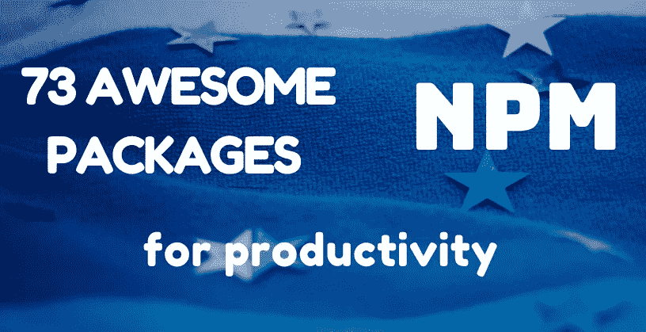

# 73 款出色的 NPM 生产力套件🚀🌱

> 原文：<https://javascript.plainenglish.io/73-awesome-npm-packages-for-productivity-c8340b373e57?source=collection_archive---------1----------------------->

如今，在我们繁忙的日程安排和紧迫的时间期限中，选择提高生产率的工具至关重要。

这里我整理了一些我最喜欢的 NPM 套餐。我还将它们进行了分类，因此信息更有条理，也更容易浏览。

当然，你不需要安装和学习它们。在大多数情况下，从每个类别中选择一个就足够了。我想提供一些选择，这样每个读者都能找到一些东西。尽情享受吧！

## 💻前端框架

1.[反应](https://www.npmjs.com/package/react)

React 使用虚拟 DOM 将页面的各个部分作为单独的组件来管理，允许您在不刷新整个页面的情况下刷新组件。通常与 [React-dom](https://www.npmjs.com/package/react-dom) 和 [React-router-dom](https://www.npmjs.com/package/react-router-dom) 一起使用。

2. [Vue](https://www.npmjs.com/package/vue)

Vue 是通过结合 React 和其他公司的最佳方法构建的，专注于使编写 Web 应用程序更快、更容易和更愉快的特性。很棒的文档。通常与 [Vue-router](https://www.npmjs.com/package/vue-router) 和 [Vuex](https://www.npmjs.com/package/vuex) 一起使用。

3.[苗条的](https://www.npmjs.com/package/svelte)

Svelte 是一种构建 web 应用程序的新方法。它是一个编译器，将您的声明性组件转换成高效的 JavaScript，并对 DOM 进行外科手术式更新。

*其他值得注意的框架还有***，* [*余烬*](https://www.npmjs.com/package/ember) *，* [*骨干*](https://www.npmjs.com/package/backbone) *，* [*预测*](https://www.npmjs.com/package/preact) *等等。你可以用他们中的任何一个创造奇迹，黄金法则是在此之前学好* [*【现代 JS】(ES6 及以上)*](https://javascript.info/) *。**

## *🎨样式框架*

*4.[自举](https://www.npmjs.com/package/bootstrap)*

*世界上最受欢迎的框架，用于构建响应迅速、移动优先的网站。直观且功能强大，尽管体积相对较大。许多现代 UI 套件都是基于它的，比如 [React Bootstrap](https://www.npmjs.com/package/react-bootstrap) 或 [Reactstrap](https://www.npmjs.com/package/reactstrap) 。*

*5.[顺风](https://www.npmjs.com/package/tailwindcss)*

*一个底层的，实用优先的 CSS 框架，用于快速 UI 开发。从头开始构建，具有超强的可定制性。*

*6.[样式-组件](https://www.npmjs.com/package/styled-components)*

*CSS-in-JS 工具在组件和样式之间架起了一座桥梁，它提供了大量的特性，让您能够以一种实用的、可重用的方式来设计组件。*

**其他伟大的解决方案还有* [*基础*](https://www.npmjs.com/package/foundation-sites)*[*布尔玛*](https://www.npmjs.com/package/bulma)*[*物化*](https://www.npmjs.com/package/materialize-css) *和* [*蚂蚁设计*](https://www.npmjs.com/package/antd) *。如果你更喜欢写香草 CSS，你可以使用一些 CSS 扩展语言像*[*SASS*](https://www.npmjs.com/package/sass)*，来扩展它的特性。****

## **🔲后端框架**

**7.[快递](https://www.npmjs.com/package/express)**

**Node.js 的快速、非个性化、极简的 web 框架。它是相对最小的，有许多可用的插件特性。通常被称为 Node.js 的标准服务器框架。**

**8.[哈比神](https://www.npmjs.com/package/@hapi/hapi)**

**哈比神最初用于快速框架。使用哈比神，您可以用最少的开销和完整的开箱即用功能构建强大的、可伸缩的应用程序。**

**9.[风帆](https://www.npmjs.com/package/sails)**

**Sails 是 Node.js 最受欢迎的 MVC 框架，支持现代应用的需求:具有可伸缩的、面向服务的架构的数据驱动 API。**

**与前端框架一样，也有许多后端替代方案，如 [*阿多尼斯*](https://www.npmjs.com/package/@adonisjs/cli) *和* [*Koa*](https://www.npmjs.com/package/koa) *。挑一个适合自己需求的，好好学。***

## **🔗CORS 和请求**

**10. [Cors](https://www.npmjs.com/package/cors)**

**Node.js 中间件，用于提供一个 Connect/Express 中间件，该中间件可用于支持具有各种选项的跨源资源共享。**

**11. [Axios](https://www.npmjs.com/package/axios)**

**一个基于 promise 的 HTTP 客户端，用于浏览器和 Node.js。与 js 内置的 [Fetch API](https://developer.mozilla.org/en-US/docs/Web/API/Fetch_API) 相比，它易于设置，直观，并且简化了很多东西。**

**12.正文解析器**

**主体解析中间件，它提取传入请求流的整个主体部分，并在 req.body 上将其公开，作为更容易交互的东西。**

## **🧩 API 服务**

**13.[重新定义](https://www.npmjs.com/package/restify)**

**Node.js web 服务框架针对构建语义正确的 RESTful web 服务进行了优化，可用于大规模生产。Restify 针对内省和性能进行了优化。**

**14.[图表 QL](https://www.npmjs.com/package/graphql)**

**API 的查询语言和用现有数据完成这些查询的运行时。为 API 中的数据提供完整的描述，让客户能够准确地询问他们需要什么。**

## **🤝Web 套接字**

**15. [Socket.io](https://www.npmjs.com/package/socket.io)**

**插座。IO 支持实时、双向和基于事件的通信。它可以在任何平台、浏览器或设备上运行，同样注重可靠性和速度。**

**16. [WS](https://www.npmjs.com/package/ws)**

**简单易用、快速且经过全面测试的 WebSocket 客户端和服务器实现。Socket.io 的一个很好的、不那么抽象的、简单的替代品。**

## **✍伐木工**

**17.[摩根](https://www.npmjs.com/package/morgan)**

**具体来说，一个 HTTP 请求记录器，存储 HTTP 请求，并让您简明地了解您的应用程序是如何使用的，以及哪里可能有潜在的错误。**

**18.温斯顿**

**一个支持多种运输方式的日志记录器。比 Morgan 存在的时间更长，它也有更大的维护者群体和更多的下载量。**

## **💾数据库工具**

**19.[猫鼬](https://www.npmjs.com/package/mongoose)**

**Mongoose 是一个 MongoDB 对象建模工具，设计用于在异步环境中工作。猫鼬支持承诺和回调。**

**20.[续集](https://www.npmjs.com/package/sequelize)**

**Sequelize 是一个基于 promise 的 Node.js ORM，用于 Postgres、MySQL、MariaDB、SQLite 和 Microsoft SQL Server。它具有可靠的事务支持、关系、急切加载和延迟加载、读取复制等特性。**

## **🔓认证工具**

**21.[护照](https://www.npmjs.com/package/passport)**

**Passport 的目的是通过一组称为策略的可扩展插件来验证请求。您向 Passport 提供认证请求，Passport 提供钩子来控制认证成功或失败时发生的事情。**

**22. [Bcrypt](https://www.npmjs.com/package/bcrypt)**

**一个帮助你散列密码的库。Bcrypt 是由 Niels Provos 和 David Mazières 基于 Blowfish 密码设计的密码散列函数，并于 1999 年在 USENIX 提出。**

**23. [JSONWebToken](https://www.npmjs.com/package/jsonwebtoken)**

**JSON Web 令牌(JWT)是一种开放的行业标准 RFC 7519 方法，用于安全地表示双方之间的声明。这个包允许你解码，验证和生成 JWT。**

## **🔧配置模块**

**24.[配置](https://www.npmjs.com/package/config)**

**设置存储在应用程序的配置文件中，可以被环境变量、命令行参数或外部源覆盖和扩展。**

**25.Dotenv**

**将环境变量从. env 文件加载到 process.env 的零依赖模块。**

## **📃静态站点生成器**

**26.盖茨比**

**一个现代的站点生成器，可以创建快速、高质量、动态的 React 应用程序，从博客到电子商务站点，再到用户仪表盘。伟大的插件生态系统和模板。**

**27. [NextJS](https://www.npmjs.com/package/next)**

**NextJS 首先支持服务器呈现以及静态生成的内容。还可以将无服务器函数定义为 API 端点。**

**28. [NuxtJS](https://www.npmjs.com/package/nuxt)**

**NuxtJS 基本上是 Vue 生态系统中的 NextJS 替代品。NuxtJS 的目标是让 web 开发变得强大和高效，并考虑到优秀的开发人员体验。**

## **🌟模板语言**

**29.[小胡子](https://www.npmjs.com/package/mustache)**

**Mustache 是一种无逻辑的模板语法。它可以用于 HTML、配置文件、源代码——任何东西。它通过使用散列或对象中提供的值扩展模板中的标签来工作。**

**30.[车把](https://www.npmjs.com/package/handlebars)**

**使用模板和输入对象生成 HTML 或其他文本格式。车把模板看起来像一个嵌入了车把表达式的常规文本。手柄在很大程度上与小胡子模板兼容。**

**31. [EJS](https://www.npmjs.com/package/ejs)**

**EJS 是一种简单的模板语言，它让你用简单的语法、快速的执行和简单的调试生成 HTML 标记。EJS 有一个庞大的活跃用户群体，该图书馆正在积极开发中。**

## **📷图像处理**

**32.[锋利](https://www.npmjs.com/package/sharp)**

**一个伟大的模块，将普通格式的大图像转换为较小的，网页友好的不同尺寸的 JPEG，PNG 和 WebP 图像。**

**33.[通用汽车](https://www.npmjs.com/package/gm)**

**多亏了 Node.js 模块 GM，您可以使用两个流行的工具来创建、编辑、合成和转换图像——graphics magick 和 ImageMagick，直接在代码中使用。**

**34.[云状](https://www.npmjs.com/package/cloudinary)**

**用于简化云服务工作的专用模块，为 web 应用程序的整个图像管理管道提供解决方案。**

## **📅日期格式**

**35. [DayJS](https://www.npmjs.com/package/dayjs)**

**DayJS 是 [MomentJS](https://www.npmjs.com/package/moment) (自 2020 年 9 月起处于维护模式)的快速轻量替代方案。使用类似的 API——如果您使用过 MomentJS，那么您已经知道如何使用大多数 DayJS。**

**36.[卢克森](https://www.npmjs.com/package/luxon)**

**如果您喜欢另一个轻量级的替代方案，具有稍微不同的 API，Luxon 可能是您的正确选择。**

## **🧙‍♂️数据生成器**

**37.[简称](https://www.npmjs.com/package/shortid)**

**创建非常短的非顺序 url 友好的唯一 id。非常适合 url 缩写、DB ids 和任何其他 id。**

**38. [Uuid](https://www.npmjs.com/package/uuid)**

**方便的小软件包，可以快速轻松地生成更复杂的通用唯一标识符(UUIDs)。**

**39.[骗子](https://www.npmjs.com/package/faker)**

**用于在浏览器和 Node.js 中生成大量虚假数据的有用包。**

## **✅验证器**

**40.[验证器](https://www.npmjs.com/package/validator)**

**方便的字符串验证器和杀毒器库。许多有用的方法可用，如`isEmail()`、`isCreditCard()`、`isDate()`和`isURL()`。**

**41. [Joi](https://www.npmjs.com/package/joi)**

**强大的模式描述语言和 JavaScript 数据验证器。**

## **📧表格和电子邮件**

**42.[福米克](https://www.npmjs.com/package/formik)**

**Formik 是 React 和 React Native 的一个流行的开源表单库。它易于使用，具有声明性和适应性。**

**43.[乘子](https://www.npmjs.com/package/multer)**

**Multer 是一个用于处理多部分/表单数据的 Node.js 中间件，主要用于上传文件。**

**44.[节点邮件程序](https://www.npmjs.com/package/nodemailer)**

**Nodemailer 是 Node.js 应用程序的一个模块，允许轻松发送电子邮件。该项目始于 2010 年，如今它是大多数 Node.js 用户默认使用的解决方案。**

## **🧪测试**

**45.[笑话](https://www.npmjs.com/package/jest)**

**Jest 是一个令人愉快的 JavaScript 测试框架，专注于简单性。它允许你用一个平易近人的、熟悉的、功能丰富的 API 来编写测试，并快速给出结果。**

**46.[摩卡](https://www.npmjs.com/package/mocha)**

**Mocha 是一个 JavaScript 测试框架，让异步测试变得简单有趣。Mocha 测试连续运行，允许灵活和准确的报告，同时将未捕获的异常映射到正确的测试用例。**

## **💫网页抓取和自动化**

**47.加油吧**

**Cheerio 广泛用于网页抓取工作，有时用于自动化任务。它非常快，因为它是基于 jquery 的。Cheerio 包装了 Parse5 解析器，足以解析任何类型的 HTML 和 XML 文档。**

**48.[木偶师](https://www.npmjs.com/package/puppeteer)**

**木偶师广泛用于自动化浏览器任务，并且只能与谷歌 chrome 无头浏览器(即 chromium)一起工作。木偶师也可以用于网页抓取任务。与 Cheerio 模块相比，它功能更强大，功能更丰富。**

## **🌷棉绒和成形器**

**49.[诚信通](https://www.npmjs.com/package/eslint)**

**ESLint 是一个工具，用于识别和报告 ECMAScript/JavaScript 代码中的模式。ESLint 是完全可插拔的，每一个规则都是一个插件，你可以在运行时添加更多。**

**50.[更漂亮](https://www.npmjs.com/package/prettier)**

**漂亮是一个固执己见的代码格式化程序。它通过解析您的代码并根据自己的规则(考虑到最大行长度，必要时换行)重新打印代码来强制执行一致的风格。**

## **📦模块捆扎机和最小化机**

**51.[网络包](https://www.npmjs.com/package/webpack)**

**一个著名的强大的模块捆绑器。它的主要目的是捆绑 JavaScript 文件以便在浏览器中使用，但它也能够转换、捆绑或打包任何资源或资产。**

**52. [HTML-Minifier](https://www.npmjs.com/package/html-minifier)**

**轻量级的、高度可配置的、经过良好测试的基于 Javascript 的 HTML 压缩器/迷你器(支持 Node.js)。**

**53.[清洁 CSS](https://www.npmjs.com/package/clean-css)**

**快速高效的 CSS 优化器，适用于 Node.js 平台和任何现代浏览器。高度可配置和许多兼容模式。**

**54.[丑 JS2](https://www.npmjs.com/package/uglify-js)**

**JavaScript 解析器，迷你器，压缩器和美化工具包。它可以接受多个输入文件，并支持许多配置选项。**

## **👨‍💻流程经理和运行人员**

**55.[节点门](https://www.npmjs.com/package/nodemon)**

**在 Node.js 应用程序开发期间使用的简单监视器脚本。对开发很有用，因为它非常容易重启，并且默认情况下支持文件监视**

**56. [PM2](https://www.npmjs.com/package/pm2)**

**节点的生产流程经理。带有内置负载平衡器的 JS 应用程序。更全面，更适合生产。为您提供了许多参数进行调整/操作。**

**57.[兼](https://www.npmjs.com/package/concurrently)**

**简单明了——并发运行多个命令的有用工具。**

## **🚧CLI 和调试器**

**58.[指挥官](https://www.npmjs.com/package/commander)**

**提供流畅的 API，用于定义 CLI 应用程序的各个方面，如命令、选项、别名和帮助。简化命令行应用程序的创建。**

**59.[问询者](https://www.npmjs.com/package/inquirer)**

**Node.js 的一个易于嵌入的漂亮命令行界面提供了令人惊叹的查询会话流。**

**60.[粉笔](https://www.npmjs.com/package/chalk)**

**Chalk 是一个非常简单的库，创建它的目的很简单——设计终端字符串。**

**61.[调试](https://www.npmjs.com/package/debug)**

**一个小型的 JavaScript 调试工具。只需将您的模块名称传递给一个函数，它将返回一个修饰版的 console.error，供您传递调试语句。**

## **🧰公用事业公司**

**62.[洛达什](https://www.npmjs.com/package/lodash)**

**一个现代化的 JavaScript 实用程序库，提供模块化、高性能和额外功能。公开了 JavaScript 数组、对象和其他数据结构的许多有用的方法。**

**63.[下划线](https://www.npmjs.com/package/underscore)**

**下划线提供了许多常用的函数助手以及更专业的东西:函数绑定、javascript 模板、创建快速索引、深度相等测试等。**

**64.[异步](https://www.npmjs.com/package/async)**

**Async 是一个实用模块，它为使用异步 JavaScript 提供了直接、强大的功能。**

## **🔩系统模块**

**65. [Fs-extra](https://www.npmjs.com/package/fs-extra)**

**Fs-extra 包含了 vanilla Node.js `fs`包中没有的方法，比如`copy()`、`remove()`、`mkdirs()`。**

**66.[节点方向](https://www.npmjs.com/package/node-dir)**

**用于一些常见目录和文件操作的模块，包括获取文件数组、子目录以及读取和处理文件内容的方法。**

**67.[节点缓存](https://www.npmjs.com/package/node-cache)**

**一个简单的缓存模块，有设置、获取和删除方法，有点像 [memcached](https://memcached.org/) 。键可以有一个超时(ttl ),超时后它们将过期并从缓存中删除。**

## **🧷其他人:**

**68.[头盔](https://www.npmjs.com/package/helmet)**

**通过设置各种 HTTP 标头来帮助您保护应用。它是连接风格的中间件，与 Express 等框架兼容。**

**69. [PDFKit](https://www.npmjs.com/package/pdfkit)**

**DFKit 是一个用于节点和浏览器的 PDF 文档生成库，使创建复杂的、多页的、可打印的文档变得容易。**

**70. [CSV](https://www.npmjs.com/package/csv)**

**全面的 CSV 套件结合了 4 个经过充分测试的软件包，用于生成、解析、转换和字符串化 CSV 数据。**

**71.[标明](https://www.npmjs.com/package/marked)**

**用于解析 markdown 的低级编译器，无需长时间缓存或阻塞。**

**72.[随机颜色](https://www.npmjs.com/package/randomcolor)**

**一个生成吸引人的随机颜色的小脚本。您可以传递一个 options 对象来影响它产生的颜色类型。**

**73.[复数](https://www.npmjs.com/package/pluralize)**

**这个模块使用一个预定义的规则列表，按顺序应用，给定单词的单数或复数。这在很多情况下都是有用的，比如任何基于用户输入的自动化。**

**写作一直是我的激情所在，帮助和激励他人给我带来了快乐。如果您有任何问题，请随时联系我们！**

**在 [Twitter](https://twitter.com/madzadev) 、 [LinkedIn](https://www.linkedin.com/in/madzadev/) 、 [GitHub](https://github.com/madzadev) 和 [DEV](https://dev.to/madza) 上给我接通！**

**订阅我的[博客](https://blog.madza.dev)获取更多类似的文章。**