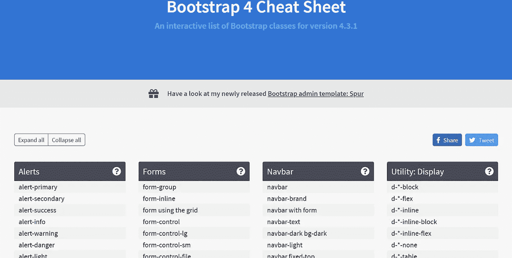

# Web 开发人员的 8 大备忘单

> 原文：<https://javascript.plainenglish.io/8-amazing-cheatsheet-resources-for-web-developers-74a50fde89ba?source=collection_archive---------5----------------------->

## 发现它们，利用它们让你的产量翻倍

8 Amazing cheat-sheet resources for web developers

亲爱的读者们，这篇文章涵盖了最棒的备忘单资源，可以让你更快更容易地编写代码。

准备好了吗？我们走吧！

# 1.OverAPI

一个了不起的小抄收藏家。我用的最多的是 JS 小抄。我喜欢这个资源，因为它有更多关于 NodeJS、Ruby、Express、MySQL 等的备忘单。对于全栈 web 开发者来说是很好的参考。

OverAPI

链接:

 [## OverAPI.com |收集所有的小抄

### OverAPI.com 是一个收集所有备忘单的网站，全部！

overapi.com](https://overapi.com/) 

# 2.GitSheet

Git 版本控制在开发者中如此受欢迎。有一个好的小抄肯定会让初学者学习起来轻松快捷。即使对于有经验的开发人员来说，将通用的 git 命令放在一边也能节省他们的时间。如果您使用 SmartGit、Fork 或其他工具，您可能会发现这毫无用处，但是总有一些开发人员仍然习惯于命令行(我就是其中之一😛).

GitSheet

链接:

 [## GitSheet

### GitSheet 是一个简单的 git 备忘单参考，用于常见的 git 命令，节省您的时间并帮助您学习如何使用…

gitsheet.wtf](https://gitsheet.wtf/) 

# 3.自举 4

Bootstrap 是 web 开发人员使用最多的 CSS 框架之一。你可能知道一个 CSS 类，但是不记得它到底是怎么写的。这个资源可以让你的网站设计变得简单快捷。

Bootstrap 4 cheat sheet

链接:

 [## Bootstrap 4 备忘单-Bootstrap 类的最终列表

### 在这个交互式自举备忘单上快速找到你的自举类。它包括代码样本和现场…

hackerthemes.com](https://hackerthemes.com/bootstrap-cheatsheet/) 

如果你用的是 Bootstrap 5，这里是它的备忘单！

 [## 自举 5 备忘单🚀按主题选择|类别

### Bootstrap 5 类、变量和混合的交互式列表。🎁你将拥有的唯一一张自举 5 备忘单…

bootstrap-cheatsheet.themeselection.com](https://bootstrap-cheatsheet.themeselection.com/) 

# 4.HTML 和更多

在线交互式 HTML 备忘单包含有用的代码示例和 web 开发人员工具、标记生成器和有趣的备忘单，可以帮助 web 开发人员快速开发。不仅仅是关于 HTML。它也有 CSS、JS、jQuery 和 SEO 的备忘单。

HTML and more cheat sheet

链接:

 [## HTML 备忘单

### HTML 备忘单在一个页面上包含有用的代码示例和 web 开发工具、标记生成器等…

htmlcheatsheet.com](https://htmlcheatsheet.com/) 

# 5.我能用吗

***我能用*** 提供最新的浏览器支持表，用于支持桌面和移动 web 浏览器上的前端 web 技术。它就像一个数据库，你可以快速找到你可以在哪里使用 CSS 网格，例如，在不同的浏览器上。

Can I use

链接:

 [## 我能用吗...HTML5、CSS3 等的支持表

### 测试功能我们与 BrowserStack 的合作现在可以让您测试您的网站在 2，000 多个真实的…

caniuse.com](https://caniuse.com/) 

# 6.全息照相术

Cheatography 对程序员来说是一个很好的参考。它有很多备忘单，你可以根据技术和标签过滤，比如 Angular，HTML，PHP 等等。

Programming cheat sheets

链接:

 [## 编程备忘单

### PHP 快速参考指南，包括函数参考，正则表达式语法指南和 PHP…

cheatography.com](https://cheatography.com/programming/) 

# 7.格子

CSS **网格**布局是 CSS 中的下一件大事。这个可视化的备忘单包括了最重要的 CSS **网格**属性，以可视化的方式呈现，使其易于学习和用作备忘单。

GRID

链接:

 [## GRID:CSS 网格布局的简单可视备忘单

### 通过简单的可视化示例了解 CSS 网格布局中所有可用的属性。

grid.malven.co](https://grid.malven.co/) 

# 媒体查询

@ **媒体 CSS** at-rule **可以**用于基于一个或多个**媒体**查询应用样式表的一部分。当且仅当**媒体**查询与使用内容的设备相匹配时，您可以指定一个**媒体**查询和一个 CSS 块应用于文档。

Media queries cheat sheet.

链接:

 [## CSS 3，媒体查询备忘单

### 编辑描述

mac-blog.org.ua](https://mac-blog.org.ua/css-3-media-queries-cheat-sheet/) 

尽情享受吧！

**让我们联系上** [**中**](https://medium.com/@famzil/) **，**[**Linkedin**](https://www.linkedin.com/in/fatima-amzil-9031ba95/)**，** [**脸书**](https://www.facebook.com/The-Front-End-World) **，**[**insta gram**](https://www.instagram.com/the_frontend_world/)**，或者**[**Twitter**](https://twitter.com/FatimaAMZIL9)**。**

[👉www.fam-front.com](http://www.fam-front.com/)

*更多内容请看*[***plain English . io***](http://plainenglish.io)