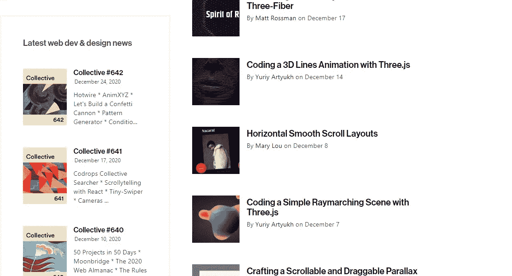
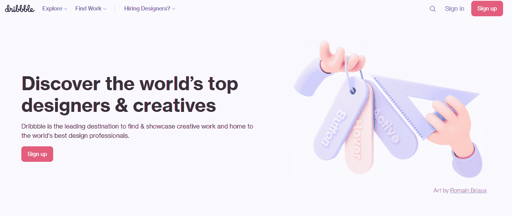
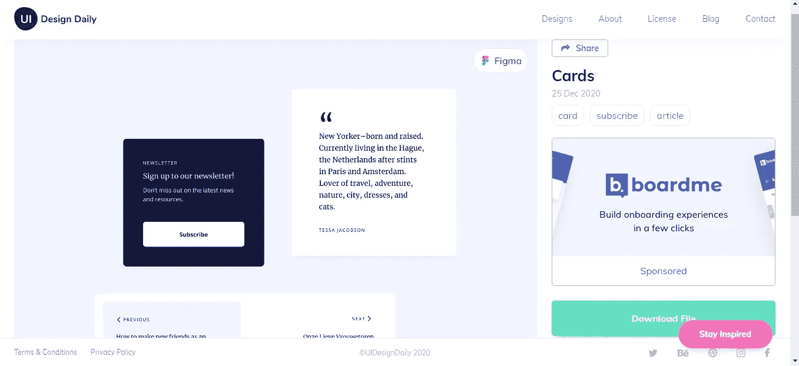
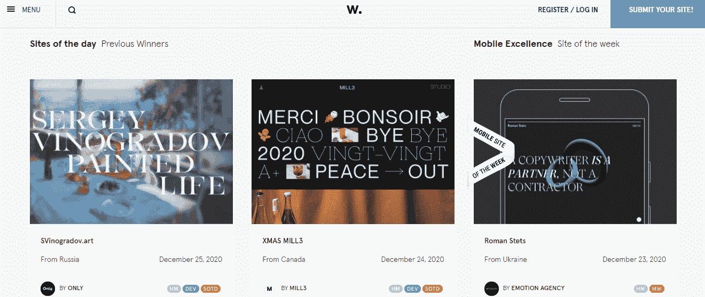
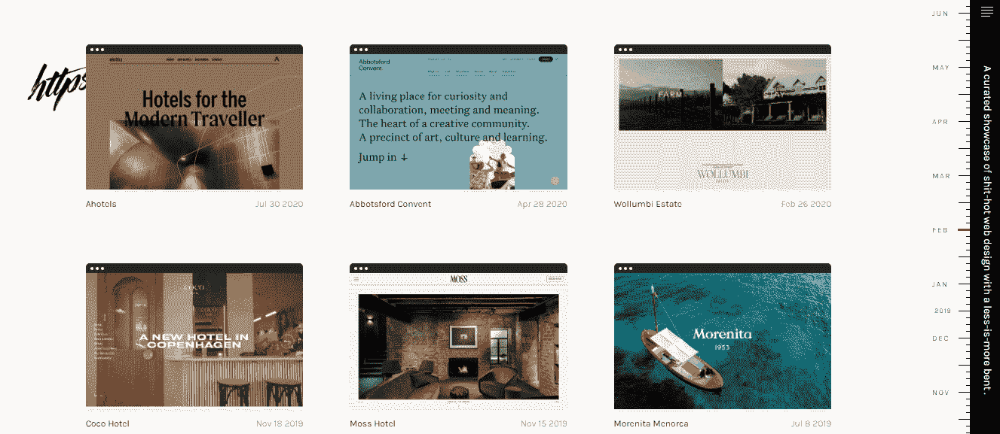
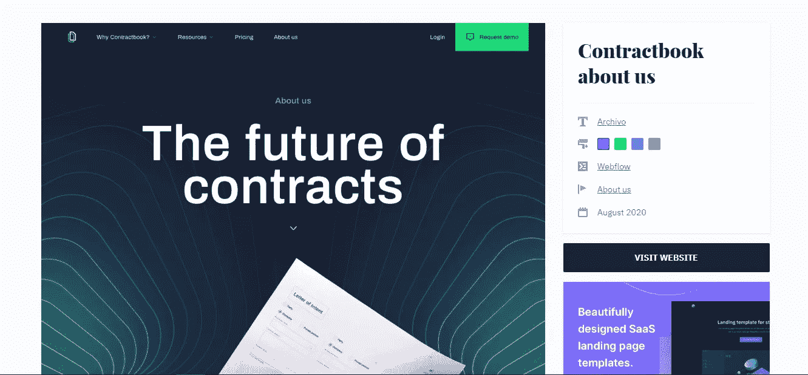
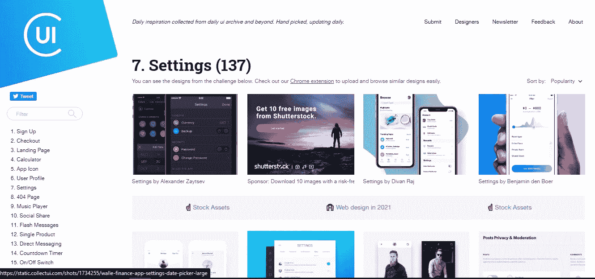
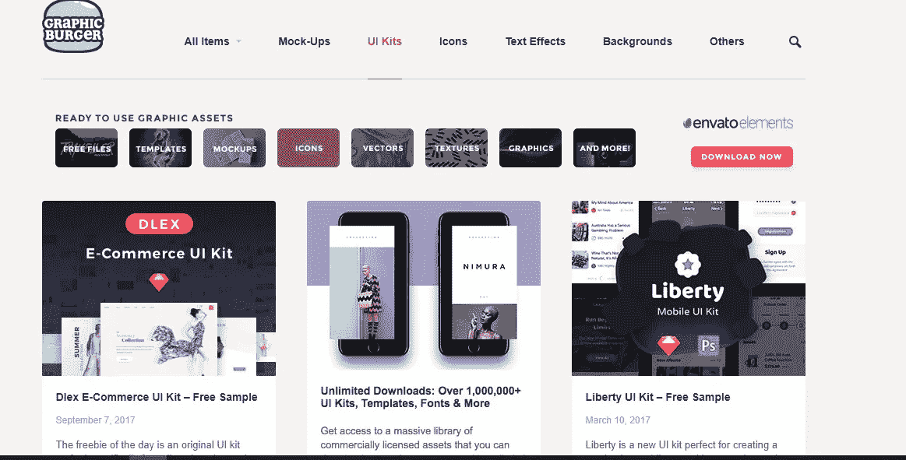

# 8 个免费寻找设计灵感的神奇地方

> 原文：<https://javascript.plainenglish.io/8-amazing-places-to-find-design-inspirations-for-free-dd2e64abc1b0?source=collection_archive---------10----------------------->

## 用这些模型创建优秀的网站和应用程序。

Source: [UI Design Daily](https://uidesigndaily.com/posts/sketch-dashboard-wireframe-website-sidebar-day-960)

找到正确的设计灵感可以在你即将推出的网站的用户界面和 UX 中发挥重要作用。

你可以只用三种颜色，甚至只用一个简单的黑白主题来创建令人惊叹的网站！

然而，提出想法并不总是容易的，因此，有一个精选的地方集合来寻找美丽的设计灵感可以是一个救命稻草。

以下是 8 个寻找设计灵感的好地方。

## 1. [Codrops](https://tympanus.net/codrops/)

当我刚涉足前端开发领域时，Codrops 是我的首选。

Source: [Codrops](https://tympanus.net/codrops/)

Codrops 在这个列表中占据第一的位置，仅仅是因为它不仅展示了迷人的设计，还提供了相同的教程。

它还有一个“文章”部分，里面有一些关于设计、最佳实践和观点的有趣文章。

## 2.[滴水不漏](https://dribbble.com/)

Source: [Dribbble](https://dribbble.com/)

Dribbble 是一个优秀的平台，不仅可以获得设计灵感，还可以展示你自己的作品。

Dribbble 有一些最专业的设计，可以免费用于商业用途。

然而，对我来说，这个网站最突出的特点是它非常像一个合适的社交网络平台。它让用户评论设计并开始对话。

此外，一个人可以喜欢设计，也可以看到一个设计收到的查看、保存和喜欢，非常像 Twitter。

## 3. [UI 设计日常](https://uidesigndaily.com/)

Source: [UI Design Daily](https://uidesigndaily.com/)

UI Design Daily 是另一个为你的下一个项目寻找现代时尚设计的好地方。

我使用这个网站已经有一段时间了，我非常喜欢这个网站的简单性和特色。

你可以很容易地找到设计中使用的调色板，它展示了创建专业设计所需的颜色是多么少。

我欣赏这个平台的另一个特点是，它允许你下载设计文件，使你能够调整和使用它们。

在写这篇文章的时候，你可以在网站上找到 Sketch，Photoshop，Figma，Adobe XD 和 Studio 文件，你甚至可以在此基础上对设计进行排序。

## 4.[向前看](https://www.awwwards.com/)

顾名思义，这个网站根据用户界面来评价和收集最好的网站。

Source: [Awwwards](https://www.awwwards.com/)

每一个设计都根据几个因素进行评分，如设计、可用性、创造性、内容、移动性等。

像 Dribbble 一样，可以评论设计。此外，它还有一个引人入胜的博客版块，在那里你可以找到关于网页设计和用户体验的讨论和意见。

它还有一个[提名名单](https://www.awwwards.com/websites/nominees/)，你可以根据类别、标签、框架、颜色等进行排序。

你可以在几乎所有的东西上找到收藏，从导航到自由投资组合，再到花哨的悬停效果。

在我看来，这是寻找设计灵感和激发你的创造力的完美平台。

## 5.[htpster](https://httpster.net/)

Source: [Httpster](https://httpster.net/).

Httpster 是另一个展示由世界各地的人制作的令人惊叹的网站的地方。

您可以根据样式(例如，浅色、浅色、深色等)或类型(例如，博客、运动、旅行等)过滤网站。

虽然这个网站不像这个列表中提到的其他网站那么成熟，但是它确实有一些最精致、最有趣的网站，比如[这个](https://www.madebyfolk.com/)。

就我个人而言，到目前为止，我只使用过这个网站几次，纯粹是为了寻找独特的登陆页面。

## 6. [SaaS 登陆页面](https://saaslandingpage.com/)

Source: [SaaS Landing Page](https://saaslandingpage.com/)

这是我查找最佳登录页面示例的网站。

它有各种常见页面的模板，如定价、登录页面、关于、联系、功能等。

除此之外，您还可以获得博客模板。

您还可以找到 [Cruip](https://cruip.com/) 网站的链接，这是另一个寻找登陆页面模板的绝佳地方，尤其是对于初创公司而言。

但是，您也可以在克鲁普网站上以 45 美元的价格购买模板。模板是使用 HTML、React、Vue.js 和 Tailwind 设计的。

值得注意的是，即使不付费，Cruip 也允许您观看网站的现场演示，从中获取灵感和想法。

## 7.[采集界面](https://collectui.com/)

如果您正在为移动和桌面构建应用程序，收集用户界面是一个一站式的目的地。

Source: [Collect UI](https://collectui.com/)

从上面的图片，你可以看到这个网站提供移动应用程序设计以及网站模板。

此外，您还会看到各种插图。

然而，值得一提的是，该网站基本上是 Dribbble 精选的最佳设计。

换句话说，它是 Dribbble 上可用资源的精选集合。您可以在[或](https://medium.com/panda-blog/collect-ui-www-collectui-com-e1e53179332#.kktcznvnm)上找到更多。

尽管如此，该网站有广泛的类别，如排行榜、下拉列表、搜索、弹出窗口、购物车，甚至 404 页模板。

该网站基本上是为了展示那些不再出现在 Dribbble 热门栏目中的作品。

## 8.[图形汉堡](https://graphicburger.com/)

Source: [Graphic Burger](https://graphicburger.com/)

这个网站提供了许多鼓舞人心的设计，但对我来说，这个网站最突出的特点是它也提供了一堆图形资产。

虽然这是一个获得绝对免费的设计灵感的好地方，但要获得大量的图形资产，你需要每月支付 16.50 美元。

订阅将允许您访问超过 5400 万的创意资产。

这并不意味着 Graphic Burger 提供的免费资源有任何减少，而且可以用于个人和商业项目。

您可以访问大量的图标、矢量、设计模型 PSD 文件以及一些可以在您的项目中使用的惊人纹理。

您还可以找到迷人的文本效果以及带有文本叠加的高质量背景。

## 结论

互联网提供了很多地方，在那里你可以找到设计灵感和背景，而且完全免费。

这些设计和模型可以帮助你创建优秀的网站，不仅外观漂亮，而且行为优雅。

如果你是一名设计师，想要展示你令人惊叹的网站，有许多平台会让你免费托管它们。你可以在这里查看:

 [## 6 个免费平台托管您的应用

### 选择合适的平台，经济地部署您的项目

medium.com](https://medium.com/javascript-in-plain-english/6-free-platforms-to-host-your-apps-b29372b530be) 

这些设计资源会让你知道如何设计简单的页面，比如 404 错误页面或者关于页面。

希望这个令人惊奇的地方的精选列表能在你的下一个项目中帮助你找到设计灵感。

喜欢这篇文章吗？如果有，通过 [**订阅我们的 YouTube 频道**](https://www.youtube.com/channel/UCtipWUghju290NWcn8jhyAw?sub_confirmation=true) **获取更多类似内容！**