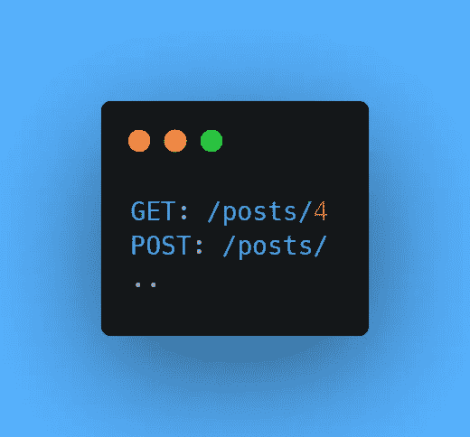
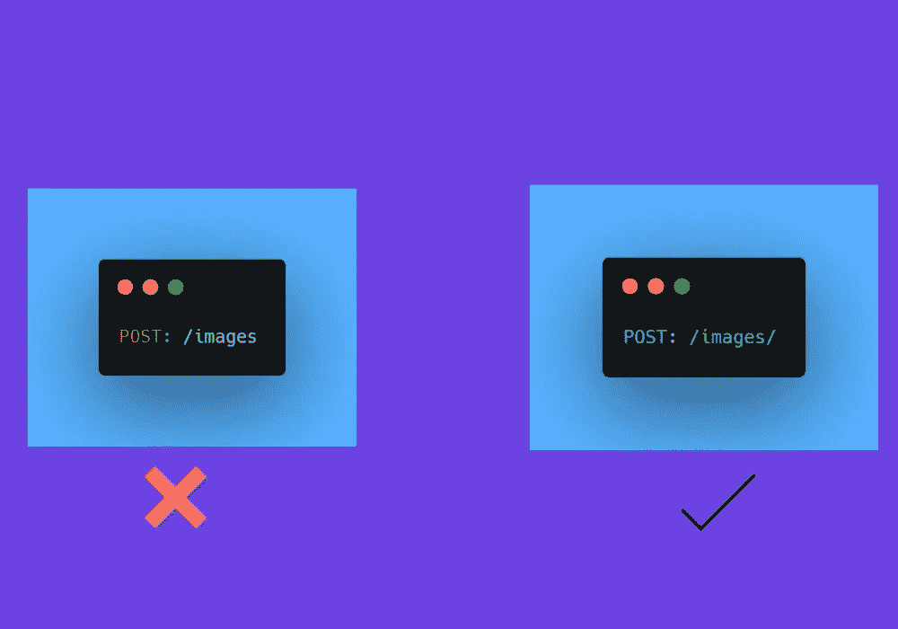
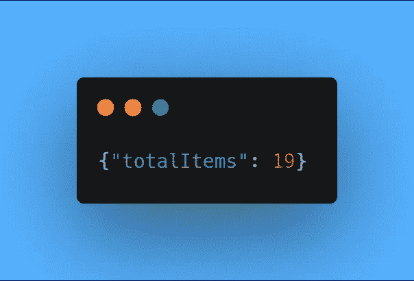

# REST API 设计的 8 个最佳实践

> 原文：<https://javascript.plainenglish.io/8-best-practices-for-rest-api-design-3fd1b837b283?source=collection_archive---------1----------------------->

## 构建更好的 REST APIs

## 1.自动缓存

重复的请求和对这些请求的响应会消耗资源，这成为有缺陷的设计的标志。为了解决这个问题，您必须将从 **API** 获取的数据存储在服务器上，并在以后从那里提供服务。

然而，有时数据会过时，需要更新，在这种情况下，我们有一些行业缓存解决方案 **(Redis** 和**亚马逊 ElasticCache)** ，它们甚至可以在做出更改后缓存数据。

## 2.API 文档

始终提供清晰简洁的文档对于任何 API 都是必要的，没有好的文档，以后使用 API 会变得更加困难。所以确保你的 API 有好的文档，用简单的语言更新和发布。

***你的 API 文档应该包括以下内容:***

*   简单易懂的语言。
*   API 在不同编程语言中的实现。

## 3.不要返回纯文本

没有必要在 **REST** 架构中超越 **JSON** ，因为大多数*REST API*使用 JSON 作为数据格式。但是有时候返回一个包含 JSON 格式字符串的主体是不够的。

比如你可以将**内容类型**头设置为值 **application/json。**

## 4.使用复数资源名词

*单数资源名词*没有错，但是如果你想只是让事情简单，那么建议使用复数资源名词。

***比如说*** *，* **GET/post/3/** 看起来还好但是 **GET/post/？。**在这种情况下，我们无法确认是只收到**一个帖子**还是所有帖子。

为了避免这种方法并且更加一致，您可以使用复数资源名词。

## 5.处理尾随斜线

使用尾随斜线是一个选择的问题，但是要确保你坚持使用尾随斜线。因为有些时候会因为一些小错误而出现不一致。

***例如*** ，在一个 REST API 项目中，仅仅因为缺少一个尾部斜杠，就可以收到一个 **500 内部错误**。

## 6.401 对 403

这两个状态码有不同的含义，很容易混淆它是与*认证*相关还是与*授权*相关。为了更快地解决问题，您需要了解两者的区别。

如果用户没有提供认证细节或认证细节无效，则为 **401 未授权**。

并且如果用户成功认证但是没有提供访问资源的许可，那么它是 **403 禁止的**。

## 7.过滤和分页

随着时间的推移， **REST API** 背后的每个数据库都会变得更大，有时我们必须立刻控制数据流，否则，这很容易使我们的系统崩溃。这就是为什么在你的 API 中总是允许过滤。

我们还需要对数据进行分页，以便一次返回几个结果，否则，我们所有的资源都会因为试图一次获得所有请求的数据而耗尽。

## 8.使用 CamelCase 作为属性名

避免使用下划线或大写字母。

通常情况下, **RESTful** web 服务是由一个用 JavaScript 编写的客户端使用的，这个客户端会将 JSON 响应转换成一个 JavaScript 对象并调用它的属性。因此，建议坚持使用 JavaScript 约定，这样代码可读性更好。

 [## 9 个最好的普通 JavaScript 实用程序库

### 用更少的时间构建您的 JavaScript 项目。

javascript.plainenglish.io](/9-best-vanilla-javascript-utilities-libraries-ff752592dfb5)  [## 现代 CSS 开发人员路线图

### 掌握 CSS 的关键概念

javascript.plainenglish.io](/the-modern-css-developer-roadmap-1ea112451dde)  [## 掌握 JavaScript 编码面试的 50 个问题

### JavaScript 编码面试问题:第 1 部分

javascript.plainenglish.io](/50-questions-to-master-the-javascript-coding-interview-639d2ac12630) 

*更多内容请看*[***plain English . io***](http://plainenglish.io)