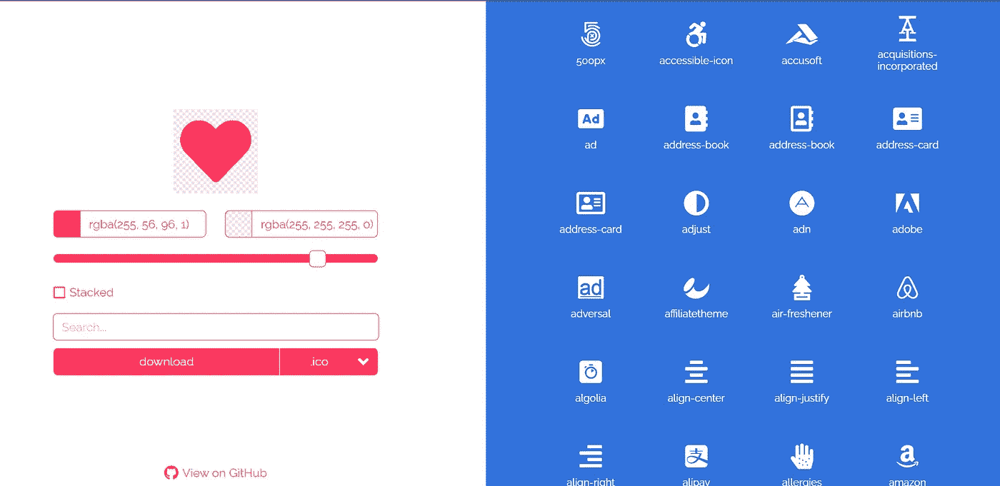

# 作为一名开发人员，你必须知道的 8 个基本的 Web 开发工具

> 原文：<https://javascript.plainenglish.io/8-essential-web-development-tools-that-you-must-know-as-a-developer-cdbb7f6b59ce?source=collection_archive---------5----------------------->

## "很明显，我们拥有的最宝贵的资源是时间。"—史蒂夫·乔布斯

Photo by [Kaleidico](https://unsplash.com/@kaleidico?utm_source=unsplash&utm_medium=referral&utm_content=creditCopyText) on [Unsplash](https://unsplash.com/s/photos/web-development?utm_source=unsplash&utm_medium=referral&utm_content=creditCopyText)

多年来，Web 开发发生了巨大的变化。简单了解 HTML、CSS、JavaScript 或任何其他编程语言的日子已经一去不复返了。如今，开发工具可以在各个方面帮助你，从编码到网站设计。这简化并加速了 web 开发过程。

我编译的工具不仅在 web 开发中有用，而且其中一些在博客网站中也有用。

# 元标签

我们都知道 SEO 对于网站来说是多么的重要。元标签是允许网络爬虫通过提供关于站点的元数据来排列网页。对于初学者来说，元标签可能会令人困惑，这就是 [*这个网站*](https://metatags.io/) 派上用场的地方。创建和预览元标签。

# 丰松鼠

自定义字体可能是一个真正的痛苦，尤其是当你创建一个新的网站，你很少或没有选择字体的线索！大多数时候，它就是不起作用。[T5【font squirrel】T6](https://www.fontsquirrel.com/)皈依*。ttf* 或*。otf* 字体文件为 WOFF 格式，并提供 CSS 代码片段供使用。

# 响应地

媒体查询是困难的，但是测试媒体查询可能更加困难和不方便。*[*responsive*](https://responsively.app/)是一个开源的开发工具，允许前端开发人员在所有可能的垂直和水平屏幕尺寸上查看他们的媒体查询。一些主要特性是热重装和镜像交互。*

# *字体图标*

**

*[*字体图标*](https://gauger.io/fonticon/) 允许你使用字体很棒的图标作为你网站的收藏夹图标。你可以改变大小，颜色，并堆叠众多的图标。当创建一个有几个图标的 UI 屏幕时，这非常有用。*

# *pfpmaker*

**

*[*pfpmaker*](https://pfpmaker.com/) 可让您快速为您的社交媒体账户创建引人注目的个人资料图片。它还提供了一个 API，可以在您的业务逻辑中使用，使用人工智能来删除背景，并为您的消费者生成看起来很酷的图像。*

# *诗人。所以*

**

*poet.so 是另一个不可思议的工具，对于在线博客和作家在网站和其他社交媒体平台上分享他们的推文非常有用。*

# *blobs.app*

**

*Blobs 无疑可以改善你网站的外观。 [*blobss.app*](https://blobs.app/) 是一个用各种颜色、渐变和图案创建 blob 的平台。*

# *readme.so*

**

*readme.md 文件对于任何项目来说都是必不可少的，但是编写它们有时可能会很乏味，这就是这个程序存在的原因。凭借其简单的 UI 和拖放逻辑， [*readme.so*](https://readme.so/) 协助您创建自述文件。*

*这些是我遇到的一些工具，它们对网络开发和写博客都有帮助。你可能知道其中的一些，如果你有一些额外的工具和资源，你也必须分享它们。😊*

*如果你喜欢读这篇文章，那么你可能也会发现下面的故事值得你花时间去读。*

* [## 提高工作效率必须使用的 6 种浏览器扩展

### 伟大的软件带来伟大的生产力。

medium.com](https://medium.com/writers-blokke/6-browser-extensions-that-you-must-use-to-increase-your-productivity-e87a08b34507)  [## 每个 Python 开发人员都必须知道的 5 个很酷的开源 Django 项目

### 关于 Python 最流行的 web 开发框架的一切。

levelup.gitconnected.com](https://levelup.gitconnected.com/5-cool-open-source-django-projects-every-python-developer-must-know-about-492d7e9633b2) 

*如果你喜欢阅读有助于你更好地学习、生活和工作的故事，可以考虑* [*成为订阅者*](https://viveknaskar.medium.com/subscribe) *。成为会员后，你可以无限制地阅读 10000 篇故事、文章和作家。每月只要 5 美元。* [*如果你注册使用我的链接*](https://viveknaskar.medium.com/membership) *，我将赚取一点佣金，帮助我写更多的文章。**