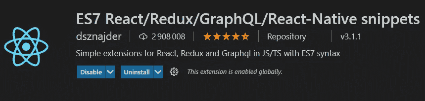
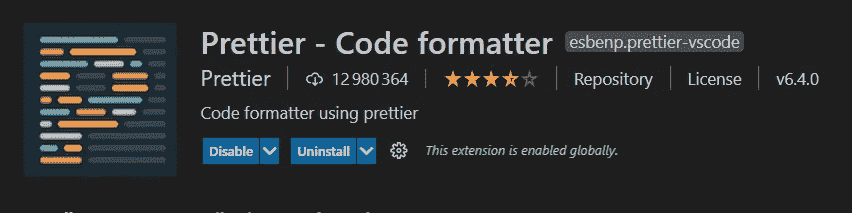
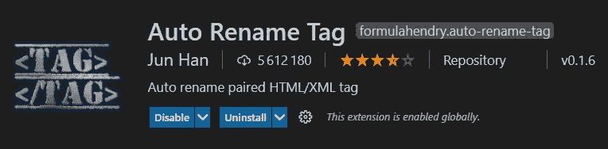
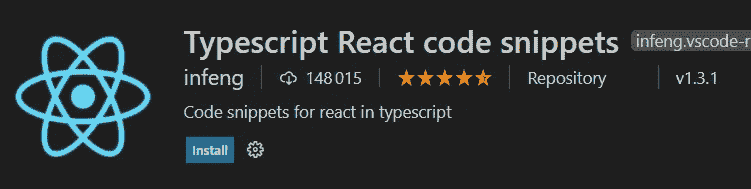
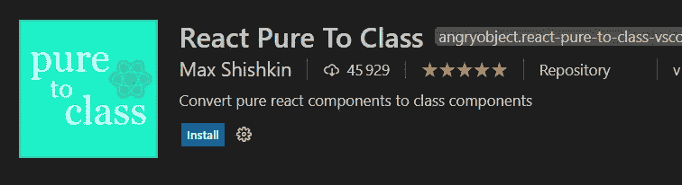
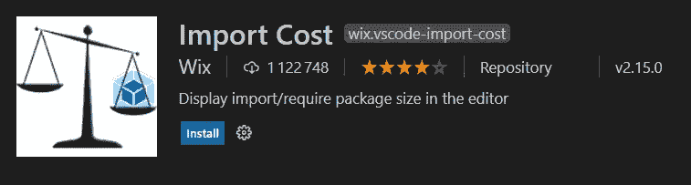
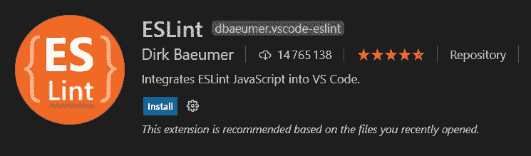

# 8 个对 React 开发人员非常有用的 VSCode 扩展

> 原文：<https://javascript.plainenglish.io/8-extremely-useful-vscode-extensions-for-reactjs-developers-9b0da7de4f47?source=collection_archive---------0----------------------->

## 每个 React 开发人员必备的 VSCode 扩展列表。

Photo by [Anthony Riera](https://unsplash.com/@frenchriera?utm_source=medium&utm_medium=referral) on [Unsplash](https://unsplash.com?utm_source=medium&utm_medium=referral)

React 现在很流行。它是构建前端 web 应用程序的首选。作为一名 web 开发人员，您可以使用这个神奇的库创建许多令人惊叹的东西。

除此之外，对 React 开发人员的需求仍在增加。许多公司正在转向 React，因为它在构建高性能网站和 web 应用程序时非常有效。

大多数 React 开发人员使用 VSCode 作为文本编辑器或 IDE 来开发 React 应用程序。这就是为什么他们可以使用许多有用的 VSCode 扩展来提高工作效率并加快开发过程。

在本文中，我决定向您提供一些非常有用的 VSCode 扩展，您可以作为 React 开发人员使用。所以让我们开始吧。

## 1.ES7 React/Redux/graph QL/React-本机代码片段

这是一个伟大的扩展，几乎每个 React 开发人员都使用它。它允许您轻松地为 React、Redux、Graphql 和 React Native 生成语法和代码片段。

因此，如果您想加快 React 应用程序的开发过程，这是一个很好的扩展。它有近 300 万次下载和 5 星评论。

Capture by the author.

## 2.较美丽

毫无疑问，漂亮是一个非常有用的 VSCode 扩展。它允许你以一种好看易读的结构来格式化你的代码。它有将近 1300 万次下载和 4 星评价。

Capture by the author.

## 3.自动导入

Auto import 是一个非常好的 VSCode 扩展，它允许您自动完成导入。它基本上自动导入你的模块，这很好，因为模块在 React 代码中无处不在。

该扩展有超过一百万的下载量和 4 星评价。

Capture by the author.

## 4.自动重命名标签

Auto rename tag 是一个很好的扩展，可以帮助你自动重命名成对的 HTML 和 XML 标签。它也适用于 JSX 的 React 代码。当您重命名一个标签时，它会自动重命名配对的标签。

同样，该扩展有超过 500 万的下载量和几乎 4 星的评论。

Capture by the author.

## 5.Typescript React 代码片段

如果您正在使用 React 和 TypeScript，这个扩展非常有用。它在 TypeScript 中为您提供了有用的 React 代码片段。

该扩展有近 150，000 次下载和 5 星评论。

Capture by the author.

## 6.纯粹对阶级作出反应

React Pure To Class 是一个扩展，它允许您轻松地将纯 React 组件转换为类组件，而不必自己重写代码。

该扩展目前只有 45.000 英镑，但它有 5 星评论，这意味着它非常有用。

Capture by the author.

## 7.进口成本

Import Cost 是一个很棒的扩展，它可以在编辑器中显示代码中导入包的大小。这对于 React 开发人员非常有用，因为他们安装了很多包。

该扩展有超过 100 万的下载量和 4 星评价。

Capture by the author.

## 8.埃斯林特

ESLint 也是一个非常有用的扩展，它允许您在代码中找到错误，并告诉您遵循风格指南。所以它迫使你不要写糟糕的代码。

您可以查看 VSCode 中的扩展，并阅读他们的文档以了解更多信息。

Capture by the author.

# 结论

这是 React 开发人员的 8 个有用的 VSCode 扩展列表。如果您希望加快在 VSCode 中的开发过程，并更有效地开发 React 应用程序，这些扩展非常有用。

感谢您阅读这篇文章。希望你觉得有用。

**延伸阅读**

 [## 编写干净的 React 代码的 6 个重要技巧

### 作为 React 开发人员，编写干净代码的技巧。

javascript.plainenglish.io](/6-important-tips-to-write-clean-react-code-5ef29d6a73a6)  [## 每个 Web 开发人员都必须知道的 7 个有用的终端命令

### 对开发人员有用的终端命令列表。

javascript.plainenglish.io](/7-useful-terminal-commands-every-web-developer-must-know-e9eeab6dd09a) 

*更多内容尽在*[plain English . io](http://plainenglish.io/)