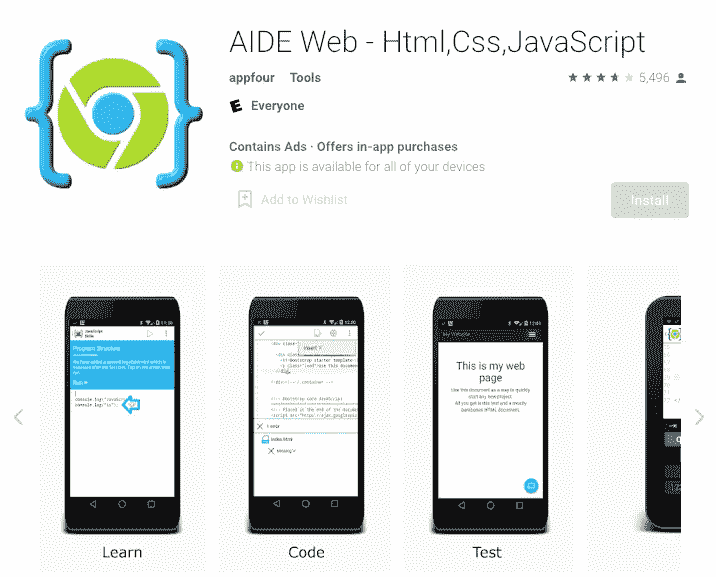
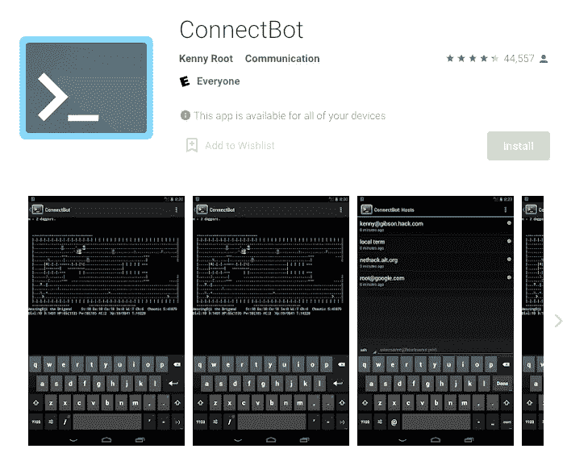
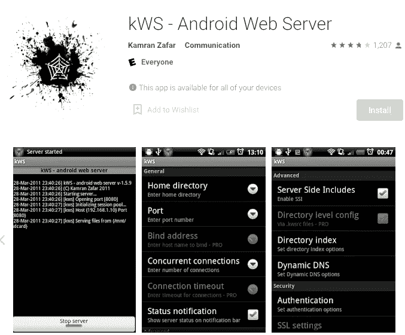
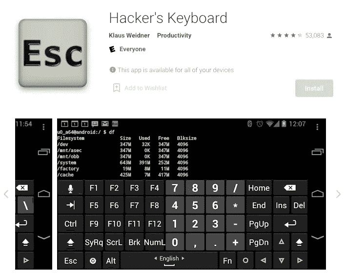
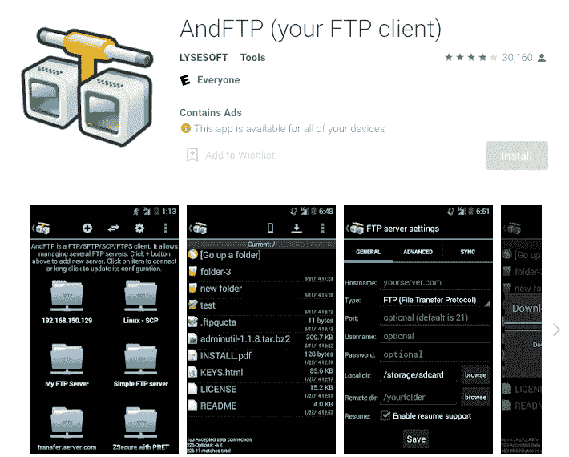
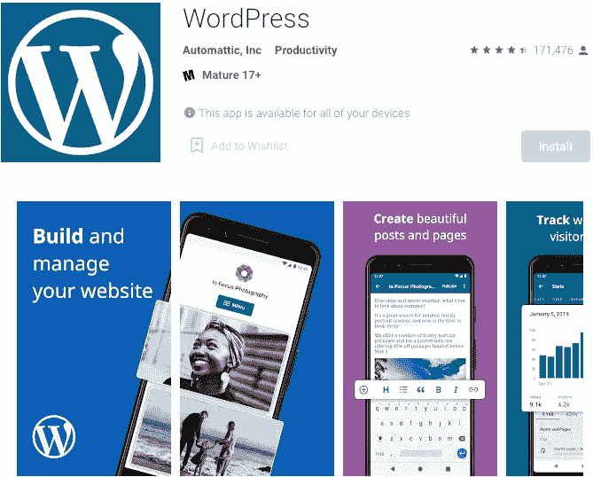
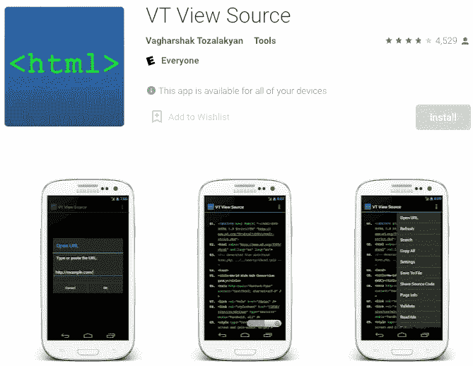
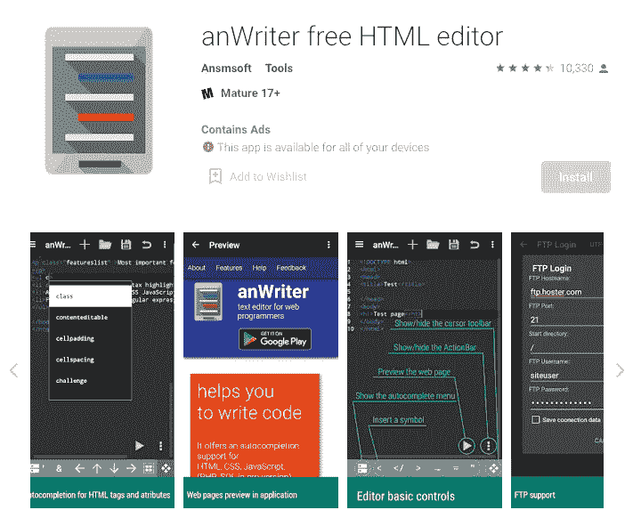

# 8 Android 工具对每个网络开发者来说都很方便

> 原文：<https://javascript.plainenglish.io/8-free-android-tools-will-come-in-handy-for-every-web-developer-d1b1c7d3d8cd?source=collection_archive---------16----------------------->

## 在紧急情况下。

Image source: [Google Play](https://play.google.com/store/apps/details?id=com.aide.web&hl=en&gl=US)

关于编程的一个误区是我们整天坐在电脑前。然后，偶尔，我们和朋友出去玩，我们出去散步，参加婚礼，或者只是结束我们的工作。

我要说的是，当紧急情况发生时，程序员不可能总是在工作站。幸运的是，已经为网络开发者提供了很好的工具和移动应用程序，可以帮助他们解决这些问题，许多工具和应用程序的功能与桌面应用程序一样好。

我给你 8 个免费的 Android 应用程序，如果你从事网络开发，你不能错过你的手机或平板电脑。

# 1.连接机器人

Image source: [Google Play](https://play.google.com/store/apps/details?id=org.connectbot&hl=en&gl=US)

但是在有些情况下，FTP 访问不能解决问题，因此有必要与服务器建立直接的 SSH 或 telnet 连接。对于这些特定情况，ConnectBot 允许您在世界任何地方通过移动设备解决问题。

该应用程序具有一个安全的 Shell 客户端，可以连接到您的 web 服务器，允许您通过下载或上传来传输文件，并在远程主机上方便、安全地编辑和执行命令。

# 2.KWS —安卓网络服务器

Image source: [Google Play](https://play.google.com/store/apps/details?id=org.xeustechnologies.android.kws&hl=en_US&gl=US)

KWS 就像它的名字所说的那样:一个运行在你的安卓设备上的网络服务器。当使用本地 wifi 网络时，它以轻巧和灵活来弥补其功能的简单性。

其结果是在您的手掌中有一个实用且强大的环境，可用于测试和调试。此外，在同一个本地网络上，你的网络服务器和任何其他传统的网络服务器之间的速度差异是察觉不到的。

# **3。黑客的键盘**

Image source: [Google Play](https://play.google.com/store/apps/details?id=org.pocketworkstation.pckeyboard&hl=en&gl=US)

虽然 Android 平台有几个键盘选项，包括系统的原生键盘，但没有一个是用户友好的编程。

你可以安装黑客键盘，而不是在你的移动设备上安装迷你键盘甚至桌面键盘(牺牲移动性)。

不要被应用程序的名称所迷惑:它是为程序员设计的，为任何需要键入命令或代码的人提供了许多便利，包括五行键、多种布局变化，甚至语言选项。

# **4。和 FTP**

Image source: [Google Play](https://play.google.com/store/apps/details?id=lysesoft.andftp&hl=en&gl=US)

AndFTP 应用程序只不过是你手中的一个方便的 FTP 客户端。对于那些需要在网络服务器上访问和操作文件的人来说，无论是下载还是上传，这都是 Android 设备上的必备功能。

除了 FTP 协议之外，该应用程序还支持 SFTP、SCP 和 FTPS 协议。您可以通过智能手机或平板电脑设置对不同服务器的快速访问、浏览目录、重命名、删除、复制文件、设置权限以及创建文件夹。

# **5。WordPress**

Image source: [Google Play](https://play.google.com/store/apps/details?id=org.wordpress.android&hl=en_US&gl=US)

WordPress 是该榜单上唯一一款黑色背景的网络开发者应用。凭借巨大的影响力，并负责维护和创建网络上近一半的内容，该公司开发了 Android 版 WordPress，这款应用程序使您可以从移动设备上访问控制面板的功能。可以创建新帖子、编辑旧帖子、管理评论、管理插件和其他功能。

# **6。VT 视图源**

Image source: [Google Play](https://play.google.com/store/apps/details?id=com.tozalakyan.viewsource&hl=en&gl=US)

任何从事网站工作的人都知道，访问已发布内容的源代码是发现问题不可或缺的任务。不幸的是，移动浏览器不提供这个功能。为了满足这一需求，开发了 VT View Source 应用程序。

通过它，你可以在你的 Android 设备上查看任何网页的 HTML。该应用程序还支持颜色代码标记，并允许您为移动或桌面版本选择 HTML 视图，并保存文件以备后用。

# 7.AIDE Web

Image source: [Google Play](https://play.google.com/store/apps/details?id=com.aide.web&hl=en&gl=US)

虽然它不是最好的平台，但有时移动设备需要成为您的开发平台。幸运的是，AIDE Web 有助于应对这一挑战，充当 HTML、CSS 和 Javascript 的 Web 编辑器和 IDE。

该应用程序提供了一个编辑-编译-运行的循环，允许创建完整的网站，具有实时错误检查，自动代码格式化，甚至为初学者提供交互式课程和内置的 Javascript 课程。

# 8.免费的 HTML 编辑器

Image source: [Google Play](https://play.google.com/store/apps/details?id=com.ansm.anwriter&hl=en&gl=US)

上述应用程序的一个很好的替代方案是编写器。它为 HTML、CSS、Javascript、LaTeX 等提供自动完成功能。此外，它还具有在内置浏览器中预览网页的功能。此外，它增加了基本的 FTP 功能，如下载和上传，而不需要额外的应用程序。当两个应用程序之间存在疑问时，安装和比较功能和性能几乎不需要任何成本。

有了这些工具的帮助，即使您不在工作站上，您也可以随时随地关注代码中出现的问题。

*更多内容尽在*[plain English . io](http://plainenglish.io/)