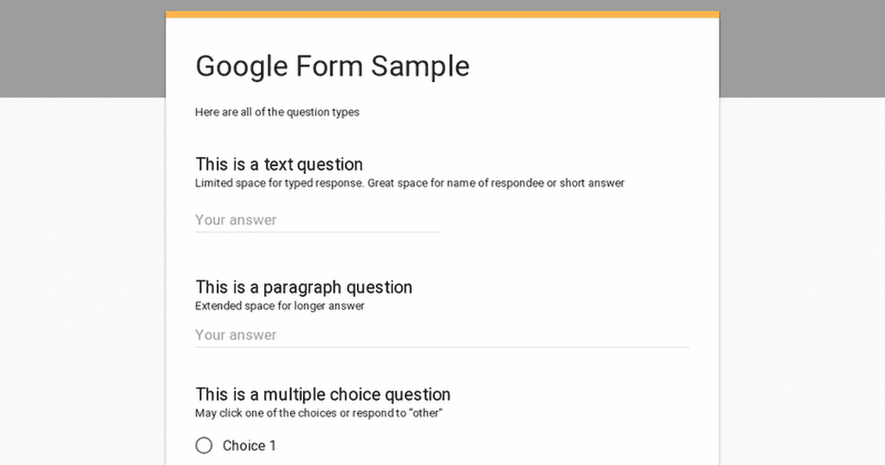
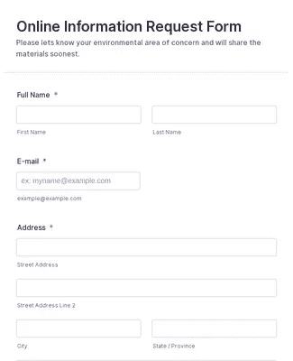
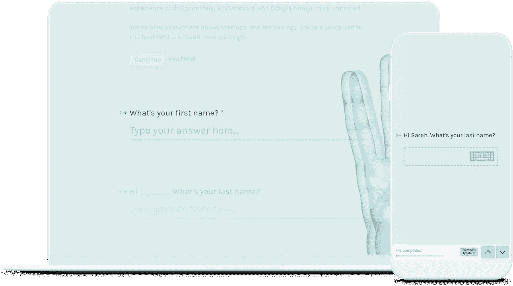
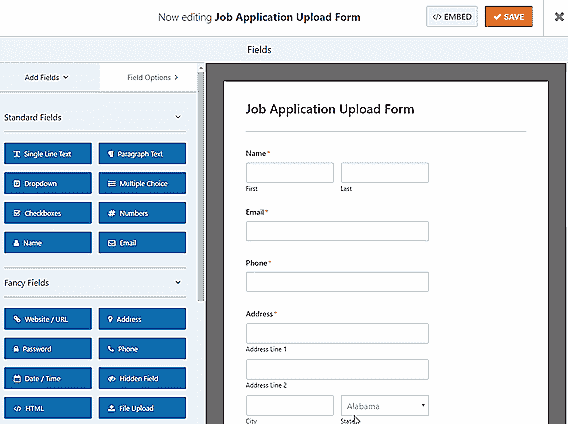

# 2021 年，8 个有趣的表单生成器将加入您的技术堆栈

> 原文：<https://javascript.plainenglish.io/8-interesting-form-builders-to-add-to-your-tech-stack-in-2021-81da79ec00d7?source=collection_archive---------11----------------------->

## 我过去用过的模板生成器。

Source: Google form

作为一名提供自由职业者服务的 web 开发人员，我使用和测试过的不同表单生成器比我记忆中的还要多。有些是好的，简单的，有些是有报酬的，但它们都足够公平地服务于它们的目的。

为了帮助你选择可以在你的网站上使用的表单生成器，我列出了我经常为我的客户使用的表单生成器。

# 1.谷歌表单

作为一名开发人员，我需要保存大量的报告，并与我的同事和上级分享。因为我有太多的文件，把所有的文件组织在一个文件夹下并组织它们来接收特定的任务或报告并不容易。

我使用谷歌表单，在谷歌上编辑我所有的报告，然后转发给相关人员，无论我在编辑什么，他们都会直接收到。我不需要每次编辑时都分享它们。它在一个地方，每当我编辑一些东西时，它会自动保存。

谷歌表单非常用户友好，界面非常好。关于我们希望它是一个选择题，还是一个简短的答案或检查点，甚至是一个长段落，有几个选项。

样本表单:

Source: Google form

# 2.Jotform

JotForm 看起来很专业，并使创建表单变得非常容易，为不同的问题提供了您需要的每个选项。创建表单的易用性和易用性是 Jotform 的优点之一。

不需要了解 HTML/CSS 或者操纵另一个产品去做你想做的事情(Google forms nothing on Jotform)。这让我很容易创建一个表单。加密是我们喜欢 JotForm 的另一个重要原因，因为知道敏感信息是加密的，会让我们安心很多。

许多预先构建的模板也非常有用，因为我们不必从头开始设计许多表单。

样本表单:

Source: Jotform.com

# 3.字体

Typeform builder 在显示如何将您的调查/表格拼凑在一起方面做得很好，因此您可以确切地知道您想要收集什么样的数据、要共享的信息等。

它随处可得；人们可以很容易地在他们的手机(移动网络视图是光滑和舒适的)和电脑或笔记本电脑上看到和使用它们。

数据提取很容易，查看从答案到表单打开和未完成次数的详细信息，对于分析数据和表单完成的有效性非常有帮助。

工作区特性也很有帮助，因为它可以很好地区分不同用户/部门的不同项目。

样本表单:

Source: Typeform

# 4.WPForms

WPForms 很容易安装并开始创建表单。它的功能非常好，而且很容易配置。您可以将收件人添加到电子邮件通知中，查看提交内容，重新发送提交内容，并且能够使用条件逻辑创建表单对我们的组织来说是一个额外的好处。我都喜欢。

易用性使我可以很快为客户制作一个表单，但我也可以在不到 10 分钟的时间内教会他们如何使用插件，他们可以自己创建复杂的表单。SMTP 使邮件传递更加一致，我喜欢该网站保留邮件的备份，这样我的客户就可以登录，仔细检查他们收到的所有网站查询。

样本表单:

Source: WPForms.com

# 5.五福

事实证明，Wufoo 是一个创建、发送和收集调查的有用工具。我不得不说这是一个简单易用的软件。他们允许你从他们创建的模板中进行选择，或者从零开始，按照你想要的方式进行定制。

这些表格填写起来既快又容易，这有助于加快回复速度。我认为你可以在同一个表格中加入多种不同类型的问题。表单管理器还会创建一个历史记录，供您复制以前的表单，以便在创建新表单时节省时间。

样本表单:

Source: Wufoo.com

# 6.重力形式

Gravity Forms 可以很容易地向用户解释，并且可以快速轻松地创建复杂的解决方案和条件逻辑。

这个插件在向网站添加表单方面做得非常好，并且很容易根据你的网站设计风格。垃圾邮件蜜罐和验证码等功能有助于确保您获得真实的联系数据。有许多不同的专用输入字段，如 e 和 phone，它们格式化答案和正常数据。Gravity Forms 还有很棒的条件逻辑，它允许你创建随时间变化的渐进式表单。

样本表单:

Source: Gravityforms.com

# 7.Zoho 表单

Zoho 表单简单易用。它们有几个输入字段，表单定制，条件逻辑，并且很好地集成到 WordPress 中。我不需要太多的技术背景就可以有效地启动和运行这个表单系统。

我基本上可以将字段移动到我希望它们在表单中出现的位置。我可以立即看到表单的外观，并在需要时立即做出更改。

样本表单:

Source: Zoho.com/forms

# 8.123 表单生成器

123contactform 提供了一个极具成本效益的表单生成器，功能极其丰富。您可以将其用于简单的调查、活动注册、在线商品销售、联系表单或电子邮件简讯注册，等等。有大量与其他服务的集成，包括支付处理器、谷歌服务、电子邮件营销服务等等。

还有许多模板可供选择，并且可以复制表单，这样您就不必重新构建表单，这对拥有多个位置的客户来说非常有用。不错的场地选择。我和许多自由职业客户一起使用这些表单:订单、特价、员工申请等。对于您创建的每个表单，它都会跟踪提交情况，您可以生成报告并导出数据，这是一个很棒的功能。

Source: 123formbuilder.com

我希望这个列表能帮助你决定或者给你一个好的联系表单生成器的想法。当你做决定时，用我的经验，追求最好的结果。

*查看更多内容请点击*[***plain English . io***](https://plainenglish.io/)