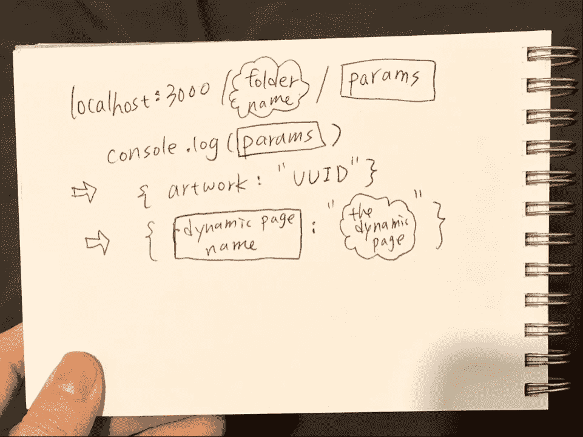

# 用 Nuxt.js 构建 Vue.js 项目必须知道的技巧

> 原文：<https://javascript.plainenglish.io/8-must-have-tips-for-building-vue-js-project-with-nuxt-js-94b68ece5ead?source=collection_archive---------13----------------------->

纠结于个人静态组合网站开发？我能感觉到你！提供免费代码示例。


Photo by [Florian Olivo](https://unsplash.com/@florianolv?utm_source=medium&utm_medium=referral) on [Unsplash](https://unsplash.com?utm_source=medium&utm_medium=referral)


## 技巧一—动态路由



my hand and my ideas

到获取 Prismic(一个免费的 CMS)中的帖子。让每个岗位都有自己的动态路线。说到取数据 Nuxt.js 还是接受 Vue.js 钩子`mounted()`，渲染页面之前不能调用。为了加载和获取客户端数据，Nuxt.js 提供了两个钩子来异步获取数据:

1.  **fetch()**
    在下载 web 组件之前获取数据。下载完 web 组件后，在调用 Vue app 后调用`fetch()`，然后在渲染完 Dom 后结束。fetch 挂钩应该返回一个将被解析的承诺。
2.  **asyncData()**
    这个钩子在 web 组件下载前被调用并与组件合并。这是只在 Nuxt.js 中的 SSR 上下文，而在 Vue.js 中没有，因为有 SSR，所以不容易调试。尽量远离它。

## 以下是我的文件:/pages/artworks/_artwork.vue

```
<script>
import Prismic from “@prismicio/client”;export default {
async asyncData({ params }) {
console.log(params);
const api = await Prismic.client(
“https://sourrain-site.cdn.prismic.io/api/v2"
);
const res = await api.getByUID(“project”, params.artwork);
console.log(res);
return { artwork: res };
},
};
</script>
```

*   **目录:**因为我们使用的是动态路由，所以不要将参数(slug)直接放在主机地址旁边，这一点很重要。它必须在一个文件夹中，以提供一个更好的目录结构，可以防止错误产生一些重复的路由名称。并且用户可以导航到空路线而不显示 404 错误消息。
*   **从 Prismic 查询数据:**查看 Prismic [文档](https://prismic.io/docs/technologies/how-to-query-the-api-javascript)如何使用 JavaScript 模块在 API 中查询数据。不要试图去找 Nuxt.js/Prismic.，一定有更清晰的方法不用 Nuxt.js 库就能从 API 中查询数据。调查 Prismic 文件。
*   **Prismic 提供什么样的 SEO:**Prismic 表示，由于 slug 冲突问题，他们提供 UUID(通用唯一标识符)而不是 slug。如果有两个人同时上传相同的 slug 帖子，UUID 会将时间和随机生成的组件结合起来。读读这个:

[](https://user-guides.prismic.io/en/articles/764589-how-to-prepare-your-content-for-seo) [## 如何为 SEO 准备你的内容

### 每个人都知道 SEO 对于让你的网站尽可能吸引眼球有多重要。使用 Prismic 会给出…

用户指南. prismic.io](https://user-guides.prismic.io/en/articles/764589-how-to-prepare-your-content-for-seo) 

*   **Nuxt.js 提供了用于查询的页面参数:**如果您已经定义了一个动态页面，即 pages 文件夹中名为 _slug.vue 的文件，您可以使用 params.slug 的上下文来访问该值。Nuxt.js 上下文参数是一个表示动态页面文件值的对象。您可以在 Nuxt.js 文档的章节页面上找到更多信息。

## 技巧二——如何使用 NuxtLink 并通过页面发送数据？

在使用 NuxtLink 之前，我们需要完成一个好的文件系统路由。只需在名为 pages 的文件夹中创建一个. vue 文件，它就会神奇地为我们进行分页。为每个页面创建不同的文件需要做大量的工作，所以 Nuxt.js 中有一个自动生成页面地址的功能叫做动态路由。为我不同的设计项目设计页面也很容易。只要文件名以底线开始，然后使用 asyncData 获取数据，使用起来就非常简单。

然后，只需使用 v-bind，在" to "前添加":"，并将每个变量直接放入" "中，如果" "中有更多 HTML，请记住使用" "与变量分隔。

***PS:*** *v-bind 和{{ }}是我们需要了解的 Vue.js 中的基本概念。*

```
<NuxtLink :to=”’/artworks/’+ block.uid”>
</NuxtLink>
```

## 技巧三——如何在 Vue 中删除 v-for 列表中的重复项？

最好用纯 JavaScript 来做:**如何用 vanilla JavaScript 显示唯一的** `**tag**` **字符串的排序列表？**看看我的 Prismic API 结构。我的目标是将数组展平并整理成一个唯一标签的列表。

*   **使用 reduce 方法:**reduce 方法是我们处理数组的重要方法之一。Reduce 方法带两个参数—第一个是回调函数，带两个参数(累加器，当前值)；第二个是累加器的初始值。reduce 方法将对数组中的每个元素执行，并将每个元素作为新对象、单个数字或字符串返回。累加器表示结果，当前值表示当前数组。当谈到作为新对象返回时，我们可以根据需要对新对象进行分组。在这种情况下，我创建了一个只带有标签的新对象，并创建了另一个带有允许重复值被重写的值的对象。
*   **使用 Object.values()** **方法:**这是一个很好的方法，可以把一个对象只通过它的值变成一个可迭代的对象。在另一个场景中，我们可能需要只保留我们可以使用的键。keys(ArrayName)这个方法也是用`.sort()`方法改变顺序规则的好方法。

```
const tagObject = res.results.reduce((a, c) => {
a[c.tags] = c.tags; return a;
}, {});
const tagList = Object.values(tagObject).flat();
const tagCat = tagList.reduce((a, c) => {
a[c] = c; return a;
}, {});
this.re = Object.values(tagCat);
return this.re;
});
```

如果你像我一样，经常因为数组交易而痛苦，听听这首来自乌纳克拉韦茨的可爱数组歌曲，希望它能给你带来一些积极的能量！

Array Method Song: — )

## 技巧四——如何构建一个组件来通过标签过滤项目？

也许这是一个问题，你和我一样，在网上搜索了很多 jQuery 解决方案。然而，使用 jQuery JavaScript 库并不是明智的选择，因为它对于实际设计来说太大了。如果能使用我们下载的 Vue.js 库就好了。在 Vue3 中，没有滤镜可以使用。相反，Vue3 建议我们使用 computed 属性进行过滤。

> *关注点分离*

在 Nuxt.js 中，我们使用 computed 来处理这个概念。我如何将 JavaScript 移出 HTML？这可以使我的代码更具可读性。计算是使用过滤器的一种方式。当我们点击相同的过滤器标签时，我们不需要我们的网站再次加载。使用计算方法是达到需求(缓存)的明智方法。

## 技巧五——如何制作项目搜索栏？


searching searching

在 HTML 部分，我们通过输入来实现这一点:

```
<input class=”” type=”text” v-model=”search” placeholder=”search projects” />
```

在数据部分，我们将用户在输入部分键入的内容定义为搜索:

```
search: “”
```

在计算块中:

```
searchProjects() {
if (this.search) {
return this.filteredProjects.filter((project) => {//return any project matched with the title
const s_title = project.data.title[0].text;
return s_title.toLowerCase().match(this.search.toLowerCase());
});
} else {
return this.filteredProjects;
}},
```

## 技巧六——如何展示相关项目？


在 Prismic 中，您可以通过将内容关系字段放在组字段中来创建一对多关系。FetchLinks 不支持分组字段。使用名为 GraphQuery 的高级版本的 FetchLinks。你可以在这里找到文档[。你只需要做下一个按钮。尝试通过在 API 中发布制作时间来获取下一个项目。](https://prismic.io/docs/technologies/graphquery-rest-api)

## 技巧七——我的收藏夹图标的最佳格式是什么？


favicon 是网站徽标(png、icon、base64 ),建议作为 base64 文件在快速浏览器中使用。这种类型的图像的优点是，它可以直接编写为 HTML/CSS，而不需要任何外部下载，并以数据 URI 文件格式呈现。

## 技巧八——如何免费托管我的 Nuxt.js 应用站点？—韦尔塞尔


**我们需要什么样的站点部署？在托管网站之前，我们需要决定我们要部署什么样的网站。Nuxt.js 提供两种类型的网站——静态和 SSR。在这种情况下，我们使用静态网站。Vercel 是一个免费的部署平台，可以轻松地将我们的 GitHub [资源库](https://www.google.com/search?rlz=1C1ZKTG_enTW843TW843&sxsrf=ALeKk027AsCKWBunvIuFZc6-zYKk_kwl6g:1617750099454&q=repository&spell=1&sa=X&ved=2ahUKEwjjqI3g3OrvAhXgh_0HHYQICm4QkeECKAB6BAgBEDU)加载到网站中。**

[](https://vercel.com/) [## 发展。预览。船。最佳前端团队- Vercel

### Vercel 将最好的开发人员体验与对最终用户性能的专注结合起来。我们的平台支持…

vercel.com](https://vercel.com/) 

## 顺便问一下

使用`mount()`钩子从 Prismic API 获取数据。使用 hook asyncData 获取动态路由 slug 的数据。网络错误表示链接错误，检查链接即可。

这些是您应该了解的 Nuxt.js 的一些关键特性。路由功能是分页这一复杂问题的简单解决方案，文件夹结构(也称为目录结构)解决了许多文件路径问题。除此之外，Nuxt.js 如何呈现页面布局以及如何在幕后工作，可以在下面两个部分中看到:

1.  **上下文生命周期**
    nuxt . js 内部函数工作的顺序。主机和浏览器先处理哪些功能，组件之间如何相互触发。
2.  **查看**
    哪些文件控制页面的外观。

## 目录

**。我们的 SSR Nuxt.js 应用程序需要 nuxt** 文件夹。但是部署静态 Nuxt.js 应用程序不需要它，因为我们使用 dist 文件夹。

**资产**文件夹包含未编译的资产。

*   使用`[Object.values()](https://developer.mozilla.org/en-US/docs/Web/JavaScript/Reference/Global_objects/Object/values)`从原始对象创建一个可迭代对象。
*   在结果#2 上使用`[Array.sort()](https://developer.mozilla.org/en-US/docs/Web/JavaScript/Reference/Global_Objects/Array/sort)`按照`tag`对数组进行排序。

## 谢谢你

*希望你有一个愉快的阅读和编码之旅。欢迎和任何和我一样纠结于 Nuxt.js 的人分享这篇文章。如果你有更多的问题，欢迎在这里讨论。还有，我活跃在 IG: sourrain_art .拜拜！*

*更多内容请看*[*plain English . io*](http://plainenglish.io/)