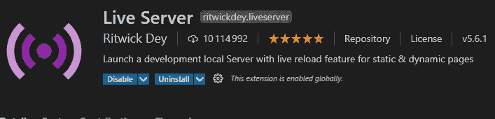
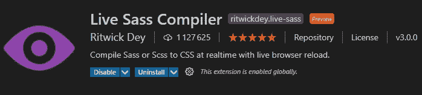
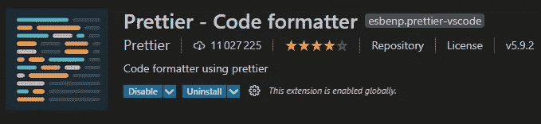
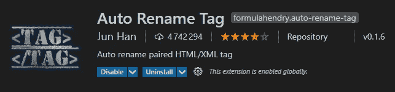
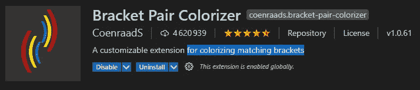
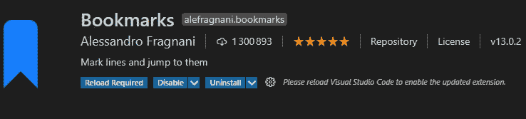
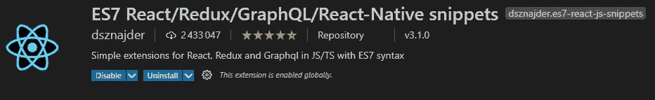
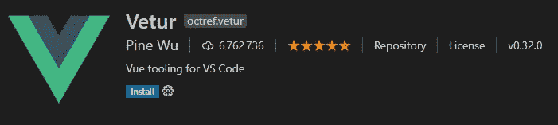

# 前端 Web 开发人员必备的 8 个 VSCode 扩展

> 原文：<https://javascript.plainenglish.io/8-must-have-vscode-extensions-for-front-end-web-developers-69842a456f9c?source=collection_archive---------12----------------------->

## 8 个 VSCode 扩展，让您的生活更轻松。

Photo by [ThisisEngineering RAEng](https://unsplash.com/@thisisengineering?utm_source=medium&utm_medium=referral) on [Unsplash](https://unsplash.com?utm_source=medium&utm_medium=referral)

# 介绍

多年来，Visual studio 代码一直主导着游戏。根据大多数开发人员的说法，在高质量的工作流程和用户体验方面，它是文本编辑器中的佼佼者。此外，它有许多有用的特性和扩展，作为开发人员，我们可以从中受益，以使我们的生活更加轻松。这就是为什么很多开发人员更喜欢使用 VSCode 进行编码。

在本文中，我们将给出一些作为前端 web 开发人员必须拥有的 VSCode 扩展的列表。让我们开始吧。

# 1.实时服务器

在机器上安装 VSCode 之后，Live server 是首先需要考虑的扩展之一。这个惊人的扩展允许你启动一个具有实时重载功能的本地服务器。它允许您在不重新加载页面的情况下查看您的更改。

该扩展现在有超过 1000 万次下载。您可以从扩展页面上的 VSCode 编辑器下载它。这同样适用于所有其他扩展。

Live Server.

# 2.实时 Sass 编译器

这是我最喜欢的扩展之一。它将你所有的 Sass 和 Scss 文件实时编译成常规的 css，以便浏览器能够理解它们。该扩展有超过 100 万的下载量和近 5 颗星的评论。

Live Sass.

# 3.较美丽

Prettier 也是一个很棒的扩展，它将你所有的代码格式化成一个非常好看的结构，这使得代码更具可读性。

Prettier 拥有超过 1100 万的下载量，这使得它成为排名第一的代码格式扩展。

Prettier.

# 4.自动重命名标签

如果您想轻松地自动重命名 HTML 和 XML 标签，这个扩展非常有用。它有超过 400 万的下载量和 4 星评价。

Auto rename tag.

# 5.括号对着色机

括号对着色程序是一个很棒的扩展，可以在你的代码中给匹配的括号着色。这使得代码更容易阅读和管理。

Bracket Pair Colorizer.

# 6.书签

当你在一个文件中有很多代码行时，书签扩展是一个巨大的救命稻草。它允许你在任何时候标记行并跳转到它们，这使得访问你的代码部分变得更加容易。

书签扩展有超过 100 万的下载量和 5 颗星的评价。

Bookmarks.

# 7.反应片段

React 是使用最多的 JavaScript 库之一。当反复编写相同的代码时，事情可能会变得令人厌烦。这就是为什么 VSCode 提供了一个很酷的扩展，为 ES7 中的 JavaScript 和 ReactJS/Redux 片段提供了 Babel 插件功能，以便不重复自己。

ES7 React/Redux/React-Native/JS snippets.

# 8.韦图尔

如果你是一个 Vue 开发者，这是一个非常有用的扩展，它为 VueJS 开发者提供了 Vue 片段、错误检查、自动完成、Emmet 和更多其他功能。

Vetur 的下载量超过 600 万次，获得了近 5 颗星的评价。

Vetur.

# 结论

如您所见，VSCode 提供了许多由其他开发人员为开发人员构建的非常有用的 VSCode 扩展。这有助于加快我们的工作流程，让我们的生活更轻松。

感谢您阅读这篇文章。希望你觉得有用。

# 更多阅读

 [## 用例子解释 JavaScript 类

### 通过实例了解 JavaScript 中的类语法。

javascript.plainenglish.io](/javascript-classes-explained-with-examples-c10d0426834b)