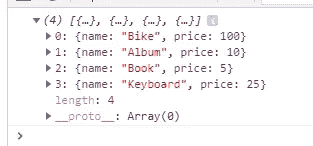
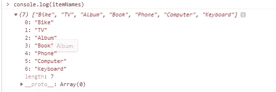
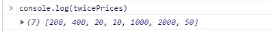
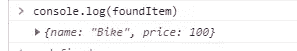
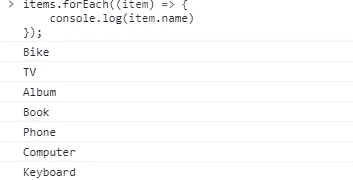

# 8 个必须知道的 JavaScript 数组方法

> 原文：<https://javascript.plainenglish.io/8-must-know-javascript-array-methods-3a01656f597e?source=collection_archive---------9----------------------->

下面我们来学习几个编程中离不开的 JavaScript 数组方法。


Photo by [Artem Sapegin](https://unsplash.com/@sapegin?utm_source=medium&utm_medium=referral) on [Unsplash](https://unsplash.com?utm_source=medium&utm_medium=referral)

数组是程序员最常用的东西之一。如果你知道如何和在哪里使用它们，它们会非常有用。数组非常简单，但是如果你知道如何使用它们，它会非常强大。

数组提供了许多方法来执行某些操作。在这篇文章中，我们将学习一些我认为你应该知道的东西。

但是在我们学习数组方法之前，让我们看看 JavaScript 中数组到底是什么。

## 什么是数组？

在 Javascript 中，数组是用于存储不同元素的单个变量，或者我们可以说数组是不同元素的列表。当我们想要存储不同元素的列表并通过单个变量访问它们时，经常使用数组。

如果您有一个项目列表(例如，一个颜色列表)，将颜色存储在单个变量中可能如下所示:

```
var color1 = “Blue”;var color1 = “Red”;var color1 = “Green”;
```

但是，如果您想遍历这些颜色并找到一个特定的颜色呢？或者，如果你想只使用你清单上的颜色呢？如果你有 300 种颜色而不是 3 种呢？

**解的是数组！**

一个数组可以在一个名称下保存许多值，您可以通过引用索引号来访问这些值。

所以一组颜色看起来像这样:

```
var colors = [“Blue”, “Red”, “Green”];
```

正如我所说的，数组提供了很多方法来简化事情。我们来讨论其中的几个。

## 1.数组 filter()方法

使用数组时最常见的任务之一是创建一个新数组，该数组包含与特定条件匹配的元素子集。

Array 方法创建一个新的数组，该数组包含现有数组中符合给定标准的元素。

为了理解所有这些方法，我将创建一个如下所示的数组:

```
const items = [ { name: ‘Bike’, price: 100 }, { name: ‘TV’, price: 200 }, { name: ‘Album’, price: 10 }, { name: ‘Book’, price: 5 }, { name: ‘Phone’, price: 500 }, { name: ‘Computer’, price: 1000 }, { name: ‘Keyboard’, price: 25 }]
```

这么说吧，我们只想得到那些价格小于或等于 100 的商品。

为了从数组中过滤这些项目，我们可以使用`filter()`方法。

```
const filteredItems = items.filter((*item*) => { return *item*.price <= 100;})console.log(filteredItems);
```

如果我们执行这段代码，我们会看到`filteredItems`是一个包含所有价格小于等于 100 的元素的数组。



在内部，`filter()`方法遍历数组的每个元素，并将每个元素传递给 `callback()`函数。如果`callback()`函数返回`true`，它将元素包含在返回数组中。

> filter()数组方法不改变原始数组。相反，它返回一个包含已处理数据的新数组。

## 2.数组映射()方法

> Array `map()`方法创建一个新的数组，其结果是为每个数组元素调用一个函数。`map()`方法为数组中的每个元素依次调用一次提供的函数。— [W3Schools](https://www.w3schools.com/jsref/jsref_map.asp)

`map()`允许我们获取一个数组，对每个数组元素执行一个函数，然后返回一个新的数组。因此，新数组中的所有元素看起来与原始数组略有不同。

为了完全理解它，让我们假设我们想要一个数组，它包含我们之前使用的`items`数组中的所有项目名称。

```
const itemNames = items.map((item) => {
    return item.name;
});
```

如果我们简单地打印`itemNames`，那么我们会看到它包含了来自`items` 数组的所有项目名称。



`map()`并不只是返回原始数组中的值。我们实际上可以先对这些值做任何事情，然后返回它们来创建一个新的数组。

这么说吧，我们想要一个数组，其中包含来自`items` 数组的所有商品的两倍价格。

```
const twicePrices= items.map((item) => {
    return item.price * 2;
});
```



Array `map()`方法有数十亿种不同的用途，你会发现自己一直在使用这个方法。例如用于`for`循环。

> map()数组方法不改变原始数组。相反，它返回一个包含已处理数据的新数组。

## 3.数组 find()方法

> `find()`方法返回满足测试函数的数组中第一个元素的值。如果没有满足测试函数的值，则返回`[undefined](https://developer.mozilla.org/en-US/docs/Web/JavaScript/Reference/Global_Objects/undefined)`。— [MDN 文档](https://developer.mozilla.org/en-US/docs/Web/JavaScript/Reference/Global_Objects/Array/find)

`find()`方法对数组中的每个元素执行一次函数:

*   如果它找到一个数组元素，其中函数返回一个`*true*`值，`find()`返回该数组元素的值(并且不检查其余的值)
*   否则，返回`undefined`

这么说吧，我们想从我们的`items`数组中找到一个名为‘Bike’的项目。我们可以简单地用`find()`方法做到这一点。

```
const foundItem = items.find((item) => {
    return item.name === 'Bike';
});
```



> `find()`不执行空数组功能。`find()`不改变原数组。

## 4.数组 forEach()方法

> `forEach()`按照索引升序为数组中的每个元素调用一次提供的`callbackFn`函数。对于已删除或未初始化的索引属性，不会调用它。— [MDN 文档](https://developer.mozilla.org/en-US/docs/Web/JavaScript/Reference/Global_Objects/Array/forEach)

对于没有值的数组元素，不执行该函数。而`forEach()`不返回任何东西。

同样，让我们使用我们的`items`数组来演示它。假设我们想打印条目数组中的每个名字。在这种情况下，我们可以简单地使用`forEach()`方法。

```
items.forEach((item) => {
    console.log(item.name)
});
```



## 5.Array some()方法

这个方法与我们讨论过的其他数组方法有点不同，因为它返回布尔值，而不是返回一个新的数组。

> `**some()**`方法测试数组中是否至少有一个元素通过了由提供的函数实现的测试。如果在数组中找到所提供的函数返回`true`的元素，则返回`true`；否则返回`false`。— [MDN 文档](https://developer.mozilla.org/en-US/docs/Web/JavaScript/Reference/Global_Objects/Array/some)

`some()`方法对数组中的每个元素执行一次函数:

*   如果找到函数返回一个`*true*`值的数组元素，`some()`返回`true`(并且不检查剩余的值)
*   否则，返回`false`

举个例子，假设我们想检查我们的项目数组中是否有一个价格小于等于 100 的项目。

```
const hasInexpensiveItems = items.some((item) => {
    return item.price <= 100;
}); console.log(hasInexpensiveItems); // true
```

> `some()`不对没有值的数组元素执行函数。`some()`不改变原数组。

## 6.Array every()方法

`every()`与`some()`非常相似，除了检查至少一个项目，它检查所有项目以确保每个项目都满足给定的条件。

> `**every()**`方法测试数组中的所有元素是否都通过了由提供的函数实现的测试。它返回一个布尔值。— [MDN 文档](https://developer.mozilla.org/en-US/docs/Web/JavaScript/Reference/Global_Objects/Array/every)

为了理解这一点，如果我们用`every()`方法而不是`some()`来执行前面的例子，那么输出将是`false`；因为它将检查是否所有商品的价格都小于等于 100。

```
const hasInexpensiveItems = items.every((item) => {
    return item.price <= 100;
});console.log(hasInexpensiveItems); // false
```

> `every()`不对没有值的数组元素执行函数。`every()`不改变原来的数组

## 7.Array reduce()方法

这个方法不同于我们讨论过的其他方法。`**reduce()**`方法对数组的每个元素执行 **reducer** 函数(您提供的),产生一个输出值。

按照我们提供的函数，它实际上对每个数组元素执行一个操作，并返回所有这些不同操作的组合。

为了更详细地理解它，让我们假设我们想从我们的`items`数组中返回所有商品价格的总和。一种选择是，我们可以使用`forEach()`方法，当它遍历每个元素时，我们逐个添加它们，并将值保存在一个全局变量中。

我们也可以使用`reduce()`实现同样的事情，甚至不用担心在每次迭代后保存新的 sum 值。

```
const total = items.reduce((currentValue, item) => {
    return item.price + currentValue;
}, 0);console.log(total); // 1840
```

reduce()方法的语法有点不同，无疑也有点令人困惑。所以让我们试着理解这里到底发生了什么。

正如我们在这里看到的，我们有一个 reduce()方法，它在每个数组元素上运行函数`(currentValue, item) => { return item.price + currentValue; }`。这个函数的第一个参数是`currentValue`，它实际上是这个数组的前一次迭代返回的值，第二个参数是`item`，它是数组中的实际项。

`reduce()`方法接受的第二个属性是我们想要开始迭代的值；在我们的例子中，是`0`。所以，`reduce()`方法一从我们的`items`数组中得到第一个元素，也就是`{ name: ‘Bike’, price: 100 }`，它就会将价格即 100 加上初始值即 0，然后将返回值保存在`currentValue`中，以此类推。

> `reduce()`不对没有值的数组元素执行函数。此方法不会更改原始数组。

## 8.数组包含()方法

方法确定一个数组是否包含一个指定的元素。如果数组包含元素，这个方法返回`*true*`，否则返回`*false*`。

假设我们有一个数字数组，我们想检查这个数组中是否存在一个特定的数字。在这种情况下，我们可以简单地使用`includes()`方法。

```
const numbers = [1, 2, 3, 4, 5, 6];
const includesTwo = numbers.includes(2);
const includesSeven = numbers.includes(7);console.log(includesTwo); // true
console.log(includesSeven); // false
```

> 当搜索一个对象时，`includes()`检查提供的对象引用是否与数组中的匹配。这很少是我们想要的，因为对象可以有相同的字段和相应的值，但是引用不同。因此，在对对象数组使用`includes()`之前，请注意这一点。更好的替代方法是`some()`方法。

## 结论

正如我已经说过的，数组非常强大，你最终会一直使用它们。了解所有这些方法会很有帮助。当然，数组不仅限于这些方法，但这些是你大部分时间会用到的方法。

这就是这篇文章的内容。我希望这是有帮助的，你已经学到了一些新的东西。感谢阅读！

*更多内容请看*[*plain English . io*](http://plainenglish.io/)