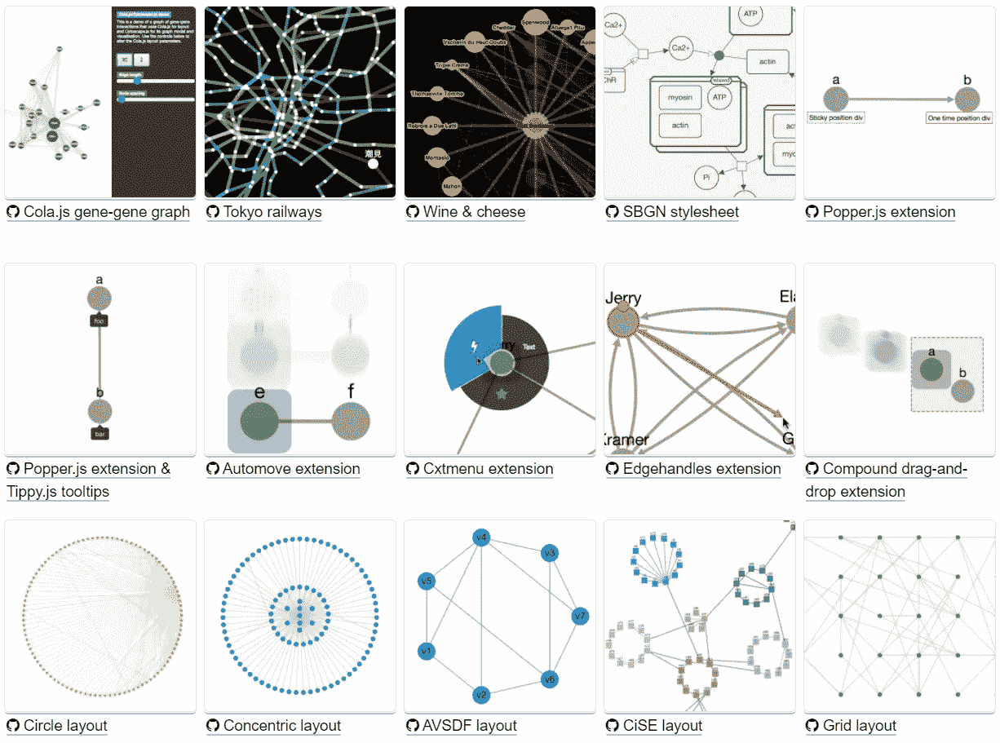
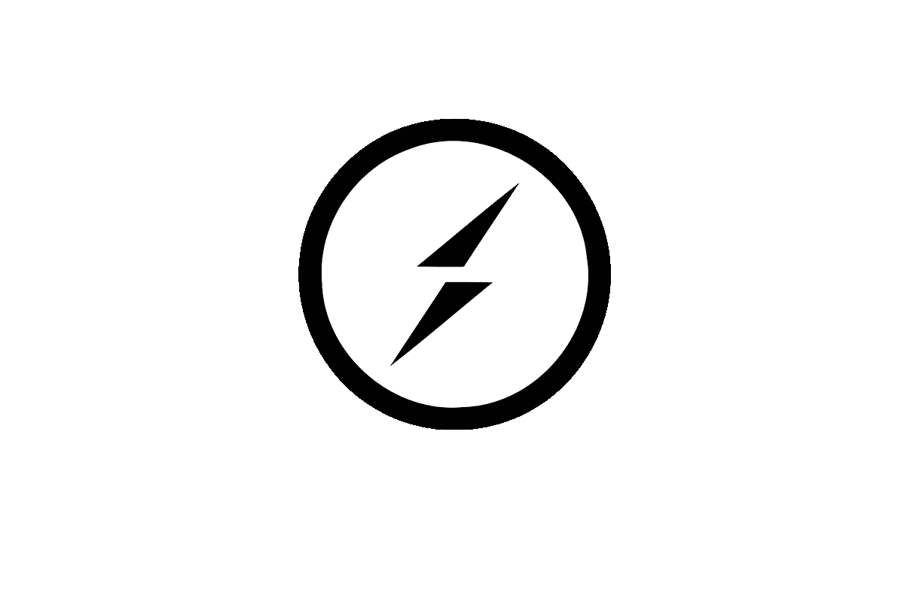
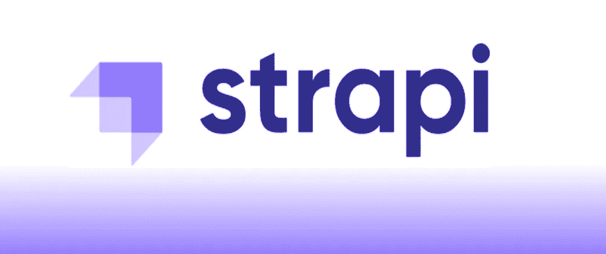
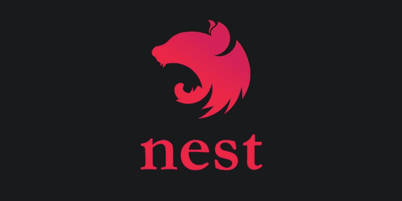

# 需要关注的 8 个 Node.js 项目

> 原文：<https://javascript.plainenglish.io/8-node-js-projects-to-keep-an-eye-on-66465e221db5?source=collection_archive---------1----------------------->

## SheetJS、ESlint & More

# 1.Cytoscape.js

一个 ***开源 JavaScript*** 库，用于可视化和图形分析，具有丰富的交互式实现。它包括所有开箱即用的手势，包括**框选择、平移**、**缩放**等等。

**Cytoscape** 可在 **Node.js** 上使用，以在网络服务器或终端上执行图形分析。朝着他们感兴趣的**数据科学**发展的开发者可以选择 ***Cytoscape*** 作为一个不错的选择，它也有一个很棒的贡献指南和文档。

# 2.PDFKit

非常有用的 **PDF** 节点生成库，有助于构建和下载复杂的 PDF，它还支持文本和**字体嵌入**、**注释**、**矢量图形**。然而，该项目没有广泛的文档，这使得它更难做出贡献。

# 3.插座。超正析象管(Image Orthicon)

基于事件的双向实时通信，可在所有浏览器设备上运行，同样注重速度。一个基本的聊天应用程序就是该工具提供的*双向通信*的一个例子。

服务器收到一条新消息，然后将它发送给客户机，并通知它们不需要在客户机和服务器之间发送请求。

附带有用的功能:

> ***二进制流***
> 
> ***实时分析***
> 
> ***文档协同***

# 4.斯特拉皮

一个开源内容管理系统，它是一个后端系统，提供与 RESTful APIs 一起使用的功能，主要目的是在所有设备上获取和交付内容。

附带大量功能，包括一个**内置电子邮件系统**、**文件上传**和 **JSON Web 令牌**认证。内容结构是通过 **Strapi** 创建的，它非常灵活，允许您创建内容组和可定制的**API**。

# 5.筑巢

Nest 是一个流行的渐进式框架，用于创建高效且可扩展的服务器端应用。使用**类型脚本**组合函数式和面向对象的编程元素&使用 **Express** 隐藏起来。由于其模块化架构，该工具通过允许您使用和库提供了真正的灵活性。

# 6.日期-fns

尽管如此，最一致和简单的工具集来操纵 **JavaScript** 日期在 **Node.js** 和浏览器，并与现代模块捆绑器如 ***Browserify、webpack 和 Rollup*** 配合良好。有了惊人的社区支持，该工具有几十个地区，每个功能都有详细的描述和例子。

# 7.SheetJS

一个 **Node.js** 库，允许你操作 **Excel** 中的电子表格以及 Excel 的许多其他功能，例如，从头开始导出工作簿，将 **HTML 表格、JSON 数组**转换为可下载的 **xlsx** 文件。附带一个大的社区和一个详细记录的贡献指南。

# 8.快递. js

最受欢迎的 **Node.js** 开源项目之一，由于其高效的 **HTTP** 请求，甚至与服务器端语言和浏览器外的 **JavaScript** 协同工作，提供了巨大的价值。

一个非常有用的工具来实现应用程序的速度和安全性。

## 基本特征:

> *不同的扩展和插件支持*
> 
> *基于 URL 的路由机制使用 HTTP 方法*
> 
> *无缝数据库集成*

感谢阅读；