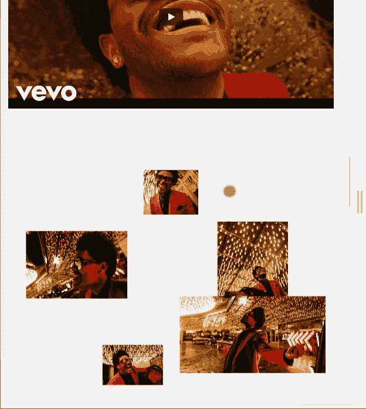
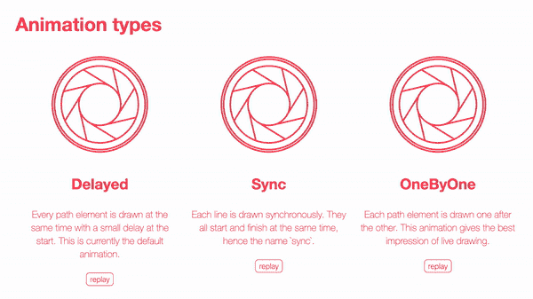
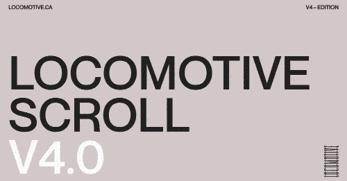
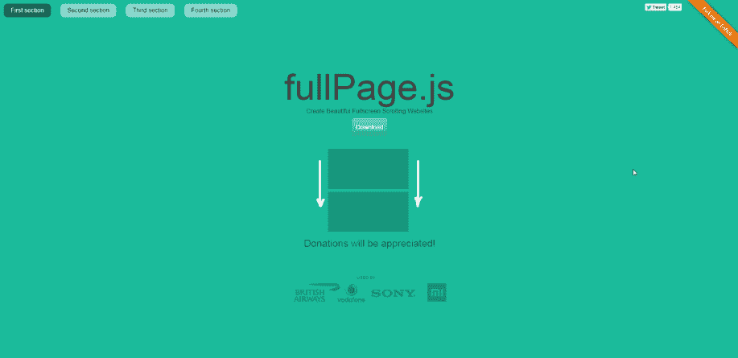
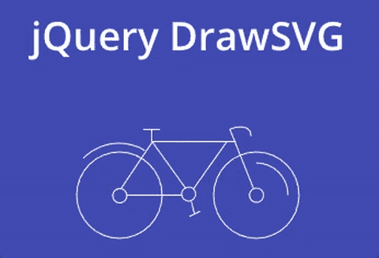
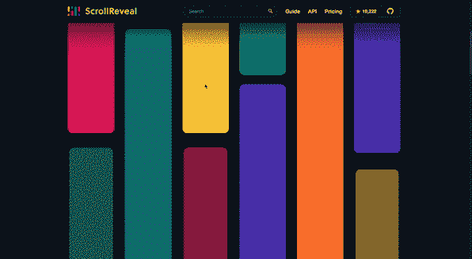
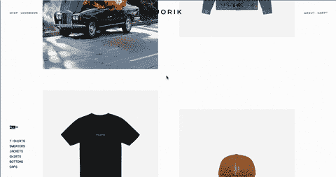

# 8 关于可以考虑的滚动动画 JavaScript 库

> 原文：<https://javascript.plainenglish.io/8-on-scroll-animation-javascript-libraries-you-can-consider-df458f80a873?source=collection_archive---------2----------------------->

## 在你的网站的元素上创建令人敬畏的滚动触发动画。

每个前端开发人员根据需要进行实验并选择不同的库。秘诀就是找到这些库并对它们进行测试，因为有时有些库并不能在所有的设备和浏览器上完美地工作，或者它们被终止而转向其他库，从免费它们变成部分或全部付费，它们与其他库发生冲突，随着更新的语法改变，简而言之，你必须总是在当场！

有许多类型的动画——在本文中，我将在滚动过程中深化网页中元素的动画。

# 1.AOS —动画打开滚动库

一个免费的库允许您根据传入元素在网页中的位置设置动画，设置持续时间、缓和、延迟、偏移和定位点。以下是不同类型的动画:

*   乏味的
*   翻转
*   一款云视频会议软件
*   幻灯片

它不需要任何特定的设置:有必要直接在元素上使用文档中指示的语法来设置动画(内联)。与其他库不同，此库不允许您检查动画状态:当元素在页面滚动过程中变为可见时，将触发触发器。

Source: [Medium](/animate-content-on-scroll-with-just-one-line-of-code-9222af203aff)

# 2.格林斯托克

你知道 Awwwards 上所有的获奖网站吗？你想创建一个网站与所有这些伟大的动画？格林斯托克才是解决之道！这是一个完整的库，允许您管理多种类型的动画。基本版本是免费的，而一些插件可以收费使用。

以下是一些完全可以控制时间轴的动画:

*   具有状态控制的 SVG(播放、停止、反转、触发事件)
*   基于页面滚动的元素动画
*   沿着已定义路径的动画元素
*   将效果应用于元素(颜色效果、比例等。)形状的变形
*   文本动画

Source: [greensock.com](http://greensock.com)

# 3.Vivus.js

此库允许您使用不同的动画制作 SVG 动画:

*   延迟:每个 SVG 轨道都以小的初始延迟动画化(默认)
*   sync:每个路径同步动画化，即它们都同时开始和结束
*   一个接一个:一个接一个地为每个路径设置动画

一旦创建了 Vivus 对象，就可以使用提供的方法控制动画:播放、停止、重置、完成、setFrameProgress、getStatus 和销毁。

必须特别注意如何生成 SVG:不允许任何形状，所有元素必须转换为<path>路径；否则，将不可能应用动画。在路径上，可以为填充和描边厚度设置填充和描边属性。</path>

Source: [Vivus](https://maxwellito.github.io/vivus/)

# 4.滚动机车

这个库在其在线演示中有很多惊喜。它允许您通过以下方式管理高影响动画:

*   具有视差效果的不同速度
*   不同方向
*   几次延期
*   视口中的固定项目
*   事件和属性可以与 data- *一起内联应用，并且有几种方法可以控制动画。

Source: [Locomotive](https://locomotivemtl.github.io/locomotive-scroll/)

# 5.Fullpage.js

一个有趣的库允许你管理页面部分，就像它是一个单独的页面，扩展整个全屏。将节的容器定义为唯一的对象并定义锚(即内部节)就足够了。

动画可以垂直或水平处理，有或没有导航元素(箭头和点)。有一些简便的方法可以控制动画和锚点。重要的是在不同的分辨率下，各部分的高度要相适应。

Source: [Alvarotrigo](https://alvarotrigo.com/fullPage/#examples)

# 6.jQuery DrawSVG

与前面的库一样，DrawSVG 允许您将 SVG 制作成动画，只要它们是由路径组成的。有几种方法不仅允许在 SVG 在页面上变得可见时启动动画，并以同步的方式滚动动画、回调后的动画和带有遮罩的动画。

# 7.滚动显示

ScrollReveal 是一个库，允许您在元素进入/离开视口时制作它们的动画。动画可以与 DOM 的任何元素相关联。

在高级配置中，可以将目标对象指定为动画触发器和各种动画选项(延迟、缓动等)。).动画也可以反向播放，因此您也可以滚动回页面顶部。

Source: [ScrollRevealJS](https://scrollrevealjs.org/)

# 8.Pararoller js

允许您对单个元素应用视差效果。必须使用文档中指示的适当 data- *属性或使用 pararoller()函数初始化元素，根据各个元素应用动画属性。

通过因子和过渡属性，可以应用具有不同延迟和效果的视差来区分附近对象的动画并强调视差效果。

此外，可以根据屏幕分辨率获得不同的视差速度(有益于更好地控制小屏幕上的动画，因为它们不允许动画元素的正确显示)。

一般来说，视差库并不完全兼容所有的浏览器(有些浏览器在滚动时会产生令人不快的毛刺效应)。

Source: [Old Jurik Website](http://jorik.com)

## 结论

一般来说，当选择一个库时，你必须密切注意与各种浏览器的兼容性和各种分辨率下元素的位置，因为可见性可能会失败，最后，不要插入太多的效果。少即是多！