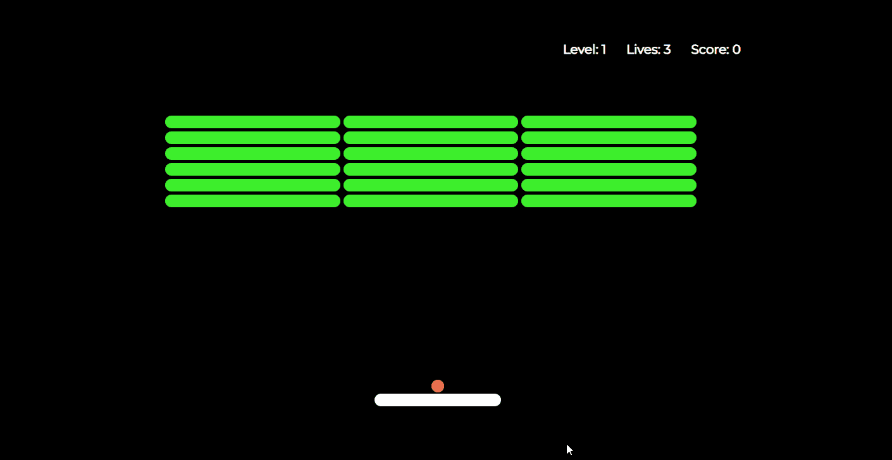

# 8 个项目来掌握你的前端技能🥇🏆

> 原文：<https://javascript.plainenglish.io/8-projects-to-build-to-master-your-front-end-skills-446e2d359ff2?source=collection_archive---------6----------------------->

我一直认为最好的学习方法是实践。招聘人员也更喜欢实践项目而不是理论知识。

在一年的时间里，我创建了 8 个网络应用和游戏克隆。我决定分享它们，这样社区也可以得到一些灵感来构建他们自己的项目。

为了探索和比较各种前端解决方案的工作原理，我尝试使用不同的堆栈，从 Vanilla HTML 到 React、Next.js 和 Svelte。

对于每个项目，将提供到已部署项目的链接以及源代码。给他们一个🌟在我的 GitHub 上。

## 计算器

## [💻直播项目](https://calculator-madza.netlify.app/) / [🔗GitHub 上的信号源](https://github.com/madzadev/calculator)

首先，我想创建一个实用的应用程序，供我们每个人在日常生活中使用。计算器似乎是个不错的选择。

它不时会派上用场。

功能包括:

1.  加、减、乘、除
2.  支持小数值
3.  计算百分比
4.  反转数值
5.  重置功能
6.  格式化较大的数字
7.  基于长度调整输出大小

这个项目是用 [React](https://reactjs.org/) 写的。

## 天气应用

## [💻直播项目](https://weather-app-madza.netlify.app/) / [🔗GitHub 上的源代码](https://github.com/madzadev/weather-app)

对于下一个应用程序，我的目标是能够查看世界各地的天气情况。我使用 Openweather API 从他们的网站获取数据。

为了让它看起来更有吸引力，我决定将它与一些对应于所显示条件的图标图形结合起来。

功能包括:

1.  搜索功能
2.  公制与英制
3.  当前当地时间和日期
4.  温度和湿度
5.  风速和风向
6.  日出和日落时间

项目写在 [NextJS](https://nextjs.org/) 里。

图标取自[平面图标](https://flaticon.com/)。

## 越狱

## [💻直播项目](https://breakout-madza.netlify.app/) / [🔗GitHub 上的源代码](https://github.com/madzadev/breakout)

[突围](https://en.wikipedia.org/wiki/Breakout_(video_game))是一款街机游戏，最初由[雅达利](https://en.wikipedia.org/wiki/Atari)开发并发布。

在突围中，目标是摧毁顶部的所有砖块。一个球从屏幕的顶部和两侧反弹回来。当砖块被击中时，球反弹回来，砖块被摧毁。

当球接触到屏幕底部时，玩家失去一个回合；为了防止这种情况发生，球员有一个可水平移动的球拍将球向上弹起，使其保持在比赛中。

功能包括:

1.  移动桨+球
2.  砖块一代
3.  冲突检出
4.  记分
5.  水平系统
6.  生活追踪
7.  游戏结束/重置

这个项目是用[细长的](https://svelte.dev/)字体写的。

## 2048

## [💻直播项目](https://2048-madza.netlify.app/) / [🔗GitHub 上的信号源](https://github.com/madzadev/2048)

[2048](https://en.wikipedia.org/wiki/2048_(video_game)) 是一款单人滑动瓷砖益智游戏，最初由意大利网页开发者 [Gabriele Cirulli](https://github.com/gabrielecirulli) 于 2014 年编写。

它是在一个普通的 4×4 格子上玩的，当玩家使用四个箭头键移动它们时，带有编号的瓷砖就会滑动。每回合，一个新的牌会随机出现在棋盘上的空白处。

游戏的目标是在格子上滑动编号的瓷砖，将它们组合起来，创建一个编号为 2048 的瓷砖。

功能包括:

1.  在 X 和 Y 轴上滑动单幅图块
2.  对碰撞的平铺值求和
3.  特定值的配色方案
4.  记分
5.  最佳分数记忆
6.  赢家检测
7.  游戏结束/重置

这个项目是用[细长的](https://svelte.dev/)字写的。

## 记忆游戏

## [💻带电项目](https://memory-game-madza.netlify.app/) / [🔗GitHub 上的源代码](https://github.com/madzadev/memory-game)

记忆游戏有不同的形式和变化。

我决定用传统的方法，用户必须记住卡片的位置，然后依次打开两张完全相同的图片来得分。一旦所有的牌都被打开，用户就是胜利者。

我使用 Unsplash API 从他们的站点获取图像。

功能包括:

1.  移动跟踪
2.  匹配百分比
3.  胜利状态检测
4.  重置功能

这个项目是用[细长的](https://svelte.dev/)字体写的。

## 井字游戏

## [💻直播项目](https://tictactoe-madza.netlify.app/) / [🔗GitHub 上的来源](https://github.com/madzadev/tic-tac-toe)

井字游戏是一种非常受欢迎的双人游戏，玩家轮流在 3×3 的网格中标记“X”或“O”。它已经在不同的环境中运行过，从传统的纸笔到许多不同版本的在线用户界面。

成功将三个标记放置在对角线、水平或垂直行中的玩家获胜。

1.  内置移动计算
2.  赢家检测
3.  重置功能

这个项目是用[细长的](https://svelte.dev/)字体写的。

## 石头剪刀布

## [💻直播项目](https://rockpaperscissors-madza.netlify.app/) / [🔗GitHub 上的信号源](https://github.com/madzadev/rock-paper-scissors)

石头剪子布起源于中国，随着与东亚接触的增加而传播，同时随着时间的推移发展出不同的符号变体。

一个决定玩石头的玩家会打败另一个选择了剪刀的玩家，但会输给一个玩过布的玩家；玩纸会输给玩剪刀。如果两个玩家选择相同的形状，这是一个平局。

功能包括:

1.  圆形跟踪
2.  记分
3.  选择显示
4.  计算机选择
5.  赢家检测
6.  重置功能

这个项目是用 [React](https://reactjs.org/) 写的。

图标取自[图标 8](https://icons8.com/) 。

## 登录页面

## [💻带电项目](https://landing-page-madza.vercel.app/) / [🔗GitHub 上的来源](https://github.com/madzadev/landing-page)

这个登录页面是在我处理我的投资组合时作为我的个人领域的临时占位符而创建的。它旨在保持设置和用户界面的简单性。

因为我不再把它放在我的个人域上，我决定用它做一个模板，这样其他寻找登陆站点的开发者也可以从中受益。

我还做了一个[教程](https://madza.dev/blog/create-a-landing-page-in-less-than-100-lines-incl-css)关于如何从头开始创建它。

功能包括:

1.  关于 dev 的信息
2.  链接到社交媒体的图标
3.  交互式悬停效果

项目是用 [HTML](https://developer.mozilla.org/en-US/docs/Web/HTML) 和 [CSS](https://developer.mozilla.org/en-US/docs/Web/CSS) 编写的。

图标取自[图标 8](https://icons8.com/) 。

写作一直是我的激情所在，帮助和激励他人给我带来了快乐。如果您有任何问题，请随时联系我们！

在 [Twitter](https://twitter.com/madzadev) 、 [LinkedIn](https://www.linkedin.com/in/madzadev/) 和 [GitHub](https://github.com/madzadev) 上给我接通！

更多类似的项目，请查看我的[作品集](https://madza.dev/code)。

*更多内容请看*[***plain English . io***](http://plainenglish.io/)