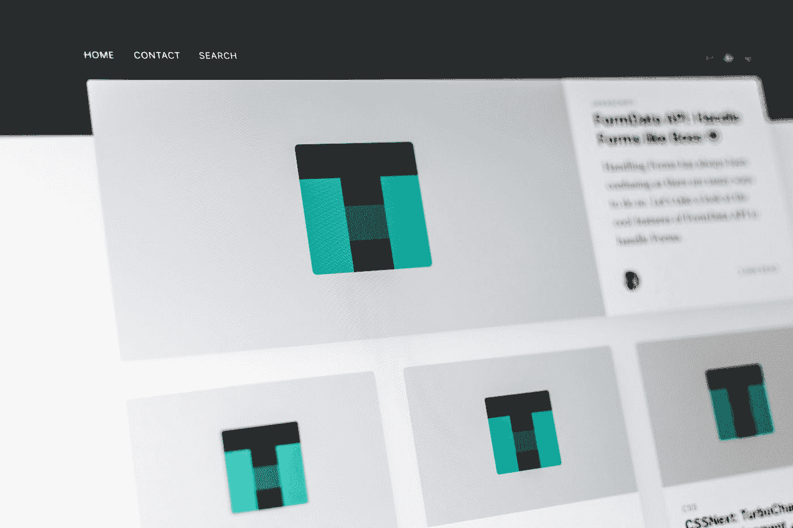

# 8 个你可能没有用过的 React UI 库

> 原文：<https://javascript.plainenglish.io/8-react-ui-libraries-you-probably-havent-used-for-styling-8dab73082083?source=collection_archive---------11----------------------->

## 是时候让你的工作更聪明，而不是更努力了。



Photo by [Pankaj Patel](https://unsplash.com/@pankajpatel?utm_source=medium&utm_medium=referral) on [Unsplash](https://unsplash.com/?utm_source=medium&utm_medium=referral)

为了节省大家的时间，我收集了一些有用的库，它们使用样式组件来提供一个简单的开箱即用的工具包。它可以帮助您将样式化的组件放到您自己的应用程序 UI 中进行测试。

您可以使用 Bit 在可视目录中组织样式化组件的集合，共享 CSS 组件，并在不同的项目中开发它们。每个组件也可以使用 NPM 安装。

# 1.雷巴斯

Rebass 是一个“用样式系统构建的 React 原始 UI 组件”，在 Github 上有超过 7k 颗星。它的特点是轻巧，精致的设计和 8 个可扩展和可重用的组件，反应灵敏，可定制。

[](https://github.com/rebassjs/rebass) [## rebassjs/rebass

### 使用样式化系统构建的 React 原始 UI 组件。https://rebassjs.org 启动你的设计系统不沸腾…

github.com](https://github.com/rebassjs/rebass) 

## 安装:

```
npm i rebass
```

# 2.Zendesk 的 Garden React 组件

虽然这个库只有 842 颗星，但它提供了制作精良的组件，可以单独发布到 NPM，也可以作为 Bit 组件轻松使用和共享。

有些组件可以用来响应一系列用户输入设备，有些可以调整以处理从右到左的布局，有些甚至包括动画效果。它提供了许多 Web HTML、CSS 和 JavaScript 小模块，可以放入任何基于 React 的应用程序中。

[](https://github.com/zendeskgarden/react-components) [## zendeskgarden/react-组件

### 🌱花园是 Zendesk Garden React 的设计系统，为花园组件提供一致的样式和行为…

github.com](https://github.com/zendeskgarden/react-components) 

# 3.索环

索门环库的 V2 版本(由网飞、优步等使用。)用样式组件替换了 SASS。所以现在您不再需要特殊的配置或使用 SASS 来设计组件的样式。样式不再是全局的，也不再是构建时的主题。他们的官网也提供了很多例子。你自己试试。

[](https://github.com/grommet/grommet) [## 索环/索环

### 有关更多信息，请访问索环网站。在打开问题或拉动请求之前，请阅读提供的…

github.com](https://github.com/grommet/grommet) 

## 安装:

对于 npm 用户:

```
$ npm install grommet styled-components --save
```

对于纱线用户:

```
$ yarn add grommet styled-components
```

# 4.平滑用户界面

获得过千星级的 React UI 组件库，强调用户体验，包括风格可扩展性。它还公开了一些现成的类，因此我们不必学习新的 API 来扩展组件并在调试组件时使用。

[](https://github.com/smooth-code/smooth-ui) [## 平滑代码/平滑用户界面

### 现代 React UI 库。少编码，多做事。NPM install @ smooth-ui/core-sc reakit styled-components 或 npm install…

github.com](https://github.com/smooth-code/smooth-ui) 

## 安装:

```
npm install @smooth-ui/core-sc reakit styled-components
```

或者

```
npm install @smooth-ui/core-em reakit @emotion/core @emotion/styled emotion-theming
```

# 5.反应堆

Reactackle 是一个带有样式组件的 React UI 库，提供了超过 200 星的跨浏览器支持。该库支持基本设计的定制，并提供开箱即用的主题。

[](https://github.com/bcrumbs/reactackle) [## bcrums/react ackull

### 用 React 和 Styled 组件构建的开源组件库。Reactackle 是一个组件系列，它可以…

github.com](https://github.com/bcrumbs/reactackle) 

## 装置

对于 npm 用户:

```
npm install reactackle --save
```

对于纱线用户:

```
yarn add reactackle
```

或者您可以独立安装组件:

```
npm install reactackle-button --save
```

# 6.雷基特

Reakit 允许你用任何组件或容器创造新事物。所有组件都像 HTML 元素一样遵循 WAI-ARIA 标准，并符合单元素模式。在 GitHub 上获得 1k 星。

[](https://github.com/reakit/reakit) [## 雷基特/雷基特

### 使用 React 构建可访问的富 web 应用的工具包。探索网站“捐赠 100 美元或以上，您将成为…

github.com](https://github.com/reakit/reakit) 

## 装置

对于 npm 用户:

```
npm i reakit
```

对于纱线用户:

```
yarn add reakit
```

# 7.反应 CSS 加载器和样式加载器

React-CSS-loaders 是纯 CSS React 加载组件的集合，基于流行的 CSS-loaders 项目，用样式组件构建。

Styled loaders 是一组基于 Preact 和 Styled Components 的加载程序，基于流行的 spin kit 项目。

[](https://github.com/LucasBassetti/react-css-loaders) [## LucasBassetti/react-CSS-loaders

### o:纯 CSS React 加载组件的集合

github.com](https://github.com/LucasBassetti/react-css-loaders) 

安装:

```
npm install react-css-loaders --save
```

# 8.样式图标

它提供的样式组件包括字体 Awesome、羽化、材质设计和 Octicons 图标包，并完全支持 TypeScript 类型和 tree-shaking / ES 模块。您可以在“样式图标网站”上查看这些图标

它提供的样式组件包括字体 Awesome、羽化、材质设计和 Octicons 图标包，并完全支持 TypeScript 类型和 tree-shaking / ES 模块。您可以在“样式图标网站”上查看这些图标

[](https://github.com/styled-icons/styled-icons) [## 样式图标/样式图标

### styled-icons 从以下图标包中提供了 20，000 多个图标作为样式组件，完全支持…

github.com](https://github.com/styled-icons/styled-icons) 

## 安装:

对于纱线用户:

```
yarn add styled-icons
```

对于 npm 用户:

```
npm install styled-icons --save
```

如果你有足够的时间，你可以从头开始写代码来找乐子。但是如果这不是你愿意做的，你应该从上面的 8 个组件中选择现成的 UI 组件。

*阅读更多在*[***plain English . io***](https://plainenglish.io/)