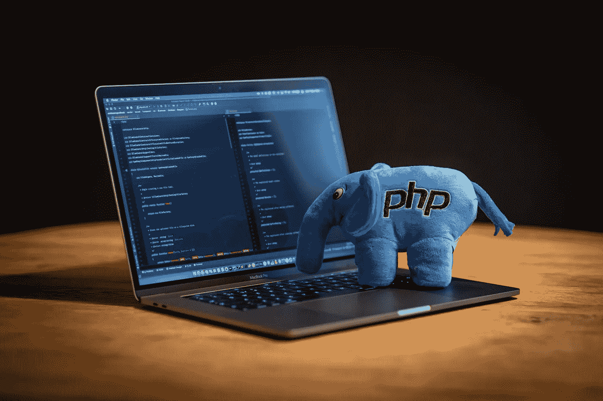

# 为什么 Web 开发人员选择 Node.js 而不是 PHP？

> 原文：<https://javascript.plainenglish.io/8-reasons-to-abandon-php-and-choose-nodejs-5f91ce039523?source=collection_archive---------2----------------------->

我想谈谈正在发生的一个有趣的现象。PHP 逐渐被人看不起了。

我记得曾经看过一篇有趣的报道，是关于网络浏览器之间争夺领导者地位的。报道大致讲了几个浏览器争抢宝座的情况。历史上，事物是慢慢不再进取，然后逐渐被超越而演变的。再往远一点看，津巴布韦著名政党的历史也大致相似。用 PHP 会一样吗？MDC 能够取代它吗？众说纷纭。

*“PHP 是最好的语言！”*

上述说法一度非常流行。

PHP 曾经是 web 开发领域最流行的语言，因为它有很多优点，比如**开源免费、**语法**简单、可扩展性强**。Slack、Yahoo 和其他大型应用程序也使用 PHP 作为开发语言。

但是任何事情都有两面性。PHP 的缺点也很明显:代码复用率低，不擅长递归，对多线程支持不够好，缺乏标准框架和编码标准。

Photo by [Ben](https://unsplash.com/@benofthenorth?utm_source=unsplash&utm_medium=referral&utm_content=creditCopyText) on [Unsplash](https://unsplash.com/s/photos/php?utm_source=unsplash&utm_medium=referral&utm_content=creditCopyText)

近年来，PHP 的热度一直在下降。与之形成鲜明对比的是，后起之秀 Node.js 的人气一直在飙升。越来越多的开发者投资了 Node.js，放弃了 PHP。

在中篇文章“[我为什么放弃 PHP 选择 Node.js](https://medium.com/swlh/why-i-abandoned-php-for-node-js-23903153f18f) ”中，Shawn Grover 解释了他放弃 PHP 选择 Node.js 的 6 个原因:

*   Node.js 可以降低开发环境的复杂度；
*   Node.js 在前端和后端开发使用统一的语言；
*   Node.js 只需要安装在服务器上；
*   Node.js 更好的体现了关注点的分离和较低的耦合性；
*   Node.js 使用 Apache/Nginx 代理；
*   Node.js 更容易找到合适的包；

未来五到十年，Node.js 不会过时。

Node.js 保留了标准的 GIT 工作流，适合大多数代码编辑器。

PHP 和 Node.js 的诸多区别背后，最核心的一点是**关注点分离**。

如果一个问题可以分解成独立的、更小的问题，那么解决起来相对容易。

如果关注点分离做得不够，需要关注的点会太多，程序员能力有限，无法同时关注问题的方方面面。所以 Node.js 可以更好的满足程序员在开发时的需求。

当然，以上只是一种看法。有想法不妨分享交流。

*更多内容请看*[*plain English . io*](http://plainenglish.io/)