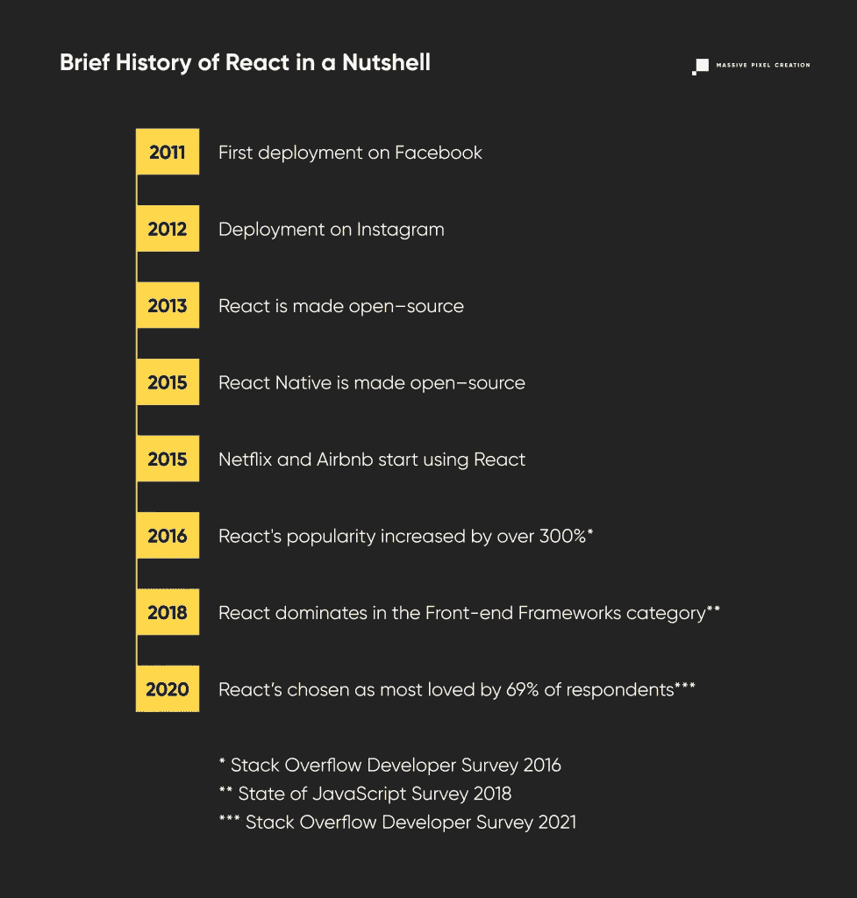

# 科技巨头使用 React 的 8 个原因

> 原文：<https://javascript.plainenglish.io/8-reasons-why-react-is-used-by-tech-giants-f3985237dddc?source=collection_archive---------7----------------------->

脸书、Instagram、网飞、推特、亚马逊、Shopify、Pinterest、优步、Airbnb。他们都有什么共同点，除了改变世界？

他们疯狂地爱上了 React。

我们也是。

这项技术不断赢得开发者的心，正如[Stack Overflow Developer Survey 2021](https://insights.stackoverflow.com/survey/2021#technology)所证明的，其中 React】被 69.28%的受访者选为最受欢迎的 web 框架。好奇 React 为什么是这么受欢迎的选择？继续读下去，自己去发现。

# 什么是反应？

React 是 web 开发前端常用的一个**开源 JavaScript 库**，专门用于**构建用户界面和可重用 UI 组件。它由**脸书**于 2011 年开发自用，两年后开源。在那之后，React 席卷了技术世界，以更容易的学习曲线(例如，与 Angular 不同)、闪电般的开发以及 React 开发人员的繁荣社区赢得了开发人员的喜爱，他们随时准备在困难的时候伸出援手。React 开发服务的兴起也是一大意外收获。**

# React Native 是一回事吗？

React 是一个用于 web 开发的库，而 **React Native 是 JavaScript 框架之一，用于构建跨平台的移动应用。**不确定库和框架的区别在哪里？

**库是用于执行特定操作的对象、辅助函数和方法的集合。由于所有的组件都是可重用的，你不必每次都重写代码，遵循[保持代码干燥](https://www.drycode.io/)的规则(不要重复自己)。**

**另一方面，框架**是许多库、API、预定义函数和对象的**集合。**它给了你一个基础功能，你可以在此基础上创建更复杂的应用程序，大大缩短开发过程。此外，框架有自己的默认行为，规定了应用程序应该如何设计，而库提供了更多的灵活性。

React 和 React Native 有一些共同点，但它们仍然是不同的技术。例如，它们共享相同的特殊语法和原理，这使得在了解其移动对应物的同时很容易学习 React。但是呈现方式不同；React 使用 VirtualDOM，而 React Native 为此需要一个本机 API。

然而，将两者结合起来——创建最高质量的 web 应用程序，然后是相同标准的移动应用程序——是通过使您的产品完全可访问来赢得最终用户的可靠方法。

# React 的优势和优势

## 1.交互式用户界面变得简单

虽然我们想推广“不要根据封面来判断一本书”的方法，但不可否认的是，web 应用程序的外观和感觉会影响最终用户的直接参与。如果产品不是用户友好的，并且违背了典型的用户行为，那么它就是失败的。

与其他 JavaScript 库相比，使用 React，**创建令人愉快的功能性用户界面的过程要容易得多。这是可能的，因为**声明性组件**用于描述期望的结果，而不是实现目标的直接步骤。那些确切的步骤留给程序去解决，这节省了大量的时间。**

您还可以**节省未来的时间**，因为维护和调试也很容易。

## 2.利用虚拟 DOM 实现高性能

速度比以往任何时候都重要。

用户不再有耐心等待网站加载，也不会原谅任何网络应用程序对他们的行为反应太慢。任何以盈利为目的的产品都需要达到最佳效率。

过去，**服务器端渲染**是一个标准，但是它不能满足单页面应用程序的需求。每次用户与页面交互时都要呈现组件，这是一种相当麻烦的体验。

这也是脸书的想法。因此，React 应运而生。

**React 的主要优势在于虚拟 DOM，**它是**文档对象布局**的虚拟表示，将 UI 中实现的所有更改保存在其内存中，直到它找到更新和呈现真实 DOM 的最经济的方法。这种称为[协调](https://reactjs.org/blog/2013/06/05/why-react.html)的渲染方法减少了必要更新的总数，从而使最复杂的应用程序也能获得更好、更快的性能。

## 3.快速开发的可重用组件

React 使构建 web 应用程序变得轻而易举，原因在于**组件的可重用性。**所有的组件都有自己的逻辑，并且彼此独立，这使得它们很容易跨应用程序重用多次。写一次，到处用——React 经常被这样描述。

此外，在 React 中，组件不是唯一可重用的东西。您还可以在不改变组件层次结构的情况下重用有状态逻辑。这个功能是随着 2019 年的 [React 16.8 一起推出的 **React 钩子**。它的目的在于使组件不那么复杂，代码更易于管理，并且更容易找出错误。](https://reactjs.org/blog/2019/02/06/react-v16.8.0.html)

在引入 React 钩子之前，[高阶组件](https://reactjs.org/docs/higher-order-components.html)用于合成行为。作为一种源自 React 的组合性质的模式，它的目的是将一个组件作为参数，并返回一个新的组件。听起来很熟悉？hoc 的灵感来自于 JavaScript 中的高阶函数。

使用 React 钩子还是高阶组件[更好完全取决于环境](https://medium.com/javascript-scene/do-react-hooks-replace-higher-order-components-hocs-7ae4a08b7b58)。例如，如果行为仅限于单个组件，React 挂钩是更好的选择，而高阶组件在没有一堆道具参与时表现良好。

有了这种级别的可重用性，您将受益于更快的开发、高效的可伸缩性和易于维护，从而节省资金和时间。

## 4.以简单的名义清理抽象层

抽象负责减少信息负载，并对最终用户隐藏复杂的内部结构。这是一件必然的事情，需要对设计架构有深入的了解，比如 **MVP** (模型-视图-展示者) **MVC** (模型-视图-控制器)，或者 **MVVM** (模型-视图-视图-模型)。它们通常用于框架中，将应用程序分成不同的逻辑组件。

但是 React 不是一个框架，因此，它不遵守架构模式的规则——这转化为在构建产品方面更大的灵活性。开发者只需要知道基础知识就可以继续，这使得使用 React 变得如此令人愉快。

## 5.单向数据流意味着稳定的代码

以[单向数据流](https://www.exclamationlabs.com/blog/the-case-for-unidirectional-data-flow/)的形式应对管理数据和应用程序状态之间相互作用的挑战。另一种选择，双向数据流，阻止了视图层识别数据来自何处，就像模型不知道数据是如何呈现的一样。虽然一个简单的网络应用程序可以很好地处理这个问题，但是更复杂的应用程序可能会发现自己处于一个困难的境地——持续的数据流很难管理、控制和维护，而所有的错误都更难发现。

**单向数据绑定通过确保可预测的应用程序状态来解决这个问题。**

随着向下运动而来的是**代码稳定性:**对子元素所做的任何改变都不会影响父数据，这对于着眼于未来扩展的软件开发人员来说是个好消息。

## 6.许多有用的开发工具可供选择

每当您需要提高效率、节省时间或简化工作时，开发人员工具都会派上用场。技术越受欢迎，就有越多的选择——所以有了 React，没人能抱怨工具的匮乏。

您可以使用[为什么渲染](https://github.com/welldone-software/why-did-you-render)来调试任何 React 组件的行为，使用[位](https://bit.dev/)来创建和共享您的可组合组件以提高团队合作，或者如果您需要做一些可靠的 UI 测试，可以使用[故事书](https://storybook.js.org/)。这只是冰山一角。

最重要的是，两种开发工具非常突出: **React Developer Tools** 和 **Redux Developer Tools。**

**React 开发者工具**让你**洞察 React 树**，让你检查应用的架构及其所有组件，从钩子和状态到道具。您还可以通过 [Profiler 选项卡](https://flaviocopes.com/react-developer-tools/)测试 web 应用程序中的交互，将它用于**运行实验**。因此，如果你想了解 React 组件如何相互影响，这个在 Chrome 和 Firefox 上都可用的扩展是必须的。

另一方面，Redux 开发工具对于那些与 React 一起使用 **Redux** 的人来说是有用的，Redux 是一个用于**状态管理**的[状态容器](https://redux.js.org/)。redux Developer Tools**有助于跟踪每个状态和分派的动作，**让你可以回到任何记录的状态，以便于调试，并保持应用程序在许多平台上的行为一致。有什么不喜欢的？

## 7.多方面的支持

React 不仅得到了它的创造者脸书的全力支持——因为它的生计依赖于它——也得到来自世界各地的巨大开发者社区的支持。这导致了数量惊人的教程、资源、技巧和指南，其中许多都是免费和开源的。它们可以在诸如 [Stack Overflow](https://stackoverflow.com/) 、 [Reddit](https://www.reddit.com/r/reactjs/) 、 [Dev.to](https://dev.to/t/react) 和[等网站上找到，也可以在许多其他博客、播客和 Youtube 频道](https://massivepixel.io/blog/web-development-blogs/)上找到。对于那些真正着急的人，甚至有免费的[组件库](https://retool.com/blog/react-component-libraries/)。

## 8.携手搜索引擎优化

最后，即使是最漂亮的网络应用程序，如果它隐藏在互联网的深处，远远超出了消费者的认知范围，也无法发挥作用。这就是为什么与谷歌合作，努力提高你网站的排名是至关重要的。

由于使用 React 可以很容易地开发出**轻量级的、完全响应的、具有有意义的结构的网站，**从商业角度来看，这是一项完美的技术。

# 关键要点:React 如此受欢迎的 8 个原因

对于那些喜欢快速开发、快速见效、无压力维护的人来说，使用 React JS，一个由脸书使用和开发的 JavaScript 库，是一个明智的选择。让我们总结一下在 web 开发中使用 React 的所有好处:

1.  **高用户参与度**交互式、响应性界面让用户体验到真正的乐趣。
2.  **虚拟 DOM** 确保**高性能**即使在最复杂的项目中也能支持，
3.  闪电般的开发速度大大缩短了上市时间，这都要归功于可重复使用的 React 组件。
4.  干净的抽象层另外**方便了开发过程**和**降低了进入门槛**，
5.  单向数据流保证**代码稳定**和**调试更容易**，
6.  许多有用的开发工具使得整个开发过程更加高效，
7.  React 得到了它的创建者脸书以及一个活跃社区的支持，由于这个社区，许多教程、指南和提示被提供。
8.  有了 React，**构建 SEO 友好的项目毫不费力。**

很容易理解为什么 React 是如此受欢迎的选择，提供快速的解决方案来增强商业前景。所以不要犹豫，至少为你的下一个项目考虑 React 吧！

*原发布于*[*https://massie pixel . io*](https://massivepixel.io/blog/why-react/)*。*

*更多内容请看*[***plain English . io***](http://plainenglish.io/)