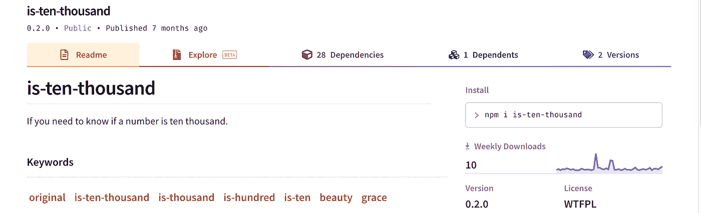
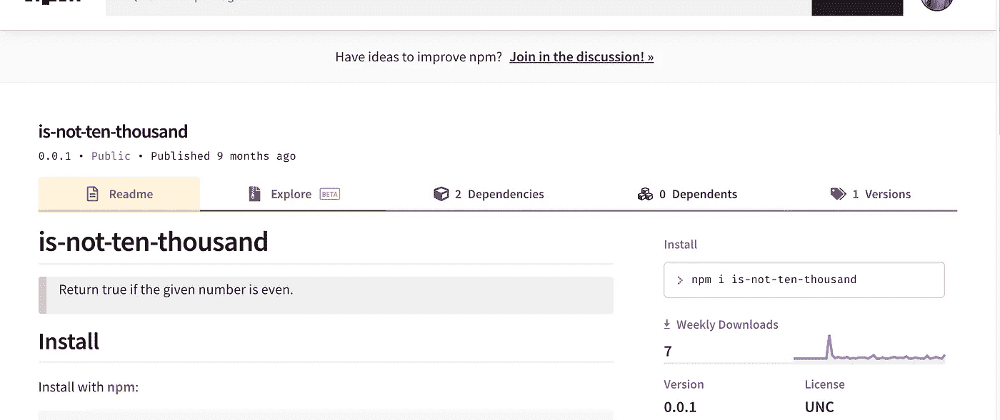
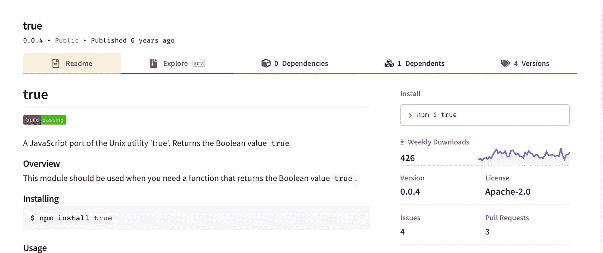
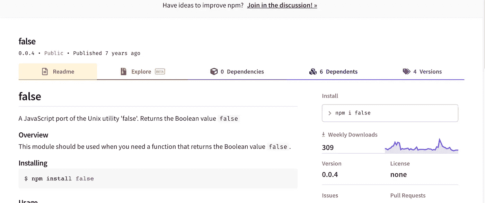
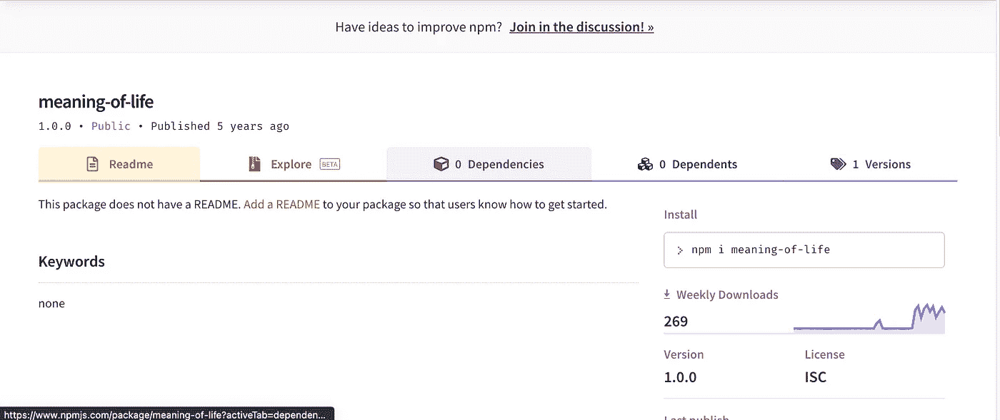
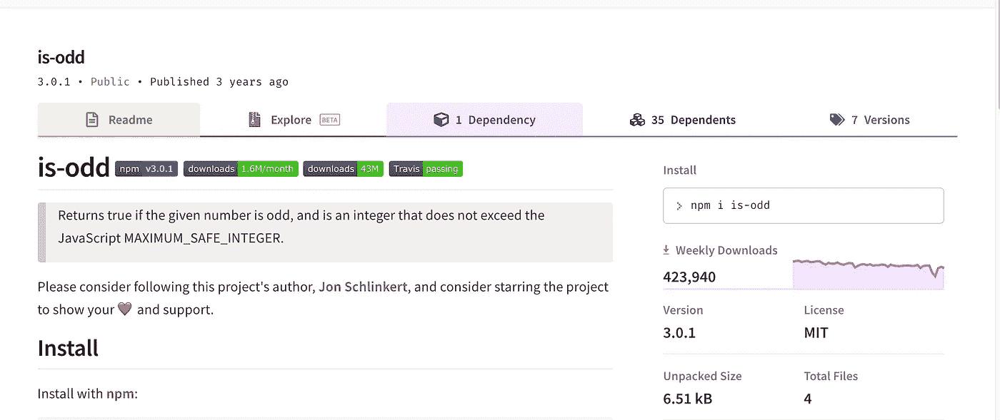
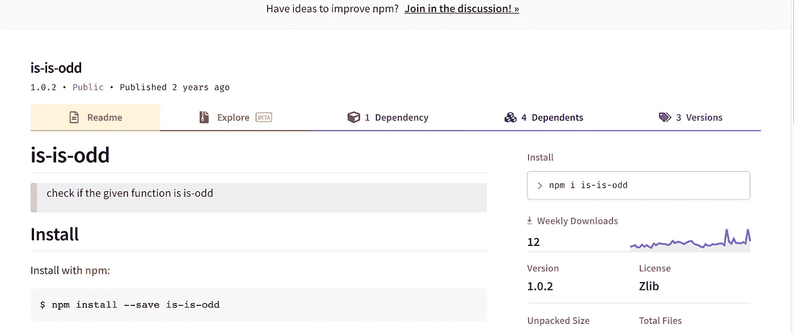
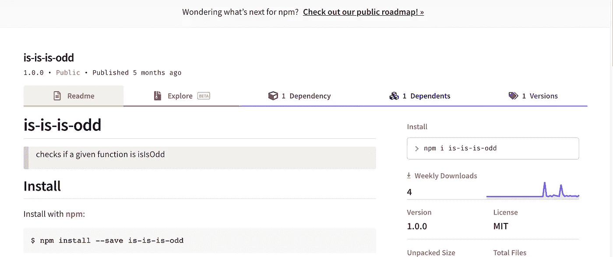

# 8 个可笑的 NPM 包裹，我希望它们不存在

> 原文：<https://javascript.plainenglish.io/8-ridiculous-npm-packages-i-wish-didnt-exist-3f3ab74942e7?source=collection_archive---------2----------------------->

## 读完之后，你也会有同样的愿望

Photo by [Usman Yousaf](https://unsplash.com/@usmanyousaf?utm_source=unsplash&utm_medium=referral&utm_content=creditCopyText) on [Unsplash](https://unsplash.com/s/photos/angry?utm_source=unsplash&utm_medium=referral&utm_content=creditCopyText)

节点包管理器(npm)对于什么包可以发布或者不可以发布是非常开放的。这些年来，有一些我们都想要和喜欢的很棒的包。但是今天我们不讨论这个问题。我们会看到一些荒谬的 npm 包，并试图理解它们为什么会存在。

# 1.是一万

这是一个软件包，可以让你检查一个特定的数字是不是 10000。

很明显，这周有 10 个人需要这个😜

但是如果你需要知道一个数不是 10000 呢？嗯，这也有一个解决方案…

# 2.不是一万

这个令人敬畏的包裹帮助你发现…

is-not-ten-thousand

# 3.真实的

继续一些严肃的事情。如果你需要布尔值 true，最简单的方法是什么？您只需安装以下软件包，就可以开始了

true

如果你想知道有另一个包也可以得到假值。所以你被保护了。

# 4.错误的

false

不要因为大约 300 人认为这个包会帮助他们的项目而不尊重他们:P

# 5.生活的意义

有没有在未能解决一个关键错误后问过这个问题？这就是你的答案。

这个包裹让你知道生命的真谛。

meaning-of-life

接下来，我们来看看一些更受欢迎的软件包。

# 6.是奇数

这个软件包消除了你检查一个数字是否是奇数的麻烦。

is-odd

这个包有**百万**的下载量，这个包有超过 **20 位作者**和 **6 位作者**来写这个。

# 7.很奇怪

然而，如果你对你的代码非常小心，并且想要绝对确保你的**是奇数的**函数实际上是奇数的函数，这里有另一个包来测试它。

is-is-odd

# 8.很奇怪

另一个用来测试这个

is-is-is-odd

所以你可以完全信任你的代码来检查一个数是否是奇数:P

这是一些你不需要的包，但是它们仍然存在。

祝你有美好的一天！别怪我浪费你的时间，:D

**通过**[**LinkedIn**](https://www.linkedin.com/in/56faisal/)**或我的** [**个人网站**](https://www.mohammadfaisal.dev/) **与我取得联系。**