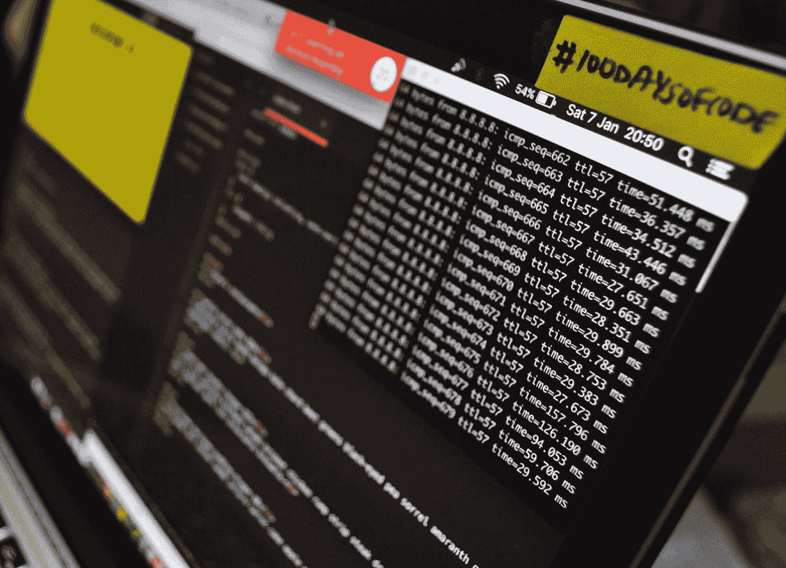

# 8 个简单的方法来解决一个十年后仍无法重现的软件错误

> 原文：<https://javascript.plainenglish.io/8-simple-ways-to-solve-an-unreproducible-software-bug-even-after-a-decade-92af14ec0f51?source=collection_archive---------16----------------------->

## 一些可以导致解决方法的方法。

Photo by [Lewis Kang'ethe Ngugi](https://unsplash.com/@ngeshlew?utm_source=medium&utm_medium=referral) on [Unsplash](https://unsplash.com?utm_source=medium&utm_medium=referral)

我在编程生涯中遇到的一个问题是修复 bug。测试人员报告的错误，最终用户识别的错误，以及我发现的错误。

作为一名程序员，我可以说解决这些 bug 需要一种不同的方法，而最难解决的是那些由最终用户确定的 bug。为什么？因为最终用户不会给出太多关于如何识别缺陷的细节。

所以我认为分享我如何解决已识别的终端用户错误的方法对其他程序员来说是有价值的。一些可以导致解决方法的事情。

# 1.获取问题的描述

输入值使用了描述错误的情况(错误消息？奇怪或意想不到的行为？等等。).通常用户不能描述问题，只是说一些像“不工作”这样的话，这样就不知道流程中哪些步骤停止了，什么对他们来说“不工作”，等等。

# 2.确定边界值

边界值是算法应该工作的范围的异常边界值。例如，边界值可以是数组的索引，它必须在 0 到 100 的范围内。任何超出该范围的值都必须被视为不正确，在处理极限(0 或 100)时，逻辑更加微妙，问题也就出现了。在大多数情况下，问题与边界值有关，这是算法失败的地方，因为它没有正确实现。

# 3.确定问题难以重现的原因

大多数情况下，这个问题的本质已经提供了一些线索。系统访问的网络中是否有文件丢失？有问题的用户是否没有适当的权限？会不会是权限下降或者网络变得不稳定？

访问信息所需的数据序列中是否缺少某些配置参数或路径？同样，几乎总是有一些线索可以帮助我们找到问题的本质。

诸如用户以前能够访问但现在不能访问的信息，或者观察到问题的条件也是有帮助的。但是，在解释用户传递的信息时必须非常小心，特别是外行用户，因为他们往往是主观的，是根据你的感觉描述的。

# 4.如果问题只发生在某台机器/某个用户身上，则可能是不同的环境或配置。

操作系统设置、软件环境、所用库的版本、任何可能影响系统并在用户机器上有所不同的东西都表明了前进的方向，尤其是如果该问题不能在其他设备上重现的话。

# 5.与多任务和共享资源相关的错误很难发现。

多任务往往会导致进程同时“获得”特定的共享资源，从而导致数据不一致，因为一个进程不会等待另一个进程完成。

解决方案是识别问题的“关键区域”，在那里只有一个任务可以同时执行，并使用“锁”(软件锁)来确保这一点。不一致的数据可能指示编程不良的关键区域。

# 6.如果即使使用所有这些策略也无法追踪错误，我们需要在软件中实现独特的处理来捕捉它。

一位数学教授在 1994 年发现，英特尔处理器在浮点计算中有一个 [**缺陷**](https://en.wikipedia.org/wiki/Pentium_FDIV_bug) 。处理器使用的计算表中缺少一些条目。这种错误非常罕见，以至于数百万人一直在使用这种处理器而没有注意到它。谁知道在渲染图像、矢量计算、游戏和电子表格时，有多少微妙的错误计算是在没有被观察到的情况下完成的。

起初，英特尔不想向所有人提供新处理器(召回)，建议根据具体情况分析需求。然而，意识到这种解决方案的不可行性和缺乏可靠性会影响每个人和它的品牌，它最终提出要改变每个人的处理器。

当我们无法跟踪某个问题时，在代码中输入“日志”会很有帮助，围绕执行有问题的功能的代码片段，记录所有与重现错误相关的条件—代码片段每次执行的确切日期和时间、操作员用户、使用的数据等。

您通常对错误的性质以及跟踪错误所要记录的条件有所了解。通常，日志应该已经是任何系统的一部分，尽管在跟踪特定条件时，可以临时启用更重、更详细的日志记录。

此外，可以将测试条件添加到程序中，以便在出现所寻找的错误条件时发出警报，从而允许对其进行捕获和检查。通常，当我们看到导致错误的参数时，我们会发现一些逻辑错误，一些与我们想象的不同的程序行为，

# 7.最后，考虑极端情况，例如归咎于硬件。

例如，有不稳定问题的记忆会导致不确定的结果。然而，这样的问题通常会影响整个计算机的行为，而不仅仅是有问题的程序。我们可以通过从最频繁到最不频繁的问题建立一个层次来最终考虑这些最不可能的假设。

# 8.学习编写写得好的代码

值得注意的是，许多问题是由糟糕的数据建模、缺乏对代码中假设的验证、糟糕的健壮编程或者没有使用良好的编程、内聚和耦合实践而产生的。首先，写得好的代码不容易出错。

当我遇到这个问题时，我觉得在超过 99%的情况下，经过三十多年的软件调试，有可能重现 bug。

*更多内容看* [***说白了. io***](http://plainenglish.io/) ***。*** *报名参加我们的* [***免费每周简讯点击这里***](http://newsletter.plainenglish.io/) ***。***