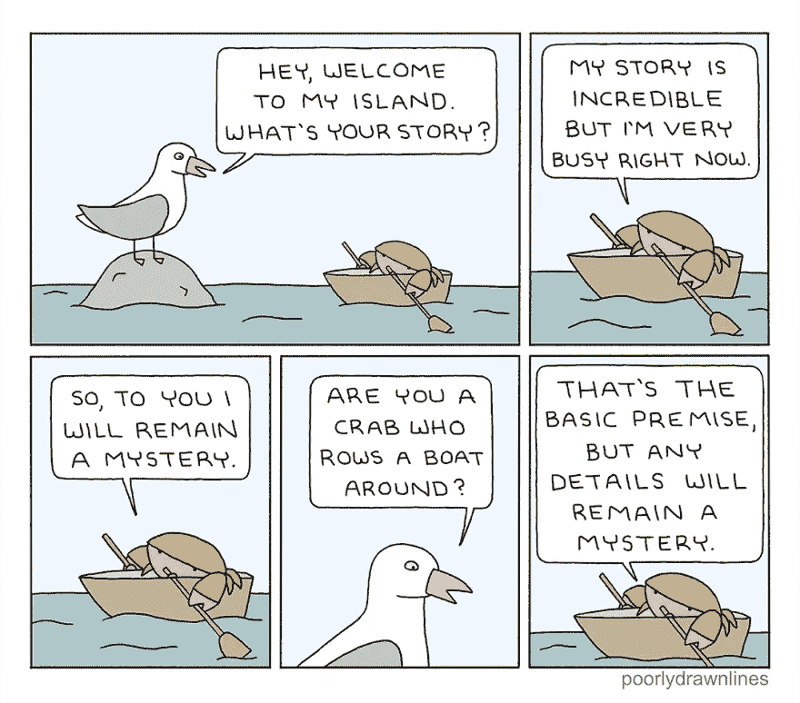

# 我在遗留代码库中学到的 8 件事

> 原文：<https://javascript.plainenglish.io/8-things-ive-learned-working-in-a-legacy-codebase-f92bd3892a92?source=collection_archive---------7----------------------->

我的第一份开发工作让我陷入了一个巨大的遗留代码库。我的最后一张大票涉及到让一个现代的库在它所使用的被否决的 UI 框架中工作。在那次旅行之后，我想分享一些我一路上学到的技巧。

# (1)通过修复 bug 来学习代码库。

理想情况下，你的公司会有很好的文档，但是遗留代码库通常是由离开的开发人员维护的。通读整个代码库来提高速度几乎是不可能的。我发现修复 bug 是了解你的应用程序的“个性”的一个很好的方式，同时也更熟悉它的工作流程。即使只是阅读待办事项清单也能让你了解公司的优先事项、缩写以及用户想要解决的问题。

# (2)教程和参考资料可能很难找到。

如果代码库中的任何包、库或工具已被弃用，情况尤其如此。熟悉您已安装的版本。在你的谷歌搜索中包含这个版本。即使你能找到教程，你的应用程序也可能是用不同的设计模式编写的。此外，许多教程表现得好像应用程序是围绕他们演示的工具构建的。让一些东西在一个成熟的、固执己见的应用程序中工作是一个全新的游戏。不要害怕尝试你想到的任何想法。

# (3)你会希望依靠对应用程序更有经验的人。

这不仅仅意味着其他开发人员。QA、数据科学和在应用上工作多年的项目经理会知道对你有很大帮助的事情。当我陷入寻找 bug 来源的困境时，我经常会问他们“是否有一个工作流会影响我所遗漏的东西？”有时候，知道一个特性是如何实现的会让你明白为什么一个 bug 现在才开始发生，才被报告，或者不是优先修复的。

# (4)在写一个全新的解决问题的方法之前，要经常检查是否有人已经解决了这个问题。

依靠以前编写的实用程序和代码。如果您没有添加新类型的数据，那么您试图实现的与数据库的交互可能已经存在。不要忘记看看你目前正在试图修复的工作流之外的工作流。以前的开发商只看他们的票不看你的。

# (5)尽量不要重复代码。

熟悉代码库的实用程序和导入方法，这样您就可以在代码库中的任何地方使用已经编写好的代码。无需增加复杂性或在多个地方进行更改。已经有很多开发人员的遗留代码库可能有不止一个这两种情况的例子。另外，他们可能知道你不知道的系统中的一个怪癖。

# (6)另一方面，大量的实用程序意味着大量的抽象。

Source: [http://www.poorlydrawnlines.com/comic/your-story/](http://www.poorlydrawnlines.com/comic/your-story/*)

依赖已建立的实用程序的函数从头到尾读起来会变得非常密集。只对实用程序的功能有高层次的理解是可以的。如果您需要在另一个地方实现它，或者在它内部发生了可怕的错误，那就是深入研究它如何工作的时候了。

# (7)如果你不知道如何改进，不要抱怨。

你不知道开发人员的时间限制，也不知道他们是否被告知去做他们个人不同意的事情。如果你已经有了答案，和你的团队讨论一下你是否可以花时间优先考虑这个问题。如果是一张小票或者你可以分解成小票的东西，你可以把那些激情项目作为完成那些真正挑战你或者根本没有挑战你的 bug 的奖励。

# (8)“我们来限定一下这个的范围。”是你的新座右铭。

您希望尽可能少地影响工作流。遗留代码库通常是相当稳定的，人们指望它能够工作。大刀阔斧的改革很诱人，但通常你的工作只是修补一些小漏洞。

*更多内容看*[***plain English . io***](http://plainenglish.io/)