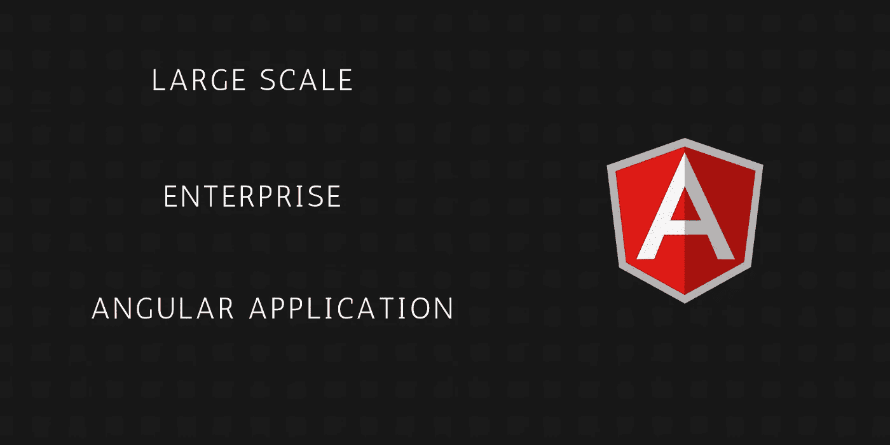

# 构建大规模企业应用程序之前，您需要学习的 8 件事

> 原文：<https://javascript.plainenglish.io/8-things-you-need-to-learn-before-building-large-scale-enterprise-angular-application-6f6b16f90a09?source=collection_archive---------4----------------------->

## 切换到 Angular 应用程序开发之前需要关注的主题



计划创建一个大型企业的 Angular 应用程序，那么本文将会对你很有帮助。我正在和安格尔分享我的个人经历。当我刚接触 Angular 时，我在设计**大型企业 Angular 应用程序**时遇到了哪些问题？我列出了 8 个主题，你必须注意之前，创建一个角度应用程序。

1.  用户界面框架
2.  惰性加载
3.  服务
4.  AuthGuard
5.  REST API 和认证(JWT)
6.  开源代码库
7.  部署
8.  页面刷新 404 错误

这些话题是我个人的观点。如果您遵循这一点，那么在开发大型企业 Angular 应用程序时，这将非常有用。

# **1 .界面框架**

企业应用程序开发的第一步是为项目选择正确的用户界面框架。为什么？因为不是所有的用户界面框架都没有你需要的所有**用户界面组件**。当我第一次接触 Angular(6 年前)时，我的团队选择了 **Angular Material UI** 框架。我们觉得这是最好的匹配，但没有评估我们需要的所有用户界面组件。为什么？因为客户的压力迫使我们不得不立即开始原型设计。

网格布局是我们在选择角度材质时遇到的第一个问题。Angular Material 具有一些网格布局特征，以支持**响应设计(flexbox 设计)**。然而，角度材料并不能提供更好的响应设计。因此，我们很难将其集成到 Angular 应用程序中。我们无法修复它。我们致力于设计网格布局。然后我们的团队找到了解决网格系统的方法。**物化 CSS** 是一个 UI 框架，我们之前在 JQuery 中使用过。因此，我们选择了实体化网格布局特性，并将其与现有的角度材质用户界面集成在一起。我们在开始项目时就面临这个问题，并找到了解决方案。所以对我们来说这不是一个大问题。

> *想想看，如果你在原型设计的中间/末端遇到了什么问题，如果你不能解决，你会怎么做？。*

所以根据我的经验，在做原型之前，请为你的角度项目选择正确的用户界面框架。这是一种最佳做法。

# **2 .惰性加载**

我的第一个企业角度应用是在航运业。这是一个大规模的应用。我刚刚学习了 Angular，以前，我使用 JQuery 开发网络应用程序。角度对我的团队来说也是很新的。我们为这个项目创建了数据建模，并选择了我们将在项目中使用的所有技术。然后我还创建了一个物理数据库。我们开始了 API 设计以及原型设计。

我们为应用程序设计了各种页面。UI 原型已经准备好，并提交给客户进行审批。我们当时创造了将近 200 个组件。后来增加的不止这些。我们开始了应用程序的开发。地方发展一切顺利。经过一个月的开发，我们决定通过将应用程序部署在云服务器上，向客户端显示应用程序的进度。我们选择 Linode 云托管平台。我们尝试生成分发/部署文件。然后我们面临第二个也是主要的问题。

> *生成生产文件时，超出了最大文件大小，并在本地机器上遇到内存问题。*

这将是在 Angular 中开发大型企业应用程序时需要考虑的非常重要的一点。为什么呢？因为 Angular 在一个请求中加载所有的页面(组件),并在我们点击它时显示相应的组件。一次加载 200 多个组件是一个耗时的过程，加载所有页面需要更多时间。最终用户(客户)永远不会接受这一点。当然，我们作为一个用户，从来不喜欢这种太多负载的应用程序。

> ***我们谷歌了一下，找到了解决的办法。那是懒惰的装载。***

是的，如果要在 Angular 应用程序中创建更多的组件，就必须实现延迟加载。请确保在创建 UI 原型本身时实现延迟加载。为什么？因为如果你计划在完成 UI 开发后实现延迟加载，那么移动所有的组件将会是一件非常繁忙的工作。

我写过一篇用 Angular 实现延迟加载的文章。它将帮助你在 Angular 中实现延迟加载。

[](https://medium.com/javascript-in-plain-english/how-lazy-loading-impacts-angular-app-performance-9c1ee0cb11ea) [## 惰性加载如何影响 Angular 应用性能

### 角形部件有什么问题？

medium.com](https://medium.com/javascript-in-plain-english/how-lazy-loading-impacts-angular-app-performance-9c1ee0cb11ea) 

# **3。服务**

在角度应用中，服务对于减少代码冗余非常重要。我们可以在这里创建一个可重用的函数。我们可以在应用程序的任何地方调用它。大多数 **HTTP** 请求调用将在服务部分创建。服务是一个不大的概念。它只是一个包含可重用函数和类的文件夹。

比方说，假设您从出生日期开始用两个不同的部分计算年龄。你会做什么？。您将在两个组件中创建相同的年龄计算函数。这将增加应用程序的大小，我们在这里没有使用**代码重用**的概念。这个问题可以通过使用服务来解决。

# **4。AuthGuard**

当我们在 Angular 中创建新页面时，任何人都可以访问它。为了防止页面被非法使用，我们需要在 Constructor 或 ngOnInit 中编写一个访问限制代码。然而，Angular 提供了一些奇妙的功能来解决这个问题。那叫**认证守卫。**

AuthGuard 只不过是一个具有生命周期功能的类，它将在定义路由本身时创建。它将在访问页面之前被调用。路线定义(routing.ts 文件)有一个 **canActivate** 属性。我们可以将 AuthGuard 类传递给 canActivate。canActivate 将在访问页面之前调用 AuthGuard 类。这就是 AuthGuard 概念在 Angular 中的工作方式。

# **5。REST API &认证(JWT)**

Angular 将只使用 REST API 从服务器获取数据。所以使用任何编程语言创建 REST API。不要忘记在每个授权请求中实现 **JWT** 。为什么？因为 REST API 是一个无状态协议。它不携带任何会话信息。

我写过一篇关于如何创建 REST API 以及如何使用 NodeJS 实现 JWT 的教程。

[](https://medium.com/javascript-in-plain-english/create-rest-api-using-nodejs-and-mysql-from-scratch-d1844601e21) [## 从头开始使用 NodeJS 和 MySQL 创建 REST API

### 从头开始使用 MySQL 的 CRUD 示例

medium.com](https://medium.com/javascript-in-plain-english/create-rest-api-using-nodejs-and-mysql-from-scratch-d1844601e21) [](https://medium.com/javascript-in-plain-english/implement-jwt-based-authorization-using-nodejs-and-angular-9f75ab5904ac) [## 使用 NodeJS 和 Angular 实现基于 JWT 的授权

### 如何使用 NodeJS，MySQL 创建 JWT 授权的完整示例，并使用 Angular

medium.com](https://medium.com/javascript-in-plain-english/implement-jwt-based-authorization-using-nodejs-and-angular-9f75ab5904ac) 

# **6。Github**

**Github** 用于存储你代码的版本(历史/变更)。您可以看到代码中所有更改的历史。每个开发人员必须对所有项目使用版本控制工具。这可能是一个小型或大型项目。请使用版本控制工具。它会帮你解决一个大问题。如果新代码出了问题，我们可以很容易地回滚到以前的代码。我们可以很容易地跟踪谁在何时修改了代码。

Git 是一个非常流行的版本控制工具。您可以使用市场上的其他工具。对 Angular 应用程序代码和 REST API 代码也使用 Git。甚至您可以使用 Jenkins 来自动化代码部署。

# **7。部署**

部署过程与传统的 web 部署略有不同。如果你用过 PHP，JSP，ASP，那么你会觉得这是一种有点不同的方法。对于传统的 web 开发，我们简单地将文件( **PHP，ASP，JSP** )移动到服务器。

但是在 Angular 中，我们必须使用下面的命令生成最终部署文件(dist 文件)。

```
ng build --prod
```

上面的命令将在你的项目的根文件夹中创建一个 **dist** 文件夹。我们必须将 dist 文件夹中的文件复制粘贴到云服务器上。

# **8。页面刷新 404 错误**

如果您对页面进行任何更改或者手动刷新页面，页面刷新将在您的本地开发中正常工作。但是当您在部署到云服务器之后刷新页面时，您肯定会看到一个 404 错误页面。为什么因为在本地开发中，所有的请求都会被转发到 index.html 文件。但是生成部署文件后，页面刷新不能转发到 index.html 文件。这是所有角度工程的通病。为了解决这个问题，我们需要包含**。htaccess** 文件将所有请求重定向到 index.html 文件。

只需按照下面的链接来创建 htaccess 文件。

[](https://github.com/mgechev/angular-seed/wiki/Deploying-prod-build-to-Apache-2) [## mge chev/角种子

### 所以您希望将您的生产构建部署到 Apache2 服务器上？你会注意到重新加载页面…

github.com](https://github.com/mgechev/angular-seed/wiki/Deploying-prod-build-to-Apache-2) 

# **结论**

在这篇文章中，我分享了我的经验，如果你正在开发一个企业大规模的 Angular 应用程序，你将面临什么问题？。对于用 Angular 开始应用开发之旅的新手来说会很有帮助。然而以上题目不仅适用于**的角度**，同样可以用于**的反应**和**的角度**也同样适用。因此，如果您正在转向 web 应用程序开发中的新技术，那么我的主题将非常有助于解决您未来面临的问题。

那都是男生。我希望你喜欢这篇文章。

敬请关注更多文章。

谢谢你。