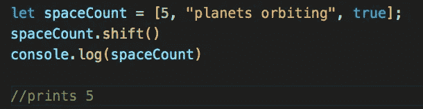

# JavaScript 中 8 个有用的数组方法

> 原文：<https://javascript.plainenglish.io/8-useful-array-methods-in-javascript-4c10b03ef0e7?source=collection_archive---------17----------------------->

*阵列方法统治世界。*

JavaScript 的一个重要概念是数组。数组帮助我们包含我们的数据，并允许我们在程序中做一些事情。它们有助于保持机器运转！我认为稍微谈一谈数组和指出每天都可以使用的数组方法可能会有帮助。现在来处理这些数组。

Photo by [Marvin Meyer](https://unsplash.com/@marvelous?utm_source=medium&utm_medium=referral) on [Unsplash](https://unsplash.com?utm_source=medium&utm_medium=referral)

# **什么是阵列？**

简单地说，在 JavaScript 中，数组是一个数据集，可以包含几个不同的值，比如数字、字符串或布尔值。

数组的语法如下所示:

# 数组方法

**。长度**如何求出一个数组的长度，我们可以用。长度法。

**。push()** 允许你在一个数组的末尾添加一个项目。

**。pop()** 允许你从数组末尾移除一个项目。

**。shift()** 允许你从一个数组的开头移除一个项目。(将返回被删除元素值)

**。unshift()** 允许你添加一个项目到一个数组的开头。

**。splice()** 允许您通过索引位置删除一个项目。

*语法为。splice()看起来是这样的:*

的例子。splice()正在运行。

**。slice()** 将原数组的一个浅层副本(一个切片)返回到一个从头到尾选中的新数组对象中。如果你不想改变你的原始数据，这是最好的选择。**

**。includes()** 确定数组是否包含括号内的值

# 访问数组索引

JavaScript 中的数组是零索引的，这意味着数组的第一个元素是[0]，最后一个元素等于数组的 length 属性的值-1。

# 结论

感谢您阅读我的博客，我希望它能成为一些使用数组的常用方法的快速参考指南。如需更多信息或帮助，请查看关于数组的 MDN 文档，以找到更多有用的数组方法！

*更多内容请看*[*plain English . io*](http://plainenglish.io/)