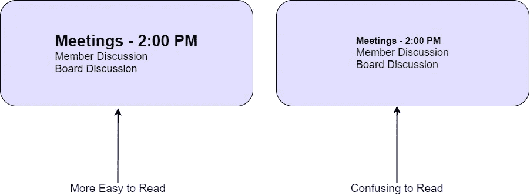
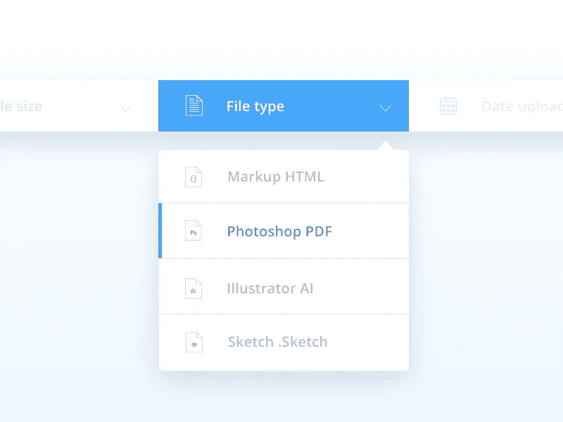
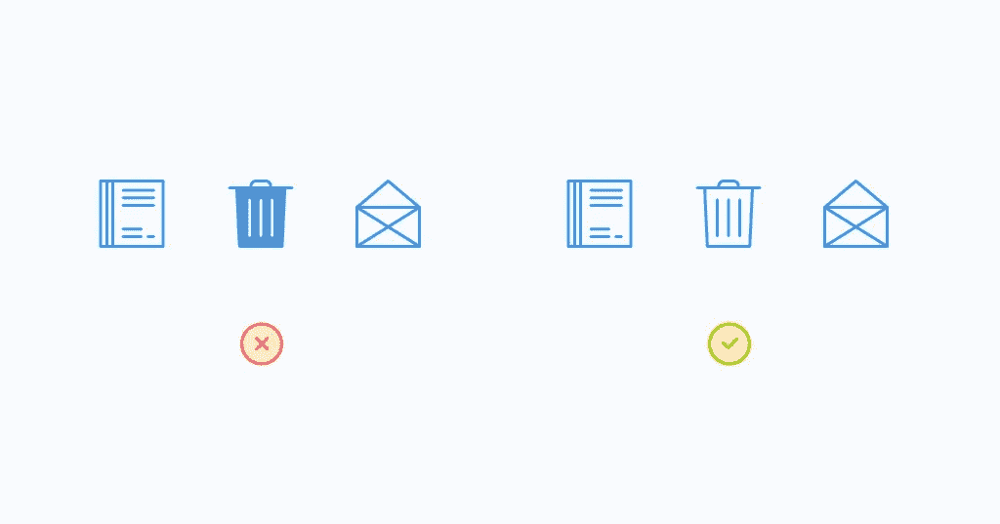

# 作为前端开发人员，你应该知道的 8 个 UX 原则

> 原文：<https://javascript.plainenglish.io/8-ux-principles-you-should-know-as-a-frontend-developer-9416a24294d2?source=collection_archive---------1----------------------->

## 用这 8 个技巧构建吸引人的前端应用程序

## 1.不要使用两种以上的字体

字体是设备上的文件，稍后用于呈现字样。开发人员有时会在他们的产品中添加太多的字体，最终导致压倒性的结果。你最多只能使用两种字体。一份用于*标题*和*标题*，另一份用于 ***正文*** 正文，即用户要阅读的内容。

然而，您可以在该字体系列中使用**粗细**和**斜体**来进一步定制您的风格，添加过多的字体会产生过多的视觉噪音**和增加他们理解面前视图的努力。**

***点记***

*   最多使用两种字体。
*   标题和**标题**使用一种字体，正文使用另一种字体。

## 2.使用系统原生字体

有时候，开发人员需要使用他们的*产品/品牌*字体，但是不同的字体需要花费更多时间加载到页面上，因为需要从服务器上下载并渲染，这导致了空白页面，直到所有内容都加载完毕。

这些字体必须从某个地方加载，无论是 **Google Fonts** 、 **Typekit、**还是你的 **CDN** ，这意味着将字体文件下载到用户的机器上存在障碍。此外，不同的设备会让你的页面看起来有些不同。这就是为什么建议使用系统原生字体，使页面看起来更快，字体看起来更清晰，阅读起来更有吸引力。

***点记***

*   使用用户已经安装的系统原生字体。
*   系统字体通常会比自定义字体呈现得更好。

## ***推荐系统字体堆栈***

*   苹果系统。
*   BlinkMacSystemFont。
*   无衬线。
*   没有氧气。
*   Helvetica·纽。
*   坎塔雷尔。

## 3.用字体大小描述信息层次

有时候，您希望在管理视图的同时保持事情的有效性，并使视图能够被广泛的用户立即理解。

***例如，*** 假设在你的应用程序中，一个弹出窗口提醒用户关于他们的会议，如果我们对所有内容使用相同的**字体大小**，当用户查看视图时，它会失去对用户最重要的层次。

***点记***

*   放大您希望用户首先观察到的信息。
*   使用至少两种但不超过三种字体大小。
*   找到字体大小之间的平衡，不要过度使用。

## 4.对正文使用默认尺寸

由于目前桌面上的大多数浏览器都允许用户放大和缩小字体，所以请记住使用应用程序首次打开时出现的默认字体大小，字体应该足够大以便于阅读，但不能太大，否则会占用视图太多空间。

***点记***

*   正文在 **16px** 中以 **1.5 行高**和*自动*或*默认*字符间距被认为对大多数用户是安全的。
*   不要禁用设备缩放功能。

## 5.使用下拉菜单

下拉菜单提供了一个扩展的选项范围，只有当你有很多真正的选项可以提供给用户时，才推荐使用它。否则不要使用用户需要点击才能打开的下拉菜单，滚动到正确的项目，然后选择。

特别是在移动设备上，这可能会导致非常令人沮丧的用户界面，因为这个过程在移动设备上由于小屏幕而变得更慢。

***点记***

*   提供在很长的下拉列表中搜索的能力。
*   下拉菜单会变得非常令人沮丧，所以只有在必要的时候才使用它们。

## 6.当内容有限时使用分页

这取决于你在视图上显示了多少内容，分页在有多个页面的情况下非常有用，用户可以决定他们想要浏览哪个页面。

***例如，*** 假设您的 web 应用程序包含提要内容，如果用户可以选择轻松浏览 **999** 页面，那么这与无限滚动相比要容易得多。

***点记***

*   为用户提供搜索、排序和过滤控制。
*   向用户显示当前页面，*范围内最高*和*最低*页面。

## 7.使用一致的图标

有时候，开发人员会对现有的多个图标集感到困惑，后来他们意识到，对于他们的产品，没有一个特定动作的图标。使用一致的图标非常重要，因为用户必须付出额外的努力来识别整个 UI。

***点记***

*   不要通过添加不同的图标来走捷径。
*   尝试建立一个连贯的图标风格。

## 8.使用面包屑导航

面包屑导航可能不会提供最吸引人的外观，但它是一个长期存在并经过测试的控件，用户会一次又一次地使用它。面包屑允许您的用户看到他们在系统中的位置，并返回到他们在层次结构中的前一个位置。

***点记***

*   使用面包屑导航来帮助你的用户理解你的产品。
*   面包屑被很多用户所理解。

 [## 作为开发人员，您应该知道的 11 个 VS 代码特性和技巧

### 对 VS 代码更加自信

javascript.plainenglish.io](/11-vs-code-features-tricks-you-should-know-as-a-developer-47e5ec0c362b)  [## 现代 CSS 开发人员路线图

### 掌握 CSS 的关键概念

javascript.plainenglish.io](/the-modern-css-developer-roadmap-1ea112451dde)  [## REST API 设计的 8 个最佳实践

### 构建更好的 REST APIs

javascript.plainenglish.io](/8-best-practices-for-rest-api-design-3fd1b837b283)  [## Web 应用程序的 6 种前端优化技术

### 构建极快的 Web 应用程序

javascript.plainenglish.io](/6-front-end-optimization-techniques-for-web-applications-6bcde2c42905) 

*更多内容看*[***plain English . io***](http://plainenglish.io)