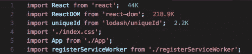
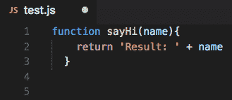
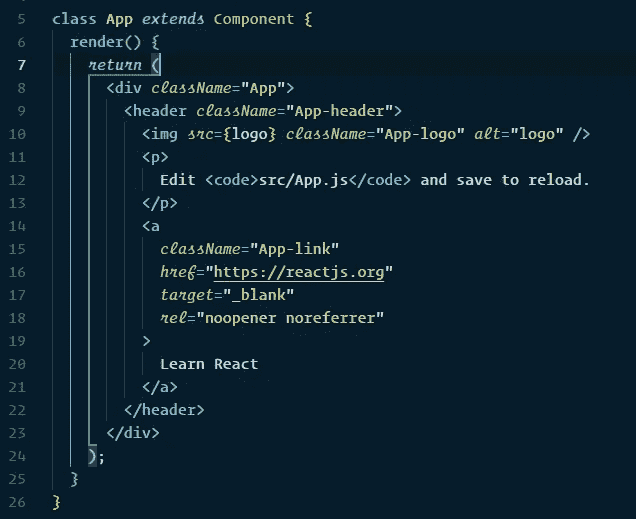
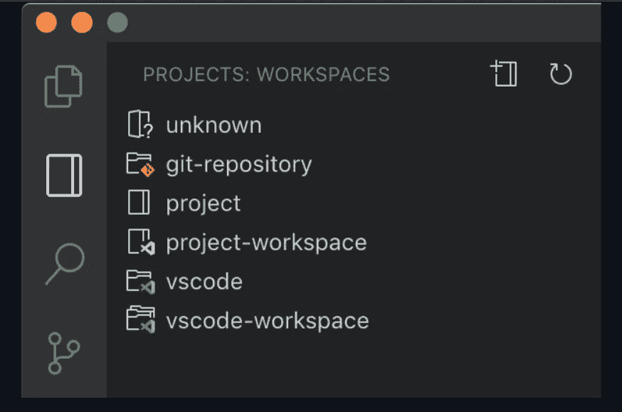
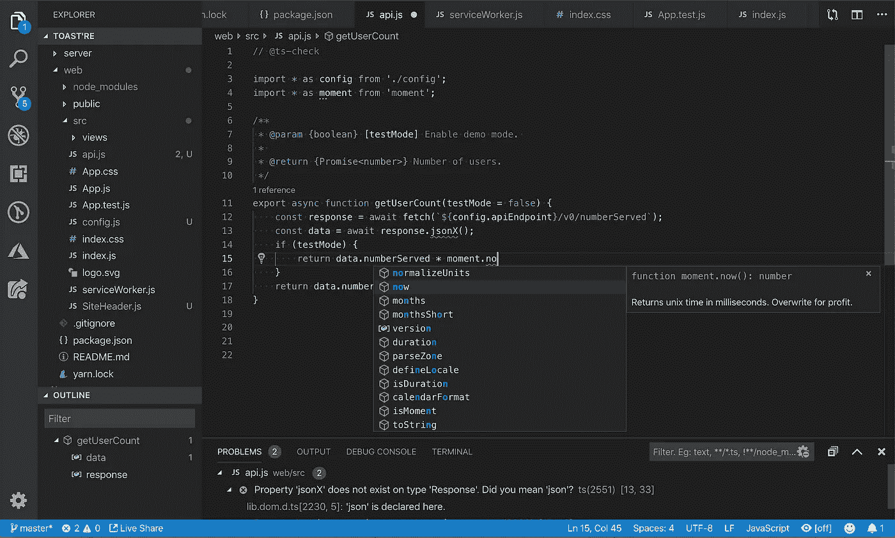

# 每个开发人员都必须拥有的 8 个 VSCode 扩展

> 原文：<https://javascript.plainenglish.io/8-vscode-extensions-every-developer-must-have-7fd6006480e3?source=collection_archive---------0----------------------->

## 更聪明地工作，而不是更努力。使用这些扩展使您的开发更加容易

Photo by [Oskar Yildiz](https://unsplash.com/@oskaryil?utm_source=unsplash&utm_medium=referral&utm_content=creditCopyText) on [Unsplash](https://unsplash.com/s/photos/code?utm_source=unsplash&utm_medium=referral&utm_content=creditCopyText)

VS 代码是最流行和最广泛使用的代码编辑器之一。与其他编辑器相比，它有很多免费的特性。您可以下载 VS 代码的扩展，它增加了另一个难以置信的特性。

我列出了一些我最喜欢的 VS 代码扩展，没有它们我无法生活。

请注意，这里不涉及排名。每个扩展本身都令人印象深刻。最后一个和第一个相等。

我相信你会带着一个新的扩展离开，这将使你的工作更容易。

# 1.涡轮控制台日志

Turbo 控制台日志是调试部分的杀手级扩展。这个扩展通过自动化编写有意义的日志消息的过程，使调试变得更加容易。

您可以通过两个步骤自动插入有意义日志消息:

*   选择作为调试主题的变量
*   按 ctrl + alt + L

# 2.进口成本

速度对你的网站至关重要。如果你的页面或 app 不能快速加载，就和没有页面一样。

这个扩展显示您的导入的大小。通过这种方式，您可以了解您将下载多少内容，并找出您的应用程序运行缓慢的原因。

有了这个扩展，您可以决定是应该编写一个函数还是导入整个包。

# 3.较美丽

这个扩展适用于所有人，不管你是用 python、JavaScript 还是其他语言编写代码。

顾名思义，它让你的代码更漂亮。

我不擅长给出相等的行、间距和制表符。因此，我的代码看起来就像一些面条。

有了更漂亮的，一按 command+S，你就体验到了神奇。你所有的代码都将得到正确的、等间距的、适当的行间距。你的代码看起来会很漂亮。

没人会知道你有多脏😐。

# 4.括号对着色机

在编辑 JavaScript 代码时，有多少次发现右括号有问题。用手指描摹开括号和闭括号是很痛苦的。别浪费时间了，用这个分机吧。

您的左括号和右括号颜色相同；这样更容易。

这个扩展对于那些使用过 python 的人来说是必备的，因为 python 不需要括号；这将有助于过渡。

# 5.实时分享

现场分享是一个奇妙的扩展。有了它，我可以和我的朋友、同事一起编写代码。

每当我遇到问题时，我可以让我的朋友过来帮我。

这个扩展的作用是它可以远程控制你的 VS 代码编辑器，打开的文件。有了它，另一个人可以修改我的代码并保存它——不再需要在电话里挣扎，或者等着见你的朋友来寻求帮助。

这样做的一个特点是，你可以实时编码。你知道谁在打字，他们输入的是什么。这使得编码就像我们都喜欢的信息传递一样。感谢 VS 代码和现场分享。此外，它还提供对本地主机(您的终端)的访问。

Live share 是 VS code 最好的特性之一，在我看来，也是我推荐给大家的原因。我还没见过像它这么好用，还能免费用的。令人震惊！

额外收获:您可以下载 live share audio 扩展，它为 live share 添加了音频通话功能。我喜欢这一点，尤其是在疫情，当一切都变得遥远。

# 6.项目

如果你同时处理几个项目，那么在文件夹之间切换是很困难的。您必须导航到所需的文件夹。如果你经常在这两者之间转换，那就是地狱。

我发现这个扩展的一个用途是它可以作为你最喜欢的标签。例如，有人可能将自定义 CSS 和 bootstrap 存储在一个文件夹中，并使用该扩展在两者之间快速导航。

# 7.设置同步

顾名思义，设置同步扩展将你所有的设置备份存储在 GitHub 中。这样，您的多个设备或新设备就可以有相同的设置。所做的任何更改都可以无缝同步。

它允许你将你在 VS 代码上定制的几乎所有东西同步到 Github，从设置到键盘快捷键到其他 VS 代码扩展。

# 8.JavaScript (ES6)代码片段

VS 代码带有内置的 JS IntelliSense，但 JS 代码片段通过添加预制的 JavaScript 片段(包含最常用的片段)进一步增强了这种体验。不再无休止地重复代码。

该扩展支持 JS、TypeScript、JS React、TS React、HTML 和 Vue。

我希望你喜欢阅读，我为你提供了价值。如果你发现我错过的扩展，并且你觉得它很神奇，在回复中提到它。

谢谢你🙌