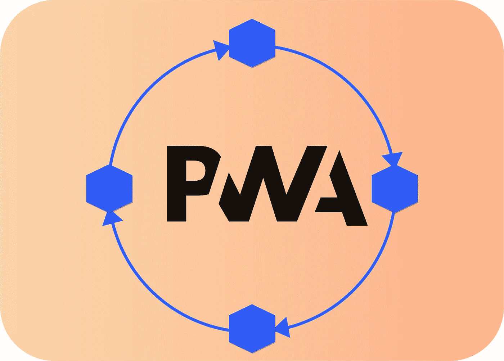
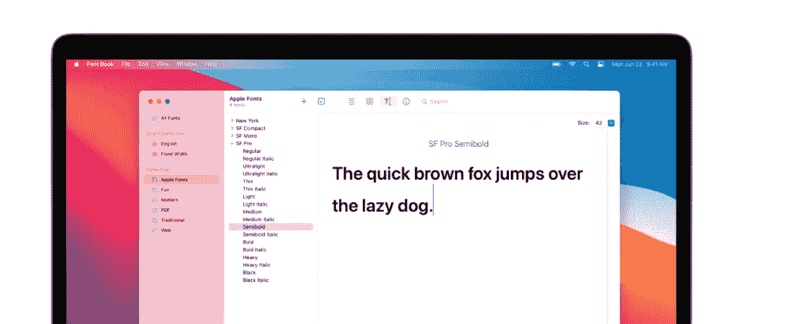
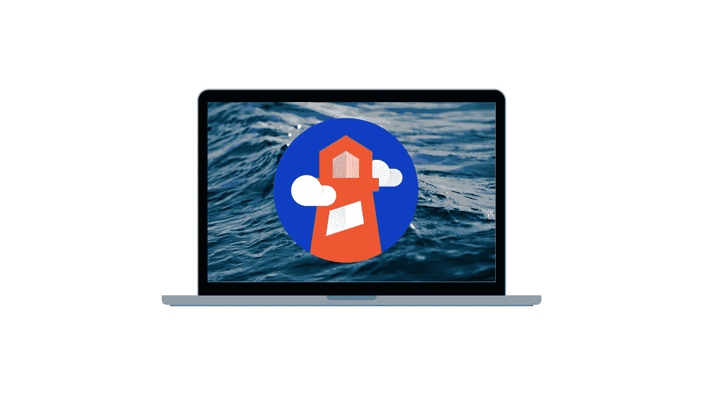

# 渐进式网络应用(PWAs)的 9 个最佳实践

> 原文：<https://javascript.plainenglish.io/9-best-practices-for-pwas-332be833f5fc?source=collection_archive---------12----------------------->

构建突出的 pwa

**渐进式网络应用***最近因其优势而受到欢迎，例如*快速、可靠、*和*吸引人、*同时确保理想的功能以及为手机用户和开发者提供的极大便利。它们对企业有着巨大的影响。例如，*引入 PWA 后，跳出率下降了 **40%** 。**

*****这里有 10 个最佳实践，每个人在开发 PWA 时都应该遵循*****

## ****1。优先考虑桌面&移动 PWA****

**最近，手机的使用已经超过了桌面，这就是为什么我们需要优先考虑 PWA，为桌面和移动设备提供用户友好的用户界面**和 **UX** 。****

*   ****桌面 PWAs 可以包含一些功能，如**网格**，一些可选的**间隔符**，或者以插图形式的*图形元素*。****
*   ****对于移动 PWA，可以选择最流行的功能添加，如**支付**或**收款**功能，并添加搜索过滤器。****

## ******2。平稳导航******

****从用户的角度来看，渐进式 Web 应用程序类似于移动电话应用程序，但从技术上来说，PWA 是一个网站&在开发 PWA 时，我们应该遵循与开发原生移动应用程序类似的方法。我们应该完全避免使用页脚，最好使用带有小图标的导航栏，以减少屏幕空间。****

*   ****简而言之，导航应该尽可能简单。****

## ******3。使用简单字体******

********

****当使用简单字体时，加载时间显著减少。在 PWA 中，选择字体应该尽可能简单，比如尽可能使用设备字体。****

*   ****默认字体是 Android 上的 **Roboto** 和 iOS 上的**旧金山**。****
*   ****避免使用自定义字体，因为它们会降低 PWA 的速度并分散注意力。****

## ******4。促进跨浏览器功能******

****拥有跨浏览器兼容性真的很有用，因为它确保在不中断用户体验的情况下为大量用户提供服务。PWA 严重依赖于现代浏览器，因此它可能无法很好地与旧版本如 *Internet Explorer* 一起工作，这就是为什么在每个浏览器上运行 PWA 很重要。****

## ******5。提供离线模式******

********

****一些用户有时可能会遇到互联网问题，在这种情况下，他们将无法使用 PWA &如果我们为用户提供我们的 PWA 离线模式，他们甚至可以在互联网连接不良的情况下轻松访问它的功能。在此期间，加载微调器可以替换为相关的东西，如游戏，这样当我们的内容需要时间加载时，用户可以玩游戏。****

## ******6。提供 PWA** 的易访问性****

****一个好的 PWA 应该既像浏览器一样易于访问，又有类似应用程序的界面。可访问性意味着所有用户都可以轻松使用，每个人都可以操作它。为了提高可访问性，网页可访问性倡议确定了一套网页内容可访问性准则(WCAG)。****

*****WCAG 有四大支柱:*****

*   ******可感知的******
*   ******可以理解的******
*   ******可操作******
*   ******健壮******

## ******7。负载性能增强******

****如果不改善应用程序的负载性能，就无法获得最佳体验。为了提高负载性能，我们有一个代表以下内容的 **PRPL** 模式。****

*   ******推送初始 URL 路由的关键**资源****
*   ******渲染**初始路线****
*   ******预缓存**剩余路线****
*   ******延迟加载**并按需创建剩余路线****

> ******PRPL** 优化移动设备上的最短交互时间，并确保最大的缓存效率。****

## ****8。用灯塔验证****

********

****Google 有一个开源的绩效管理工具叫做 **Lighthouse** 。Lighthouse 可以用来审计您的 web 应用程序或任何网页，并让它生成关于页面性能的报告。Lighthouse 用来判断你的 PWA 的标准包括 ***速度、设计、安全性、缓存、索引等*** 。此外，lighthouse 向我们提供了一份报告，陈述了需要改进的 PWA 领域。****

## ******9。避免滚动故障******

****在设计 PWA 的时候，有一点应该记住，用户不太喜欢滚动。当一个网站包含无限滚动或非常大的提要时，这会导致令人讨厌的滚动故障。在用户滚动时使用虚拟化列表有助于解决这个问题。不应提供水平滚动。然而，*骨架*滚动提供了无缝体验。****

**** [## 让你成为前端忍者的 6 个 UI 概念

### 构建具有出色 UI 的应用程序的基本概念

javascript.plainenglish.io](/6-ui-concepts-that-makes-you-a-frontend-ninja-c6c0a29fa954)  [## 作为前端开发人员，你应该知道的 3 个 CSS 特性

### 了解 CSS 鲜为人知的特性

javascript.plainenglish.io](/3-css-features-you-should-know-as-frontend-developer-f1b5536bf179)  [## 作为开发人员，您应该知道的 11 个 VS 代码特性和技巧

### 对 VS 代码更加自信

javascript.plainenglish.io](/11-vs-code-features-tricks-you-should-know-as-a-developer-47e5ec0c362b) 

*更多内容尽在*[*plain English . io*](http://plainenglish.io/)****