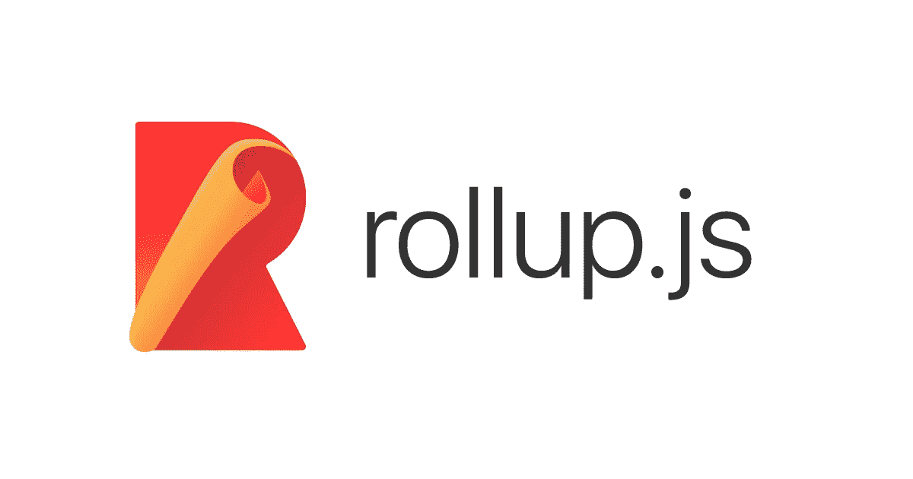
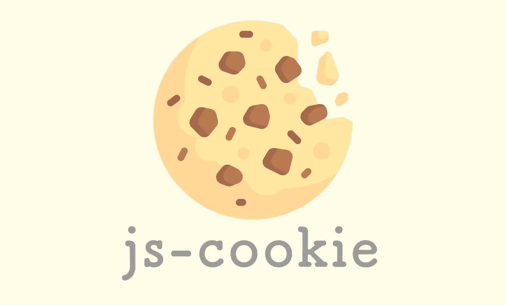

# 9 个最好的普通 JavaScript 实用程序库

> 原文：<https://javascript.plainenglish.io/9-best-vanilla-javascript-utilities-libraries-ff752592dfb5?source=collection_archive---------9----------------------->

用更少的时间构建您的 JavaScript 项目。

## 1.[柏树](https://github.com/cypress-io/cypress)

> 对浏览器中运行的任何东西进行快速可靠的测试。

*   **Cypress** 允许你创建可以与 ***交互的测试，点击按钮*** ， ***填写表格*** ，这个包很好的支持定期更新。
*   唯一的缺点是，你会发现 Cypress 的**学习曲线**要宽一些，因为它需要一些时间，这取决于你之前对测试 ***JavaScript*** 应用程序的了解。
*   另外，还有一个主要问题是，它目前不支持 **Safari** 。

## [2。汇总](https://github.com/rollup/rollup)

> 下一代 ES 模块捆扎机。

*   **Rollup** 是一个模块捆绑器，使用标准化的 es 模块格式进行代码，而不是以前的**CommonJS**&**AMD**等解决方案。
*   它可以轻松地优化 **ES** 模块，以便在现代浏览器中更快地进行本地加载，并放置一个遗留模块格式，允许 ***ES 模块工作流*。**
*   有了对**树抖动**的支持，它是一个很棒的模块捆绑器，虽然不像**包**或 **Webpack** 那样出名，但它仍在随着响应更新而增长。

## [3。day.js](https://github.com/iamkun/dayjs)

> 2KB 不可变的日期和时间库。

*   在 **JavaScript** 中，你最有可能用日期&时间库来构建应用，而 **days.js** 是 **Moment.js** 的绝佳替代品。因为它要轻得多，并且具有相同的 API。
*   文档也很棒，新开发人员可以在更短的时间内轻松适应 **day.js** 。

## [4。immer](https://github.com/immerjs/immer)

> 通过改变当前状态来创建下一个不可变状态。

*   非常轻量级的包 **(5KB)** 有助于处理 ***React*** 应用程序中的不可变状态，我们只需在不干扰原始状态的情况下对虚拟状态进行更改，在此之后，一旦所有的更改完成，它就会进入下一个状态。
*   它有很少的样板代码，所以你的代码看起来更干净，结构更简洁。

## [5。jsdoc](https://github.com/jsdoc/jsdoc)

> JavaScript 的 API 文档生成器。

*   如果你需要记录你的个人功能，那么 **jsdoc** 是一个很好的工具。产生的文件是非常基本的，并且服务于文档的目的，你可以在很短的时间内拥有你自己的函数文档。
*   文档也很棒，对于新开发人员来说很容易使用，并且在开始使用 **jsdoc** 时不需要太多经验。
*   特别是如果你在一个团队中工作，它会提高你的工作流程的整体生产力，因为你有你的功能的定义。

## [6。拉姆达](https://github.com/ramda/ramda)

> 实用的函数式 JavaScript。

*   **Ramda** 强调更纯粹的函数风格， ***不变性*** ， ***副作用-*** 自由函数是其设计哲学的核心，帮助你用简单优雅的代码完成工作。
*   这些函数是自动生成的，这允许您通过不提供最终参数来从旧函数构建新函数。
*   唯一的缺点是它会很快变得不可读，所以建议避免链接太多的函数。

## [7。p 极限](https://github.com/sindresorhus/p-limit)

> 以有限的并发性运行多个承诺返回&异步函数。

*   如果您想限制 JavaScript 中的承诺或同时阻止来自服务器的所有请求调用，那么这个包就是为您准备的。

## 8。秋田

> 为 JavaScript 应用程序量身定制的状态管理。

*   在开始之前，你所需要知道的是 **RxJS** 样式观察值以及基本的**类型脚本**语法。
*   如果您正在使用角度应用程序，建议使用 Akita，因为它比 **ngrx** 和 **ngxs** 更容易使用。

## [9。js-cookie](https://github.com/js-cookie/js-cookie)

> 用于处理浏览器 cookies 的轻量级 JavaScript API。

*   这个库使得代码更加干净和可用。当使用 cookie 时，你可以使用一个简单的 API 来管理 cookie，它包含了开发者需要的一切。

 [## 现代 CSS 开发人员路线图

### 掌握 CSS 的关键概念

javascript.plainenglish.io](/the-modern-css-developer-roadmap-1ea112451dde) 

*更多内容请看*[*plain English . io*](http://plainenglish.io/)