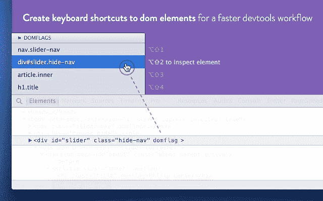
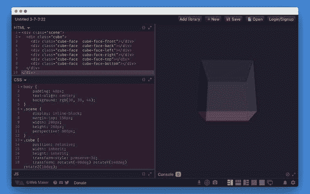
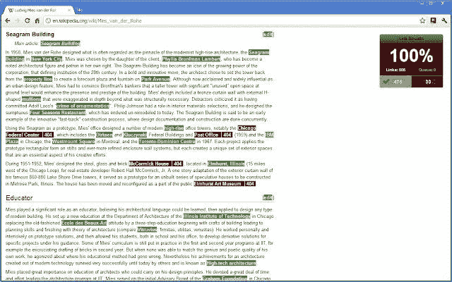
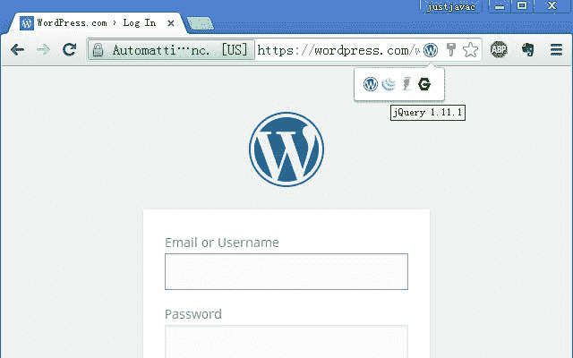
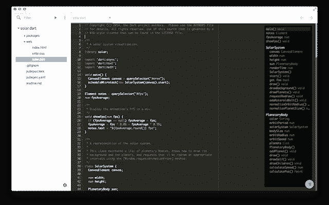
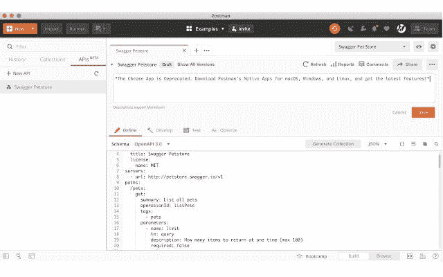
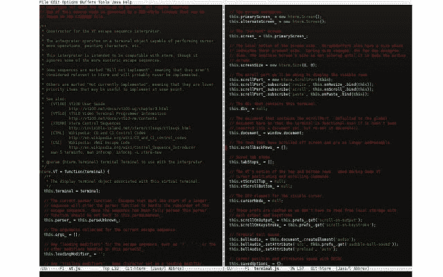

# 9 个浏览器工具，让你的开发者生活更轻松

> 原文：<https://javascript.plainenglish.io/9-browser-tools-that-will-make-your-life-as-a-developer-easier-c38ff75ba02a?source=collection_archive---------2----------------------->

## 惊人的开发工具，帮助您更聪明地工作，而不是更努力

Image Source: [https://chrome.google.com/webstore/detail/domflags/nindoglnpjcjoaheijieagogboabafkc](https://chrome.google.com/webstore/detail/domflags/nindoglnpjcjoaheijieagogboabafkc)

作为一名 web 开发人员，我可以说工具让我的生活变得简单多了。有一个工具可以帮我自动填充表格，一个工具可以帮我检查我正在处理的页面上是否有断开的链接，甚至可以帮助选择颜色组合。

你可能知道很多 Chrome 扩展工具，这些工具让你的开发者生活变得更容易，但是我向你保证，仍然有更好的工具可以变得更加高效。

在这篇文章中，我收集了我最喜欢的 10 个，排名不分先后。我们去那里吧！

# **1。WebMaker**

Image source: [https://chrome.google.com/webstore/detail/web-maker/lkfkkhfhhdkiemehlpkgjeojomhpccnh?hl=en](https://chrome.google.com/webstore/detail/web-maker/lkfkkhfhhdkiemehlpkgjeojomhpccnh?hl=en)

WebMaker 就像你在浏览器中直接安装了 Codepen 一样，并且有离线支持。它允许您用 HTML、CSS 和 JavaScript 创建小项目和测试，并实时查看它们如何响应变化。

您可以添加对最常用库的引用，以便在项目中使用。它还支持 Markdown、Jade、SCSS (Sass)、LESS、JSX、CoffeeScript、TypeScript，所有这些都不需要连接到互联网。

学习和实践，快速构建一些实用工具的原型，或者在将它转移到 Codepen 之前平静地在您的团队中工作，这是非常有用的，顺便说一下，您可以通过单击将项目导出到 Codepen 网站。

它在屏幕上提供了几个元素的布局，你可以将项目保存在本地，稍后再打开它们，并对你创建的内容进行截图。

而且是完全免费的。

[**试试吧**](https://chrome.google.com/webstore/detail/web-maker/lkfkkhfhhdkiemehlpkgjeojomhpccnh?hl=en)

# **2。饼干**

通过 Chrome 开发者工具，我们有可能检查每个网站的所有 cookies，但我们无法管理它们。在这里，我们可以一起看到它们，按域过滤，甚至删除它们。但在这两种情况下，我们对它们的控制都很少，其中一个原因是谷歌对我们拥有它们不太感兴趣，因为它靠通过它们控制我们来生存。

> *chrome://settings/siteData？搜索=cookies*

这个扩展允许我们看到我们计算机上的所有 cookies，能够编辑、删除它们，甚至创建新的，获得对“cookies”的完全控制。

另一个有趣的特性是能够在加密和密钥保护的存储中保存 cookies 集，以便我们可以在需要时恢复它们。

# **3。检查我的链接**

Image source: [https://chrome.google.com/webstore/detail/check-my-links/ojkcdipcgfaekbeaelaapakgnjflfglf?hl=en](https://chrome.google.com/webstore/detail/check-my-links/ojkcdipcgfaekbeaelaapakgnjflfglf?hl=en)

这个扩展的目标非常简单:跟踪某个页面上的所有链接，检查它们是否正确。当您检查它们时，指示检查状态的图表会更新，最后，您将确切地知道有多少链接，多少是有效的，多少是断开的，以及哪些是断开的。

如果你制作网站，它应该是你的必备品，但它实际上可以用于许多其他情况。

[**试试吧。**](https://chrome.google.com/webstore/detail/check-my-links/ojkcdipcgfaekbeaelaapakgnjflfglf?hl=en)

# **4。DOMFlags**

Image Source: [https://chrome.google.com/webstore/detail/domflags/nindoglnpjcjoaheijieagogboabafkc](https://chrome.google.com/webstore/detail/domflags/nindoglnpjcjoaheijieagogboabafkc)

这个需要一点时间来掌握它的窍门，但是当你找到它时，你就离不开它了。

DOMFlags 允许您在页面元素中创建“收藏夹”，然后通过热键组合从一个页面跳转到另一个页面。用 DOMFlags 属性标记一个元素就足够了，这样它就成为该页面的“书签”列表的一部分。

该属性可以在开发人员工具中动态设置，可以手动设置，也可以使用特定的按钮为每个元素提供工具(或 ALT+MAYs+D 组合)。或者你可以直接把它放在你的源代码中，在你做调整的时候使它们永久化。

[**试试看。**](https://chrome.google.com/webstore/detail/domflags/nindoglnpjcjoaheijieagogboabafkc)

# **5。库嗅探器**

Image Source: [https://chrome.google.com/webstore/detail/library-sniffer/fhhdlnnepfjhlhilgmeepgkhjmhhhjkh?hl=en](https://chrome.google.com/webstore/detail/library-sniffer/fhhdlnnepfjhlhilgmeepgkhjmhhhjkh?hl=en)

虽然一个有经验的开发人员可以快速分析一个站点的代码和请求头，以非常准确地知道它使用了什么技术，但完成它总是一个好主意。

这正是这个扩展所做的——它在浏览器栏上放置了一个放大镜，每次你进入一个网站，它都会告诉你它在客户端和服务器端都使用了哪些技术。

[**试试看。**](https://chrome.google.com/webstore/detail/library-sniffer/fhhdlnnepfjhlhilgmeepgkhjmhhhjkh?hl=en)

# **6。ChromeDev 编辑器**

Image Source: Google.com

它是一个很好的代码编辑器，可以直接在浏览器中运行，由 Google 创建。虽然它的主要目的是用来开发 Chrome 的扩展，但事实是它通常可以很好地用于任何前端 web 开发，因为它支持 JavaScript 和 HTML 代码的着色、聚合模板，甚至支持与 Git 集成以控制源代码。

它提供了大量的“皮肤”来显示不同颜色的用户界面，并允许您更改热键以匹配 Vim 或 Emacs 的热键。

它不会取代你常用的编辑器，但在紧急情况下可以派上用场。它也可以离线工作，因此可以在没有覆盖的地方使用。如果你有 Chrome Book，你绝对应该安装它。

# **7。**又一个 REST 客户端

Image Source: [https://chrome.google.com/webstore/detail/yet-another-rest-client/ehafadccdcdedbhcbddihehiodgcddpl?hl=en](https://chrome.google.com/webstore/detail/yet-another-rest-client/ehafadccdcdedbhcbddihehiodgcddpl?hl=en)

这个应用程序允许轻松测试和解析 REST web 服务。它允许您轻松地测试任何方法，分析和操作响应，保存历史，创建调用集合。它有一个用于团队合作和文档改进的付费版本，但如果你是个人开发者，你可以使用免费版本。

[**试试吧。**](https://chrome.google.com/webstore/detail/yet-another-rest-client/ehafadccdcdedbhcbddihehiodgcddpl?hl=en)

# **8。SecureShell —** 终端模拟器以及 SSH 和 SFTP 客户端

Image Source: [https://chrome.google.com/webstore/detail/secure-shell/iodihamcpbpeioajjeobimgagajmlibd?hl=en](https://chrome.google.com/webstore/detail/secure-shell/iodihamcpbpeioajjeobimgagajmlibd?hl=en)

终端在 Chrome 中直接与 XTerm 兼容。您可以将它用作 SSH 客户机或终端仿真，这样您就可以连接到托管您的站点的 Linux 服务器，并在不离开浏览器的情况下管理它。

[**试试看。**](https://chrome.google.com/webstore/detail/secure-shell/iodihamcpbpeioajjeobimgagajmlibd?hl=en)

# **9。假填充物**

Image Source: [https://chrome.google.com/webstore/detail/fake-filler/bnjjngeaknajbdcgpfkgnonkmififhfo?hl=en](https://chrome.google.com/webstore/detail/fake-filler/bnjjngeaknajbdcgpfkgnonkmififhfo?hl=en)

这个有趣的扩展帮助你测试你的 web 应用程序的表单，用虚拟的数据自动填充它们，但是根据数据的类型有意义。为此，它根据字段名或其类型与某些类型的信息进行匹配。

[**试试看。**](https://chrome.google.com/webstore/detail/fake-filler/bnjjngeaknajbdcgpfkgnonkmififhfo?hl=en)

## 面向开发人员的更多工具:

 [## 23 个工具让你的开发者生活变得更加轻松

### 试试这些工具。

javascript.plainenglish.io](/want-to-make-your-life-as-a-developer-a-lot-easier-use-these-tools-bf7796c2e12c)  [## 让你成为高效开发者的 9 个工具

### 没有代码错误的风险。

javascript.plainenglish.io](/9-tools-that-will-make-you-a-productive-and-effective-developer-8affc4a6d2a4) 

*更多内容请看*[***plain English . io***](http://plainenglish.io)