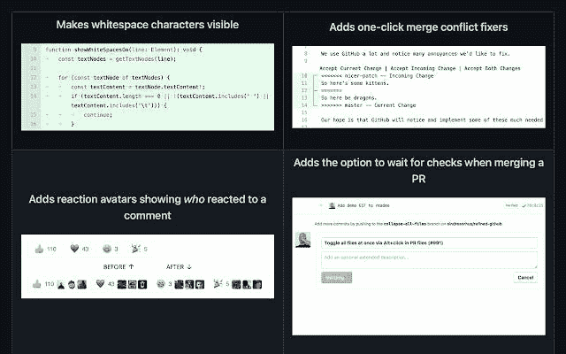

# 9+ Chrome 扩展我希望我能早点知道

> 原文：<https://javascript.plainenglish.io/9-chrome-extensions-i-wish-i-knew-earlier-a42ec954ac9e?source=collection_archive---------2----------------------->

## 大多数人不知道这些方便的扩展。

Photo by [Jeremy Bezanger](https://unsplash.com/@jeremybezanger?utm_source=medium&utm_medium=referral) on [Unsplash](https://unsplash.com?utm_source=medium&utm_medium=referral)

我在 2017 年底开始编程，多年来，我收集了一些工具和扩展，这些工具和扩展简化了我的编码之旅。

然而，我发现我最常用和最有用的扩展是我在过去几个月中发现的。

这些扩展为我节省了大量时间，并简化了我们这些 web 开发人员执行的各种日常任务。

这些扩展也可以在 Edge 浏览器中使用。

以下是你应该研究的 11 个 Chrome 扩展:

## #1.[浏览器堆栈](https://chrome.google.com/webstore/detail/browserstack/nkihdmlheodkdfojglpcjjmioefjahjb?hl=en)

[Source](https://chrome.google.com/webstore/detail/browserstack/nkihdmlheodkdfojglpcjjmioefjahjb?hl=en).

有没有用 JS 或 CSS 编写过代码，并对浏览器的兼容性感到疑惑？BrowserStack 通过允许您在多种设备和浏览器组合上测试代码来帮助您回答这个问题。

对于网络开发者来说，BrowserStack 是最令人惊叹的 Chrome 扩展之一。

在一个实例中，您可以设置多达 12 个浏览器并在它们之间切换。您还可以选择各种设备。

这个扩展使得跨浏览器测试变得轻而易举。

## #2. [Githunt](https://chrome.google.com/webstore/detail/githunt/khpcnaokfebphakjgdgpinmglconplhp?hl=en)

[Source](https://chrome.google.com/webstore/detail/githunt/khpcnaokfebphakjgdgpinmglconplhp?hl=en).

Chrome 的新标签非常简单明了，但是通过这个扩展，你可以把它变成一个有趋势 GitHub 库的空间。

它允许您跳过手动查找激动人心的热门项目的过程，并将它们直接放入您的新选项卡屏幕。

此外，您可以轻松选择您感兴趣的主题，并在新标签中获取相关项目。

您甚至可以按时间段进行过滤(*每周、每月或每年*)。

## #3.[假填充物](https://chrome.google.com/webstore/detail/fake-filler/bnjjngeaknajbdcgpfkgnonkmififhfo?hl=en)

[Source](https://chrome.google.com/webstore/detail/fake-filler/bnjjngeaknajbdcgpfkgnonkmififhfo?hl=en).

填表对我来说一直很可怕，尤其是对于那些我只是为了好玩而尝试的随机服务。

F ake Filler，顾名思义，用假的/虚拟的数据填充所有的输入&表单，比如随机的名字、电子邮件和电话号码。

此外，它忽略任何验证码或隐藏的输入。

它不仅对您在互联网上遇到的随机表单有用，而且在测试和处理表单时也很有用。

你可以很容易地输入随机数据和测试数据库，验证和其他类似的操作，而不是手动填写表格。

## #4.[关注待办事项:番茄定时器&待办事项列表](https://chrome.google.com/webstore/detail/focus-to-do-pomodoro-time/ngceodoilcgpmkijopinlkmohnfifjfb?hl=en)

[Source](https://chrome.google.com/webstore/detail/focus-to-do-pomodoro-time/ngceodoilcgpmkijopinlkmohnfifjfb?hl=en).

虽然这个扩展不是开发特有的，但是拥有一个 Pomodoro 计时器总是一项资产。

这个扩展帮助我管理分心的事物&通过使用番茄工作法改善我的计划。

如果你不熟悉这个技巧，它本质上是一个时间管理技巧。这种技术的基础是将工作负载分成高度集中的块。

例如，你可以开始做一件事 25 分钟，然后休息 5 分钟。你可以用这 5 分钟来解决前 25 分钟出现的任何分心的事情。

这个扩展还提供了很多 fo 可定制性，提供了各种警报声音、子任务以及通过设置截止日期来区分任务优先级的能力。

## #5.[站点调色板](https://chrome.google.com/webstore/detail/site-palette/pekhihjiehdafocefoimckjpbkegknoh?hl=en)

[Source](https://www.youtube.com/watch?v=NZKD3mk57bE&ab_channel=Sliday).

站点调色板是一个神奇的工具，尤其是对于 UI/UX 设计师和前端开发人员。

只需点击几下，你就可以得到你所访问的任何网站的调色板。

此外，还支持多种调色板。

Adobe Swatch、Google Arts & Culture 以及 Sketch 都得到支持，可以完美地工作。

你甚至可以在[酷派](http://coolors.co)定制和玩调色板。

生成的调色板也可以保存为 pdf。

## #6.[每日发展](https://chrome.google.com/webstore/detail/dailydev-the-homepage-dev/jlmpjdjjbgclbocgajdjefcidcncaied?hl=en)

[Source](https://chrome.google.com/webstore/detail/dailydev-the-homepage-dev/jlmpjdjjbgclbocgajdjefcidcncaied?hl=en).

我喜欢阅读博客，但是从不同平台上更新博客一直是一个挑战。

这个扩展把你的新标签屏幕转换成一个你可以个性化的博客集合。你可以获得多个提要，通过标签搜索文章的能力，以及黑暗主题支持。

几周前我安装了这个扩展，从那以后我一直在使用它。

我喜欢的另一个有用的特性是，它允许我轻松地访问我最常访问的站点，以及根据来源过滤博客的能力。

## [#7。精制 Github](https://chrome.google.com/webstore/detail/refined-github/hlepfoohegkhhmjieoechaddaejaokhf?hl=en)

[Source](https://chrome.google.com/webstore/detail/refined-github/hlepfoohegkhhmjieoechaddaejaokhf?hl=en).

对于刚接触 GitHub 的人，甚至日常使用 Github 的有经验的人来说, [Refined Github](https://chrome.google.com/webstore/detail/refined-github/hlepfoohegkhhmjieoechaddaejaokhf?hl=en) 可以成为救命的扩展。

它极大地简化了 GitHub，同时还增加了大量有用的功能。

除了未解决的评论之外，隐藏所有评论的能力只是这个扩展提供的许多非常有用的特性之一。

您可以直接从分支列表中克隆一个分支，有一个预览 HTML 文件的链接，以及下载整个文件夹。

从代码到写评论到文件管理，这个扩展一定会提升你的 GitHub 体验。

你可以在他们的 GitHub 页面上找到功能列表。

## #8. [Amino: Live CSS 编辑器](https://chrome.google.com/webstore/detail/amino-live-css-editor/pbcpfbcibpcbfbmddogfhcijfpboeaaf?hl=en)

[Source](https://chrome.google.com/webstore/detail/amino-live-css-editor/pbcpfbcibpcbfbmddogfhcijfpboeaaf?hl=en).

正如这个扩展的名字所暗示的，它允许你编辑任何网站的 CSS，并实时看到变化。

然而，与许多其他实时 CSS 编辑器不同，这个编辑器提供了许多相关的功能，如云存储以保存您的自定义 CSS，Sass 支持，以及代码格式和颜色选择器。

还提供了自动完成/智能感知支持。

您可以通过[官方网站](http://aminoeditor.com)访问和管理您的自定义 CSS。

此外，您还可以获得现成的 DevTools 集成。

如果你有兴趣了解 DevTools 的一些很酷的特性，你可以查看我的博客。

## #9.[在 VSCode 中打开](https://chrome.google.com/webstore/detail/open-in-vscode/pfakkjlkpobjeghlgipljkjmbgcanpji?hl=en)

[Source](https://chrome.google.com/webstore/detail/open-in-vscode/pfakkjlkpobjeghlgipljkjmbgcanpji?hl=en).

VSCode 中的 Open 是一个简单却非常有用的工具。

它允许你在 VS 代码中打开 GitHub 和 GitLab 链接。

Settings of Open in VSCode extension.

但是，您必须在使用之前进行配置，提供本地保存存储库的文件夹的基本路径。

如果你习惯于 VS 代码，并且总是喜欢它而不是标准的 GitHub 接口， ***有一个小技巧你可以做，只需要几秒钟*** 。

每当你在 VS 代码界面中找到一个你想要读取的 GitHub 库，只要把' github.com '改成' github *1s* 。' com '。

例如，如果你有一个网址为“www.github.com/repo”的资源库，那么只需将其更改为“'www.github1s.com/repo'”。

## #10.[运行什么](https://chrome.google.com/webstore/detail/whatruns/cmkdbmfndkfgebldhnkbfhlneefdaaip)

[Source](https://chrome.google.com/webstore/detail/whatruns/cmkdbmfndkfgebldhnkbfhlneefdaaip).

曾经访问过一个网站，想知道它的技术栈是什么？

由于每个技术栈都会在使用它的网站上留下一个模式，这些模式可以揭示所使用的框架和技术栈。

WhatRuns 是 Chrome 的一个扩展，它试图通过识别这些模式来回答这个问题。

它不仅揭示了框架，还揭示了字体、分析工具、字体以及活跃的 WordPress 插件。

我以前用过 Ghostery 和 Wappalyzer，但根据我的经验，WhatRuns 是识别技术堆栈的最佳扩展，因为它在浏览器上更轻便，还可以检测一些最新的框架和插件。

## #11.[twe MEX:Twitter 侧边栏](https://chrome.google.com/webstore/detail/twemex-sidebar-for-twitte/amoldiondpmjdnllknhklocndiibkcoe?hl=en)

[Source](https://chrome.google.com/webstore/detail/twemex-sidebar-for-twitte/amoldiondpmjdnllknhklocndiibkcoe?hl=en).

这个扩展与 web 开发无关，但是它极大地帮助了我节省时间。

我在 Twitter 上关注技术社区并与之互动，这个扩展帮助我减少噪音，阅读我想要的任何个人资料中的热门推文。

查看推文时，您也可以立即看到报价推文。

这个扩展还用一个更强大的搜索栏代替了股票搜索栏。

## 最后的想法…

每个人都偶尔通过浏览器访问互联网，但是程序员经常需要更频繁地访问互联网，通常是为了各种目的，而不仅仅是为了访问几个网站。

浏览器扩展帮助我们将独特和相关的功能直接添加到我们的网络浏览器中，Google Chrome 的网络商店拥有这些扩展的奇妙集合。

我在上面分享的许多扩展都是初学者友好的，我希望我能早点发现它们，因为这会节省我大量的时间和工作。

如果你喜欢读这篇文章，考虑使用[我的推荐链接](https://medium.com/@anuragkanoria/membership)，这样你就可以通过点击[这里](https://medium.com/@anuragkanoria/membership)无限制地访问我的博客以及其他作者的博客。

*更多内容请看*[***plain English . io***](http://plainenglish.io/)