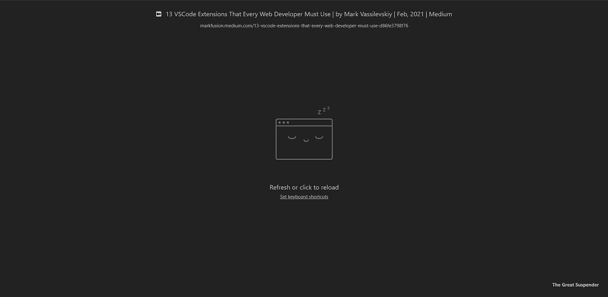

# 每个网络开发者都应该尝试的 9 个 Chrome 扩展

> 原文：<https://javascript.plainenglish.io/9-chrome-extensions-that-every-web-developer-should-try-42bf3aafc4bd?source=collection_archive---------11----------------------->

## 最佳 Chrome 扩展

## 这些扩展是最常见和最有用的

Photo by [Burst](https://unsplash.com/@burst?utm_source=unsplash&utm_medium=referral&utm_content=creditCopyText) on [Unsplash](https://unsplash.com/?utm_source=unsplash&utm_medium=referral&utm_content=creditCopyText)

Chrome 是我们世界上最著名的浏览器，当然，它有许多扩展，你可以很容易地下载到你的浏览器中使用。其中一些只是为了你更好的工作效率和更好的使用你的浏览器，还有一些对于每一个 web 开发者来说都是非常有用的，因为它们有惊人的功能，可以将 web 布局过程简化一百倍。我试图在无数的扩展中找到最好的，并展示这 8 个

# [1。什么字体](https://chrome.google.com/webstore/detail/whatfont/jabopobgcpjmedljpbcaablpmlmfcogm)

在网站上找字体最简单的方法就是 [***WhatFont***](https://chrome.google.com/webstore/detail/whatfont/jabopobgcpjmedljpbcaablpmlmfcogm) 。你需要做的一切就是点击字体扩展图标，并开始在整个网站上移动光标，当你将鼠标悬停在文本上时，他会显示这是什么字体

# [2。ColorZilla](https://chrome.google.com/webstore/detail/colorzilla/bhlhnicpbhignbdhedgjhgdocnmhomnp)

最流行的 Chrome 之一，Firefox 扩展是[***ColorZilla***](https://chrome.google.com/webstore/detail/colorzilla/bhlhnicpbhignbdhedgjhgdocnmhomnp)*，它用来从网页中选择颜色。它实际上与早期的扩展具有相同的机制，单击 ColorZilla 扩展按钮，然后选择“从页面中选择颜色”,并瞄准您想要复制的颜色。它快速、简单、高效*

**

# *[3。窗口大小调节器](https://chrome.google.com/webstore/detail/window-resizer/kkelicaakdanhinjdeammmilcgefonfh)*

*为了取悦所有用户，你应该做一个无论大小在所有屏幕上都好看的网站*

*[***Window Resizer***](https://chrome.google.com/webstore/detail/window-resizer/kkelicaakdanhinjdeammmilcgefonfh)正如你可能已经注意到的，它是一个扩展，用于将你的标准网络浏览器屏幕更改为 iPhone 6 或笔记本电脑。这对自适应网页布局很有用*

**

# *[4。完美像素](https://chrome.google.com/webstore/detail/perfectpixel-by-welldonec/dkaagdgjmgdmbnecmcefdhjekcoceebi)*

*[***完美像素***T5 是帮助您以完美像素精度开发网站的扩展。你可以添加你自己的项目，它会在主网站上增加第二层。正因为如此，你可以让你的网站越来越好](https://chrome.google.com/webstore/detail/perfectpixel-by-welldonec/dkaagdgjmgdmbnecmcefdhjekcoceebi)*

# *[5。页面标尺还原](https://chrome.google.com/webstore/detail/loom-for-chrome/liecbddmkiiihnedobmlmillhodjkdmb)*

*如果你想测量一个网站上一个块的大小，它可能真的很糟糕，当然没有 [***页面标尺扩展***](https://chrome.google.com/webstore/detail/page-ruler-redux/giejhjebcalaheckengmchjekofhhmal) 了，因为它可以帮助你轻松地测量你想要的一切，只需将测量工具悬停在该区域然后拖动*

**

# *[6 .织机](https://chrome.google.com/webstore/detail/loom-for-chrome/liecbddmkiiihnedobmlmillhodjkdmb)*

*有时仅仅做截图是不够的，还有 [***织布机***](https://chrome.google.com/webstore/detail/loom-for-chrome/liecbddmkiiihnedobmlmillhodjkdmb)*帮你搞定它。它实际上是你浏览器中的一台录像机，你可以用它来记录任何动画、臭虫或任何你想要的东西**

**我自己也使用这个扩展，只是不知道如何在没有这个不可思议的扩展的情况下进行联合项目**

# **[7。Svg-grabber](https://chrome.google.com/webstore/detail/svg-grabber-get-all-the-s/ndakggdliegnegeclmfgodmgemdokdmg)**

**偶尔，您会在别人的网站上看到 SVG 图标，或者刚从您的计算机上删除了一个文件，并想复制它。[***Svg-Grabber***](https://chrome.google.com/webstore/detail/svg-grabber-get-all-the-s/ndakggdliegnegeclmfgodmgemdokdmg)可以向您显示该网页上使用的每个 Svg 图标，您可以很容易地将其全部下载**

****

# **[8。气势](https://chrome.google.com/webstore/detail/momentum/laookkfknpbbblfpciffpaejjkokdgca?hl=en)**

**你还记得这些难看的默认 Chrome 新标签吗？ [***气势***](https://chrome.google.com/webstore/detail/momentum/laookkfknpbbblfpciffpaejjkokdgca?hl=en) 会用最漂亮的照片和灵感短语代替它们，它还有一个小的待办事项列表，你可以用它连接你的账户(Todoist，等等。)**

****

# **[9。最伟大的吊杆](https://chrome.google.com/webstore/detail/the-great-suspender-origi/ahmkjjgdligadogjedmnogbpbcpofeeo?hl=en)**

**如果你有一个运行缓慢的笔记本电脑或电脑，那么 [***最大的悬挂器***](https://chrome.google.com/webstore/detail/the-great-suspender-origi/ahmkjjgdligadogjedmnogbpbcpofeeo?hl=en) 是你的必备，当你 afk 或没有使用你的标签时，它会自动暂停它，chrome 将不再像以前那样有那么多内存。它有明暗两种模式**

****

# **结论**

**在我看来，这些是每个网络开发者都应该尝试的最好的 Chrome 扩展。我希望你喜欢这篇文章。**

***更多内容看* [***说白了. io***](https://plainenglish.io/)**