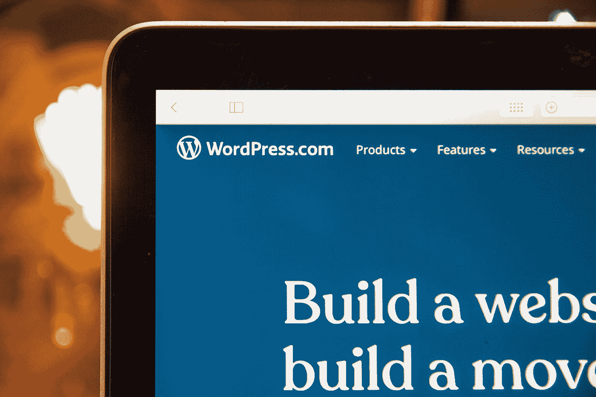

# 一个有经验的 WordPress 开发者的 9 条戒律

> 原文：<https://javascript.plainenglish.io/9-commandments-of-an-experienced-wordpress-developer-b22682b5e79f?source=collection_archive---------14----------------------->

## 你应该始终遵循的重要实践。

Photo by [Stephen Phillips - Hostreviews.co.uk](https://unsplash.com/@hostreviews?utm_source=medium&utm_medium=referral) on [Unsplash](https://unsplash.com?utm_source=medium&utm_medium=referral)

在研究 WordPress 资源时，我注意到许多重叠的技巧和实践。所以，在这篇文章中，我选择了你在 WordPress(不仅仅是 WordPress)上建立一个新网站时应该关注的要点。

# 1.不要安装有问题和未经测试的主题或插件。

没有软件是没有缺陷的。那是不用说的。然而，许多人在使用插件和主题时忘记了这一点。这种插件或主题通常存在缺陷和漏洞，使网络犯罪分子能够成功攻击我们的网站。因此，我建议尽可能安装一些扩展，并且只安装必要的扩展。每一个后续插件都会增加一些安全漏洞的风险。

另一个问题是我们经常过度信任插件和主题开发者。不幸的是，不是每个开发人员都必须诚实，我们可能会不知不觉地在我们的网站上安装恶意软件。例如，在 Chrome 网上商店中就出现过这种软件——本文将详细介绍。你还不如把一个被感染的插件扔进你的 WordPress 插件数据库，所以确保你安装了几次。

# 2.制作备份

这是第一点，是有原因的。基本上人分为两类:做备份的和会做备份的。

备份副本是你应该认真对待的事情。越是不那么困难和费时。备份方法之一是使用迁移插件。定期备份可以保证你的网站安全，你也可以睡个好觉。

# 3.安装更新

在这里，原因实际上和上面一样——安全。该软件的旧版本可能包含安全漏洞。此外，新的插件经常与旧版本的 WordPress 不兼容。由于其受欢迎程度，WordPress 是网络犯罪攻击的病毒目标。因此，使用旧版本的 WordPress、插件或主题是自找麻烦。

# 4.在类别、标签和分类法方面要适度

拥有大量的类别意味着你会迷失方向，失去网站的访问者。如果你的网站有几十个类别，这应该会让你觉得有些地方不对劲，你应该继续努力。

标签也是一样。我经常遇到这样的情况，一个博客上有几百个标签，其中大多数只有一个条目。这造成信息混乱，完全没有意义。

# 5.注意 URL 结构

合适的链接结构不仅美观，而且对谷歌爬虫来说也是如此。决定哪个链接更清晰:

*   https://example.com/blog/post/?p=21
*   https://example.com/wordpress-developer/

第二个链接比较长，但是可读性更强，鼓励我们去点击，从它的结构可以看出我们点击链接后能找到什么。好的链接结构也影响 SEO。一个结构良好的链接会让我们的网站在搜索结果中排名靠前一点。

# 6.使用缓存

这里你可以用一个缓存插件举例——比如 WP 超级缓存下载量超过 200 万，平均评分 4 星半！您也可以开发自己的缓存机制——选择权在您。缓存将允许您更快、更方便地使用我们的网站。也会对我们网站的 SEO 产生积极的影响。

# 7.注意管理面板的安全性

完整的基础是设置一个强密码和不同于 admin、administrator 等的用户名。另一件可以增加网站安全性的事情是改变管理面板的路径。

更好的解决方案是用单独的密码保护管理员路径。通过使用适当的。htaccess 规则，您可以设置登录面板的附加密码。这很有用，因为页面在输入密码之前不会加载，所以在暴力攻击尝试中我们不会使用服务器的资源。攻击我们网站的机器人通常设置了默认的 WordPress 参数，并攻击管理面板的默认地址。更改此地址或应用额外的密码可以显著降低攻击的风险及其可能的影响。

# 8.不要使用内置的评论系统。

这一点可能有些值得商榷。内置评论系统有支持者，但也有反对者。我是后者之一。当我运行我的博客时，我使用了行内评论，我后悔了。

我收到的评论数量巨大。但是，不幸的是，这些不是我想听到的评论。他们主要关心的是垃圾广告。它们不适合博客的主题。此外，关于 GDPR 的引入，我们必须保留与提交的意见一起传送的数据。我个人推荐 Disqus。WordPress 中的实现非常简单。许多博客上都有这个系统。我们不必担心 GDPR 或垃圾邮件。

# 9.优化您的照片

未经优化的照片会使您的网站加载时间过长。缓慢的页面加载会让收件人放弃浏览，损害 SEO。您可以通过减小图像大小和使用正确的格式(如 Jpeg 或 PNG)来优化照片。

希望你能遵循 WordPress 开发者戒律，并把上面的建议应用到你的 WordPress 站点上。

*更多内容看*[*plain English . io*](http://plainenglish.io/)