# 作为开发人员，你应该知道的 9 种数据结构和算法

> 原文：<https://javascript.plainenglish.io/9-data-structures-algorithms-you-should-know-as-a-developer-5e10946c95a0?source=collection_archive---------1----------------------->

## 让你成为更好的开发者的数据结构和算法

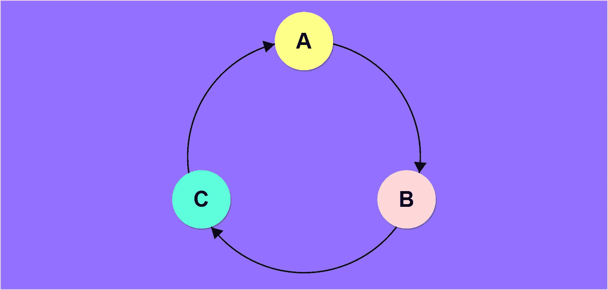

# 1.链表

如果你已经有一些编程经验，那么你可能听说过链表，这被认为是比数组更好的在内存中存储列表的选择，因为使用数组有很多缺点和限制。

> 什么是节点？
> 
> 比方说，在一家餐馆里，你点了一些食物，当服务员来到你的桌前并记下你点的食物时，他必须随身携带两样东西，那显然是你的食物和你在餐馆的位置。类似地，在一个链表中，我们有包含两个东西的节点，**数据** & **链接**。 ***数据*** 是您实际存储的数据，而 ***链接*** 包含列表中下一个节点的地址。

**有 3 种类型的链表需要查看。**

*   **单链表:**简单的由多个节点组成，每个节点都包含数据和链接。 ***例如，*** 如果我们在单个链表中存储 3 个数字 **(10，20，30)** ，现在每个节点都包含该节点的地址及其相关数据，除了第一个节点没有链接，为了访问第一个节点，我们有一个 ***指针*** ，它包含自己的地址。注意，最后一个节点在一个链表中也没有地址。

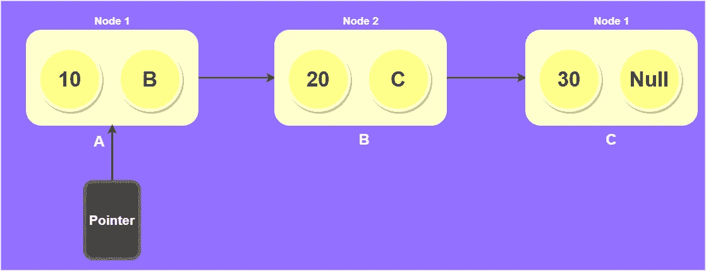

**Single Linked List**

> 导航仅向前

**双向链表:**由于我们在单向链表中有前向导航，双向链表和单向链表有点不同，每个节点都有一个额外的指针指向前一个节点，类似于单向链表。这些额外的指针提供了向前和向后移动的能力。

> 注意，我们必须在双向链表中的两个位置提供空指针。

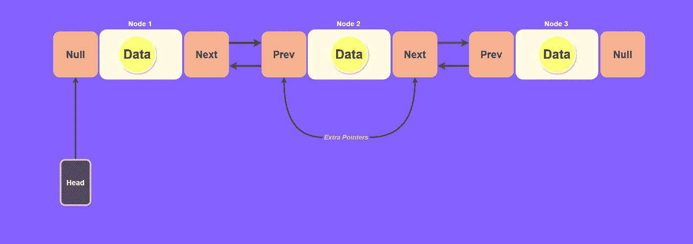

**Doubly Linked List**

> 向前和向后导航是可能的

*   **循环链表:**在这种情况下，如果你对单链表&双链表有很好的了解就很容易理解了。现在循环链表有两个子类型**(循环单链表** & **循环双链表)。**在 ***循环单链表*** 的情况下，除了循环单链表的最后一个节点指向第一个节点之外，我们拥有与单链表相似的一切。

> 另一方面，循环双向链表类似于双向链表，除了 ***循环双向链表*** 的最后一个节点指向第一个节点&第一个节点指向最后一个节点。下图你会有更好的理解。

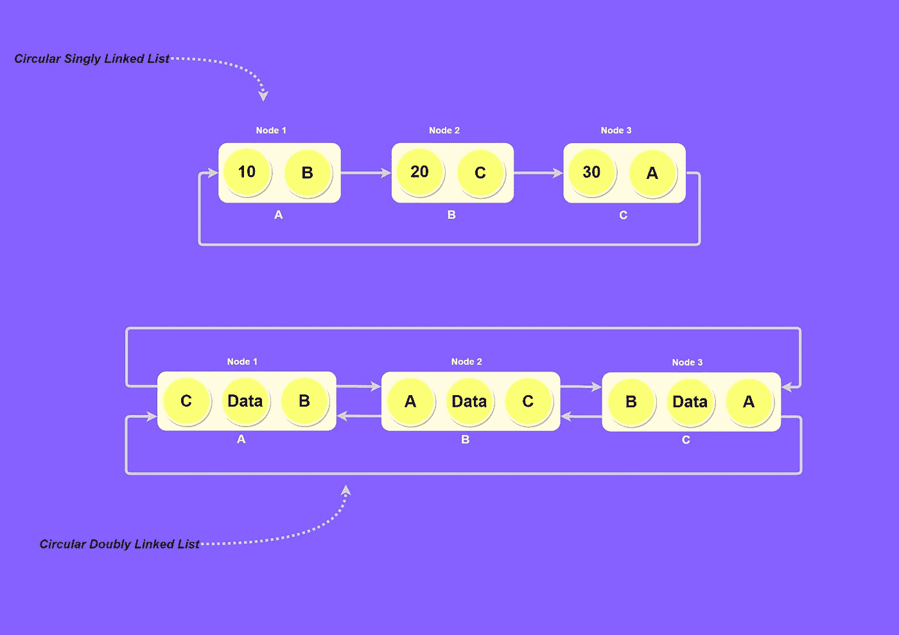

**Circular Linked List**

> 最后一个元素链接到第一个元素

## 2.堆栈和队列

*   **栈:**它们是遵循特定操作顺序的线性数据结构。现实生活中有很多关于书库的例子，例如:我们说图书馆里的书库，里面的书一本书一本书地叠在一起。
*   **队列:**队列的一个很好的例子是任何资源的任何客户队列，队列中排在第一位的客户将首先得到服务，当第一个客户离开队列时，更多的客户可以从队列的后面排队。

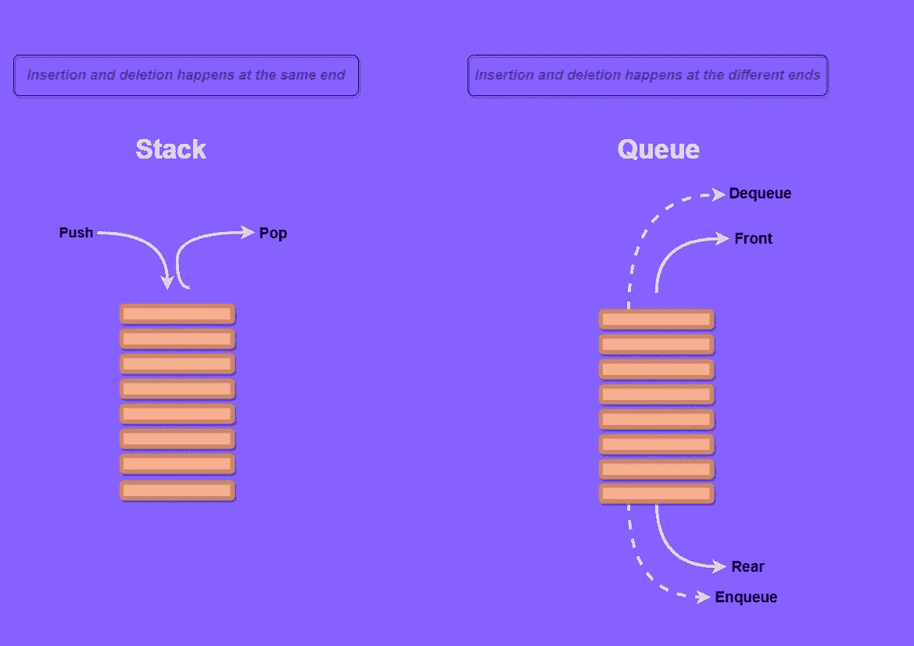

**Stack & Queue**

## 3.合并排序

这是一个 ***分治算法*** ，我们将输入数组分成两半，它为这两半调用自己，然后合并排序后的两半。为了更好地理解，请看一下我在下面展示的例子。

*   我们有一个输入数组，如示例中所述，在 merge-sort 中，当我们将输入数组分成两半时，我们需要计算该数组中元素的索引，以便我们可以将数组分成两半。
*   在这里，我们可以看到数组中有 5 个元素，所以我们将 5 除以 2，结果，我们得到了数组中需要划分的元素的索引。
*   当我们得到索引 2 时，我们简单地从第 2 个索引开始划分数组，之后，左边的数组 **(8，2)** 不能再划分，所以我们根据顺序&对其排序。转换后的数组现在是 **2，8** 。
*   现在我们在处理右边的数组，用同样的除法术语来获得索引，我们在数组不能再分的地方继续分，之后，我们按照它们的顺序排序。

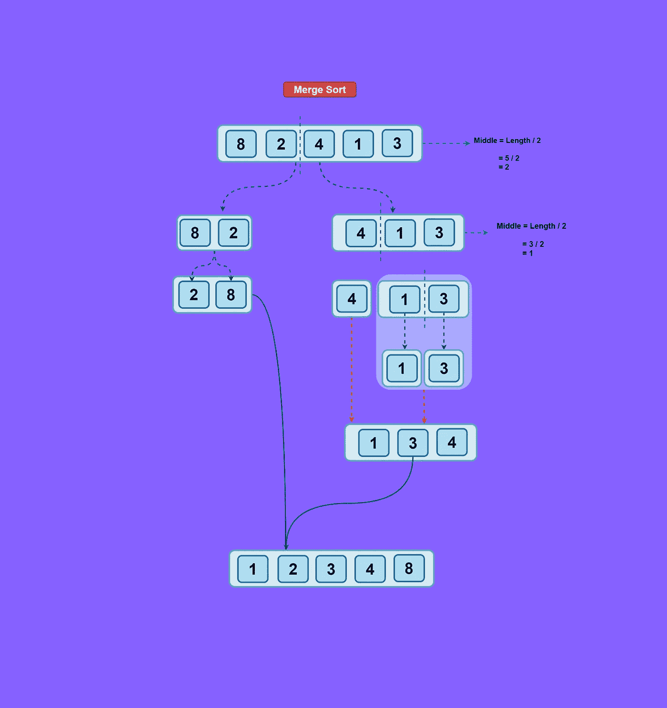

**Merge Sort**

## 4.二叉树

二叉树中有很多东西需要学习，所以我将只关注入门前你必须知道的基础知识。

*二叉树是一种每个节点最多有两个子节点的树。*

*   二叉查找树:树在计算机科学中有大量的应用，因为它们被用于数据库、自动完成、压缩算法等。二叉查找树是一种二叉树，其中每个节点遵循对它们排序的属性。例如所有后代< = n <所有正确的后代&子树也是如此。

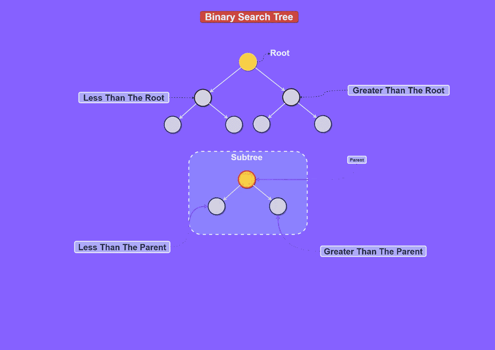

**Binary Search Tree**

## 5.图表

这种数据结构由一组有限的节点和一组连接它们的边组成。 ***例如*** ，一对 **(x，y)** 被称为边，它传达了 ***x 节点*** 连接到 ***y 节点*** 。

图被大量用于解决包含网络复杂性的现实生活问题，例如社交网站数据库中的用户可以被表示为节点，而与另一个用户的连接可以被表示为节点之间的边。 ***每个节点可以存储用户的信息。***

> 图形的类型

*   **无向图:**节点通过边以双向方式连接，因此如果一条边连接两个节点，那么我们可以从节点 1 横向到节点 2，反之亦然。
*   **有向图:**节点仅通过有向边以有向方式连接，因此如果一条边连接两个节点，我们只能从节点 1 和节点 2 横向穿过，而不能在相反方向穿过。

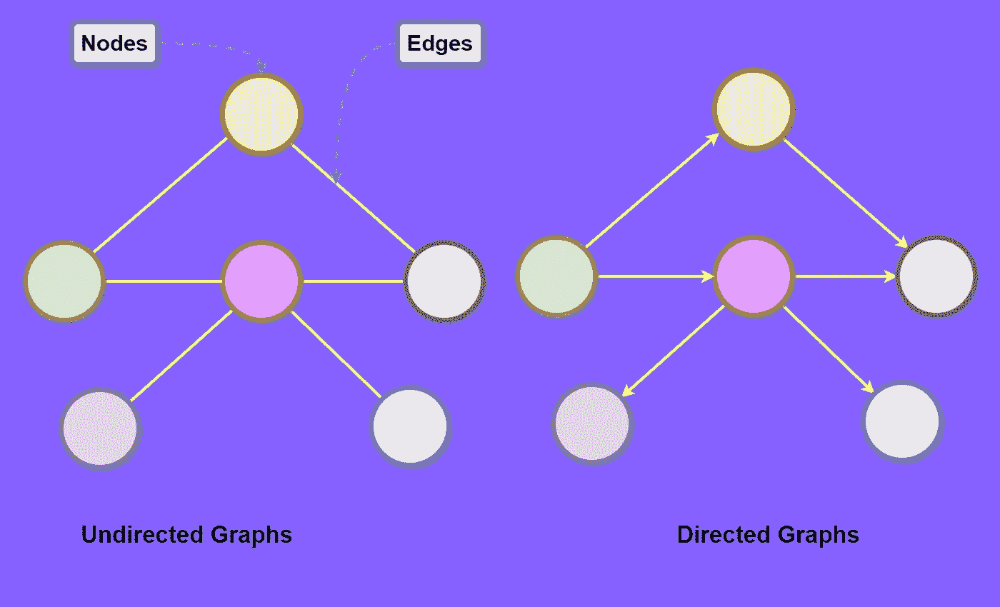

**Graphs**

## 6.哈希表

如果你是学习数据结构和算法的新手，那么哈希表在实际情况下很难理解，因为它们比基本数据结构更复杂。哈希表用于构建**拼写检查器**、**编译器、字典**、&代码编辑器。

在哈希表中，数据存储在键-值对中，键被发送给哈希函数，哈希函数对其执行算术运算&结果称为 ***哈希值*** ，它是哈希表中键-值对的索引。

***一个基本哈希表由两部分组成:***

*   **哈希函数:**它决定了我们的键值对的索引。
*   **Array:** 它保存表中所有的键值条目，数组的大小根据我们期望的数据量来设置。

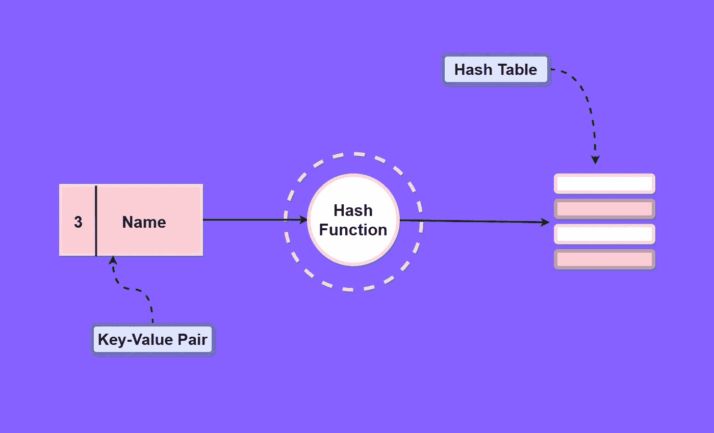

**Hash Tables**

## 7.大 O 符号

简而言之，*大 O 符号*描述了一个算法的性能，它让我们了解当提供大量输入数据时，该算法将如何执行。

***例如，*** *我们可以很容易地通过一个数组元素的索引来访问它，这样就够快了，但是如果我们不得不* ***添加*** *或* ***删除数组中的*** *项，如果输入的数据太大，代价就会很大。同样，如果我们需要添加或删除项目，我们有* ***链表*** *，它可以快速增长或收缩，但通过索引访问项目的* ***速度很慢*** *。当我们必须根据所需的性能选择算法时，这就是大 O 符号发挥作用的地方。*

## 8.线性搜索

它在时间复杂度为 **O(n)** 的元素列表中查找给定元素，其中 **n** 表示列表中元素的总数。这被认为是最简单的搜索算法，因为该过程从比较搜索元素和列表中的第一个元素开始，如果两者都匹配，则我们获得结果，否则它继续与列表中的下一个元素进行比较。

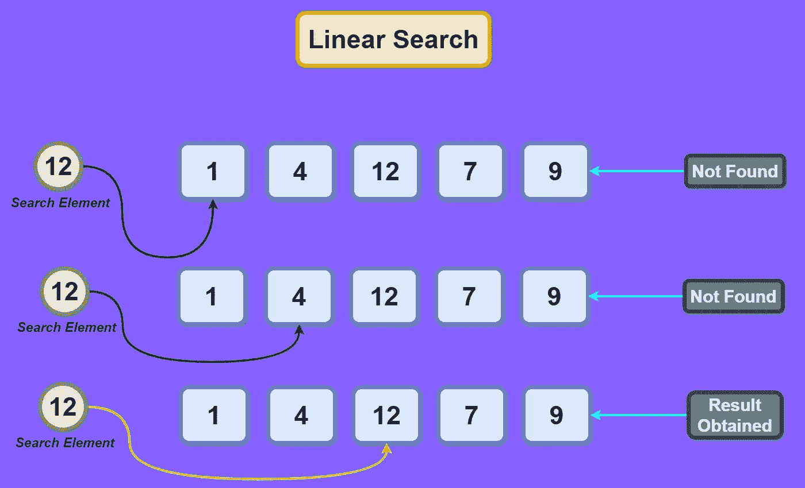

**Linear Search**

## 9.冒泡排序

一种简单的排序算法，如果相邻元素的顺序不正确，则交换相邻元素，然后多次迭代数组，直到元素的顺序正确为止。

***例如:***

*   我们有一个包含 4 个元素的数组，它们的相关索引为 **(0，1，2，3)** ，使用冒泡排序，我们通过交换相邻的元素来对最高值进行排序。
*   我们比较索引 **0** & **1** ，按顺序排列它们并继续下一个交换操作，等等，直到我们找到正确顺序中的最高值，我们必须继续迭代数组。

> 之所以称之为冒泡排序，是因为在每次迭代之后，具有最高值的元素被移动到最正确的位置，这被称为冒泡。

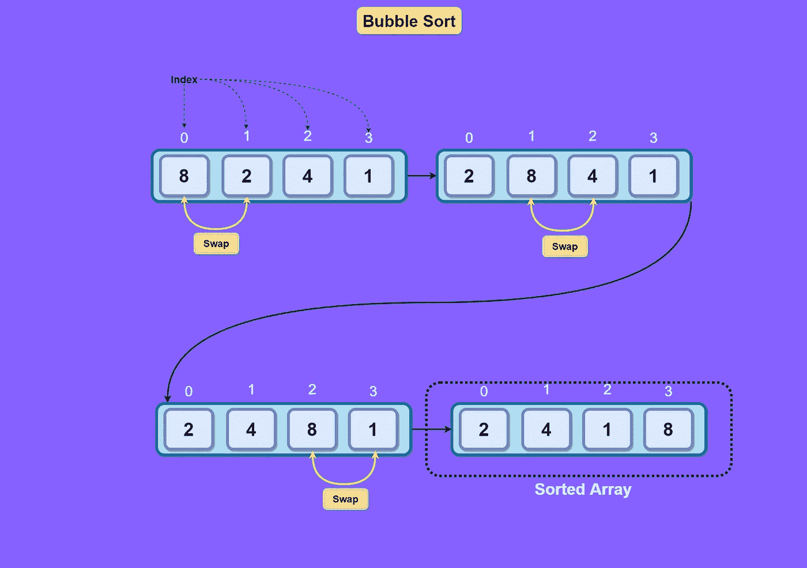

**Bubble Sort**

 [## 2021 年 React 开发者的 10 个重要工具

### 使用 React 工具的正确生态系统来制作出色的 React 应用程序。

javascript.plainenglish.io](/10-must-have-tools-for-react-developers-in-2021-b063426b43fd)  [## React Native 中的设计模式:组件模式

### 学习在 React Native 中创建可重用的表示组件

javascript.plainenglish.io](/design-patterns-in-react-native-component-patterns-785d585ac3f)