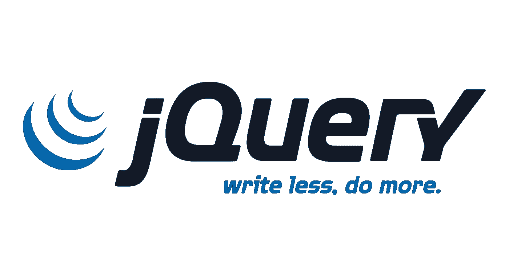
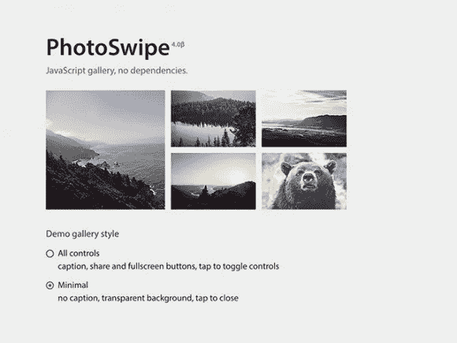
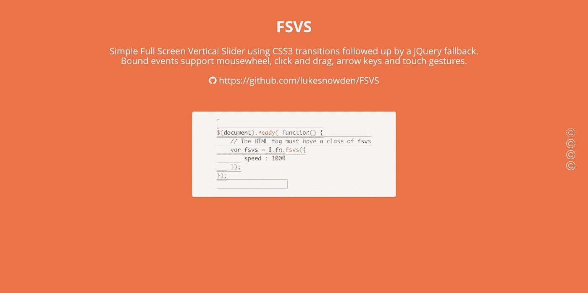
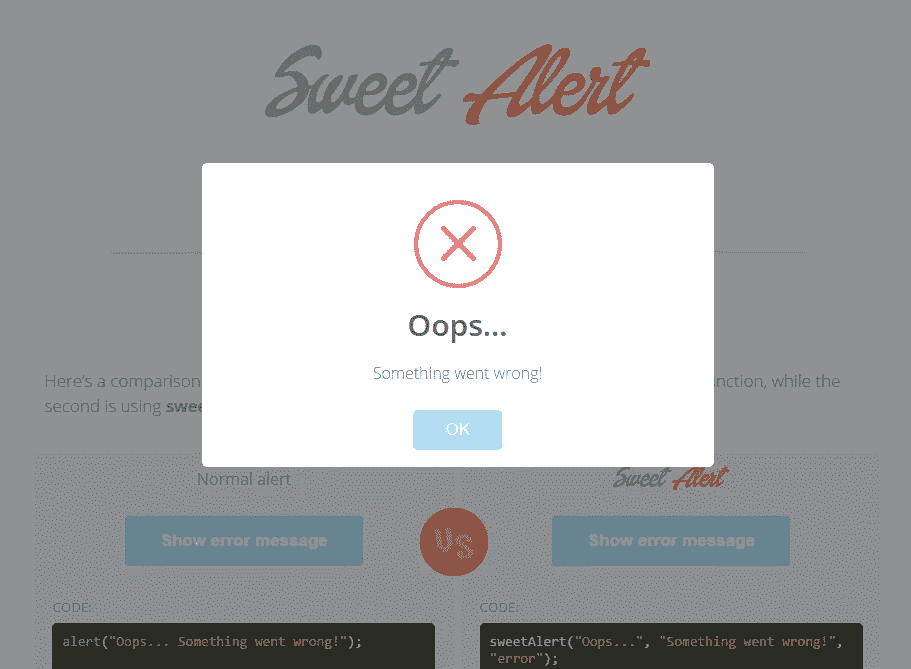
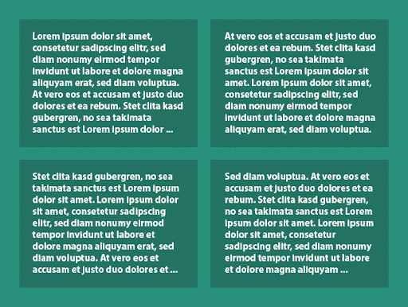
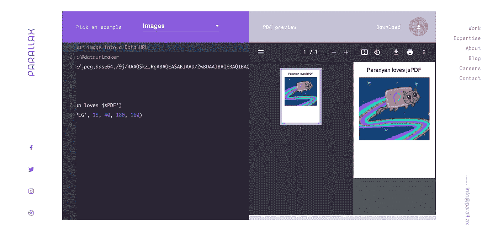
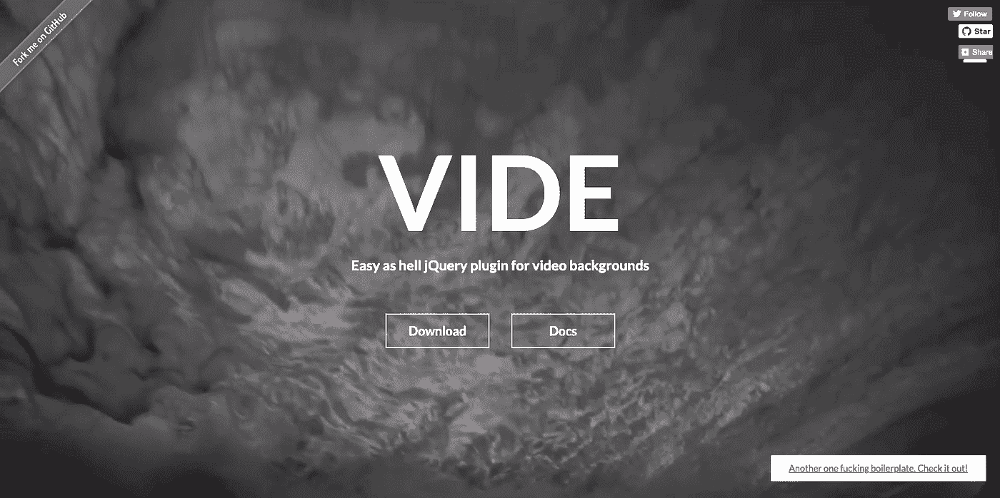

# Web 开发人员应该知道的 9 个免费有用的 jQuery 插件

> 原文：<https://javascript.plainenglish.io/9-free-and-useful-jquery-plugins-ever-web-developer-should-know-a0ce720f6987?source=collection_archive---------16----------------------->

## 我挑选了对你最有用的。

Image source: [https://jquery.com/](https://jquery.com/)

jQuery 很快征服了开发环境。今天，许多专家无法想象不使用这个框架创建现代网站。虽然你可以在网上找到大量免费的 jQuery 插件，但我还是选择了对你最有用的。

# **1。照片擦除**

Image Source: [https://photoswipe.com/](https://photoswipe.com/)

这是一个方便的插件，适合那些想在自己的网站上准备一个令人兴奋的、视觉上吸引人的图库的人。当然，我们还会发现对触摸手势和其他非标准功能的支持(例如，社交媒体共享控制)。值得一提的是，从版本号 4 开始，新的作者已经在准备这个插件了。

# **2。图表列表**

Image Source: [https://gionkunz.github.io/chartist-js/](https://gionkunz.github.io/chartist-js/)

如果我们想要非常吸引人地呈现枯燥的数据，Chartist 插件将是有益的。它是一个复杂的脚本，具有许多有用的功能(例如，在光标悬停后显示标签)，将数据转化为视觉上令人兴奋的图表。此外，插件的作者已经准备了详细的文档，使得配置插件变得非常容易。

# **3。全屏垂直滚动(FSVS)**

Image Source: [https://www.lukesnowden.co.uk/full-screen-vertical-scroll/#fsvs-initial-setup](https://www.lukesnowden.co.uk/full-screen-vertical-scroll/#fsvs-initial-setup)

有趣的滚动效果，利用了 CSS3 的可能性。它在适用于平板电脑和智能手机(即触摸设备)的网站上也能很好地工作。但这还不是全部，因为插头还允许用传统的鼠标或键盘箭头进行简单的操作。

# **4。甜蜜警报**

Image Source: [https://sweetalert2.github.io/](https://sweetalert2.github.io/)

“哎呀……出问题了！”—这是由于 Sweet Alert 插件而出现的信息。当由于与网站用户的交互而出现错误时，该插件将会工作。

无论页面是显示在桌面还是移动设备上，警告窗口都会自动居中显示，而站点的背景是灰色的。

# **5。焦点**

方便和智能的图形文件修剪。当我们希望网站背景中使用的照片在桌面屏幕、平板电脑和智能手机上看起来一样好时，该插件是有益的。值得一提的是，FocusPoint 允许您以多种不同的方式裁剪图像。

# **6。TextTailor**

更多的用户在移动设备上浏览网站，这意味着网站必须更好地适应平板电脑和智能手机的屏幕。像 TextTailor 这样的插件在这方面支持 web 开发者。在这种情况下，我们可以获得响应性文本，灵活地适应屏幕，并注意适当的格式。

# **7。jsPDF**

Image source: [https://parall.ax/products/jspdf](https://parall.ax/products/jspdf)

一个使用 HTML5 功能的插件允许你在客户端动态生成 PDF 文件。该插件是创建各种类型的报告、票据和证书的理想工具，这些报告、票据和证书补充了特定用户的数据，例如输入到表单中的数据。

# **8。参见**

Image Source: [http://vodkabears.github.io/vide/](http://vodkabears.github.io/vide/)

网页设计中越来越流行的趋势是将视频材料作为背景图像。Vide 插件让它变得更加简单快捷。动态视觉效果有效地吸引注意力，并允许额外的信息。Vide 还允许你在移动设备上显示页面时放置一个静态背景替换。

# **9。漂亮的床**

在网站上直接嵌入来自 YouTube 的视频材料是一种越来越普遍的做法。PrettyEmbed plugin 促进了这种解决方案，并解决了实现到 YouTube 的链接时的各种问题(例如，消除巨大和小屏幕上的屏幕失真)。

目前，jQuery 是许多 web 开发人员使用的最流行的 JavaScript 库之一。所以，希望这个 jQuery 插件列表能派上用场，对作为 web 开发者的你有所帮助。

*更多内容尽在*[***plain English . io***](http://plainenglish.io/)