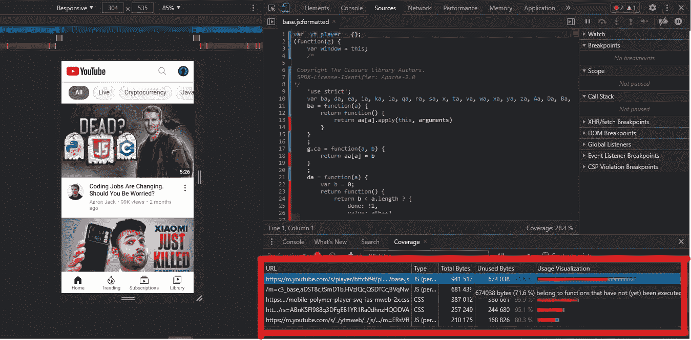

# Chrome DevTools 的 9 个隐藏功能

> 原文：<https://javascript.plainenglish.io/9-hidden-features-of-chrome-devtools-78856b2a96de?source=collection_archive---------3----------------------->

## 大多数人不知道的疯狂功能。


Photo by [Diana Polekhina](https://unsplash.com/@diana_pole?utm_source=medium&utm_medium=referral) on [Unsplash](https://unsplash.com?utm_source=medium&utm_medium=referral)

Web 开发人员最喜欢的莫过于找到加速开发过程的惊人扩展。

一个这样的工具是 Chrome DevTools，它提供了很多特性，是所有级别的前端开发者的首选工具。

DevTools 有大量的特性和选项，Google 在记录这个工具方面做得非常出色。

然而，尽管有[全面的文档](https://developer.chrome.com/docs/devtools/)，仍然有一系列有用的工具和特性是大多数开发者不知道的。

从模拟移动设备到寻找无用的 JavaScript 代码，我们将在这篇博客中讨论 DevTools 必须提供的 9 个秘密特性。

## #1.控制网络速度

您的网站将被世界各地使用不同尺寸和平台的设备的人访问。

您可以使用媒体查询来构建响应迅速的网站，但是网络速度呢？

不是每个访问者都有相同的网速，因此你需要检查你的网站在不同网速下的表现。

幸运的是，DevTools 可以在 3 种网络预设之间切换:

1.  快速 3G
2.  慢速 3G
3.  脱机的


Source: Author

您还可以添加自定义配置文件。

您可以通过单击“无限制”下拉菜单，在“网络”选项卡下找到此功能。

## #2.多光标


Multi-cursor. Source: Author.

DevTools 内置了一个优秀的代码编辑器。

如果你是使用这个工具编辑 CSS 或任何代码的人，你一定会喜欢多光标支持。

这也很容易设置。你所需要做的就是按住 Ctrl(Mac 上的命令),点击你想要多个光标的行。

您也可以通过按住 Ctrl(Mac 上的 Command)+u 来撤销选择。

而且，还可以通过按住 Alt 并拖动来获得多个光标。你可以在这里看到实现。

## #3.深色模式

对我来说，黑暗模式增加能见度，减少眼睛疲劳。使用黑暗模式有很多好处，也有坏处。

各种[文章](https://www.androidauthority.com/dark-mode-1046425/)涵盖了这个话题。


Source: [Reddit](https://www.reddit.com/r/memes/comments/aopfyp/dark_mode_is_better/)

我尽可能使用黑暗模式，从 Twitter 应用程序到我的计算器应用程序。

DevTools 也不例外。

要启用黑暗模式，请通过单击屏幕右上角的三个垂直点打开设置。

然后转到**>***外观****>***主题*** 最后选择*。****

## ***#4.命令菜单***

******

***Source: Author***

***当 DevTools 打开时，通过按 Ctrl(Mac 上的 CMD)+Shift+P 可以快速打开命令菜单。***

***它提供了一种快速浏览 DevTools 的方法，随着时间的推移，您会对它越来越熟悉。***

***如果您熟悉 VS Code 的命令面板，这个特性会很方便。***

***您可以删除`>`并用`?`替换它，以查看该菜单提供的所有功能。***

## ***#5.检测未使用的代码***

******

***Source: Author***

***现代 JavaScript 应用变得越来越复杂，并且依赖于大量第三方库。***

***总有一些代码没有被使用，被认为是多余的。***

***DevTools 帮助你定位那些不必要的阻碍你网站速度的冗余代码。***

***为此，请单击 DevTools 右上角的三个垂直点。然后单击更多工具并选择覆盖范围。***

***现在您只需要重新加载页面，新弹出的面板将显示未使用的 JavaScript 代码。***

***您可以看到总字节数和未使用的字节数，以及可视化的使用栏。***

## ***#6.自动启动***

***如果你的主浏览器是其他不提供此类工具的浏览器，而你只使用 Chrome 开发工具，那么这个特性对你来说会非常有用。***

******

***Source: Author***

***在 DevTools 设置下有一个全局选项，可以自动打开弹出窗口的 DevTools。***

***然而，更好的方法是启动 DevTools，不只是在弹出窗口中，而是在 Chrome 浏览器中。***

***您可以通过在 Google Chrome 上添加以下行作为属性来实现这一点。***

```
***"C:\Program Files (x86)\Google\Chrome\Application\chrome.exe" --auto-open-devtools-for-tabs***
```

***对于 Mac 用户来说，***

```
***--auto-open-devtools-for-tabs***
```

***你可以参考这里的[答案](https://stackoverflow.com/questions/12212504/automatically-open-chrome-developer-tools-when-new-tab-new-window-is-opened/36957422#36957422)来了解更多启用 DevTools 的选项。***

## ***#7.颜色选择器***

******

***Color Picker. Source: Author***

***颜色选择器是一个很好的方式来选择你需要的颜色，并能够很容易地将其添加到你的网站的 CSS 中。***

***DevTools 提供了一个颜色选择器，访问它是一个非常简单的过程。***

***转到“元素”选项卡，从那里选择“样式”面板来查看 CSS。***

***只需点击颜色方块(不是值)，颜色选择器就会出现。***

***颜色选择器能够轻松地在颜色模式之间转换，如从十六进制到 RGBA。***

## ***#8.移动仿真器***

******

***Source: Author***

***超过 60%的在线搜索是由移动设备完成的，这使得响应式网页设计成为网页开发的关键部分。***

***幸运的是，DevTools 提供了一个移动模拟器，它具有预定义的高度和宽度，与一些流行的移动设备如 iPhone、Pixel、Surface 和 iPad 相匹配。***

***打开 DevTools，点击[切换设备工具栏](https://developer.chrome.com/docs/devtools/device-mode/#:~:text=toggle%20device%20toolbar)，如上图所示。***

***您还可以从“无节流”下拉菜单中选择中端或低端移动设备。***

***此外，拖动控制柄来调整视口的大小也是获得所需精确尺寸的一种简便方法。***

## ***#9.断点***

******

***Source: Author***

***想知道像 YouTube 这样的网站有多少媒体查询吗？您可以通过启用查看媒体查询选项来轻松检查它。***

***只需单击上面媒体中显示的 3 个垂直点，即可启用媒体查询可见性。***

***您将看到一个新面板，显示各种媒体查询断点，您可以单击这些断点进行应用。***

***除此之外，您还可以非常容易地在 JavaScript 代码中设置断点。***

***一种方法是在代码中编写`debugger`，当到达`debugger` 时将暂停执行。***

```
***console.log('a');
console.log('b');
debugger;
console.log('c');***
```

***另一种方法是转到 Sources 选项卡，然后转到代码文件，找到要暂停执行的那一行。***

***然后，您必须单击代码左侧的行号，这将使蓝色图标出现在该行号上。就是这样。***

***DevTools 将在执行这行代码之前暂停。***

## ***最后的想法***

***DevTool 是 Google Chrome 内置的一套工具，可以简化前端开发过程。***

***它提供了一些最常用的工具，每个 web 开发人员都不时需要这些工具。***

***然而，它是一个非常全面的工具，提供了大多数开发人员知道他们需要的各种特性，但他们不知道 DevTools 默认提供了这些特性。***

***DevTools 在 React 中构建博客平台时给了我很大的帮助，尽管后来我不得不将其转换为 Next。***

***我在最近的博客中讨论了让我从 React 转向 Next 的[原因。](/5-reasons-to-switch-from-react-to-next-js-f776413693d0)***

***希望你喜欢阅读这篇博客。***

****更多内容请看*[*plain English . io*](http://plainenglish.io/)***