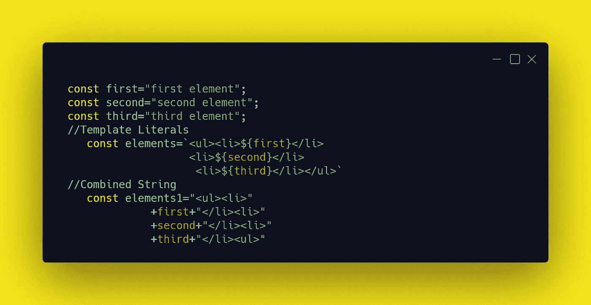

# 在学习 React 之前你应该知道的 9 个 JavaScript 概念

> 原文：<https://javascript.plainenglish.io/9-javascript-concepts-you-should-know-before-learning-react-316069f54ce4?source=collection_archive---------11----------------------->

Photo by [Ferenc Almasi](https://unsplash.com/@flowforfrank?utm_source=medium&utm_medium=referral) on [Unsplash](https://unsplash.com?utm_source=medium&utm_medium=referral)

自 1995 年发布以来，JavaScript 的语法发生了很大变化，其用途也是如此。这种语言从一种 web 脚本语言变成了一种影响 IT 行业许多领域的语言。

从技术上讲，JavaScript 的语法在 ECMAScript 5 和 6 发布后经历了最大的变化。这个版本带来了所谓的现代 JavaScript，一种充满了点、箭头和类的新语法。

我很自豪成为那些完成了关于 JavaScript 的整本书和教程，然后发现他们必须学习现代 JavaScript 的开发人员之一。

旧的语法仍然有效，但 React 等现代 JavaScript 库非常强调使用 ES6，或者为那些希望最大限度地利用该库的人提供现代 JavaScript 语法。[虽然没有 ES6 也可以用 React。](https://reactjs.org/docs/react-without-es6.html)

# JavaScript 和 React

如果你去 React 的官方网站或任何教授它的书籍或教程，你会注意到请求中存在以前在 ES6 中的知识——我不是在天真地说，这是你必然会看到的东西。

检查任何 React 代码，您会看到新的关键字和符号，如`let`、`const`、箭头、类、对象和数组。因此，我列出了一些你在学习 React 之前必须知道的概念。

# **1。变量和赋值**

您可能认为声明变量不值得一提，但对于 JavaScript 来说却是如此。在 ES6 之前，你可以声明变量的唯一方式是使用`var`关键字，这导致了一些问题。

**用常量声明变量**

像 constant 这样的常规东西在 JavaScript 中并不存在，但现在存在了。使用`const`关键字意味着变量的值不会改变。然而，对于数组、对象和其他集合来说，情况并非如此。

用`const`关键字声明一个数组或对象并不会使它们的元素不可变。

**用 let** 声明变量

除了不维护变量值，使用`var`关键字时另一个困扰 JavaScript 开发人员的问题是变量的范围。您可以将作用域视为可以访问变量的地方。

声明两个同名的变量，一个在 if/else 块内，另一个在块外，应该不会引起任何问题。这条规则不适用于用 var 关键字声明的变量，如下所示。

如果我们用`let`或`const`替换块内的声明，我们会得到别的东西，因为`let`和`const`将变量的范围定在其块内。换句话说，在一个块中声明的任何变量都只属于那个块。

在使用 let 时，还有其他有趣的情况。仅仅涵盖这些就需要一整篇文章。所以，还是把时间和空间留给其他概念吧。如果感兴趣，可以访问本文末尾参考资料部分提供的链接。

# 2.模板文字

在用 JavaScript 构建 HTML 标记时，有一件事会让你心烦，那就是你应该用引号括起来的字符串连接变量。两三行 HTML 可能没问题，但是想象一下 20 行？

您将不得不处理无穷无尽的结束和开始引号以及许多+运算符的麻烦。PHP 开发人员不必处理这个问题，因为他们可以毫无负担地在两个双引号内写变量。

ES6 通过引入模板文字将这份礼物送给了 JavaScript 开发人员。这取决于两件事:首先，模板文字用反斜杠(``)括起来。第二:里面的变量用美元符号“$”和花括号{}括起来，就像这个${element}。

# 3.箭头功能

用 JavaScript 编写函数工作量很大。这对你来说可能听起来很奇怪，因为你一直在不知情的情况下做这项工作。想象一下，我只用一个箭头写一个函数？比如这个“= >”。

我们把“函数”和“返回”，括号“()”，花括号{}，用箭头和“= >”代替了关键词，你看这个箭头卸下了我们多少担子？然而，在使用它时，有一些规则要遵循。

首先，箭头函数必须用作匿名函数，因此应该将其赋给一个变量，如下所示:

你可能注意到我们没有省略括号。arrow 函数的另一个规则是，当有多个参数时，必须使用括号。此外，如果函数体包含不止一条指令，则必须用花括号{}将函数体括起来。

当我们在数组方法中使用箭头函数时，它们的威力大放异彩。您将在“阵列”部分看到这一点。

# 4 个 ES6 类

知道 JavaScript 没有类让我震惊。我非常渴望学习 OOP(面向对象编程)方法，并了解如何使用类。但是，在 ES6 之前，是没有课的。所以，我通过有规律地创建一个对象或者通过使用一个构造函数来学习 OOP。

现在，这种语言有了自己的类系统，对于 C++、PHP、VB.net 等语言中的任何类系统来说都很熟悉。什么都没有真正改变。你所学到的关于对象和原型继承的一切都是一样的，除了我们有了一种新的方法来使用类的语法声明对象的结构。

在上面的例子中，我们创建了一个 House 类，它包含两个属性门、窗和一个显示这些属性的值的方法。之后，我们创建了 House 类的一个实例。

对于任何想学习 React 的人来说，理解类是必不可少的。就我个人而言，第一次使用 React 时，我遇到了类，因为您通常会通过扩展现有的类来创建 React 组件。

尽管 React 中有一种通过函数创建组件的新方法，React 开发人员还是建议使用它。这比创建基于类的组件要容易得多。

# 5.数组、对象和其他数据集合

## **数组**

数组结构没有改变。改变的是操作数组中每一项的数组方法的数量。比如我们有:map()，filter()，find()，forEach()，reduce()，match()。每一个都有独特的使用案例。

在 React 中你会经常遇到 map 方法，实际上是在将数组中的每一项映射到一个

*   元素时。map 方法将使您能够迭代数组中的每一项并改变其形状。作为一个例子，让我们将一个现有数组中的每个元素乘以 2。

正如您在上面看到的，与使用 for 循环的老方法相比，使用 map 方法迭代数组并更改其项目要容易得多。如果仔细观察，您会发现我们使用了一个箭头函数作为对 map 方法的回调。当与数组一起使用时，箭头函数发挥了最大的作用。

## **对象**

对象现在有了一些很棒的方法，可以消除处理对象结构的所有负担。例如，我们有:

**Object.values()** :该方法将返回一个数组，其中包含对象中的每个值。

**Object.keys()** :它将返回一个包含对象中每个属性名称的数组

**Object.assign()** :这个方法非常强大，它可以让你用另一个对象的属性更新一个对象，同时保留旧的属性

## 其他数据收集

在 ES6 之前，关于数据收集的对话仅限于对象和阵列。现在这个名单还在增长。我们有 map(不要和 Map()方法混淆)，Set，WeakMap 和 WeakSet。您不会经常使用这些集合，但是了解它们是有好处的。

# 6.析构对象和数组

## 解构对象

大多数时候，我们使用构造函数来创建对象并将数据放入其中。如果没有使用 object 属性或数组符号的传统方式，从对象中获取数据会怎么样？在这种情况下，我们将使用析构赋值。让我们看看它是如何工作的。

正如你在上面的例子中看到的，我们已经创建了一个包含四个属性的对象，然后我们使用析构来获取颜色和内存属性的值。

为了使析构赋值起作用，你要赋值的变量的名字应该与对象中所需属性的名字相匹配，换句话说，像这样的赋值:`const {size}= phone;`会给你一个未定义的值。

## 解构数组

对于数组，语法保持不变。幸运的是，我们不需要知道任何东西的名字，因为数组不包含任何键。你只需要尊重数组中每一项的顺序，这样你就可以得到想要的值。

在上面的例子中，如果不获取第一个元素的值，我们就无法获取数组中第二个元素的值。如果我们只需要第四个值，我们将不得不创建三个不必要的变量。幸运的是，我们可以使用逗号来代替如下所示的变量名。

# 7.默认参数

对于一个函数来说，有些情况下函数应该有三个参数，但是它只收到了两个参数。在正常情况下，这将抛出一个错误或 undefined，但对于缺省参数，将使用缺省值。

# 8.Spread 和 Rest 运算符

## 扩展运算符

正如我前面提到的，现代 JavaScript 的语法充满了点。为什么？嗯，那是因为 spread 运算符。它被广泛用于变量。因此，您可能会在每个 ES6+或现代 JavaScript 文件中看到它。

您将使用 spread 运算符将数组转换为列表。换句话说，您将分散数组的元素。此外，您还可以将它与其他集合(如 Map)和函数一起使用。让我们看看它是如何工作的。

在上面的情况中，我们使用 spread 操作符将*车辆数组*与*物品数组*连接起来。如果您试图找出“car”项的索引，而不使用 spread 操作符，您将得到-1，简而言之，它不存在。

我们也可以在析构赋值中使用 spread 运算符。

关于 spread 操作符更有趣的是，我们可以用它来操作数组内部的值，而不用改变原始数组。

## Rest 运算符

当使用 rest 操作符时，spread 操作符的三点语法将为我们服务，并且当我们不知道函数应该获得多少个参数时，这个语法也是有效的。因此，我们将只使用 spread 操作符语法:三个点后跟参数名。

# 9.模块

模块—一个 JavaScript 文件，它导出其代码供另一个文件使用。我们知道，当你出口某样东西时，你应该进口它。导出和导入数据的语法会有所不同，这取决于您的偏好。对于导出数据，可以使用命名导出或默认导出。

## 默认导出

file name: **prototype.js**

上面，我们已经创建了一个模块，它导出了一个名为 Junior 的类。这个类有 4 个属性。第一个属性将在用构造函数创建实例时获得它们的值，最后一个属性将有默认值。这里重要的是我们使用了 export 和 default 关键字来导出这个类。

使用默认关键字导出模块数据(默认导出)意味着:数据将被导入，无论我们使用哪个名称导入它。让我们在下面的例子中展示这一点。

注意我们是如何用不同的名称从 prototype.js 文件导入该类的，以及这是如何不会导致任何错误的。

## 命名出口

看起来，命名导出将根据其名称导出数据。您只需要删除默认关键字，在导入数据时记住数据的名称，并使用花括号将数据括起来。

file name: **prototype.js**

您可以根据想要导出的内容和导出方式来使用 export 和 import 语句。顺便说一下，这里涉及到了对象析构。我已经就此写了一篇文章。如果有兴趣，您可以查看下面的链接:

 [## JavaScript 中对象的析构和与模块的集成

### 在使用模块时，你能做的最好的事情之一就是把析构放到等式中。有时候…

javascript.plainenglish.io](/object-destructuring-and-integration-with-modules-in-javascript-391ca0434ea9) 

# 最后的话

我试图给你一个概述，你可能会遇到的每个概念，而试图学习反应，甚至角。遇到这些概念是不可避免的。你必须加强和更新你的 JavaScript 语法知识。

对于每一个概念，我承认我只举了一个例子。所以我会为你提供更多的资源。

# 资源:

1.  [**变量和赋值**](https://developer.mozilla.org/en-US/docs/Web/JavaScript/Reference/Statements#declarations)

2.[**模板文字**](https://developer.mozilla.org/en-US/docs/Web/JavaScript/Reference/Template_literals)

3. [**箭头功能**](https://developer.mozilla.org/en-US/docs/Web/JavaScript/Reference/Functions/Arrow_functions)

4. [**ES6 类**](https://developer.mozilla.org/en-US/docs/Web/JavaScript/Reference/Statements/class)

5.**数组，对象&其他数据集合。**

*   [**阵列**](https://developer.mozilla.org/en-US/docs/Web/JavaScript/Reference/Global_Objects/Array)
*   [**对象**](https://developer.mozilla.org/en-US/docs/Learn/JavaScript/Objects/Basics)
*   [**其他数据采集。**](https://developer.mozilla.org/en-US/docs/Web/JavaScript/Reference/Global_Objects#keyed_collections)

6. [**析构对象和数组。**](https://hacks.mozilla.org/2015/05/es6-in-depth-destructuring/)

7 [**默认参数。**](https://developer.mozilla.org/en-US/docs/Web/JavaScript/Reference/Functions/Default_parameters)

8. [**传歇符。**](https://javascript.info/rest-parameters-spread)

9 [**模块。**](https://developer.mozilla.org/en-US/docs/Web/JavaScript/Guide/Modules)

*更多内容请看*[*plain English . io*](http://plainenglish.io/)