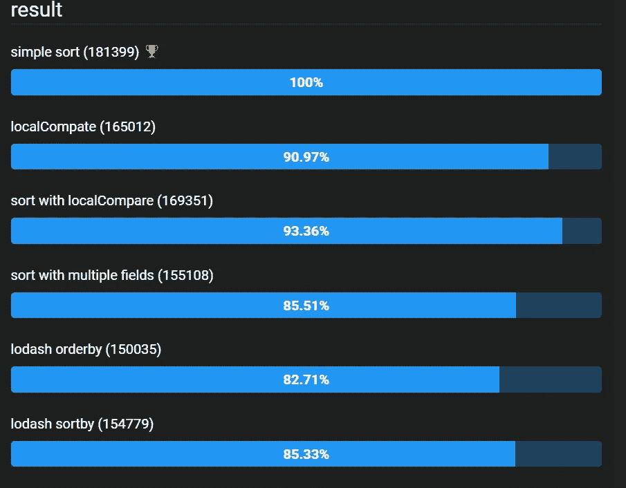

# JavaScript 中对数组(和对象数组)中的项目进行排序的 9 种方法

> 原文：<https://javascript.plainenglish.io/9-methods-for-sorting-an-item-in-an-array-and-array-of-objects-in-javascript-558837845e5f?source=collection_archive---------5----------------------->

## 最新 JavaScript 面试问题 2021


Photo by [Michał Parzuchowski](https://unsplash.com/@mparzuchowski?utm_source=medium&utm_medium=referral) on [Unsplash](https://unsplash.com?utm_source=medium&utm_medium=referral)

我总是喜欢像报纸这样能在较短时间内提供足够信息的东西。在这里，我为日常前端开发创建了一些技巧。

在这里，我将带来一篇新文章，介绍一些基于属性值对数组进行排序的方法。这些技巧可以成为你 2021 年 JavaScript 编码面试中的一块小石头。

> 我知道小石头没什么区别，但如果我们有成千上万的石头，那就有区别了，为此我明天会带来新的石头。敬请期待😉

我们可能总会遇到一种或另一种基于一个或多个属性对数组或对象数组进行排序的方法。让我们看看如何在不同的条件下对数组中的项目进行排序。

*让我们创建将在本文中使用的测试数据。*

```
let data = [{
        id: "3",
        city: "toronto",
        state: "TR",
        zip: "75201",
        price: "123451"
    },
    {
        id: "1",
        city: "anand",
        state: "AN",
        zip: "94210",
        price: "345678"
    },
    {
        id: "5",
        city: "sudbury",
        state: "SB",
        zip: "00110",
        price: "789045"
    }
];
```

## 1.简单排序

"`**sort()**`方法将数组 [*中的元素在*](https://en.wikipedia.org/wiki/In-place_algorithm) 处排序，并返回排序后的数组。默认的排序顺序是升序，建立在将元素转换为字符串，然后比较它们的 UTF-16 代码单元值序列的基础上。(来源: [MDN](https://developer.mozilla.org/) )

```
let sorttest2 = data.sort((a, b) => (a.id < b.id ? -1 : Number(a.id > b.id)));console.log("sort test 2 ", sorttest2);
```

控制台:

## 2.本地比较

`**localeCompare()**`方法返回一个数字，指示一个引用字符串在排序顺序中是在给定字符串之前还是之后，或者是否与给定字符串相同(来源: [MDN](https://developer.mozilla.org/) )

```
let sorttest3 = data.sort(
    (a, b) => a.city.localeCompare(b.city) || (b.state as any) - (a.state as any)
);
console.log("sort test 3", sorttest3);
```

控制台:

## 3.使用 localCompare 排序

```
let sorttest1 = data.sort((a, b) => a.id.localeCompare(b.id));
console.log("sort test 1 ", sorttest1); 
```

控制台:

## 4.使用多个字段排序

"`**parseInt()**`函数解析一个字符串参数并返回一个指定的[基数](https://en.wikipedia.org/wiki/Radix)(数学数字系统中的基数)的整数。"(来源: [MDN](https://developer.mozilla.org/) )

```
let sorttest4 = data.sort(function(left, right) {
    var city_order = left.city.localeCompare(right.city);
    var price_order = parseInt(left.price) - parseInt(right.price);
    return city_order || -price_order;
});
console.log("sort test 4", sorttest4);
```

控制台:

## 5.Lodash _orderBy

这个方法类似于`[_.sortBy](https://lodash.com/docs/4.17.15#sortBy)`，除了它允许指定迭代排序的顺序。

"如果未指定`orders`，则所有值按升序排序。否则，请指定“desc”作为对应值的降序排序顺序，或指定“asc”作为对应值的升序排序顺序。(来源:[洛达什](https://lodash.com/docs))

```
let sorttest5 = _.orderBy(data, ["zip"], ["asc"]);
console.log("sort test 5", sorttest5);
```

## 6.Lodash _sortBy

创建一个元素数组，按照每次迭代运行集合中每个元素的结果按升序排序。

此方法执行稳定排序，即保留相等元素的原始排序顺序。使用一个参数调用迭代:*(值)*。(来源:[洛达什](https://lodash.com/docs))

```
let sorttest6 = _.sortBy(data, ["id", "city"]);console.log("sort test 6", sorttest6);
```

控制台:

***让我们在这里检查性能。***

[https://jsben.ch/u2Mv1](https://jsben.ch/u2Mv1)



# 排序日期

## 7.分类

```
let isDescending = false; //set to true for Descendinglet dates = ["1/7/2021", "1/6/2021", "8/18/2020", "8/6/2020"];let sorteddates = dates.sort((a, b) => isDescending ? new Date(b).getTime() - new Date(a).getTime() : new Date(a).getTime() - new Date(b).getTime());console.log(sorteddates);
```

控制台:

## 8.洛达什

```
let arr = [{
        name: "test1",
        date: "1/7/2021"
    },
    {
        name: "test2",
        date: "1/6/2021"
    },
    {
        name: "test3",
        date: "1/5/2020"
    }
];arr = _.sortBy(arr, function(dateObj) {
    return new Date(dateObj.date);
});console.log("sort date", arr);
```

控制台:

## 9.Lodash(按月份和年份排序)

```
let  yearAndMonth  =  [
    { "year": 2016, "month": "FEBRUARY" },
    { "year": 2015, "month": "MARCH" },
    { "year": 2021, "month": "JANUARY" },
    { "year": 2021, "month": "FEBRUARY" }
]let value= _.sortBy(yearAndMonth, a => new Date(1 + a.month + a.year));
console.log('Sorted Result: ', value);
```

控制台:

***这里可以玩 stack blitz***

[https://stackblitz.com/edit/sort-array](https://stackblitz.com/edit/sort-array)

# 你可以在这里查看我以前的文章:

*更多内容请看*[***plain English . io***](http://plainenglish.io/)