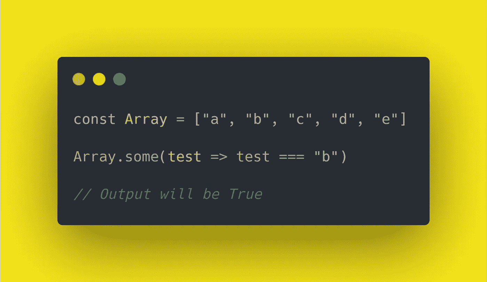
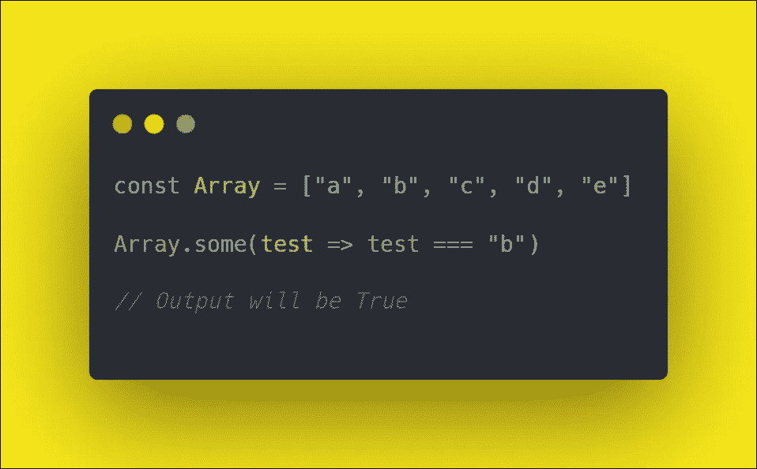
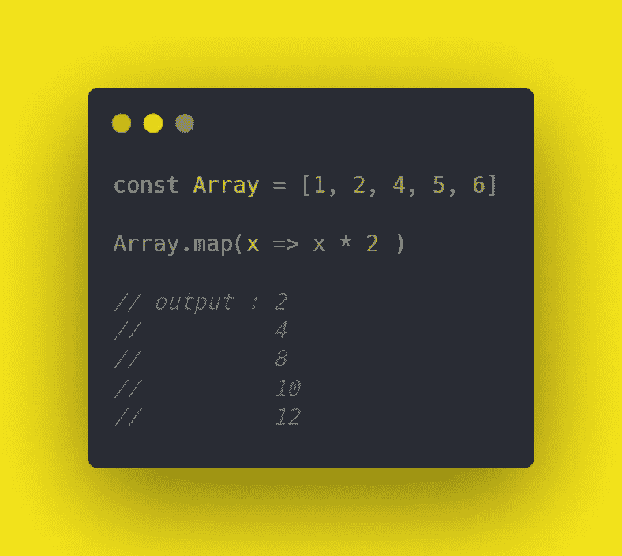
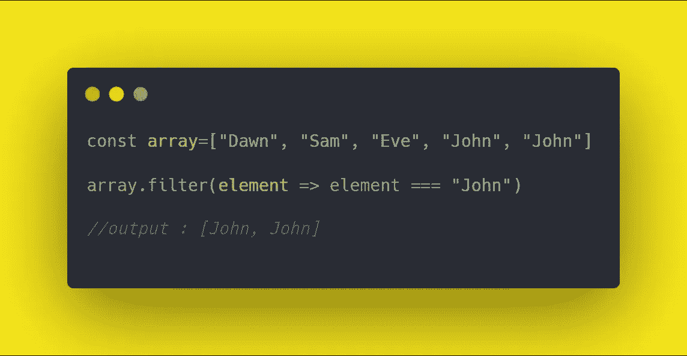
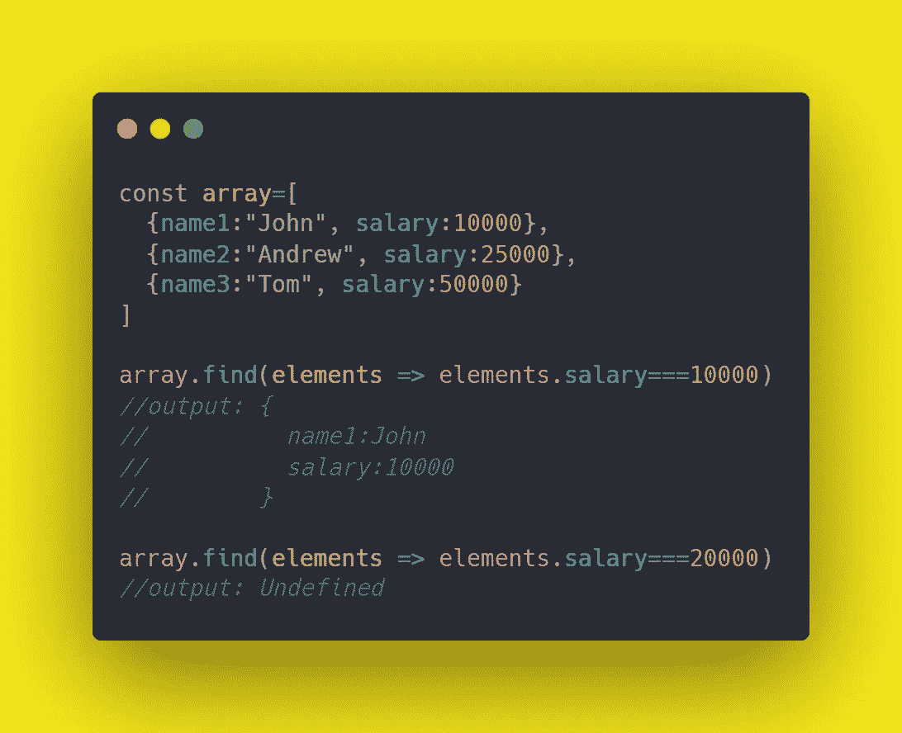
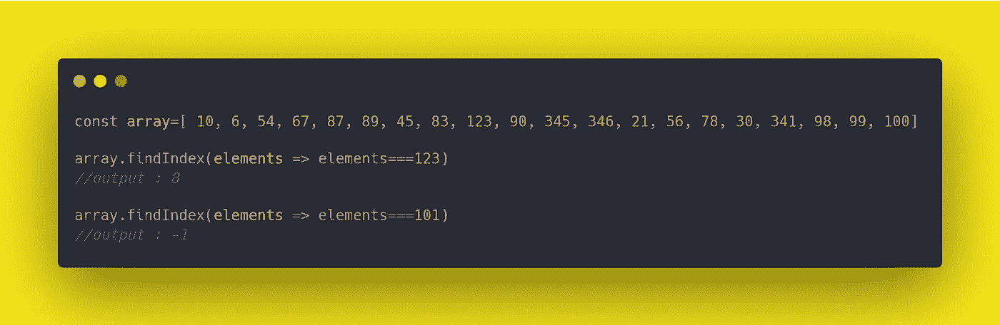
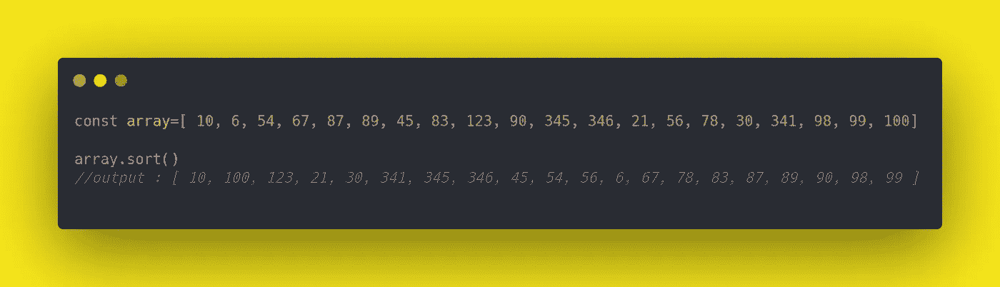
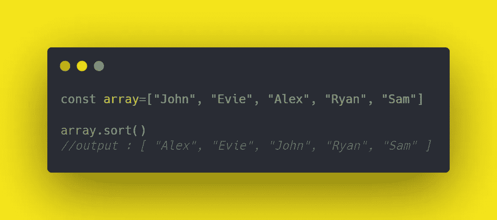
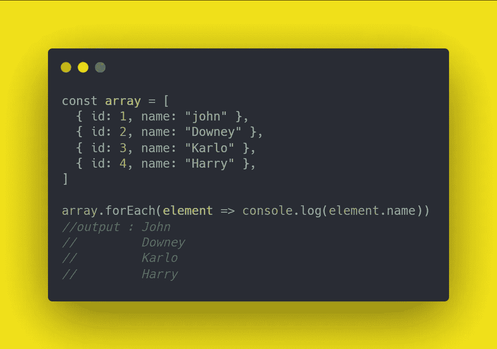
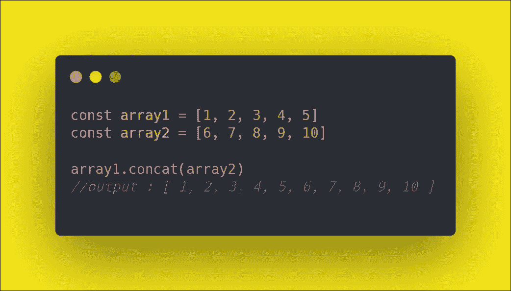

# 提高 JavaScript 技能的 9 个必须知道的数组方法

> 原文：<https://javascript.plainenglish.io/9-must-know-array-methods-to-boost-your-javascript-skills-4ae1822f7751?source=collection_archive---------12----------------------->



在 JavaScript 中，数组是一种特殊类型的变量，可以存储不同类型的元素。JavaScript 有一些内置的数组方法，在不同的情况下很有用，比如删除、添加、操作数据。了解这些方法会提升你的 JavaScript 技能。

在本文中，我们将看到 9 个基本的 JavaScript 数组方法，它们将帮助您正确地操作数据。

## 数组方法

1.  一些()
2.  地图()
3.  过滤器()
4.  查找()
5.  findIndex()
6.  排序()
7.  包括()
8.  反向()
9.  concat()

## 1.array.some()

如果数组中的某个元素匹配，`array.some()`方法将返回 true 或 false 作为输出。

当您想要匹配数组中的元素时，此方法很有用。让我们用一个例子来理解这个方法。我们有一个包含 5 个字母的数组。

```
const Array = ["a", "b", "c", "d", "e"]
```

我们将对该数组应用`array.some()`方法，它将输出 true 或 false。

```
const Array = ["a", "b", "c", "d", "e"]Array.some(test => test === "b")// Output will be True
```



## 2.array.map()

该方法将一个函数作为参数，并用原始数组中每个元素的图像创建一个新数组。元素的数量将是相同的，但是您可以对其应用任何函数。

当您想要将函数应用于数组的所有元素时，此方法非常有用。

假设我们有一个包含 5 个元素编号的数组，我们的任务是应用 map 方法并将所有元素乘以 2。我们可以对它应用任何功能。现在，我只是把每个元素乘以 2。

```
const Array = [1, 2, 4, 5, 6]Array.map(x => x * 2 )// output : 2
//   4   
//   8
//   10
//   12
```



## 3.array.filter()

`array.filter()`方法将一个函数作为参数，并返回一个新数组，该数组包含原始数组中与我们在参数中传递的元素相匹配的元素。其余的元素被过滤掉。

当您想用函数中传递的特定元素过滤一个`array`时，这个方法很有用。

我们通过一个简单的例子来理解这个方法。我们声明了一个有 5 个名字的数组。这些名称可以重复，也可以不同。

```
const array=["Dawn", "Sam", "Eve", "John", "John"]
```

我们需要从数组中过滤出“John”这个名字。我们想要一个只有“John”的数组。

```
const array=["Dawn", "Sam", "Eve", "John", "John"]array.filter(element => element === "John")//output : [John, John]
```



## 4.array.find()

`array.find()`方法将一个函数作为参数，并返回数组中满足测试函数的元素的值。否则，如果没有找到测试值，将返回`Undefined`作为输出。

需要一些例子来理解这个吗？假设我们有一个包含键和值的数组字典。键表示员工姓名，值将是他们的工资。

```
const array=[
  {name1:"John", salary:10000},
  {name2:"Andrew", salary:25000},
  {name3:"Tom", salary:10000}
]
```

而你的要求就是找到那些工资 10000 美元的员工。

```
const array=[
  {name1:"John", salary:10000},
  {name2:"Andrew", salary:25000},
  {name3:"Tom", salary:50000}
]array.find(elements => elements.salary=10000)
```

厉害！我们传递一个函数，在这个函数中，我们试图找到 10，000 的薪水。如果它出现在数组中，它将输出包含键和值的字典部分。如果没有，它将简单地返回`undefined`。

当您想要在一个包含数千或数百万元素的大数组中找到一个值时，这种查找方法就派上了用场。



## 5.array.findIndex()

如果你理解了查找方法，那么你就会很容易理解这个方法。`array.findIndex()`方法的工作原理与 find 方法相同，但是它返回数组中值的索引，而不是返回值。简单地说，它输出元素在数组中的位置。

当您想要查找数组中某个元素的索引时，此方法很有用。您想知道元素出现在哪个位置，并根据这个位置执行您未来的代码逻辑。

一个例子将帮助您清除此方法。假设我们有一个由 20 个随机数组成的数组。

```
const array=[ 10, 6, 54, 67, 87, 89, 45, 83, 123, 90, 345, 346, 21, 56, 78, 30, 341, 98, 99, 100]
```

我们的任务是找到 123 号的位置。

```
const array=[ 10, 6, 54, 67, 87, 89, 45, 83, 123, 90, 345, 346, 21, 56, 78, 30, 341, 98, 99, 100]array.findIndex(elements => elements===123)
//output : 8array.findIndex(elements => elements===101)
//output : -1
```

现在，您可以理解 findIndex 方法是如何工作的了。它返回 8 作为输出，我们知道 123 出现在数组的第 8 个索引处。如果没有找到这个数字，与返回`undefined,` 的查找方法不同，findIndex 方法返回-1，它不代表任何索引。



## `6\. array.sort()`

`array.sort()`只是将一个函数作为参数，返回一个排序的数组。当您想要对数组重新排序时，这个方法非常方便。

为了理解排序方法，假设您有一个由 20 个不按顺序排列的随机数组成的数组。

```
const array=[ 10, 6, 54, 67, 87, 89, 45, 83, 123, 90, 345, 346, 21, 56, 78, 30, 341, 98, 99, 100]
```

您的要求是按升序对数组中的数字重新排序。

```
const array=[ 10, 6, 54, 67, 87, 89, 45, 83, 123, 90, 345, 346, 21, 56, 78, 30, 341, 98, 99, 100]array.sort()
//output : [ 10, 100, 123, 21, 30, 341, 345, 346, 45, 54, 56, 6, 67, 78, 83, 87, 89, 90, 98, 99 ]
```



排序方法不仅适用于数字，在按字母顺序对字符串进行排序时也很有用。让我们假设一个场景，我们想按字母顺序对 5 个名字进行排序。

```
const array=["John", "Evie", "Alex", "Ryan", "Sam"]array.sort()
//output : [ "Alex", "Evie", "John", "Ryan", "Sam" ]
```



## 7.array.includes()

这个方法不接受任何函数，而是接受一个元素作为参数，并根据该值在该特定数组中是否存在来输出 true 或 false。

当数组中有一堆元素，并且您想检查该数组中是否存在某个元素时，这个方法很有用。显然，我们可以使用 find 或 findIndex 方法。但是有时，我们只需要执行一个简单的任务，即知道数组中是否存在元素。

我们将举例说明我们的概念。我们有一系列词典，里面有名字和职业。

```
const array=[ "Computer Scientist", "Programmer", "AI Expert", "Web Developer", "App Developer", "White Hacker"]
```

我们的任务是找出数组中是否存在“程序员”。

```
const array=[ "Computer Scientist", "Programmer", "AI Expert", "Web Developer", "App Developer", "White Hacker"]array.includes("Programmer")
//output : true
```


## 8.array.forEach()

此方法将一个函数作为参数，并返回与字典数组中的键匹配的元素列表。

是的，当您想要使用元素的键来查找元素时，这个方法对于字典数组特别有用。假设有一个带有关键字 id 和名称的字典数组。

```
const myAwesomeArray = [
  { id: 1, name: "john" },
  { id: 2, name: "Downey" },
  { id: 3, name: "Karlo" },
  { id: 4, name: "Harry" },
]
```

现在，我们需要与数组中的 name 键相关联的所有值的输出。

```
const array = [
  { id: 1, name: "john" },
  { id: 2, name: "Downey" },
  { id: 3, name: "Karlo" },
  { id: 4, name: "Harry" },
]array.forEach(element => console.log(element.name))
//output : John
//     Downey
//     Karlo
//     Harry
```



## 9.array.concat()

`array.concat()`方法将另一个数组而不是任何函数或元素作为参数，并返回一个合并的数组。当我们想把两个数组合并成一个时，这个方法很有用。

例如，假设我们有两个包含数字的数组。

```
const array1 = [1, 2, 3, 4, 5]
const array2 = [6, 7, 8, 9, 10]
```

现在，我们的任务是合并数组 1 和数组 2。

```
const array1 = [1, 2, 3, 4, 5]
const array2 = [6, 7, 8, 9, 10]array1.concat(array2)
//output : [ 1, 2, 3, 4, 5, 6, 7, 8, 9, 10 ]
```



## 结论:

希望你能从这篇文章中学到一些有用的东西。JavaScript 中还有很多其他的数组方法。现在您已经了解了数组方法，可以检查它们了。

如果你有兴趣阅读我的另一篇文章:

[](/puppeteer-js-web-scraping-with-a-headless-browser-b5c5151c24a5) [## js:使用无头浏览器进行网络抓取

### Web 开发在很大程度上依赖于测试机制，在我们将它们投入生产之前进行质量检查…

javascript.plainenglish.io](/puppeteer-js-web-scraping-with-a-headless-browser-b5c5151c24a5) 

希望这篇文章对你以后有所帮助。欢迎留言回复，祝 JavaScript 编码愉快！

*更多内容看*[*plain English . io*](http://plainenglish.io/)