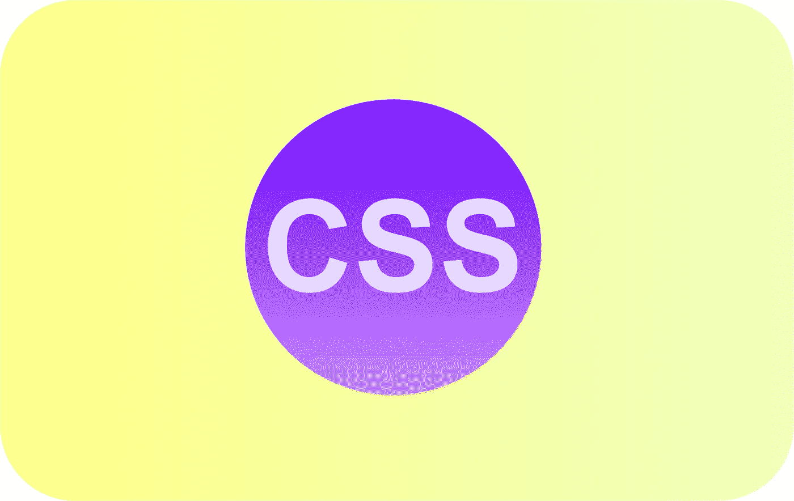
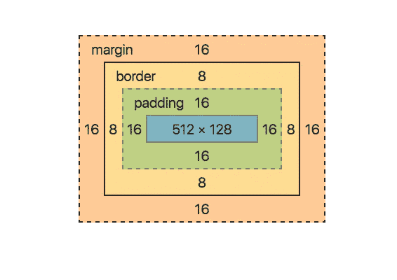
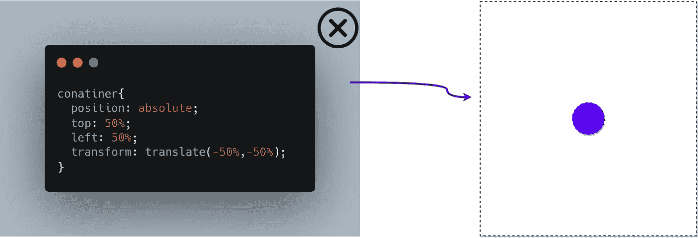
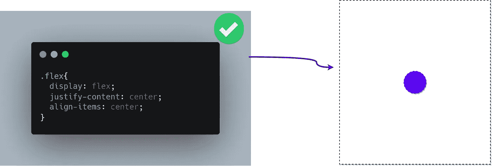
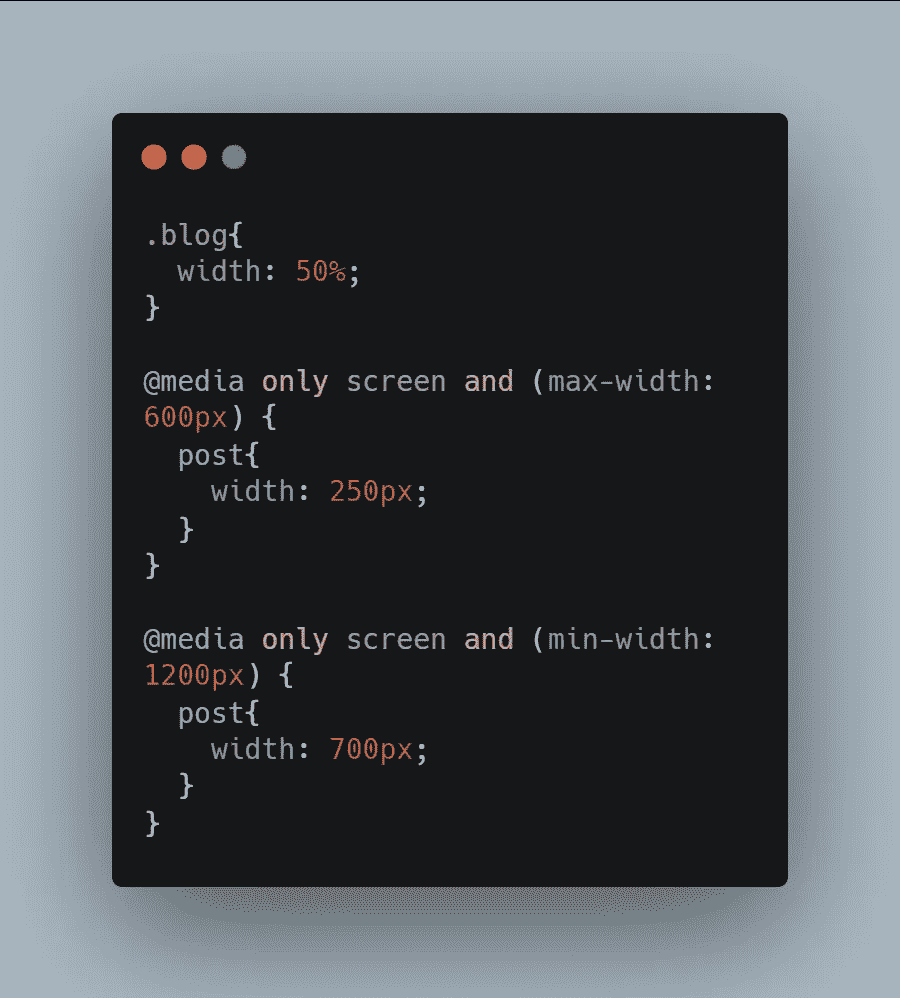
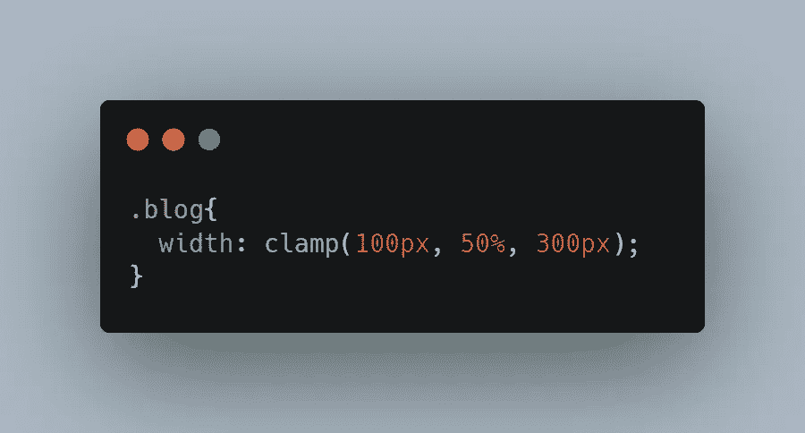

# 网络开发人员的 9 个专业 CSS 技巧

> 原文：<https://javascript.plainenglish.io/9-pro-css-tips-for-web-developers-508b8302ff6f?source=collection_archive---------5----------------------->

你需要知道的 CSS 技巧

## **1。学习箱式模型**

在学习 CSS 的时候，你应该避免使用像 **Bootstrap** 或者**tailwindss**这样的框架，这些工具对于构建漂亮的网站非常有用，但是如果你不了解 CSS，那么建议你不要使用这些框架。因为如果您使用这些工具，您将无法学习作为开发人员应该了解的基本 CSS 基础知识。当您理解了 *CSS box 模型*之后，代码中的其他一切就开始有意义了。

*   从基础学习 CSS 可以让你更自由、更有创造力地控制你的代码。

## **2 .调试 CSS 的火狐**

你应该用火狐代替 **Chrome** 来调试 CSS，因为**火狐**有最高级的 ***开发工具*** 。在 CSS 方面，当你在火狐中检查一个元素时，你有一个盒子模型的分解，你可以直接编辑元素的属性。

*   此外，火狐提供了一些有用的注释。

## **3 .使用 Flexbox**

元素相对于彼此的布局或定位一直是开发人员面临的主要问题之一，其中一个问题就是如何将 *div* 水平居中**垂直居中**。一个好的基本方法是给孩子**绝对的定位**，将其移动到底部**右侧**角然后**将**转回到 ***50%*** 使其处于中心位置。这种方法可以奏效，但非常不直观。****

*   ****现代 CSS 的一个更好的方法是使用 *flexbox* ，它允许您在用户界面的任何地方创建灵活的*列*和*行*。****

********

## ******4 .夹钳 VS 介质查询******

****人们使用不同的设备访问您的网站，所以您在处理项目时应该记住这一点。为了创建响应性布局，宽度**应根据该设备或**视口**上的可用空间而定。******

*****例如:*****

****你有一篇文章的 **50%宽度**，对于一个小屏幕你希望它固定在 **250 像素，**对于一个大屏幕，你希望它固定在 **700 像素**。您可以通过有条件地应用媒体查询来做到这一点，但这将导致下面给出的混乱代码。****

********

******Media Quries******

*   ****在这里您可以使用**夹钳**功能来编写更小更简单的 CSS。****

********

******Clamp Function in CSS******

## ******5。纵横比一行程序******

****假设你要编码一个响应式的图片或者视频网站，保持一定的长宽比。一种方法是在容器元素的顶部应用**填充**，然后给子元素**绝对**定位。****

*   ****但另一种更简单的方法是使用纵横比属性。您可以只定义视频或图像的宽高比。****

## ******6。变量为变量******

****使代码灵活和消除 CSS 代码同样重要，这样重构对你来说就不是问题了。实现这一点的最好方法之一是使用 CSS 自定义属性或变量。****

*   ****假设你在多行中有相同的颜色值，你决定改变颜色，一种方法是修改每一行有那个值的代码。但那是重复的。****
*   ****一个更好的方法是在**根**选择器上创建一个全局变量，它可以在任何需要的地方被引用。****
*   ****现在，当你决定改变**颜色**时，你只需要修改一行代码，所有具有该颜色值的代码行将被修改。****

## ******7。复杂的计算******

****虽然 CSS 不是编程语言，但它能够使用***calc()****函数执行一些基本的计算。*****

*   *****这个函数允许你做一些基本的数学计算，但是这个函数更大的优点是你可以组合不同的单位。*****

## *****8。计数器状态*****

*****CSS 内置了一个状态管理机制，您可以跟踪运行计数，而无需使用一行 JavaScript 代码。*例如*，如果你想跟踪代码中标题的数量，一种方法是手动编写并记住计数。*****

*   *****一个更聪明的方法是使用 CSS 计数器在你移动到下一个标题时进行计数和递增。您可以使用***counter-rese*t**属性在您的代码中创建一个计数器，现在您不必担心记住代码中的小事情。*****

## *******9。寻找焦点-在**内*****

*****当您想要构建一个复杂的下拉菜单时，最常见的方法是使用 JavaScript 来管理菜单的打开和关闭状态。*****

*   *****令人惊讶的是 CSS 可以帮助你做到这一点。它提供了 ***焦点*(一个伪类)**来创建和打开一个下拉菜单，但问题是当你选择一个选项时，它会失去焦点并关闭。*****
*   *****然而，还有另一个伪类叫做***focus——在*** 之内，如果任何孩子也有焦点，它就保持活动状态。这个简单的特性消除了大量的 ***Javascript*** 代码。*****

***** [## 3 个隐藏的 CSS 功能

### 对前端开发者有用的 CSS 特性

javascript.plainenglish.io](/3-hidden-features-of-css-566e8c27597f)  [## 作为前端开发人员，你应该知道的 3 个 CSS 特性

### 了解 CSS 鲜为人知的特性

javascript.plainenglish.io](/3-css-features-you-should-know-as-frontend-developer-f1b5536bf179)  [## 现代 CSS 开发人员路线图

### 掌握 CSS 的关键概念

javascript.plainenglish.io](/the-modern-css-developer-roadmap-1ea112451dde) 

*更多内容请看*[*plain English . io*](http://plainenglish.io/)*****