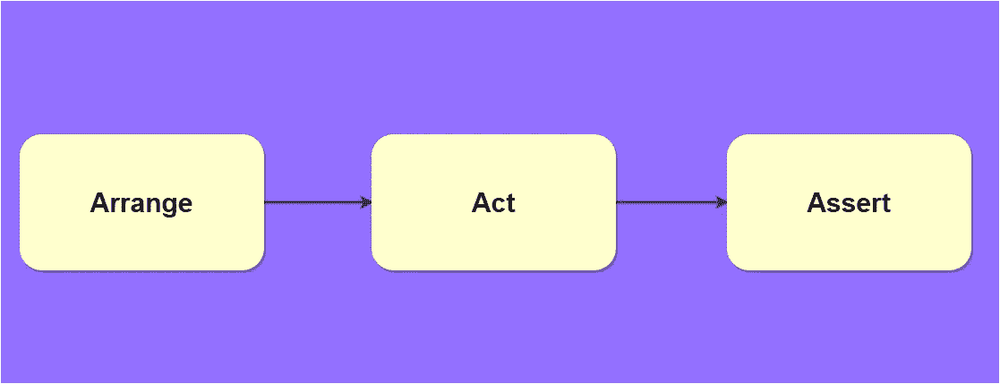

# 每个软件开发人员都应该知道的 9 条编程原则

> 原文：<https://javascript.plainenglish.io/9-programming-principles-every-software-developer-should-know-9fffe3c5258?source=collection_archive---------9----------------------->

## 很好地了解干净代码的编程原则

# 1.YAGNI

> 你不需要它

这是**极限编程**的一个原理，一般用在*敏捷软件开发*过程中。根据这个原则，我们不应该添加任何功能，直到它被认为是必要的，或者更简单地说，你的代码应该总是与当前的情况相关。不要添加任何你将来需要的东西，你的代码应该呈现当前情况的逻辑，而不是需要在过程的后期解决的东西。

***优点:***

*   避免软件在开发的早期变得更大更复杂。

# 2.吻

> 简单点，笨蛋

这个原则的重点是保持代码库的简单，并且对其他开发人员来说是描述性的。不仅仅是开发人员，在遵循这个原则的同时，你的代码必须是人类可以理解的。保持方法简单和整洁，避免在每个方法中添加超过 50-60 行。

每种方法一次只能解决一个小问题，如果方法中有很多条件，那么就把它们分解成更小的方法。

***优点:***

*   使得与其他开发人员一起工作变得更加容易，因为他们不必花费大量的时间阅读任何杂乱的代码。

# 3.美国汽车协会

> 安排，行动，断言

软件开发行业的一个标准原则，这个原则建议你应该把你的*测试*方法分成三个部分&，每个部分只负责它们被命名的那部分。

*   **安排:**设置特定测试所需的代码
*   **动作:**调用被测试的方法
*   **断言:**检查测试是否符合预期

***优点:***

*   使执行多个单元测试变得更加容易

# 4.干燥的

> 不要重复你自己

您一定听说过这一条，这是最著名的编程原则之一，在编写代码时应用它，以减少相同方法的重复。程序中的每一个重要功能都应该在代码中的一个地方实现&类似的功能由其他一些不同的代码段执行。

***优点:***

*   避免代码库中的重复，因为这会导致重大的维护问题。同样，如果没有这个原则，就更有可能构建出糟糕的重构代码库。

# 5.童子军规则

> 让代码比你发现时更干净

我个人认为这个原则非常有用，因为它有助于保持我离开工作时的环境。根据这个原则，你应该总是保持你的代码库像开始时一样干净。比方说，当我们在应用程序中处理一个特性时，我们在顶部添加了更多的功能，最终它变得不可读，现在我们没有清理这些代码，过了一段时间，我们意识到没有什么是有意义的。

***优点:***

*   您将始终拥有一个可维护且可读的代码库

# 6.第一

> 快速、独立、可重复、自我验证和彻底

在编写健壮的单元测试时应用这个原则，并结合如下多个原则:

*   **快:**单元测试必须更快，当运行*单元测试*时，它们不应该与任何**远程服务器**或**数据库**通信，由于这个原因，当你实现新的应用程序特性时，你可以经常运行*单元测试*。
*   **独立:**单元测试应该是独立的，一个单元测试不应该依赖于另一个单元测试产生的结果。此外，您正在测试的代码应该与它的**依赖关系**隔离开来，这可以确保一些随机的 bug 不会破坏整个单元测试 ***(依赖关系通常会被嘲笑或者被提供一些预定义的数据)。***
*   可重复:如果在不同的机器上执行，单元测试应该能够产生相同的结果。
*   **自验证:**单元测试应该是自验证的，这意味着，无论测试是否通过，开发人员都不必在*单元测试结束后执行任何手动检查。*
*   **彻底:**考虑到单元测试中的负面结果，我们应该在*正面*和*负面*场景下运行我们的测试，以获得更可靠的结果。一个单元测试将在有效的输入参数下测试函数，另一个单元测试将在无效的输入参数下测试函数。

***优点:***

*   最小化单元测试中的错误，并导致更快的单元测试

# 7.控制反转

> 请勿来电；我们会通知你

它意味着你如何控制组件(**类**)。之所以称之为反转，是因为在这种模式之前，这些类对它们将做什么的定义是固定的。控制反转改变方法签名的耦合方向&方法签名的定义由方法实现而不是方法调用方决定。

***优点:***

*   它用于增加程序的模块化，使其更具可扩展性。

# 8.鲁棒性原则

> 在你做的事情上要保守，在你接受别人的事情上要开明

这个原则反映了计算机界面应该能够接受许多不同形式的信息，但总是返回相同的信息。由于这个原因，你总是知道你的软件会有什么样的结果。

***优点:***

*   你可以在不破坏现有产品的情况下，用新的特性来改进当前的软件。

# 9.命令查询分离

> 提问不应该修改答案

每个方法应该要么处理**查询**，要么**执行**一个将数据返回给调用者的动作，但不能同时处理两者。使用这个原则，开发人员可以建立更多的信心，因为查询方法可以在任何地方以任何顺序使用。

***优点:***

*   开发人员无需了解每个方法的实现细节，就可以更加自信地进行编码。

 [## JavaScript 开发人员应该知道的 7 个概念

### 在下一个 JavaScript 项目中使用的基本概念

javascript.plainenglish.io](/7-concepts-you-should-know-as-a-javascript-developer-f406597319ab)  [## 作为开发人员，你应该知道的 9 种数据结构和算法

### 让你成为更好的开发者的数据结构和算法

javascript.plainenglish.io](/9-data-structures-algorithms-you-should-know-as-a-developer-5e10946c95a0)  [## 2021 年终极网络开发者路线图

### 从基础到部署可伸缩的 Web 应用程序

javascript.plainenglish.io](/ultimate-web-developer-roadmap-for-2021-6758edd0bd3f)