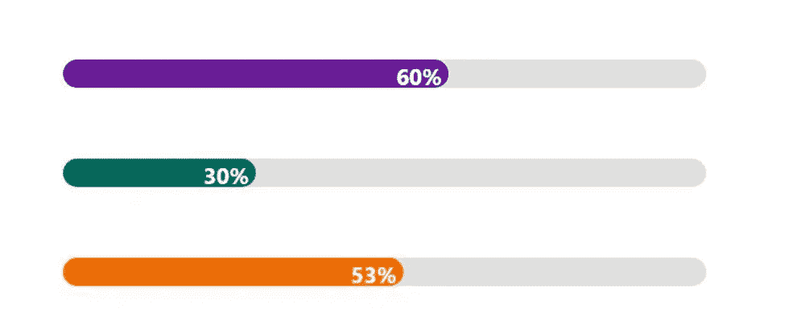
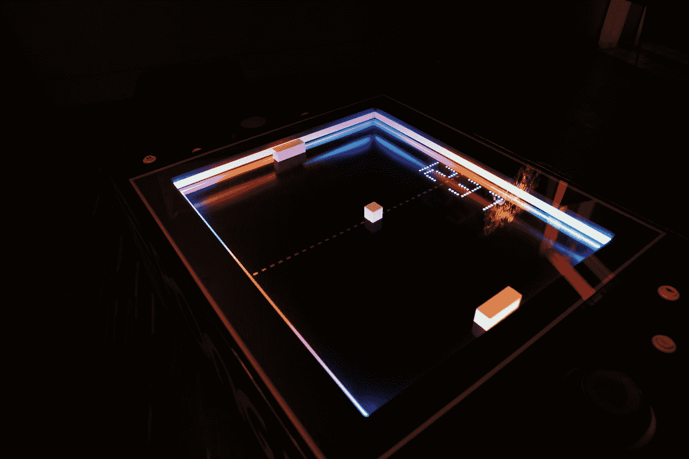

# 初学 JavaScript 开发人员的 9 个项目想法

> 原文：<https://javascript.plainenglish.io/9-project-ideas-for-beginners-and-intermediate-javascript-developers-a4afe88514d6?source=collection_archive---------2----------------------->

学习一门新语言时，应用知识是很重要的。有时你不知道如何应用新发现的知识。在这篇文章中，我将向你推荐 9 个初级的想法，让你用 JavaScript 实现。你要训练的技能不仅仅是 JavaScript，还有 HTML 和 CSS。

在每个想法的末尾，我还添加了一个“提前”说明，如果你们中的任何人觉得这个想法有点太简单，可以把事情推进到一个更高的水平。希望你在实现它们的过程中获得乐趣。:)

Photo by [Skye Studios](https://unsplash.com/@skyestudios?utm_source=medium&utm_medium=referral) on [Unsplash](https://unsplash.com?utm_source=medium&utm_medium=referral)

## 1.待办事项列表

臭名昭著的待办事项列表。这可能是人们在学习一门新语言时创建的最多的应用程序(当然是在 Hello-World 程序之后)。但这是有原因的，因为实现这个应用程序，你学会了如何实现 UI 实现的基础，如按钮，输入字段，文本字段等。和 CRUD 操作。

制作一个可以添加新项目和删除项目的待办事项列表。移除的项目应该完全删除，不再显示。这些项目应该显示为列表。UI 应该有一个添加和删除项目的按钮。还应该有一个显示待办事项的区域。

Photo by [Lauren Sauder](https://unsplash.com/@laurensauderstudio?utm_source=medium&utm_medium=referral) on [Unsplash](https://unsplash.com?utm_source=medium&utm_medium=referral)

*前进*:使项目持久化，即即使刷新页面，项目也不应被删除。添加重新排序项目的功能。删除的项目不应删除，而应划掉。

## 2.图片库

图库是许多网站的一个很好的补充。这并不像你想象的那么简单。实现一个可以一次上传一张图片的图片库。

Photo by [Mick Haupt](https://unsplash.com/@rocinante_11?utm_source=medium&utm_medium=referral) on [Unsplash](https://unsplash.com?utm_source=medium&utm_medium=referral)

*高级*:实现一个照片库，可以上传图片并排序，使其最适合页面，这意味着每张图片之间的空白空间应该最小。

## 3.进度条

进度条指示特定操作的进度。实现一个采用百分数的进度，并相应地绘制进度条。给它添加一些花哨的造型。

[https://res.cloudinary.com/practicaldev](https://res.cloudinary.com/practicaldev)

*前进*:实现一个进度条，指示一个给定网站的滚动进度，即如果读者在一个网页的顶部，进度条应该在 0%的状态。如果用户已经滚动到最底部，进度条应该处于 100%状态。它应该在进度条上以百分比的形式显示进度。

## 4.罗马到阿拉伯数字转换器

创建一个将罗马数字转换成阿拉伯数字的程序。对于这个程序，您不需要实现 UI。

Photo by [Shalone Cason](https://unsplash.com/@shalone86?utm_source=medium&utm_medium=referral) on [Unsplash](https://unsplash.com?utm_source=medium&utm_medium=referral)

*Advance* :创建一个吸引人的 UI，带有一个输入字段和一个将一个数字转换成另一个数字的按钮，这样就更高级了。还要添加另一个按钮，将阿拉伯数字转换成罗马数字。如果你愿意，你可以添加单元测试。如果你不知道什么是单元测试，那就去读一下。

## 5.计算器

实现一个能够执行基本数学运算的计算器，如加、减、乘、除。也能够计算一个数的平方根和幂。在不使用数学库的情况下做这件事。

计算器应该有一个输入字段，你可以把你的数字。请记住如何处理错误的输入，例如被零除，或者输入的不是数字而是字母或特殊字符。将错误显示为警报。

Photo by [Clayton Robbins](https://unsplash.com/@claytonrobbins?utm_source=medium&utm_medium=referral) on [Unsplash](https://unsplash.com?utm_source=medium&utm_medium=referral)

*进阶*:再增加一个按钮，可以让用户切换到科学计算器，可以计算 sin，cos，tan 等。

## 6.表单验证

通过添加表单验证来扩展 calculator 项目。为计算器的输入字段创建表单验证。显示任何错误输入或输出的错误消息。

在我们的计算器示例中，错误的输入可能是字母或特殊字符，而不是数字。错误的输出可能被零除。

Photo by [Sigmund](https://unsplash.com/@sigmund?utm_source=medium&utm_medium=referral) on [Unsplash](https://unsplash.com?utm_source=medium&utm_medium=referral)

*高级*:为另一个项目创建表单验证，检查一个单词是否符合有效密码的条件(有效密码应该是至少 8 个字符长的单词，至少包含一个字母、一个数字和一个特殊字符)。

## 7.存储卡游戏

在一个 4×3 的格子上显示二次卡片。该卡应该有网站:一个与任何背景图像。另一个具有值，例如数字。每张卡都有一对。开始时，所有的卡片都应该用背景图片展示网站。如果你点击其中一张卡片，它将打开并显示数值。如果你点击另一张显示不同数值的卡片，那么这张卡片应该再次关闭。但是，如果你点击显示相同数值的牌，那么这些牌应该保持打开。

Photo by [Soragrit Wongsa](https://unsplash.com/@invictar1997?utm_source=medium&utm_medium=referral) on [Unsplash](https://unsplash.com?utm_source=medium&utm_medium=referral)

*进阶*:通过增加积分系统和计时器对游戏进行扩展。计算游戏结束前的尝试次数。在游戏结束时，即当所有的牌都打开时，显示一个高分列表，一边是试验次数，另一边是时间。

## 8.乒乓球游戏

创建著名的 pong 游戏，其中有两个玩家，左和右，分别由一根棍子、一个球、一个游戏场和一个点数表表示。每当球碰到球员或比赛场地的边界时，都应该被弹回来。当球到达右场边界时，左边的球员得一分，反之亦然。如果其中一个玩家达到 10 分，游戏应该结束。

Photo by [Feelfarbig Magazine](https://unsplash.com/@feelfarbig?utm_source=medium&utm_medium=referral) on [Unsplash](https://unsplash.com?utm_source=medium&utm_medium=referral)

*高级*:创建一个 3D 版本，并添加一个输入字段，玩家可以在其中输入自己的名字。也让玩家决定游戏应该在哪个点结束。创建一个高分列表，永久保存结果以及玩家姓名和游戏日期。

## 9.模拟时钟

实现一个模拟时钟，带有显示当前时间的小时、分钟和秒的指针。按照你想要的方式设计它，但是要让它有反应。

Photo by [Tony Mucci](https://unsplash.com/@eklect?utm_source=medium&utm_medium=referral) on [Unsplash](https://unsplash.com?utm_source=medium&utm_medium=referral)

*推进*:试着实现，让手“自然”地移动。取决于你如何实现它，显示秒的指针将会在到达一分钟和你重新加载它时出错。您将如何实现它来消除这种毛刺效应？

你知道更多适合初学者的项目吗？让我知道并在下面评论。如果你已经实现了它们，让我知道，并张贴一个链接到您的项目。我对你的方法非常感兴趣。

喜欢这篇文章吗？如果有，通过 [**订阅我们的 YouTube 频道**](https://www.youtube.com/channel/UCtipWUghju290NWcn8jhyAw?sub_confirmation=true) **获取更多类似内容！**