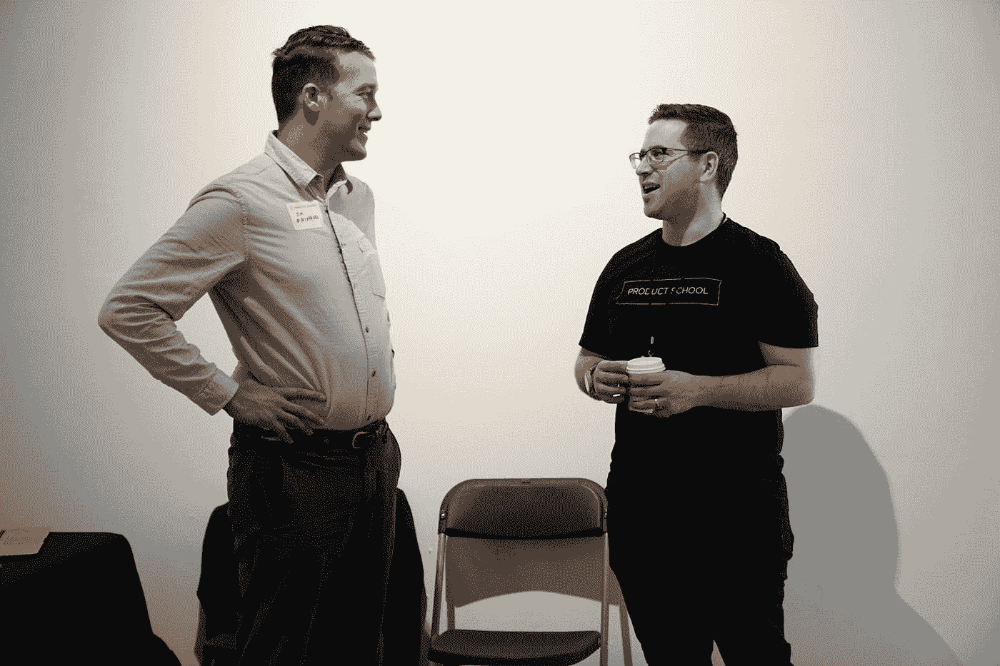

# 来自高级程序员的 9 个有用的编程技巧

> 原文：<https://javascript.plainenglish.io/9-simple-programming-tips-from-a-senior-programmer-to-a-junior-a7f96078822b?source=collection_archive---------1----------------------->

## 如果你是编程行业的新手，最好的方法是向专家学习。

Photo by [Product School](https://unsplash.com/@productschool?utm_source=medium&utm_medium=referral) on [Unsplash](https://unsplash.com?utm_source=medium&utm_medium=referral)

在我们去找大三的高级顾问之前，先想想做一个好的程序员。美国作家兰德尔·e·斯特罗斯曾经说过:

> 最好的程序员并不比优秀的程序员强多少。他们在各方面都比别人强一个数量级:创造力、速度、独创性和解决问题的技能。”

那么如何成为最优秀的程序员呢？

如果这些只是你的 IT 冒险的第一章，听听资深同事的建议，看看如何成为一名编码大师。

## **1。不要多此一举。使用成熟的库和框架，而不是自己写所有的东西——这是一位前辈给你的第一个建议。**

不要从头开始编写所有代码。网络上有免费和付费的“现成”或“半成品”供开发者使用。我说的是框架，你可以在其上建立你的项目和库的现成方案，一套算法，规则，以及准备在你的应用程序或网站中实现的组件。多亏了他们，你的工作会更有效率和效果——重复性更少，利润更高。

## **2。永远使用 GIT，即使只有你在做这个项目。**

git 真的是 GIT。这是一个版本控制系统，在这个系统中，您可以持续地保存和跟踪所创建的代码或图形中的变化。这在几个人一起做一个项目的情况下特别有用。

每一个都有自己的分支，最终与主枝汇合。Git 不会丢失任何东西——您可以访问所有以前版本的代码，并且如果您愿意，可以轻松地后退几步。一个高级开发人员通常有大量的代码行。

## **3。永远不要停止发展。跟随潮流，了解新产品，尝试。**

了解潜在客户或竞争对手在市场上的动向。

*   舍不得离开你的智能手机？看看你的竞争对手在开发什么应用，下载并测试它们。
*   你创建网站吗？点击浏览网络上的各种网站，寻找最新、新鲜、“新潮”的灵感。
*   你编程游戏吗？所以你有时必须变成一个玩家，经历最新的红色死亡救赎 II。

如果没有一个真正的、根植于你的激情、一个玩笑、对编码的热爱，以及对你创造的最终产品的迷恋，你在 IT 方面的开发可能是一种工艺折磨，而不是一次大冒险。

## **4。尽可能多写。每行代码都是关于开发和体验的。没有几个小时的练习，你是学不会编程的。**

一个全职程序员平均每周花近 20 个小时在编码上。打败它会更好。接额外的项目，申请新的团队，做自由职业者，寻找新的订单，编写非商业项目的代码。

所有这些都是为了学习如何与不同的客户合作，了解不同的行业、技术和编程语言。在这个游戏里，“大学论文”和理论远没有实践和一个好的程序员作品集重要。

## **5。读，听，看。书籍、博客、视频教程、播客。互联网上充满了值得学习的信息。**

吸收各种形式的最新知识和灵感。互联网在这方面给了我们无限的可能。有很多博客你可以去看看，比如 BetterProgrammer，JavaScript in Plain English，FreeCodeCamp。等等。，你需要做的就是采取主动，开始行动。

## **6。和某人一起工作。让这个人检查你的代码，试着理解它，给你意见。我们自己在代码中可能会遗漏很多东西。**

虚心接受高级开发人员或部门 IT 团队领导的意见和建议。如果你是远程工作或在家办公的自由职业者，给自己买一只橡皮鸭，用它来分析你的代码。

## **7。开阔眼界。不要只在前端关闭。了解一点后端。练习测试。学点 DevOps 的小技巧。**

已经掌握了 HTML、CSS 和 JavaScript 的基础知识？然后，继续向全栈开发人员前进，这是开发人员中收入最高的工作之一。

与 Java、Ruby 或 Python 等语言交朋友。一个好的学长应该懂得多一点。尽可能多地了解 UX 和 UI 世界的技巧和生活窍门。

从 DevOps 工程师的提示和想法中获得灵感-通过他们，您将了解到什么是无服务器或 AppSync 如何工作。

## **8。重构。回到你之前写的代码，重写它们。你会学到很多东西，你会注意到你取得了多大的进步。**

我们从错误中学习最多。在程序员的日常生活中没有什么不同。重写并更正几个月甚至几年前存储在 Git 中的代码。你会看到在这段时间里你取得了什么样的进步，并发现你已经完全忘记的功能。

## **9。来自一位年长公民的最后一条建议:开放源代码。通过大型社区浏览库代码。然后，随着时间的推移，你也可以参与他们的积极发展。**

加入这样一个活跃的程序员社区，例如，通过互联网和与其他程序员一起开发选定的开源软件，是在 IT 行业建立关系网、交流经验和获得新知识的额外机会。

## **完美前端开发者:如何精益求精**

我相信这 9 个技巧可以帮助你成为更好的程序员。这不是一个终极列表，其他程序员可以对这个主题添加更多内容。所以如果你想要更多，找到他们并向他们学习。

*更多内容看*[***plain English . io***](http://plainenglish.io/)